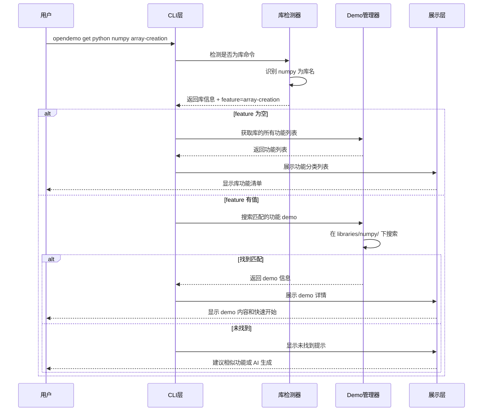

# 新增 Python 库 Demo 逻辑设计文档

## 一、需求概述

### 1.1 业务目标

为 opendemo CLI 工具新增 Python 第三方库的 demo 支持功能，使程序员能够快速、系统地学习和掌握常用 Python 库（如 numpy）的核心功能。

### 1.2 功能定位

当前 opendemo 工具支持按语言和主题获取 demo，例如：
- `opendemo get python logging` - 获取 Python 基础功能 demo
- `opendemo get python 列表操作` - 获取特定主题 demo

新功能将扩展命令格式，支持第三方库：
- `opendemo get python numpy` - 获取 numpy 库的功能概览
- `opendemo get python numpy array-creation` - 获取 numpy 数组创建的具体 demo

### 1.3 核心价值

- **系统性学习**：将库的功能模块化、结构化，帮助开发者全面掌握库的能力
- **快速上手**：提供可运行的示例代码，降低学习成本
- **功能发现**：通过功能列表，让开发者发现库的隐藏功能

### 1.4 首批支持库

从 numpy 库开始，后续可扩展到 pandas、requests、matplotlib 等常用库。

## 二、功能设计

### 2.1 命令格式设计

#### 2.1.1 新命令格式

```
opendemo get <language> <library> [feature]
```

参数说明：
- `language`: 编程语言（如 python）
- `library`: 库名称（如 numpy）
- `feature`: 可选，具体功能模块（如 array-creation）

#### 2.1.2 命令示例与行为

| 命令 | 行为说明 |
|------|---------|
| `opendemo get python numpy` | 列出 numpy 库的所有功能模块（分类展示） |
| `opendemo get python numpy array` | 搜索并匹配包含 array 关键字的功能 demo |
| `opendemo get python numpy array-creation` | 获取数组创建的具体 demo |
| `opendemo search python numpy` | 搜索 numpy 相关的所有 demo |

#### 2.1.3 与现有命令的兼容性

- 保持现有命令格式不变：`opendemo get python logging` 继续有效
- 通过智能识别区分库名和主题关键字
- 库名识别优先级：内置库列表 > 常规主题匹配

### 2.2 库功能组织架构

#### 2.2.1 目录结构设计

```
opendemo_output/
└── python/
    └── libraries/
        └── numpy/
            ├── _library.json                    # 库元数据
            ├── array-creation/                  # 功能模块1
            │   ├── metadata.json
            │   ├── README.md
            │   ├── code/
            │   │   ├── basic_array.py
            │   │   └── array_from_data.py
            │   └── requirements.txt
            ├── array-indexing/                  # 功能模块2
            │   ├── metadata.json
            │   ├── README.md
            │   ├── code/
            │   │   └── indexing_slicing.py
            │   └── requirements.txt
            ├── mathematical-operations/         # 功能模块3
            │   └── ...
            └── linear-algebra/                  # 功能模块4
                └── ...
```

#### 2.2.2 库元数据结构

`_library.json` 文件定义库的整体信息：

| 字段 | 类型 | 说明 | 示例 |
|------|------|------|------|
| name | string | 库名称 | "numpy" |
| display_name | string | 显示名称 | "NumPy" |
| description | string | 库简介 | "数值计算基础库" |
| version | string | 支持版本 | "1.24.0+" |
| categories | array | 功能分类 | 见下表 |
| official_url | string | 官方文档 | "https://numpy.org" |
| install_command | string | 安装命令 | "pip install numpy" |
| created_at | string | 创建时间 | ISO 8601 格式 |

categories 字段结构：

| 字段 | 类型 | 说明 |
|------|------|------|
| category | string | 分类名称（如 "数组操作"） |
| features | array | 该分类下的功能列表 |
| features[].name | string | 功能模块文件夹名 |
| features[].title | string | 功能显示标题 |
| features[].description | string | 功能简短描述 |
| features[].difficulty | string | 难度级别 |

#### 2.2.3 功能模块元数据

每个功能模块的 `metadata.json` 结构：

| 字段 | 说明 | 示例 |
|------|------|------|
| name | 模块名称 | "array-creation" |
| library | 所属库 | "numpy" |
| language | 编程语言 | "python" |
| title | 显示标题 | "数组创建" |
| keywords | 关键字数组 | ["array", "create", "数组", "创建"] |
| description | 详细描述 | "演示 numpy 数组的多种创建方法" |
| difficulty | 难度级别 | "beginner" |
| related_features | 相关功能 | ["array-indexing", "array-reshape"] |
| prerequisites | 前置知识 | ["python-basics"] |

### 2.3 Numpy 库功能清单（初版）

#### 2.3.1 功能分类结构

| 分类 | 功能模块 | 难度 | 说明 |
|------|---------|------|------|
| **基础数组操作** | array-creation | beginner | 数组创建（zeros, ones, arange, linspace） |
| | array-attributes | beginner | 数组属性（shape, dtype, ndim） |
| | array-indexing | beginner | 索引与切片 |
| | array-reshape | intermediate | 形状变换（reshape, flatten, ravel） |
| **数学运算** | basic-math | beginner | 基础运算（加减乘除） |
| | aggregate-functions | beginner | 聚合函数（sum, mean, std） |
| | broadcasting | intermediate | 广播机制 |
| | universal-functions | intermediate | 通用函数（ufunc） |
| **线性代数** | matrix-operations | intermediate | 矩阵运算（dot, matmul） |
| | linear-solve | advanced | 线性方程求解 |
| | eigenvalues | advanced | 特征值与特征向量 |
| **随机数** | random-generation | beginner | 随机数生成 |
| | random-sampling | intermediate | 随机采样 |
| **数组操作** | array-concatenate | intermediate | 数组拼接 |
| | array-split | intermediate | 数组分割 |
| | array-sort | beginner | 数组排序 |

#### 2.3.2 初版实现范围

第一阶段实现以下核心功能模块：
1. array-creation（数组创建）
2. array-indexing（索引切片）
3. basic-math（基础数学运算）
4. aggregate-functions（聚合函数）
5. random-generation（随机数生成）

### 2.4 用户交互流程

#### 2.4.1 库功能列表展示

用户执行 `opendemo get python numpy` 时的输出示例：

```
📚 NumPy - 数值计算基础库
版本：1.24.0+
安装：pip install numpy
文档：https://numpy.org

功能模块列表：

【基础数组操作】
  1. array-creation          数组创建 (beginner)
  2. array-indexing          索引与切片 (beginner)
  3. array-reshape           形状变换 (intermediate)

【数学运算】
  4. basic-math              基础运算 (beginner)
  5. aggregate-functions     聚合函数 (beginner)
  6. broadcasting            广播机制 (intermediate)

【线性代数】
  7. matrix-operations       矩阵运算 (intermediate)
  8. linear-solve            线性方程求解 (advanced)

提示：
  - 获取具体功能：opendemo get python numpy array-creation
  - 搜索相关功能：opendemo get python numpy array
  - 查看全部：opendemo search python numpy
```

#### 2.4.2 具体功能获取流程



## 三、技术实现方案

### 3.1 核心组件设计

#### 3.1.1 LibraryDetector（库检测器）

职责：识别命令中的库名，区分库命令和普通主题命令

关键方法：

| 方法 | 参数 | 返回 | 说明 |
|------|------|------|------|
| is_library_command | language, keywords | boolean | 判断是否为库命令 |
| parse_library_command | language, keywords | dict | 解析库命令，返回库名和功能名 |
| get_supported_libraries | language | list | 获取支持的库列表 |
| load_library_metadata | language, library | dict | 加载库的元数据 |

检测逻辑：
1. 检查 keywords 第一个参数是否在支持库列表中
2. 若存在，返回库信息；若不存在，返回 None
3. 支持库列表从配置文件或硬编码列表获取

#### 3.1.2 LibraryManager（库管理器）

职责：管理库的元数据、功能列表和 demo 组织

关键方法：

| 方法 | 参数 | 返回 | 说明 |
|------|------|------|------|
| get_library_info | language, library | dict | 获取库的完整信息 |
| list_library_features | language, library, category | list | 列出库的功能模块 |
| search_library_feature | language, library, keyword | list | 搜索库中的功能 |
| get_feature_demo | language, library, feature | Demo | 获取具体功能的 demo |
| create_library_structure | language, library | boolean | 创建库的目录结构 |

数据流：
- 从 `libraries/<library>/_library.json` 读取库元数据
- 遍历库目录下的子文件夹获取功能列表
- 与现有 DemoManager 集成，复用 demo 加载逻辑

#### 3.1.3 CLI 命令扩展

扩展现有 `get` 命令，增加库识别分支：

```
get 命令执行流程：
1. 解析参数：language, keywords
2. 调用 LibraryDetector.is_library_command(language, keywords[0])
3. 若是库命令：
   3.1 解析库名和功能名
   3.2 若功能名为空：调用 LibraryManager.list_library_features()
   3.3 若功能名有值：调用 LibraryManager.search_library_feature()
4. 若非库命令：
   继续现有逻辑（搜索 demo、AI 生成等）
```

### 3.2 数据存储设计

#### 3.2.1 存储位置

| 数据类型 | 存储路径 | 说明 |
|---------|---------|------|
| 库配置 | `opendemo/builtin_demos/python/libraries/<library>/_library.json` | 内置库定义 |
| 功能 demo | `opendemo/builtin_demos/python/libraries/<library>/<feature>/` | 内置功能 demo |
| 用户库配置 | `~/.opendemo/libraries/<language>/<library>/` | 用户自定义库 |
| 输出目录 | `opendemo_output/python/libraries/<library>/` | 生成的 demo 输出 |

#### 3.2.2 配置文件优先级

1. 用户自定义库配置（`~/.opendemo/libraries/`）
2. 内置库配置（`opendemo/builtin_demos/python/libraries/`）

### 3.3 搜索与匹配策略

#### 3.3.1 匹配优先级

当用户执行 `opendemo get python numpy array` 时：

1. **精确匹配**：功能名完全等于 "array"（权重 10）
2. **前缀匹配**：功能名以 "array" 开头，如 "array-creation"（权重 8）
3. **包含匹配**：功能名包含 "array"，如 "multi-array"（权重 6）
4. **关键字匹配**：metadata.keywords 中包含 "array"（权重 5）
5. **描述匹配**：description 中包含 "array"（权重 3）

#### 3.3.2 搜索结果排序

按以下顺序排序：
1. 匹配分数（降序）
2. 难度级别（beginner > intermediate > advanced）
3. 功能名称（字母序）

### 3.4 AI 生成集成

#### 3.4.1 库功能 Demo 生成

当库功能 demo 不存在时，支持 AI 生成：

提示词模板增强：
```
生成 {library} 库的 {feature} 功能 demo
要求：
- 演示该功能的核心用法
- 包含 2-3 个典型示例
- 包含注释说明
- 必须可运行
- 符合库版本 {version} 的 API
```

#### 3.4.2 生成元数据自动填充

AI 生成的 demo 自动添加库相关元数据：
- library: 库名
- feature: 功能模块名
- related_features: 建议由 AI 推断相关功能

### 3.5 展示层设计

#### 3.5.1 库功能列表展示

使用 rich 库的表格展示：

表格列：
- 序号
- 功能名称
- 描述
- 难度标签（用颜色区分）

分组展示：
- 按 category 分组
- 每组显示分类标题

#### 3.5.2 功能 Demo 展示

复用现有 `_display_output_demo` 逻辑，增加字段：
- 所属库名
- 相关功能推荐
- 官方文档链接

## 四、实现路线图

### 4.1 Phase 1：基础架构（第 1-2 天）

| 任务 | 产出 |
|------|------|
| 创建 LibraryDetector 类 | 库检测逻辑 |
| 创建 LibraryManager 类 | 库元数据管理 |
| 扩展 CLI get 命令 | 支持库命令识别 |
| 设计并实现库配置文件结构 | _library.json 模板 |

### 4.2 Phase 2：Numpy 库实现（第 3-5 天）

| 任务 | 产出 |
|------|------|
| 编写 numpy _library.json | 库元数据配置 |
| 实现 5 个核心功能 demo | array-creation、array-indexing、basic-math、aggregate-functions、random-generation |
| 测试库功能列表展示 | CLI 输出验证 |
| 测试功能 demo 获取 | Demo 内容验证 |

### 4.3 Phase 3：搜索与匹配优化（第 6 天）

| 任务 | 产出 |
|------|------|
| 实现库功能搜索算法 | LibraryManager.search_library_feature |
| 集成到 SearchEngine | 支持库功能搜索 |
| 优化匹配优先级 | 精确匹配 > 前缀匹配 > 包含匹配 |

### 4.4 Phase 4：AI 生成与测试（第 7 天）

| 任务 | 产出 |
|------|------|
| 扩展 AI 提示词模板 | 支持库功能生成 |
| 测试 AI 生成库功能 demo | 验证生成质量 |
| 编写单元测试 | 测试覆盖率 > 80% |
| 编写文档 | 用户指南和开发者文档 |

## 五、配置与扩展

### 5.1 支持库配置

创建配置文件 `opendemo/config/supported_libraries.json`：

| 字段 | 说明 |
|------|------|
| libraries | 支持的库列表 |
| libraries[].name | 库名称（如 numpy） |
| libraries[].language | 所属语言 |
| libraries[].enabled | 是否启用 |
| libraries[].priority | 优先级（用于排序） |

### 5.2 扩展其他库

添加新库的流程：
1. 在 `supported_libraries.json` 中注册库名
2. 创建库目录结构 `libraries/<library>/`
3. 编写 `_library.json` 元数据
4. 创建功能 demo 子目录
5. 测试库功能列表和 demo 获取

易扩展的库列表：
- pandas（数据分析）
- requests（HTTP 请求）
- matplotlib（数据可视化）
- flask（Web 框架）
- sqlalchemy（数据库 ORM）

## 六、风险与限制

### 6.1 技术风险

| 风险 | 影响 | 缓解措施 |
|------|------|---------|
| 命令解析冲突 | 库名可能与现有关键字冲突 | 优先库列表匹配，明确库命名规范 |
| 目录结构复杂 | 维护成本增加 | 提供工具脚本自动生成目录结构 |
| AI 生成质量 | 生成的库功能 demo 可能不准确 | 人工审核 + 验证机制 |

### 6.2 性能考虑

| 场景 | 潜在问题 | 优化方案 |
|------|---------|---------|
| 库功能列表加载 | 大量功能模块时加载慢 | 元数据缓存 + 懒加载 |
| 搜索性能 | 多库多功能搜索慢 | 建立索引文件 |

### 6.3 兼容性约束

- 保持向后兼容：现有 `opendemo get python logging` 等命令不受影响
- 库版本管理：元数据中记录支持的库版本，但不强制校验

## 七、验收标准

### 7.1 功能验收

| 场景 | 验收标准 |
|------|---------|
| 库功能列表 | `opendemo get python numpy` 显示分类功能列表 |
| 功能 demo 获取 | `opendemo get python numpy array-creation` 返回可运行 demo |
| 搜索功能 | `opendemo search python numpy` 列出所有 numpy demo |
| 模糊匹配 | `opendemo get python numpy array` 返回相关功能 |
| 兼容性 | 现有命令格式正常工作 |

### 7.2 质量验收

| 指标 | 目标 |
|------|------|
| 单元测试覆盖率 | ≥ 80% |
| Numpy 功能 demo 数量 | ≥ 5 个 |
| Demo 可运行性 | 100% 可运行 |
| 文档完整性 | 包含用户指南和 API 文档 |

### 7.3 性能验收

| 指标 | 目标 |
|------|------|
| 库功能列表加载时间 | < 500ms |
| 功能搜索响应时间 | < 1s |
| Demo 生成时间（AI） | < 30s |
