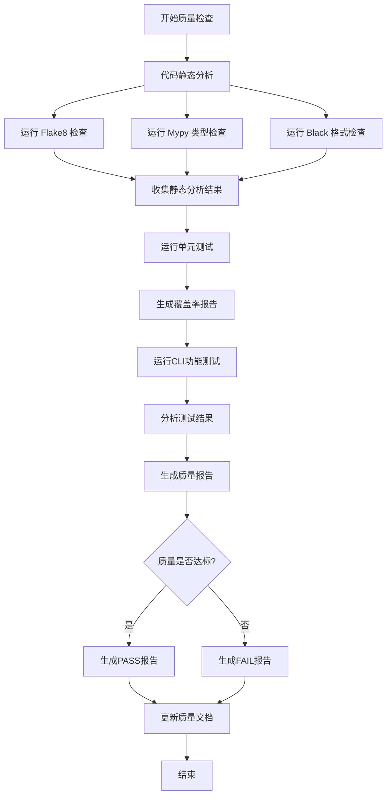

# 代码库质量检查设计文档

## 1. 背景与目标

### 1.1 检查目标
对 OpenDemo CLI 项目进行全面的代码库质量检查，确保项目在代码质量、测试覆盖、架构设计、文档完整性等方面达到高质量标准。

### 1.2 检查范围
- 代码质量与规范性
- 测试覆盖与有效性
- 项目架构与设计
- 文档完整性
- 依赖管理与安全性
- 开发工具链配置

## 2. 质量检查维度

### 2.1 代码质量检查

#### 2.1.1 代码规范性
- **Python 代码风格**：遵循 PEP 8 规范
  - 行长度限制：100字符（已配置 black）
  - 命名约定：模块、类、函数、变量命名规范
  - 导入语句组织：标准库、第三方库、项目内模块
  
- **类型注解**：检查关键函数是否包含类型提示
  - 公开 API 函数必须有类型注解
  - 复杂函数参数和返回值类型声明
  - mypy 静态类型检查配置（已配置但 disallow_untyped_defs 为 false）

- **文档字符串**：检查是否遵循规范
  - 模块级文档字符串
  - 类和方法的文档字符串
  - 参数说明、返回值说明、异常说明

#### 2.1.2 代码复杂度
- **圈复杂度**：评估函数复杂度
  - 单个函数圈复杂度应小于 10
  - 识别需要重构的复杂函数
  
- **代码重复**：检测重复代码片段
  - 避免复制粘贴代码
  - 提取公共函数或工具类

#### 2.1.3 潜在问题
- **静态代码分析**：使用 flake8 检测
  - 未使用的导入和变量
  - 语法错误和逻辑错误
  - 代码异味（code smells）
  
- **安全漏洞扫描**：检查常见安全问题
  - 不安全的函数调用
  - 输入验证缺失
  - 敏感信息泄露风险

### 2.2 测试质量检查

#### 2.2.1 单元测试覆盖率
- **代码覆盖率指标**
  - 总体覆盖率目标：≥ 80%
  - 核心模块覆盖率目标：≥ 90%
  - 按模块统计覆盖率

- **覆盖维度**
  - 语句覆盖（Statement Coverage）
  - 分支覆盖（Branch Coverage）
  - 函数覆盖（Function Coverage）

#### 2.2.2 测试用例质量
- **测试完整性**
  - 正常场景测试
  - 异常场景测试
  - 边界条件测试
  - 极端情况测试

- **测试独立性**
  - 测试用例之间无依赖
  - 可并行执行
  - 测试数据隔离

#### 2.2.3 现有测试分析
基于项目现状，已有测试文件：
- `test_config_service.py`：配置服务测试
- `test_demo_manager.py`：Demo管理器测试
- `test_search_engine.py`：搜索引擎测试

**缺失测试**：
- `demo_generator.py`：Demo生成器测试
- `demo_repository.py`：Demo仓库测试
- `demo_verifier.py`：Demo验证器测试
- `quality_checker.py`：质量检查器测试（自身）
- `readme_updater.py`：README更新器测试
- `ai_service.py`：AI服务测试
- `storage_service.py`：存储服务测试

#### 2.2.4 CLI功能测试
- **命令测试覆盖**
  - `search` 命令：所有语言、关键字搜索
  - `get` 命令：获取Demo、错误处理
  - `new` 命令：AI生成、验证选项
  - `config` 命令：配置管理操作

- **集成测试**
  - 端到端工作流测试
  - 多命令组合场景

### 2.3 架构与设计质量

#### 2.3.1 模块划分
- **职责清晰度**
  - `core/`：核心业务逻辑模块
    - `demo_generator.py`：Demo生成
    - `demo_repository.py`：Demo仓库管理
    - `demo_search.py`：Demo搜索
    - `demo_verifier.py`：Demo验证
    - `quality_checker.py`：质量检查
    - `readme_updater.py`：README更新
  
  - `services/`：服务层
    - `ai_service.py`：AI服务封装
    - `config_service.py`：配置管理
    - `storage_service.py`：存储管理
  
  - `utils/`：工具模块
    - `formatters.py`：输出格式化
    - `logger.py`：日志管理

- **模块依赖关系**
  - 避免循环依赖
  - 清晰的依赖层次：CLI → Core → Services → Utils
  - 低耦合高内聚

#### 2.3.2 设计模式应用
- **单一职责原则**：每个类专注单一功能
- **开闭原则**：对扩展开放，对修改封闭
- **依赖注入**：通过构造函数注入依赖
- **策略模式**：不同语言的Demo生成策略

#### 2.3.3 错误处理机制
- **异常层次**
  - 自定义异常类型
  - 统一错误处理
  - 错误信息清晰

- **错误恢复**
  - 优雅降级
  - 重试机制
  - 错误日志记录

### 2.4 文档完整性

#### 2.4.1 项目文档
- **README.md**
  - 项目介绍与特性
  - 快速开始指南
  - 命令参考
  - Demo统计与清单
  - 配置说明
  - 开发指南

- **代码文档**
  - 模块级文档字符串
  - 类和函数文档字符串
  - 复杂逻辑的行内注释

#### 2.4.2 API文档
- **对外接口文档**
  - CLI命令详细说明
  - 参数说明与示例
  - 返回值与错误码

#### 2.4.3 开发者文档
- **贡献指南**：如何贡献代码
- **开发环境搭建**：依赖安装、环境配置
- **测试指南**：如何运行测试、编写测试

### 2.5 依赖管理

#### 2.5.1 依赖声明
检查 `pyproject.toml` 中的依赖：
- **核心依赖**
  - `click>=8.0.0`：CLI框架
  - `pyyaml>=6.0`：YAML处理
  - `requests>=2.28.0`：HTTP请求
  - `rich>=13.0.0`：终端输出美化
  - `colorama>=0.4.6`：终端颜色支持

- **开发依赖**
  - `pytest>=7.0.0`：测试框架
  - `pytest-cov>=4.0.0`：覆盖率报告
  - `black>=23.0.0`：代码格式化
  - `flake8>=6.0.0`：代码检查
  - `mypy>=1.0.0`：类型检查

- **可选依赖**
  - `docker>=6.0.0`：Docker支持
  - `gitpython>=3.1.0`：Git支持

#### 2.5.2 依赖版本管理
- **版本固定策略**
  - 使用版本范围（`>=`）保证兼容性
  - 避免版本冲突
  
- **安全性检查**
  - 扫描已知漏洞依赖
  - 及时更新安全补丁

### 2.6 开发工具链

#### 2.6.1 代码格式化
- **Black 配置**（已配置）
  - 行长度：100字符
  - 目标Python版本：3.8-3.11
  
#### 2.6.2 代码检查工具
- **Flake8**：代码风格和错误检查
- **Mypy**：静态类型检查
- **Pytest**：测试框架

#### 2.6.3 版本控制
- **Git配置**
  - `.gitignore` 完整性
  - 忽略规则合理性

## 3. 质量检查流程

### 3.1 自动化检查流程



### 3.2 检查执行步骤

#### 步骤1：准备环境
- 确保开发依赖已安装
- 激活虚拟环境
- 切换到项目根目录

#### 步骤2：静态代码分析
- 执行 Black 格式检查（dry-run模式）
- 执行 Flake8 代码规范检查
- 执行 Mypy 类型检查
- 收集并汇总问题清单

#### 步骤3：运行测试套件
- 运行单元测试（pytest）
- 生成覆盖率报告（pytest-cov）
- 运行CLI功能测试
- 分析测试失败原因

#### 步骤4：架构与文档检查
- 检查模块依赖关系
- 验证文档完整性
- 检查代码注释质量

#### 步骤5：生成质量报告
- 汇总所有检查结果
- 计算质量评分
- 生成详细报告
- 提供改进建议

### 3.3 质量报告格式

#### 3.3.1 报告结构

```
质量检查报告
├── 执行摘要
│   ├── 总体状态（PASS/FAIL）
│   ├── 检查时间
│   └── 关键指标
├── 代码质量评估
│   ├── 静态分析结果
│   ├── 代码规范问题
│   └── 类型检查结果
├── 测试质量评估
│   ├── 单元测试覆盖率
│   ├── 测试通过率
│   └── CLI功能测试结果
├── 架构与设计评估
│   ├── 模块职责分析
│   ├── 依赖关系图
│   └── 设计模式应用
├── 文档完整性评估
│   ├── README完整性
│   ├── 代码注释覆盖率
│   └── API文档完整性
├── 依赖管理评估
│   ├── 依赖版本分析
│   └── 安全漏洞扫描
└── 改进建议
    ├── 优先级高的问题
    ├── 优先级中的问题
    └── 优先级低的问题
```

#### 3.3.2 报告输出格式
- **JSON格式**：机器可读，用于持续集成
- **Markdown格式**：人类可读，便于查看
- **存储路径**：`check/check_report_{timestamp}.md` 和 `.json`
- **最新报告链接**：`check/latest_report.json`

## 4. 质量标准与阈值

### 4.1 代码质量标准

| 指标 | 目标值 | 最低要求 |
|------|--------|----------|
| Flake8 错误数 | 0 | ≤ 5 |
| Mypy 类型错误数 | 0 | ≤ 10 |
| Black 格式不一致 | 0 | 0 |
| 代码重复率 | ≤ 3% | ≤ 5% |
| 平均圈复杂度 | ≤ 5 | ≤ 8 |

### 4.2 测试质量标准

| 指标 | 目标值 | 最低要求 |
|------|--------|----------|
| 单元测试覆盖率 | ≥ 80% | ≥ 70% |
| 核心模块覆盖率 | ≥ 90% | ≥ 80% |
| 单元测试通过率 | 100% | 100% |
| CLI测试通过率 | 100% | ≥ 90% |

### 4.3 文档质量标准

| 指标 | 目标值 | 最低要求 |
|------|--------|----------|
| 公开API文档覆盖率 | 100% | ≥ 90% |
| README完整性 | 完整 | 基本完整 |
| 代码注释率 | ≥ 30% | ≥ 20% |

### 4.4 综合评分规则

**评分模型**
- 代码质量：30分
- 测试质量：35分
- 架构设计：20分
- 文档完整性：15分

**等级划分**
- 优秀：≥ 90分
- 良好：80-89分
- 合格：70-79分
- 需改进：< 70分

## 5. 现有质量检查器分析

### 5.1 QualityChecker 类功能
基于 `opendemo/core/quality_checker.py` 分析：

**已实现功能**
- 运行单元测试（pytest）
- 运行CLI功能测试（9个测试用例）
- 生成JSON和Markdown格式报告
- 报告包含执行时间、通过率、失败详情

**CLI测试用例覆盖**
1. `version`：版本信息显示
2. `help`：帮助信息显示
3. `search_all_languages`：搜索所有语言
4. `search_python`：搜索Python Demo
5. `search_with_keyword`：关键字搜索
6. `get_existing_demo`：获取已存在的Demo
7. `get_unsupported_language`：不支持的语言错误处理
8. `config_list`：配置列表显示
9. `new_unsupported_language`：新建Demo不支持语言错误处理

### 5.2 检查器的不足

**缺失的检查项**
- 无静态代码分析（Flake8、Mypy、Black）
- 无测试覆盖率统计
- 无代码复杂度分析
- 无依赖安全性检查
- 无文档完整性检查

**改进建议**
- 集成静态分析工具
- 添加覆盖率报告生成
- 扩展CLI测试用例（目前仅9个）
- 添加性能基准测试
- 支持自定义检查规则

## 6. 质量改进建议

### 6.1 短期改进（1-2周）

#### 优先级：高
1. **补充缺失的单元测试**
   - 为未覆盖的核心模块添加测试
   - 优先：demo_generator, demo_verifier, readme_updater

2. **修复静态分析问题**
   - 运行 Flake8 并修复所有错误
   - 启用 Mypy 严格模式（disallow_untyped_defs = true）

3. **统一代码格式**
   - 对所有代码运行 Black 格式化
   - 确保代码风格一致性

#### 优先级：中
4. **扩展CLI测试用例**
   - 添加 `new` 命令的完整测试
   - 添加错误场景的边界测试

5. **完善文档字符串**
   - 补充缺失的docstring
   - 统一文档风格

### 6.2 中期改进（1-2月）

#### 优先级：高
1. **提升测试覆盖率至80%**
   - 按模块逐步提升覆盖率
   - 重点关注核心业务逻辑

2. **集成持续集成（CI）**
   - 配置GitHub Actions
   - 自动运行质量检查
   - 生成覆盖率徽章

#### 优先级：中
3. **重构复杂模块**
   - demo_repository.py（34.6KB，可能需要拆分）
   - demo_verifier.py（23.3KB，职责过多）

4. **添加性能测试**
   - 搜索性能基准
   - 大规模Demo生成性能

### 6.3 长期改进（3-6月）

1. **建立代码质量门禁**
   - 所有PR必须通过质量检查
   - 覆盖率不得下降

2. **完善架构设计文档**
   - 绘制系统架构图
   - 编写设计决策文档

3. **引入代码审查机制**
   - 制定审查清单
   - 定期代码审查会议

## 7. 执行计划

### 7.1 检查执行命令

**手动执行完整检查**
```bash
# 1. 代码格式检查
python -m black --check opendemo/ tests/

# 2. 代码规范检查
python -m flake8 opendemo/ tests/

# 3. 类型检查
python -m mypy opendemo/

# 4. 运行测试并生成覆盖率报告
python -m pytest tests/ --cov=opendemo --cov-report=html --cov-report=term

# 5. 使用内置质量检查器
python -c "from opendemo.core.quality_checker import QualityChecker; qc = QualityChecker(); qc.run_all_checks(); qc.save_report()"
```

**快捷执行方案**
创建 `scripts/quality_check.py` 脚本，一键执行所有检查并生成综合报告。

### 7.2 定期检查计划

| 检查类型 | 频率 | 负责人 | 输出物 |
|----------|------|--------|--------|
| 代码格式检查 | 每次提交 | 开发者 | 格式化报告 |
| 单元测试 | 每次提交 | 开发者 | 测试报告 |
| 完整质量检查 | 每周 | 质量负责人 | 质量周报 |
| 综合质量评估 | 每月 | 项目负责人 | 质量月报 |
| 依赖安全扫描 | 每月 | 安全负责人 | 安全报告 |

## 8. 成功标准

### 8.1 检查完成标准
- 所有检查项均已执行
- 生成完整的质量报告
- 识别所有高优先级问题
- 提供可行的改进建议

### 8.2 质量达标标准
- 静态分析错误数 ≤ 5
- 单元测试覆盖率 ≥ 70%
- 所有单元测试通过
- CLI测试通过率 ≥ 90%
- 综合评分 ≥ 70分

### 8.3 持续改进标准
- 每月质量评分提升 ≥ 5分
- 半年内达到"优秀"等级（≥ 90分）
- 建立完善的质量保障体系
