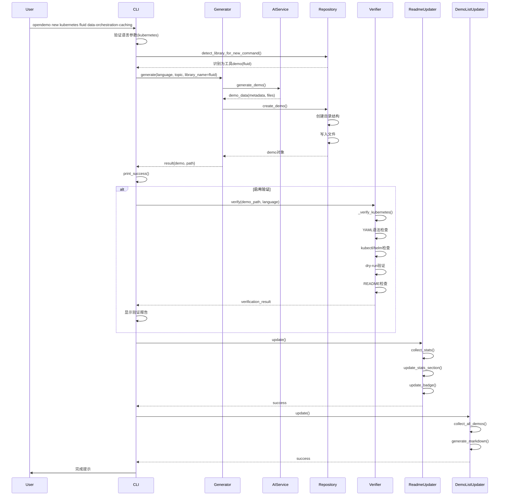
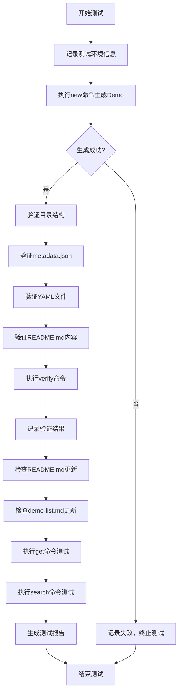

# 为Kubernetes创建Fluid Demo的设计文档

## 目标概述

通过CLI的`new`命令为Kubernetes生态创建一个关于Fluid（云原生数据编排与加速系统）的完整、专业、可执行的Demo，以此全面测试CLI的new功能、验证功能、文档自动更新功能，并确保整个工作流程的端到端正确性。

## 业务背景

### Fluid简介

Fluid是Kubernetes原生的分布式数据集编排和加速引擎，专为数据密集型应用设计。主要特性包括：
- 数据集抽象：将数据抽象为Kubernetes原生资源
- 数据预热与缓存：支持多级缓存加速数据访问
- 数据编排：自动化数据生命周期管理
- 弹性伸缩：根据负载动态调整缓存资源
- 多运行时支持：支持Alluxio、JuiceFS等多种缓存运行时

### 测试目标

本次任务将测试CLI工具的以下能力：
1. 通过`new`命令生成Kubernetes类型的Demo
2. 验证Kubernetes Demo的有效性（YAML语法、kubectl/helm可用性、文档完整性）
3. 自动更新README.md和demo-list.md文档
4. 生成完整的测试报告

## 功能需求

### Demo内容要求

Demo应覆盖Fluid的核心功能场景，包括但不限于：
- **基础安装配置**：Fluid系统部署与基本配置
- **数据集管理**：Dataset和AlluxioRuntime资源的创建与管理
- **数据缓存**：数据预热、缓存策略配置
- **应用集成**：将Fluid数据集挂载到Pod中使用
- **弹性伸缩**：基于数据访问负载的缓存容量自动扩缩容

### CLI命令执行

执行如下命令生成Demo：

```
opendemo new kubernetes fluid data-orchestration-caching
```

命令参数说明：
- `kubernetes`：目标语言/平台
- `fluid`：工具名称（将被识别并归类到kubernetes/fluid目录）
- `data-orchestration-caching`：功能描述关键词

### 输出目录结构

基于Kubernetes特殊目录结构规范，生成的Demo应位于：

```
opendemo_output/kubernetes/fluid/<demo_folder>/
```

其中`<demo_folder>`由AI生成，建议命名模式为：`fluid-<feature>-demo`

每个Demo目录应包含：
- `README.md`：完整的功能说明、安装步骤、使用示例、验证方法
- `metadata.json`：Demo元数据（名称、描述、关键字、难度、依赖版本等）
- `code/`：存放YAML清单文件和辅助脚本
  - `*.yaml` / `*.yml`：Kubernetes资源清单
  - `install.sh`（可选）：安装脚本
  - `verify.sh`（可选）：验证脚本

### Demo验证要求

根据demo_verifier.py中的`_verify_kubernetes`方法，验证流程包括：

| 验证步骤 | 检查内容 | 通过标准 |
|---------|---------|---------|
| 静态检查 | YAML文件语法有效性 | 所有YAML文件可被解析，无语法错误 |
| 工具检查 | kubectl和helm可用性 | kubectl version命令执行成功 |
| Dry-run验证 | kubectl apply --dry-run=client | 所有YAML清单通过客户端验证 |
| 文档检查 | README.md完整性 | 包含"安装"、"验证"等关键章节 |

### 文档自动更新

#### README.md更新

由`readme_updater.py`负责，需更新以下部分：

**Demo统计表格**：
- 更新Kubernetes行的工具列表，添加fluid及其Demo数量
- 更新总计行的数量

**徽章更新**：
- 更新顶部Demos徽章的总数量

#### demo-list.md更新

由`demo_list_updater.py`负责，需更新：

**统计摘要**：
- Kubernetes语言行的第三方库/工具数量
- 总计数量

**详细列表**：
- 在Kubernetes工具Demo章节添加fluid子章节
- 列出所有fluid相关的Demo条目

### 测试用例设计

#### 功能测试用例

| 测试用例ID | 测试场景 | 预期结果 |
|-----------|---------|---------|
| TC-NEW-01 | 执行new命令生成Fluid Demo | 命令执行成功，输出Demo路径 |
| TC-NEW-02 | 检查生成的目录结构 | 包含README.md、metadata.json、code/目录 |
| TC-NEW-03 | 检查metadata.json格式 | JSON格式正确，包含必需字段 |
| TC-NEW-04 | 检查YAML文件 | 至少1个YAML文件，语法正确 |
| TC-NEW-05 | 检查README.md内容 | 包含安装、使用、验证等章节 |

#### 验证功能测试用例

| 测试用例ID | 测试场景 | 预期结果 |
|-----------|---------|---------|
| TC-VERIFY-01 | 运行verify命令进行静态检查 | YAML语法检查通过 |
| TC-VERIFY-02 | 工具可用性检查 | kubectl检测通过或产生警告 |
| TC-VERIFY-03 | Dry-run验证 | kubectl dry-run执行成功或产生警告 |
| TC-VERIFY-04 | 生成验证报告 | 报告包含步骤、输出、错误信息 |

#### 文档更新测试用例

| 测试用例ID | 测试场景 | 预期结果 |
|-----------|---------|---------|
| TC-DOC-01 | 检查README.md更新 | Kubernetes行增加fluid工具统计 |
| TC-DOC-02 | 检查徽章更新 | Demos数量增加 |
| TC-DOC-03 | 检查demo-list.md更新 | 添加fluid章节和Demo条目 |
| TC-DOC-04 | 检查更新时间戳 | 文档包含最新生成时间 |

#### 集成测试用例

| 测试用例ID | 测试场景 | 预期结果 |
|-----------|---------|---------|
| TC-INT-01 | 完整流程：new -> verify -> 检查文档 | 所有步骤顺利执行 |
| TC-INT-02 | 使用get命令获取生成的Demo | 能够正确匹配并显示 |
| TC-INT-03 | 使用search命令搜索fluid | 返回新生成的Demo |

### 测试报告要求

测试报告应包含以下章节：

**执行摘要**：
- 测试目标
- 测试范围
- 总体结果（通过/失败）

**测试环境**：
- 操作系统
- Python版本
- kubectl版本
- 相关依赖版本

**测试执行记录**：
- 每个测试用例的执行结果
- 截图或命令输出
- 错误信息（如有）

**文档验证结果**：
- README.md更新前后对比
- demo-list.md更新前后对比
- 数量统计验证

**问题与建议**：
- 发现的问题
- 改进建议

## 技术方案

### 命令执行流程



### Demo生成策略

#### 库/工具识别

`DemoRepository.detect_library_for_new_command()`方法将识别"fluid"为工具名：
- 检查是否在已注册的Kubernetes工具列表中
- 对于未注册的工具，可选使用AI判断
- 返回工具名"fluid"

#### 目录结构创建

`DemoRepository.create_demo()`方法在`library_name`不为空时：
- 对于Kubernetes语言，创建路径：`kubernetes/fluid/<folder_name>/`
- folder_name由AI生成或基于topic关键字生成

#### 元数据生成

AI生成的metadata应包含：
- `name`：中文或英文的功能名称
- `description`：功能描述
- `keywords`：包含"fluid"、"kubernetes"、"data-orchestration"等
- `difficulty`：建议为"beginner"或"intermediate"
- `dependencies`：记录Fluid版本、Kubernetes版本等
- `category`：可设置为"Data Orchestration"

### 验证执行策略

#### 静态YAML检查

- 使用PyYAML库解析所有.yaml和.yml文件
- 支持多文档YAML（使用yaml.safe_load_all）
- 记录每个文件的检查结果

#### 工具可用性检查

- 执行`kubectl version --client`命令
- 超时时间从配置读取（默认30秒）
- 工具不可用时记为警告，不阻断验证

#### Dry-run验证

- 对每个YAML文件执行`kubectl apply --dry-run=client -f <file>`
- 验证资源定义的正确性
- 失败时记录警告信息

#### 文档完整性检查

- 读取README.md内容
- 检查是否包含关键词：["安装", "install", "验证", "verify"]
- 至少包含2个关键词视为通过

### 文档更新策略

#### README.md统计更新

`ReadmeUpdater.collect_stats()`针对Kubernetes的特殊处理：
- 遍历`kubernetes/`目录下的所有子目录（工具目录）
- 统计每个工具目录下的Demo数量
- 将结果存储在`stats['kubernetes']['tools']`字典中

`ReadmeUpdater.generate_stats_table()`生成表格时：
- Kubernetes行的"第三方库/工具"列显示所有工具及数量
- 格式：`fluid(N), kubeflow(M), ...`

#### demo-list.md列表更新

`DemoListUpdater.scan_demos()`针对Kubernetes：
- 识别两层目录结构：`kubernetes/<tool>/<demo>/`
- 提取每个demo的信息，设置category为工具名

`DemoListUpdater.generate_markdown()`生成列表时：
- 在Kubernetes章节下按工具名分组
- 每个工具（如fluid）创建独立子章节
- 列出该工具下的所有Demo

### 测试执行流程



## 数据模型

### metadata.json结构

```
{
  name: string                    # Demo名称
  language: "kubernetes"          # 语言标识
  keywords: string[]              # 关键字列表，包含"fluid"
  description: string             # 功能描述
  difficulty: string              # 难度级别：beginner/intermediate/advanced
  author: string                  # 作者
  created_at: string              # 创建时间(ISO 8601)
  updated_at: string              # 更新时间(ISO 8601)
  version: string                 # 版本号
  dependencies: {                 # 依赖信息
    fluid_version: string         # Fluid版本要求
    kubernetes_version: string    # Kubernetes版本要求
    helm_version: string          # Helm版本要求（可选）
  }
  verified: boolean               # 验证状态
  category: string                # 分类标签
}
```

### 验证结果数据结构

```
{
  verified: boolean               # 总体验证结果
  partial: boolean                # 是否为部分验证
  method: "kubernetes"            # 验证方法
  steps: string[]                 # 执行步骤列表
  outputs: string[]               # 输出信息列表
  errors: string[]                # 错误信息列表
  warnings: string[]              # 警告信息列表
  message: string                 # 总体消息
}
```

### 统计数据结构

```
{
  kubernetes: {
    base: number                  # 基础Demo数量（通常为0）
    libraries: {}                 # 库Demo（空对象）
    tools: {                      # 工具Demo
      fluid: number               # Fluid Demo数量
      kubeflow: number            # Kubeflow Demo数量
      ...
    }
  }
}
```

## 操作步骤

### 执行阶段

1. **环境准备**
   - 确保已安装opendemo CLI
   - 配置AI API密钥
   - 安装kubectl（用于验证）

2. **生成Demo**
   ```bash
   opendemo new kubernetes fluid data-orchestration-caching --verify
   ```

3. **手动验证生成结果**
   - 检查生成的目录路径
   - 查看README.md内容
   - 查看metadata.json结构
   - 查看YAML文件内容

4. **测试功能命令**
   ```bash
   # 搜索fluid相关demo
   opendemo search kubernetes fluid
   
   # 获取生成的demo
   opendemo get kubernetes fluid data-orchestration-caching
   ```

5. **验证文档更新**
   - 打开README.md，检查Kubernetes行的统计
   - 打开demo-list.md，检查fluid章节

### 测试执行步骤

1. **准备测试用例清单**
   - 创建测试用例表格
   - 准备测试数据

2. **执行功能测试**
   - 按照测试用例逐一执行
   - 记录每个用例的结果
   - 截图保存证据

3. **执行验证测试**
   - 运行带--verify标志的命令
   - 检查验证报告内容
   - 记录各项检查结果

4. **执行文档测试**
   - 对比文档更新前后
   - 验证数量统计正确性
   - 检查格式是否规范

5. **执行集成测试**
   - 测试完整工作流
   - 测试与其他命令的集成

6. **生成测试报告**
   - 汇总所有测试结果
   - 分析通过率
   - 记录问题和建议

## 验证标准

### Demo质量标准

| 检查项 | 标准 |
|-------|------|
| 目录结构 | 符合Kubernetes目录规范，位于kubernetes/fluid/下 |
| README.md | 包含完整的安装、使用、验证说明，不少于100行 |
| metadata.json | 格式正确，包含所有必需字段 |
| YAML文件 | 至少包含3个YAML文件，涵盖Dataset、Runtime、示例应用 |
| 代码注释 | YAML中包含必要的注释说明 |
| 文档语言 | 使用中文描述，专业术语准确 |

### 验证功能标准

| 检查项 | 标准 |
|-------|------|
| YAML语法检查 | 所有YAML文件可被PyYAML解析 |
| kubectl检查 | 检测到kubectl或记录警告 |
| dry-run验证 | 执行成功或有合理的警告解释 |
| README检查 | 包含安装和验证相关章节 |
| 验证报告 | 生成完整的报告，包含步骤、输出、错误 |

### 文档更新标准

| 文档 | 检查项 | 标准 |
|-----|-------|------|
| README.md | Kubernetes行统计 | fluid工具及Demo数量正确显示 |
| README.md | 总计统计 | 总Demo数量正确增加 |
| README.md | 徽章更新 | Demos徽章数量正确 |
| demo-list.md | 统计摘要 | Kubernetes行数量正确 |
| demo-list.md | fluid章节 | 创建fluid子章节，列出所有Demo |
| demo-list.md | 更新时间 | 包含最新生成时间 |

### 测试通过标准

| 类别 | 通过标准 |
|-----|---------|
| 功能测试 | 所有测试用例通过率 ≥ 90% |
| 验证测试 | 核心验证步骤全部通过，可接受非阻断性警告 |
| 文档测试 | 所有文档更新检查通过 |
| 集成测试 | 完整流程可顺利执行 |
| 总体评估 | 所有类别测试通过率 ≥ 90%，无阻断性问题 |

## 风险与应对

### 技术风险

| 风险 | 影响 | 概率 | 应对措施 |
|-----|------|------|---------|
| AI生成内容不符合Fluid规范 | 高 | 中 | 人工审核和修正生成内容 |
| YAML语法错误 | 中 | 低 | 静态检查发现并修复 |
| kubectl未安装导致验证失败 | 低 | 中 | 验证作为警告而非阻断 |
| 文档更新正则匹配失败 | 高 | 低 | 测试文档更新逻辑，备用手动更新 |

### 流程风险

| 风险 | 影响 | 概率 | 应对措施 |
|-----|------|------|---------|
| 测试用例遗漏 | 中 | 中 | 评审测试用例清单，补充边界场景 |
| 测试环境不一致 | 中 | 低 | 记录详细的环境信息 |
| 测试时间不足 | 高 | 低 | 优先执行核心测试用例 |

### 数据风险

| 风险 | 影响 | 概率 | 应对措施 |
|-----|------|------|---------|
| 现有Demo数据损坏 | 高 | 极低 | 测试前备份opendemo_output目录 |
| 文档格式破坏 | 高 | 低 | 测试前备份README.md和demo-list.md |
| 统计数据不一致 | 中 | 低 | 验证统计算法的正确性 |

## 成功标准

1. **Demo生成成功**：通过new命令成功生成fluid demo，目录结构正确
2. **内容质量达标**：Demo内容专业、完整，符合Fluid使用规范
3. **验证功能正常**：验证流程执行成功，生成完整报告
4. **文档自动更新**：README.md和demo-list.md正确更新统计信息
5. **测试报告完整**：测试用例执行完毕，生成详细报告
6. **通过率达标**：所有测试类别通过率≥90%
7. **无阻断问题**：不存在阻断CLI核心功能的严重问题

## 交付物

1. **生成的Demo**：位于`opendemo_output/kubernetes/fluid/`目录下的完整Demo
2. **验证报告**：verify命令生成的验证报告（命令行输出或文件）
3. **测试用例表格**：包含所有测试用例及执行结果的表格文档
4. **测试报告文档**：详细的测试执行报告，包含截图和分析
5. **更新后的文档**：更新后的README.md和demo-list.md
6. **问题清单**：测试过程中发现的问题及建议改进列表

## 后续优化建议

1. **增强AI提示词**：针对Fluid等特定工具优化prompt，生成更专业的内容
2. **扩展验证能力**：增加对Helm Chart的验证支持
3. **验证报告格式**：支持输出HTML或Markdown格式的验证报告
4. **测试自动化**：将测试用例转化为自动化测试脚本
5. **Demo模板库**：为常见Kubernetes工具建立Demo模板
6. **版本兼容性**：在metadata中明确记录兼容的版本范围
## 目标概述

通过CLI的`new`命令为Kubernetes生态创建一个关于Fluid（云原生数据编排与加速系统）的完整、专业、可执行的Demo，以此全面测试CLI的new功能、验证功能、文档自动更新功能，并确保整个工作流程的端到端正确性。

## 业务背景

### Fluid简介

Fluid是Kubernetes原生的分布式数据集编排和加速引擎，专为数据密集型应用设计。主要特性包括：
- 数据集抽象：将数据抽象为Kubernetes原生资源
- 数据预热与缓存：支持多级缓存加速数据访问
- 数据编排：自动化数据生命周期管理
- 弹性伸缩：根据负载动态调整缓存资源
- 多运行时支持：支持Alluxio、JuiceFS等多种缓存运行时

### 测试目标

本次任务将测试CLI工具的以下能力：
1. 通过`new`命令生成Kubernetes类型的Demo
2. 验证Kubernetes Demo的有效性（YAML语法、kubectl/helm可用性、文档完整性）
3. 自动更新README.md和demo-list.md文档
4. 生成完整的测试报告

## 功能需求

### Demo内容要求

Demo应覆盖Fluid的核心功能场景，包括但不限于：
- **基础安装配置**：Fluid系统部署与基本配置
- **数据集管理**：Dataset和AlluxioRuntime资源的创建与管理
- **数据缓存**：数据预热、缓存策略配置
- **应用集成**：将Fluid数据集挂载到Pod中使用
- **弹性伸缩**：基于数据访问负载的缓存容量自动扩缩容

### CLI命令执行

执行如下命令生成Demo：

```
opendemo new kubernetes fluid data-orchestration-caching
```

命令参数说明：
- `kubernetes`：目标语言/平台
- `fluid`：工具名称（将被识别并归类到kubernetes/fluid目录）
- `data-orchestration-caching`：功能描述关键词

### 输出目录结构

基于Kubernetes特殊目录结构规范，生成的Demo应位于：

```
opendemo_output/kubernetes/fluid/<demo_folder>/
```

其中`<demo_folder>`由AI生成，建议命名模式为：`fluid-<feature>-demo`

每个Demo目录应包含：
- `README.md`：完整的功能说明、安装步骤、使用示例、验证方法
- `metadata.json`：Demo元数据（名称、描述、关键字、难度、依赖版本等）
- `code/`：存放YAML清单文件和辅助脚本
  - `*.yaml` / `*.yml`：Kubernetes资源清单
  - `install.sh`（可选）：安装脚本
  - `verify.sh`（可选）：验证脚本

### Demo验证要求

根据demo_verifier.py中的`_verify_kubernetes`方法，验证流程包括：

| 验证步骤 | 检查内容 | 通过标准 |
|---------|---------|---------|
| 静态检查 | YAML文件语法有效性 | 所有YAML文件可被解析，无语法错误 |
| 工具检查 | kubectl和helm可用性 | kubectl version命令执行成功 |
| Dry-run验证 | kubectl apply --dry-run=client | 所有YAML清单通过客户端验证 |
| 文档检查 | README.md完整性 | 包含"安装"、"验证"等关键章节 |

### 文档自动更新

#### README.md更新

由`readme_updater.py`负责，需更新以下部分：

**Demo统计表格**：
- 更新Kubernetes行的工具列表，添加fluid及其Demo数量
- 更新总计行的数量

**徽章更新**：
- 更新顶部Demos徽章的总数量

#### demo-list.md更新

由`demo_list_updater.py`负责，需更新：

**统计摘要**：
- Kubernetes语言行的第三方库/工具数量
- 总计数量

**详细列表**：
- 在Kubernetes工具Demo章节添加fluid子章节
- 列出所有fluid相关的Demo条目

### 测试用例设计

#### 功能测试用例

| 测试用例ID | 测试场景 | 预期结果 |
|-----------|---------|---------|
| TC-NEW-01 | 执行new命令生成Fluid Demo | 命令执行成功，输出Demo路径 |
| TC-NEW-02 | 检查生成的目录结构 | 包含README.md、metadata.json、code/目录 |
| TC-NEW-03 | 检查metadata.json格式 | JSON格式正确，包含必需字段 |
| TC-NEW-04 | 检查YAML文件 | 至少1个YAML文件，语法正确 |
| TC-NEW-05 | 检查README.md内容 | 包含安装、使用、验证等章节 |

#### 验证功能测试用例

| 测试用例ID | 测试场景 | 预期结果 |
|-----------|---------|---------|
| TC-VERIFY-01 | 运行verify命令进行静态检查 | YAML语法检查通过 |
| TC-VERIFY-02 | 工具可用性检查 | kubectl检测通过或产生警告 |
| TC-VERIFY-03 | Dry-run验证 | kubectl dry-run执行成功或产生警告 |
| TC-VERIFY-04 | 生成验证报告 | 报告包含步骤、输出、错误信息 |

#### 文档更新测试用例

| 测试用例ID | 测试场景 | 预期结果 |
|-----------|---------|---------|
| TC-DOC-01 | 检查README.md更新 | Kubernetes行增加fluid工具统计 |
| TC-DOC-02 | 检查徽章更新 | Demos数量增加 |
| TC-DOC-03 | 检查demo-list.md更新 | 添加fluid章节和Demo条目 |
| TC-DOC-04 | 检查更新时间戳 | 文档包含最新生成时间 |

#### 集成测试用例

| 测试用例ID | 测试场景 | 预期结果 |
|-----------|---------|---------|
| TC-INT-01 | 完整流程：new -> verify -> 检查文档 | 所有步骤顺利执行 |
| TC-INT-02 | 使用get命令获取生成的Demo | 能够正确匹配并显示 |
| TC-INT-03 | 使用search命令搜索fluid | 返回新生成的Demo |

### 测试报告要求

测试报告应包含以下章节：

**执行摘要**：
- 测试目标
- 测试范围
- 总体结果（通过/失败）

**测试环境**：
- 操作系统
- Python版本
- kubectl版本
- 相关依赖版本

**测试执行记录**：
- 每个测试用例的执行结果
- 截图或命令输出
- 错误信息（如有）

**文档验证结果**：
- README.md更新前后对比
- demo-list.md更新前后对比
- 数量统计验证

**问题与建议**：
- 发现的问题
- 改进建议

## 技术方案

### 命令执行流程


### Demo生成策略

#### 库/工具识别

`DemoRepository.detect_library_for_new_command()`方法将识别"fluid"为工具名：
- 检查是否在已注册的Kubernetes工具列表中
- 对于未注册的工具，可选使用AI判断
- 返回工具名"fluid"

#### 目录结构创建

`DemoRepository.create_demo()`方法在`library_name`不为空时：
- 对于Kubernetes语言，创建路径：`kubernetes/fluid/<folder_name>/`
- folder_name由AI生成或基于topic关键字生成

#### 元数据生成

AI生成的metadata应包含：
- `name`：中文或英文的功能名称
- `description`：功能描述
- `keywords`：包含"fluid"、"kubernetes"、"data-orchestration"等
- `difficulty`：建议为"beginner"或"intermediate"
- `dependencies`：记录Fluid版本、Kubernetes版本等
- `category`：可设置为"Data Orchestration"

### 验证执行策略

#### 静态YAML检查

- 使用PyYAML库解析所有.yaml和.yml文件
- 支持多文档YAML（使用yaml.safe_load_all）
- 记录每个文件的检查结果

#### 工具可用性检查

- 执行`kubectl version --client`命令
- 超时时间从配置读取（默认30秒）
- 工具不可用时记为警告，不阻断验证

#### Dry-run验证

- 对每个YAML文件执行`kubectl apply --dry-run=client -f <file>`
- 验证资源定义的正确性
- 失败时记录警告信息

#### 文档完整性检查

- 读取README.md内容
- 检查是否包含关键词：["安装", "install", "验证", "verify"]
- 至少包含2个关键词视为通过

### 文档更新策略

#### README.md统计更新

`ReadmeUpdater.collect_stats()`针对Kubernetes的特殊处理：
- 遍历`kubernetes/`目录下的所有子目录（工具目录）
- 统计每个工具目录下的Demo数量
- 将结果存储在`stats['kubernetes']['tools']`字典中

`ReadmeUpdater.generate_stats_table()`生成表格时：
- Kubernetes行的"第三方库/工具"列显示所有工具及数量
- 格式：`fluid(N), kubeflow(M), ...`

#### demo-list.md列表更新

`DemoListUpdater.scan_demos()`针对Kubernetes：
- 识别两层目录结构：`kubernetes/<tool>/<demo>/`
- 提取每个demo的信息，设置category为工具名

`DemoListUpdater.generate_markdown()`生成列表时：
- 在Kubernetes章节下按工具名分组
- 每个工具（如fluid）创建独立子章节
- 列出该工具下的所有Demo

### 测试执行流程


## 数据模型

### metadata.json结构

```
{
  name: string                    # Demo名称
  language: "kubernetes"          # 语言标识
  keywords: string[]              # 关键字列表，包含"fluid"
  description: string             # 功能描述
  difficulty: string              # 难度级别：beginner/intermediate/advanced
  author: string                  # 作者
  created_at: string              # 创建时间(ISO 8601)
  updated_at: string              # 更新时间(ISO 8601)
  version: string                 # 版本号
  dependencies: {                 # 依赖信息
    fluid_version: string         # Fluid版本要求
    kubernetes_version: string    # Kubernetes版本要求
    helm_version: string          # Helm版本要求（可选）
  }
  verified: boolean               # 验证状态
  category: string                # 分类标签
}
```

### 验证结果数据结构

```
{
  verified: boolean               # 总体验证结果
  partial: boolean                # 是否为部分验证
  method: "kubernetes"            # 验证方法
  steps: string[]                 # 执行步骤列表
  outputs: string[]               # 输出信息列表
  errors: string[]                # 错误信息列表
  warnings: string[]              # 警告信息列表
  message: string                 # 总体消息
}
```

### 统计数据结构

```
{
  kubernetes: {
    base: number                  # 基础Demo数量（通常为0）
    libraries: {}                 # 库Demo（空对象）
    tools: {                      # 工具Demo
      fluid: number               # Fluid Demo数量
      kubeflow: number            # Kubeflow Demo数量
      ...
    }
  }
}
```

## 操作步骤

### 执行阶段

1. **环境准备**
   - 确保已安装opendemo CLI
   - 配置AI API密钥
   - 安装kubectl（用于验证）

2. **生成Demo**
   ```bash
   opendemo new kubernetes fluid data-orchestration-caching --verify
   ```

3. **手动验证生成结果**
   - 检查生成的目录路径
   - 查看README.md内容
   - 查看metadata.json结构
   - 查看YAML文件内容

4. **测试功能命令**
   ```bash
   # 搜索fluid相关demo
   opendemo search kubernetes fluid
   
   # 获取生成的demo
   opendemo get kubernetes fluid data-orchestration-caching
   ```

5. **验证文档更新**
   - 打开README.md，检查Kubernetes行的统计
   - 打开demo-list.md，检查fluid章节

### 测试执行步骤

1. **准备测试用例清单**
   - 创建测试用例表格
   - 准备测试数据

2. **执行功能测试**
   - 按照测试用例逐一执行
   - 记录每个用例的结果
   - 截图保存证据

3. **执行验证测试**
   - 运行带--verify标志的命令
   - 检查验证报告内容
   - 记录各项检查结果

4. **执行文档测试**
   - 对比文档更新前后
   - 验证数量统计正确性
   - 检查格式是否规范

5. **执行集成测试**
   - 测试完整工作流
   - 测试与其他命令的集成

6. **生成测试报告**
   - 汇总所有测试结果
   - 分析通过率
   - 记录问题和建议

## 验证标准

### Demo质量标准

| 检查项 | 标准 |
|-------|------|
| 目录结构 | 符合Kubernetes目录规范，位于kubernetes/fluid/下 |
| README.md | 包含完整的安装、使用、验证说明，不少于100行 |
| metadata.json | 格式正确，包含所有必需字段 |
| YAML文件 | 至少包含3个YAML文件，涵盖Dataset、Runtime、示例应用 |
| 代码注释 | YAML中包含必要的注释说明 |
| 文档语言 | 使用中文描述，专业术语准确 |

### 验证功能标准

| 检查项 | 标准 |
|-------|------|
| YAML语法检查 | 所有YAML文件可被PyYAML解析 |
| kubectl检查 | 检测到kubectl或记录警告 |
| dry-run验证 | 执行成功或有合理的警告解释 |
| README检查 | 包含安装和验证相关章节 |
| 验证报告 | 生成完整的报告，包含步骤、输出、错误 |

### 文档更新标准

| 文档 | 检查项 | 标准 |
|-----|-------|------|
| README.md | Kubernetes行统计 | fluid工具及Demo数量正确显示 |
| README.md | 总计统计 | 总Demo数量正确增加 |
| README.md | 徽章更新 | Demos徽章数量正确 |
| demo-list.md | 统计摘要 | Kubernetes行数量正确 |
| demo-list.md | fluid章节 | 创建fluid子章节，列出所有Demo |
| demo-list.md | 更新时间 | 包含最新生成时间 |

### 测试通过标准

| 类别 | 通过标准 |
|-----|---------|
| 功能测试 | 所有测试用例通过率 ≥ 90% |
| 验证测试 | 核心验证步骤全部通过，可接受非阻断性警告 |
| 文档测试 | 所有文档更新检查通过 |
| 集成测试 | 完整流程可顺利执行 |
| 总体评估 | 所有类别测试通过率 ≥ 90%，无阻断性问题 |

## 风险与应对

### 技术风险

| 风险 | 影响 | 概率 | 应对措施 |
|-----|------|------|---------|
| AI生成内容不符合Fluid规范 | 高 | 中 | 人工审核和修正生成内容 |
| YAML语法错误 | 中 | 低 | 静态检查发现并修复 |
| kubectl未安装导致验证失败 | 低 | 中 | 验证作为警告而非阻断 |
| 文档更新正则匹配失败 | 高 | 低 | 测试文档更新逻辑，备用手动更新 |

### 流程风险

| 风险 | 影响 | 概率 | 应对措施 |
|-----|------|------|---------|
| 测试用例遗漏 | 中 | 中 | 评审测试用例清单，补充边界场景 |
| 测试环境不一致 | 中 | 低 | 记录详细的环境信息 |
| 测试时间不足 | 高 | 低 | 优先执行核心测试用例 |

### 数据风险

| 风险 | 影响 | 概率 | 应对措施 |
|-----|------|------|---------|
| 现有Demo数据损坏 | 高 | 极低 | 测试前备份opendemo_output目录 |
| 文档格式破坏 | 高 | 低 | 测试前备份README.md和demo-list.md |
| 统计数据不一致 | 中 | 低 | 验证统计算法的正确性 |

## 成功标准

1. **Demo生成成功**：通过new命令成功生成fluid demo，目录结构正确
2. **内容质量达标**：Demo内容专业、完整，符合Fluid使用规范
3. **验证功能正常**：验证流程执行成功，生成完整报告
4. **文档自动更新**：README.md和demo-list.md正确更新统计信息
5. **测试报告完整**：测试用例执行完毕，生成详细报告
6. **通过率达标**：所有测试类别通过率≥90%
7. **无阻断问题**：不存在阻断CLI核心功能的严重问题

## 交付物

1. **生成的Demo**：位于`opendemo_output/kubernetes/fluid/`目录下的完整Demo
2. **验证报告**：verify命令生成的验证报告（命令行输出或文件）
3. **测试用例表格**：包含所有测试用例及执行结果的表格文档
4. **测试报告文档**：详细的测试执行报告，包含截图和分析
5. **更新后的文档**：更新后的README.md和demo-list.md
6. **问题清单**：测试过程中发现的问题及建议改进列表

## 后续优化建议

1. **增强AI提示词**：针对Fluid等特定工具优化prompt，生成更专业的内容
2. **扩展验证能力**：增加对Helm Chart的验证支持
3. **验证报告格式**：支持输出HTML或Markdown格式的验证报告
4. **测试自动化**：将测试用例转化为自动化测试脚本
5. **Demo模板库**：为常见Kubernetes工具建立Demo模板
6. **版本兼容性**：在metadata中明确记录兼容的版本范围
## 目标概述

通过CLI的`new`命令为Kubernetes生态创建一个关于Fluid（云原生数据编排与加速系统）的完整、专业、可执行的Demo，以此全面测试CLI的new功能、验证功能、文档自动更新功能，并确保整个工作流程的端到端正确性。

## 业务背景

### Fluid简介

Fluid是Kubernetes原生的分布式数据集编排和加速引擎，专为数据密集型应用设计。主要特性包括：
- 数据集抽象：将数据抽象为Kubernetes原生资源
- 数据预热与缓存：支持多级缓存加速数据访问
- 数据编排：自动化数据生命周期管理
- 弹性伸缩：根据负载动态调整缓存资源
- 多运行时支持：支持Alluxio、JuiceFS等多种缓存运行时

### 测试目标

本次任务将测试CLI工具的以下能力：
1. 通过`new`命令生成Kubernetes类型的Demo
2. 验证Kubernetes Demo的有效性（YAML语法、kubectl/helm可用性、文档完整性）
3. 自动更新README.md和demo-list.md文档
4. 生成完整的测试报告

## 功能需求

### Demo内容要求

Demo应覆盖Fluid的核心功能场景，包括但不限于：
- **基础安装配置**：Fluid系统部署与基本配置
- **数据集管理**：Dataset和AlluxioRuntime资源的创建与管理
- **数据缓存**：数据预热、缓存策略配置
- **应用集成**：将Fluid数据集挂载到Pod中使用
- **弹性伸缩**：基于数据访问负载的缓存容量自动扩缩容

### CLI命令执行

执行如下命令生成Demo：

```
opendemo new kubernetes fluid data-orchestration-caching
```

命令参数说明：
- `kubernetes`：目标语言/平台
- `fluid`：工具名称（将被识别并归类到kubernetes/fluid目录）
- `data-orchestration-caching`：功能描述关键词

### 输出目录结构

基于Kubernetes特殊目录结构规范，生成的Demo应位于：

```
opendemo_output/kubernetes/fluid/<demo_folder>/
```

其中`<demo_folder>`由AI生成，建议命名模式为：`fluid-<feature>-demo`

每个Demo目录应包含：
- `README.md`：完整的功能说明、安装步骤、使用示例、验证方法
- `metadata.json`：Demo元数据（名称、描述、关键字、难度、依赖版本等）
- `code/`：存放YAML清单文件和辅助脚本
  - `*.yaml` / `*.yml`：Kubernetes资源清单
  - `install.sh`（可选）：安装脚本
  - `verify.sh`（可选）：验证脚本

### Demo验证要求

根据demo_verifier.py中的`_verify_kubernetes`方法，验证流程包括：

| 验证步骤 | 检查内容 | 通过标准 |
|---------|---------|---------|
| 静态检查 | YAML文件语法有效性 | 所有YAML文件可被解析，无语法错误 |
| 工具检查 | kubectl和helm可用性 | kubectl version命令执行成功 |
| Dry-run验证 | kubectl apply --dry-run=client | 所有YAML清单通过客户端验证 |
| 文档检查 | README.md完整性 | 包含"安装"、"验证"等关键章节 |

### 文档自动更新

#### README.md更新

由`readme_updater.py`负责，需更新以下部分：

**Demo统计表格**：
- 更新Kubernetes行的工具列表，添加fluid及其Demo数量
- 更新总计行的数量

**徽章更新**：
- 更新顶部Demos徽章的总数量

#### demo-list.md更新

由`demo_list_updater.py`负责，需更新：

**统计摘要**：
- Kubernetes语言行的第三方库/工具数量
- 总计数量

**详细列表**：
- 在Kubernetes工具Demo章节添加fluid子章节
- 列出所有fluid相关的Demo条目

### 测试用例设计

#### 功能测试用例

| 测试用例ID | 测试场景 | 预期结果 |
|-----------|---------|---------|
| TC-NEW-01 | 执行new命令生成Fluid Demo | 命令执行成功，输出Demo路径 |
| TC-NEW-02 | 检查生成的目录结构 | 包含README.md、metadata.json、code/目录 |
| TC-NEW-03 | 检查metadata.json格式 | JSON格式正确，包含必需字段 |
| TC-NEW-04 | 检查YAML文件 | 至少1个YAML文件，语法正确 |
| TC-NEW-05 | 检查README.md内容 | 包含安装、使用、验证等章节 |

#### 验证功能测试用例

| 测试用例ID | 测试场景 | 预期结果 |
|-----------|---------|---------|
| TC-VERIFY-01 | 运行verify命令进行静态检查 | YAML语法检查通过 |
| TC-VERIFY-02 | 工具可用性检查 | kubectl检测通过或产生警告 |
| TC-VERIFY-03 | Dry-run验证 | kubectl dry-run执行成功或产生警告 |
| TC-VERIFY-04 | 生成验证报告 | 报告包含步骤、输出、错误信息 |

#### 文档更新测试用例

| 测试用例ID | 测试场景 | 预期结果 |
|-----------|---------|---------|
| TC-DOC-01 | 检查README.md更新 | Kubernetes行增加fluid工具统计 |
| TC-DOC-02 | 检查徽章更新 | Demos数量增加 |
| TC-DOC-03 | 检查demo-list.md更新 | 添加fluid章节和Demo条目 |
| TC-DOC-04 | 检查更新时间戳 | 文档包含最新生成时间 |

#### 集成测试用例

| 测试用例ID | 测试场景 | 预期结果 |
|-----------|---------|---------|
| TC-INT-01 | 完整流程：new -> verify -> 检查文档 | 所有步骤顺利执行 |
| TC-INT-02 | 使用get命令获取生成的Demo | 能够正确匹配并显示 |
| TC-INT-03 | 使用search命令搜索fluid | 返回新生成的Demo |

### 测试报告要求

测试报告应包含以下章节：

**执行摘要**：
- 测试目标
- 测试范围
- 总体结果（通过/失败）

**测试环境**：
- 操作系统
- Python版本
- kubectl版本
- 相关依赖版本

**测试执行记录**：
- 每个测试用例的执行结果
- 截图或命令输出
- 错误信息（如有）

**文档验证结果**：
- README.md更新前后对比
- demo-list.md更新前后对比
- 数量统计验证

**问题与建议**：
- 发现的问题
- 改进建议

## 技术方案

### 命令执行流程


### Demo生成策略

#### 库/工具识别

`DemoRepository.detect_library_for_new_command()`方法将识别"fluid"为工具名：
- 检查是否在已注册的Kubernetes工具列表中
- 对于未注册的工具，可选使用AI判断
- 返回工具名"fluid"

#### 目录结构创建

`DemoRepository.create_demo()`方法在`library_name`不为空时：
- 对于Kubernetes语言，创建路径：`kubernetes/fluid/<folder_name>/`
- folder_name由AI生成或基于topic关键字生成

#### 元数据生成

AI生成的metadata应包含：
- `name`：中文或英文的功能名称
- `description`：功能描述
- `keywords`：包含"fluid"、"kubernetes"、"data-orchestration"等
- `difficulty`：建议为"beginner"或"intermediate"
- `dependencies`：记录Fluid版本、Kubernetes版本等
- `category`：可设置为"Data Orchestration"

### 验证执行策略

#### 静态YAML检查

- 使用PyYAML库解析所有.yaml和.yml文件
- 支持多文档YAML（使用yaml.safe_load_all）
- 记录每个文件的检查结果

#### 工具可用性检查

- 执行`kubectl version --client`命令
- 超时时间从配置读取（默认30秒）
- 工具不可用时记为警告，不阻断验证

#### Dry-run验证

- 对每个YAML文件执行`kubectl apply --dry-run=client -f <file>`
- 验证资源定义的正确性
- 失败时记录警告信息

#### 文档完整性检查

- 读取README.md内容
- 检查是否包含关键词：["安装", "install", "验证", "verify"]
- 至少包含2个关键词视为通过

### 文档更新策略

#### README.md统计更新

`ReadmeUpdater.collect_stats()`针对Kubernetes的特殊处理：
- 遍历`kubernetes/`目录下的所有子目录（工具目录）
- 统计每个工具目录下的Demo数量
- 将结果存储在`stats['kubernetes']['tools']`字典中

`ReadmeUpdater.generate_stats_table()`生成表格时：
- Kubernetes行的"第三方库/工具"列显示所有工具及数量
- 格式：`fluid(N), kubeflow(M), ...`

#### demo-list.md列表更新

`DemoListUpdater.scan_demos()`针对Kubernetes：
- 识别两层目录结构：`kubernetes/<tool>/<demo>/`
- 提取每个demo的信息，设置category为工具名

`DemoListUpdater.generate_markdown()`生成列表时：
- 在Kubernetes章节下按工具名分组
- 每个工具（如fluid）创建独立子章节
- 列出该工具下的所有Demo

### 测试执行流程


## 数据模型

### metadata.json结构

```
{
  name: string                    # Demo名称
  language: "kubernetes"          # 语言标识
  keywords: string[]              # 关键字列表，包含"fluid"
  description: string             # 功能描述
  difficulty: string              # 难度级别：beginner/intermediate/advanced
  author: string                  # 作者
  created_at: string              # 创建时间(ISO 8601)
  updated_at: string              # 更新时间(ISO 8601)
  version: string                 # 版本号
  dependencies: {                 # 依赖信息
    fluid_version: string         # Fluid版本要求
    kubernetes_version: string    # Kubernetes版本要求
    helm_version: string          # Helm版本要求（可选）
  }
  verified: boolean               # 验证状态
  category: string                # 分类标签
}
```

### 验证结果数据结构

```
{
  verified: boolean               # 总体验证结果
  partial: boolean                # 是否为部分验证
  method: "kubernetes"            # 验证方法
  steps: string[]                 # 执行步骤列表
  outputs: string[]               # 输出信息列表
  errors: string[]                # 错误信息列表
  warnings: string[]              # 警告信息列表
  message: string                 # 总体消息
}
```

### 统计数据结构

```
{
  kubernetes: {
    base: number                  # 基础Demo数量（通常为0）
    libraries: {}                 # 库Demo（空对象）
    tools: {                      # 工具Demo
      fluid: number               # Fluid Demo数量
      kubeflow: number            # Kubeflow Demo数量
      ...
    }
  }
}
```

## 操作步骤

### 执行阶段

1. **环境准备**
   - 确保已安装opendemo CLI
   - 配置AI API密钥
   - 安装kubectl（用于验证）

2. **生成Demo**
   ```bash
   opendemo new kubernetes fluid data-orchestration-caching --verify
   ```

3. **手动验证生成结果**
   - 检查生成的目录路径
   - 查看README.md内容
   - 查看metadata.json结构
   - 查看YAML文件内容

4. **测试功能命令**
   ```bash
   # 搜索fluid相关demo
   opendemo search kubernetes fluid
   
   # 获取生成的demo
   opendemo get kubernetes fluid data-orchestration-caching
   ```

5. **验证文档更新**
   - 打开README.md，检查Kubernetes行的统计
   - 打开demo-list.md，检查fluid章节

### 测试执行步骤

1. **准备测试用例清单**
   - 创建测试用例表格
   - 准备测试数据

2. **执行功能测试**
   - 按照测试用例逐一执行
   - 记录每个用例的结果
   - 截图保存证据

3. **执行验证测试**
   - 运行带--verify标志的命令
   - 检查验证报告内容
   - 记录各项检查结果

4. **执行文档测试**
   - 对比文档更新前后
   - 验证数量统计正确性
   - 检查格式是否规范

5. **执行集成测试**
   - 测试完整工作流
   - 测试与其他命令的集成

6. **生成测试报告**
   - 汇总所有测试结果
   - 分析通过率
   - 记录问题和建议

## 验证标准

### Demo质量标准

| 检查项 | 标准 |
|-------|------|
| 目录结构 | 符合Kubernetes目录规范，位于kubernetes/fluid/下 |
| README.md | 包含完整的安装、使用、验证说明，不少于100行 |
| metadata.json | 格式正确，包含所有必需字段 |
| YAML文件 | 至少包含3个YAML文件，涵盖Dataset、Runtime、示例应用 |
| 代码注释 | YAML中包含必要的注释说明 |
| 文档语言 | 使用中文描述，专业术语准确 |

### 验证功能标准

| 检查项 | 标准 |
|-------|------|
| YAML语法检查 | 所有YAML文件可被PyYAML解析 |
| kubectl检查 | 检测到kubectl或记录警告 |
| dry-run验证 | 执行成功或有合理的警告解释 |
| README检查 | 包含安装和验证相关章节 |
| 验证报告 | 生成完整的报告，包含步骤、输出、错误 |

### 文档更新标准

| 文档 | 检查项 | 标准 |
|-----|-------|------|
| README.md | Kubernetes行统计 | fluid工具及Demo数量正确显示 |
| README.md | 总计统计 | 总Demo数量正确增加 |
| README.md | 徽章更新 | Demos徽章数量正确 |
| demo-list.md | 统计摘要 | Kubernetes行数量正确 |
| demo-list.md | fluid章节 | 创建fluid子章节，列出所有Demo |
| demo-list.md | 更新时间 | 包含最新生成时间 |

### 测试通过标准

| 类别 | 通过标准 |
|-----|---------|
| 功能测试 | 所有测试用例通过率 ≥ 90% |
| 验证测试 | 核心验证步骤全部通过，可接受非阻断性警告 |
| 文档测试 | 所有文档更新检查通过 |
| 集成测试 | 完整流程可顺利执行 |
| 总体评估 | 所有类别测试通过率 ≥ 90%，无阻断性问题 |

## 风险与应对

### 技术风险

| 风险 | 影响 | 概率 | 应对措施 |
|-----|------|------|---------|
| AI生成内容不符合Fluid规范 | 高 | 中 | 人工审核和修正生成内容 |
| YAML语法错误 | 中 | 低 | 静态检查发现并修复 |
| kubectl未安装导致验证失败 | 低 | 中 | 验证作为警告而非阻断 |
| 文档更新正则匹配失败 | 高 | 低 | 测试文档更新逻辑，备用手动更新 |

### 流程风险

| 风险 | 影响 | 概率 | 应对措施 |
|-----|------|------|---------|
| 测试用例遗漏 | 中 | 中 | 评审测试用例清单，补充边界场景 |
| 测试环境不一致 | 中 | 低 | 记录详细的环境信息 |
| 测试时间不足 | 高 | 低 | 优先执行核心测试用例 |

### 数据风险

| 风险 | 影响 | 概率 | 应对措施 |
|-----|------|------|---------|
| 现有Demo数据损坏 | 高 | 极低 | 测试前备份opendemo_output目录 |
| 文档格式破坏 | 高 | 低 | 测试前备份README.md和demo-list.md |
| 统计数据不一致 | 中 | 低 | 验证统计算法的正确性 |

## 成功标准

1. **Demo生成成功**：通过new命令成功生成fluid demo，目录结构正确
2. **内容质量达标**：Demo内容专业、完整，符合Fluid使用规范
3. **验证功能正常**：验证流程执行成功，生成完整报告
4. **文档自动更新**：README.md和demo-list.md正确更新统计信息
5. **测试报告完整**：测试用例执行完毕，生成详细报告
6. **通过率达标**：所有测试类别通过率≥90%
7. **无阻断问题**：不存在阻断CLI核心功能的严重问题

## 交付物

1. **生成的Demo**：位于`opendemo_output/kubernetes/fluid/`目录下的完整Demo
2. **验证报告**：verify命令生成的验证报告（命令行输出或文件）
3. **测试用例表格**：包含所有测试用例及执行结果的表格文档
4. **测试报告文档**：详细的测试执行报告，包含截图和分析
5. **更新后的文档**：更新后的README.md和demo-list.md
6. **问题清单**：测试过程中发现的问题及建议改进列表

## 后续优化建议

1. **增强AI提示词**：针对Fluid等特定工具优化prompt，生成更专业的内容
2. **扩展验证能力**：增加对Helm Chart的验证支持
3. **验证报告格式**：支持输出HTML或Markdown格式的验证报告
4. **测试自动化**：将测试用例转化为自动化测试脚本
5. **Demo模板库**：为常见Kubernetes工具建立Demo模板
6. **版本兼容性**：在metadata中明确记录兼容的版本范围
