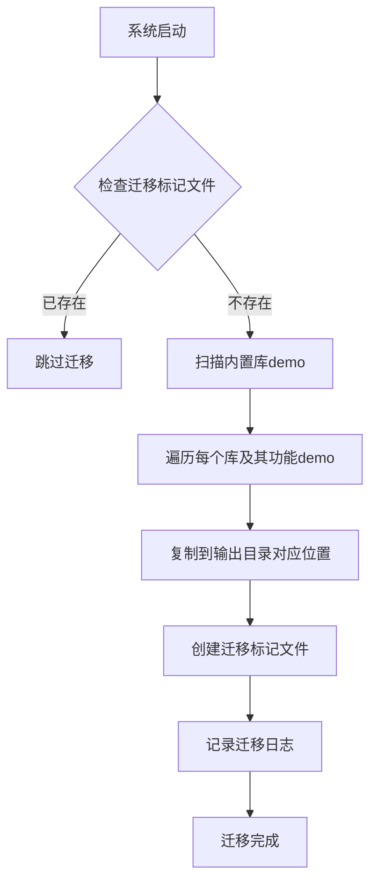
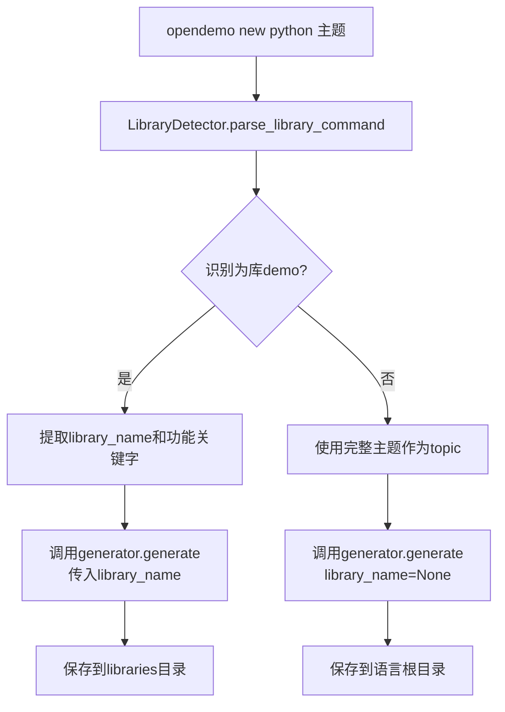
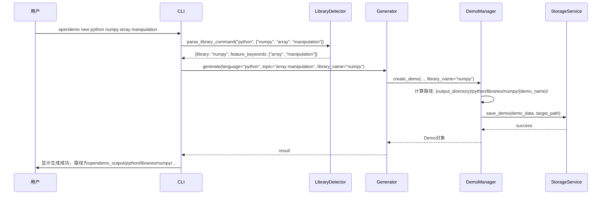

# 目录结构调整设计文档

## 需求概述

对现有demo库的目录结构进行调整，目的是：

1. 将内置库中的numpy demo迁移到输出目录，建立初始库demo集合
2. 改进库demo的生成逻辑，使所有Python库demo统一输出到规范的libraries目录结构下
3. 调整`opendemo new`命令逻辑，支持库demo的正确生成路径

## 当前状态分析

### 现有目录结构

| 路径 | 说明 | 示例 |
|------|------|------|
| `opendemo/builtin_demos/python/libraries/numpy/` | 内置numpy库demo存储位置 | 包含array-creation、array-indexing等5个功能demo |
| `opendemo_output/python/` | Python demo输出根目录 | 当前存放普通demo，无libraries子目录 |
| `opendemo/builtin_demos/python/libraries/` | 内置库demo存储结构 | 按库名分层，每个库包含多个功能demo |

### 现有生成逻辑

**DemoManager.create_demo方法（demo_manager.py:132-200）**
- 保存路径决策
  - 用户库：`{user_library_path}/{language}/`
  - 输出目录：`{output_directory}/{language}/`
- 问题：未区分库demo与普通demo，导致库demo无法生成到libraries子目录

**LibraryManager.copy_feature_to_output方法（library_manager.py:218-245）**
- 目标路径：`{output_directory}/{language}/libraries/{library}/{feature}`
- 特点：已实现libraries目录结构，但仅用于复制内置库demo

**Generator.generate方法（generator.py:31-102）**
- 调用DemoManager.create_demo
- 问题：无法传递库信息，导致AI生成的库demo路径错误

## 调整目标

### 目录结构目标

调整后的目录结构应为：

```
opendemo_output/
└── python/
    ├── libraries/                    # 库demo专用目录
    │   └── numpy/                    # 按库名分层
    │       ├── array-creation/       # 功能demo
    │       ├── array-indexing/
    │       ├── basic-math/
    │       ├── aggregate-functions/
    │       └── random-generation/
    └── {普通demo目录}/               # 非库demo直接放在语言目录下
```

### 功能目标

| 功能点 | 目标行为 | 影响组件 |
|--------|---------|---------|
| 内置库demo迁移 | 将`opendemo/builtin_demos/python/libraries/numpy/`下的所有demo复制到`opendemo_output/python/libraries/numpy/` | 初始化脚本或迁移工具 |
| 库demo生成路径 | AI生成的库demo自动保存到`{output_directory}/{language}/libraries/{library_name}/` | DemoManager、Generator |
| 普通demo生成路径 | 普通demo仍保存到`{output_directory}/{language}/` | DemoManager（保持不变） |
| opendemo new识别库 | 能够识别用户输入是否为库demo请求，并正确路由到libraries目录 | CLI、LibraryDetector、DemoManager |

## 设计方案

### 1. 内置库demo迁移

**迁移策略**

采用一次性迁移方式，在系统首次运行或执行特定初始化命令时自动完成。

**迁移范围**

| 源路径 | 目标路径 |
|--------|---------|
| `opendemo/builtin_demos/python/libraries/numpy/*` | `opendemo_output/python/libraries/numpy/*` |

**执行时机选项**

| 方案 | 优点 | 缺点 |
|------|------|------|
| A. 新增init命令 | 明确控制，可重复执行 | 需要用户手动触发 |
| B. 首次运行自动迁移 | 用户无感知 | 需增加迁移状态标记 |
| C. 独立迁移脚本 | 灵活，便于测试 | 需单独维护 |

**推荐方案：B（首次运行自动迁移）**

在StorageService中增加迁移检查与执行逻辑，通过标记文件避免重复迁移。

**迁移流程**



**标记文件位置**

- 路径：`{output_directory}/.migration_completed`
- 内容：记录迁移时间、迁移库列表

### 2. demo生成路径改进

**路径决策逻辑扩展**

现有DemoManager.create_demo需要新增参数以支持库demo识别。

**新增参数**

| 参数名 | 类型 | 说明 | 默认值 |
|--------|------|------|--------|
| library_name | Optional[str] | 库名称，如"numpy" | None |
| is_library_demo | bool | 是否为库demo | False（由library_name自动推导） |

**路径决策表**

| save_to_user_library | library_name | 输出基础路径 | 完整路径模式 |
|---------------------|--------------|-------------|-------------|
| True | None | {user_library_path}/{language}/ | {base}/{demo_name}/ |
| True | "numpy" | {user_library_path}/{language}/libraries/ | {base}/{library_name}/{demo_name}/ |
| False | None | {output_directory}/{language}/ | {base}/{demo_name}/ |
| False | "numpy" | {output_directory}/{language}/libraries/ | {base}/{library_name}/{demo_name}/ |

**修改点：DemoManager.create_demo**

在确定保存路径时，增加库名判断分支：

- 若library_name不为空，基础路径需追加`libraries/{library_name}`
- demo_name生成逻辑无需调整，仍使用`{language}-{safe_name}`格式

### 3. Generator改进

**问题**

当前Generator.generate无法传递库信息到DemoManager.create_demo。

**解决方案**

扩展Generator.generate方法签名，增加library_name参数。

**参数传递链路**


**新增参数**

| 参数名 | 类型 | 说明 | 默认值 |
|--------|------|------|--------|
| library_name | Optional[str] | 库名称 | None |

**调用示例场景**

| 场景 | library_name传值 | 输出路径 |
|------|-----------------|---------|
| 生成普通demo | None | `opendemo_output/python/python-logging/` |
| 生成numpy库demo | "numpy" | `opendemo_output/python/libraries/numpy/python-array-slicing/` |

### 4. opendemo new命令逻辑调整

**当前行为**

`opendemo new python 主题 [选项]` 仅支持生成普通demo。

**调整需求**

识别主题中的库名称，自动判断是否为库demo生成请求。

**库识别策略**

利用现有LibraryDetector，扩展其识别能力以支持`new`命令。

**识别规则**

| 输入主题示例 | 识别结果 | library_name | 功能关键字 |
|-------------|---------|--------------|-----------|
| "numpy array slicing" | 库demo | "numpy" | "array slicing" |
| "logging configuration" | 普通demo（logging为通用词） | None | "logging configuration" |
| "pandas dataframe operations" | 库demo | "pandas" | "dataframe operations" |
| "异步编程" | 普通demo | None | "异步编程" |

**库名识别优先级**

1. 主题第一个词精确匹配已知库列表（如numpy、pandas、requests）
2. 主题第一个词在库元数据的别名列表中
3. 若不匹配，视为普通demo

**已知库列表维护**

可扩展LibraryDetector，维护一个已知库名称列表：

| 语言 | 库列表 |
|------|--------|
| python | numpy, pandas, requests, flask, django, matplotlib, ... |
| java | spring, hibernate, jackson, ... |
| go | gin, gorm, ... |
| nodejs | express, lodash, axios, ... |

**opendemo new流程调整**



**CLI修改点**

在cli.py的new命令处理函数中：

1. 调用LibraryDetector识别库信息
2. 若识别到库，提取library_name和功能主题
3. 将library_name传递给generator.generate

### 5. 影响范围汇总

**需要修改的组件**

| 组件 | 文件路径 | 修改内容 | 修改类型 |
|------|---------|---------|---------|
| StorageService | services/storage_service.py | 增加迁移检查与执行方法 | 新增方法 |
| DemoManager | core/demo_manager.py | create_demo增加library_name参数，调整路径逻辑 | 修改签名+逻辑 |
| Generator | core/generator.py | generate增加library_name参数，传递给DemoManager | 修改签名 |
| CLI new命令 | cli.py | 增加库识别逻辑，传递library_name | 修改逻辑 |
| LibraryDetector | core/library_detector.py | 扩展parse_library_command以支持new场景 | 功能扩展 |

**向后兼容性**

| 影响点 | 兼容性策略 |
|--------|-----------|
| DemoManager.create_demo签名变化 | library_name为可选参数，默认值None保证向后兼容 |
| Generator.generate签名变化 | library_name为可选参数，默认值None保证向后兼容 |
| 已生成的demo路径 | 不影响已存在的demo，新demo按新规则生成 |
| 内置库demo迁移 | 仅复制不删除，内置库demo仍可用 |

## 数据模型

### 迁移标记文件结构

| 字段名 | 类型 | 说明 | 示例值 |
|--------|------|------|--------|
| migrated_at | string | ISO格式时间戳 | "2025-01-15T10:30:00" |
| migrated_libraries | array | 已迁移的库列表 | ["numpy"] |
| version | string | 迁移脚本版本 | "1.0" |

### 已知库配置数据结构

| 字段 | 类型 | 说明 |
|------|------|------|
| language | string | 编程语言 |
| libraries | array | 库配置列表 |
| libraries[].name | string | 库名称 |
| libraries[].aliases | array | 库别名 |
| libraries[].priority | number | 识别优先级 |

## 关键流程

### 流程1：系统启动时的库demo迁移

**触发条件**

StorageService初始化时检测到未执行过迁移。

**执行步骤**

| 步骤 | 操作 | 负责组件 |
|------|------|---------|
| 1 | 检查`{output_directory}/.migration_completed`是否存在 | StorageService |
| 2 | 若不存在，扫描`builtin_library_path/python/libraries/`目录 | StorageService |
| 3 | 遍历每个库（如numpy），获取其下所有功能demo目录 | StorageService |
| 4 | 对每个功能demo，调用copy_demo复制到`{output_directory}/python/libraries/{library}/{feature}` | StorageService |
| 5 | 记录迁移信息到日志 | Logger |
| 6 | 创建迁移标记文件 | StorageService |

**错误处理**

| 错误场景 | 处理策略 |
|---------|---------|
| 复制某个demo失败 | 记录警告日志，继续迁移其他demo |
| 目标目录无写权限 | 记录错误日志，终止迁移，下次启动重试 |
| 标记文件创建失败 | 记录错误日志，下次启动会重新迁移 |

### 流程2：AI生成库demo

**触发场景**

用户执行`opendemo new python numpy array manipulation`。

**执行步骤**



**路径计算细节**

- library_name = "numpy"
- base_path = `{output_directory}/python/libraries/numpy/`
- demo_name = `python-array-manipulation`
- 最终路径 = `{output_directory}/python/libraries/numpy/python-array-manipulation/`

### 流程3：普通demo生成（保持不变）

**触发场景**

用户执行`opendemo new python async http client`。

**执行步骤**

| 步骤 | 操作 | 结果 |
|------|------|------|
| 1 | LibraryDetector识别主题 | 未识别为库demo，返回None |
| 2 | CLI调用generator.generate(library_name=None) | 传递library_name=None |
| 3 | DemoManager.create_demo接收library_name=None | 使用原有路径逻辑 |
| 4 | 路径计算 | `{output_directory}/python/python-async-http-client/` |

## 配置项

无需新增配置项，使用现有配置：

| 配置键 | 说明 | 默认值 |
|--------|------|--------|
| output_directory | demo输出根目录 | ./opendemo_output |
| user_demo_library | 用户demo库路径 | ~/.opendemo/demos |

## 边界与约束

### 功能边界

| 范围 | 是否包含 |
|------|---------|
| 迁移python/libraries下的所有库demo | ✓ |
| 迁移其他语言（java、go、nodejs）的库demo | ✓（通用逻辑） |
| 删除内置库中的原demo | ✗（保留以便回退） |
| 支持用户自定义库demo生成路径 | ✗（固定使用libraries目录） |

### 技术约束

| 约束项 | 限制 |
|--------|------|
| 库名识别准确性 | 依赖LibraryDetector的库名列表维护 |
| 迁移执行时机 | 首次启动时可能增加启动时间（约1-2秒） |
| 路径长度限制 | Windows系统路径长度最大260字符 |

### 兼容性约束

| 场景 | 保证措施 |
|------|---------|
| 已存在的输出目录demo | 不受影响，新demo生成到新路径 |
| 依赖DemoManager的其他模块 | library_name参数可选，默认值保证兼容 |
| 配置文件变更 | 无需配置变更 |

## 风险评估

| 风险项 | 影响 | 概率 | 缓解措施 |
|--------|------|------|---------|
| 迁移过程中断导致部分demo未迁移 | 中 | 低 | 支持重新迁移，通过标记文件控制 |
| 库名识别误判导致普通demo放入libraries目录 | 低 | 中 | 维护精确的库名列表，提供人工确认提示 |
| 路径过长导致Windows系统报错 | 中 | 低 | 限制demo_name长度，监控路径长度 |
| 向后兼容性破坏 | 高 | 低 | 参数设置默认值，保留原逻辑分支 |

## 测试建议

### 功能测试场景

| 测试项 | 验证点 |
|--------|--------|
| 迁移numpy demo | 验证所有5个功能demo正确复制到输出目录 |
| 生成新库demo | 验证路径为`opendemo_output/python/libraries/{library}/{demo_name}/` |
| 生成普通demo | 验证路径为`opendemo_output/python/{demo_name}/`，无libraries层级 |
| 重复迁移阻止 | 验证标记文件存在时不重复迁移 |
| 库名识别准确性 | 测试常见库名及边界情况 |

### 单元测试重点

| 模块 | 测试方法 |
|------|---------|
| StorageService | migrate_builtin_libraries、check_migration_status |
| DemoManager | create_demo（带library_name参数） |
| Generator | generate（带library_name参数） |
| LibraryDetector | parse_library_command（new场景） |

### 集成测试场景

| 场景 | 命令 | 预期结果 |
|------|------|---------|
| 首次启动 | 启动系统 | 自动迁移numpy demo到输出目录 |
| 生成numpy demo | `opendemo new python numpy matrix multiplication` | demo保存到`opendemo_output/python/libraries/numpy/...` |
| 生成普通demo | `opendemo new python web scraping` | demo保存到`opendemo_output/python/...` |

## 实施步骤建议

| 阶段 | 任务 | 产出 |
|------|------|------|
| 1. 基础准备 | 确认需求，评审设计文档 | 设计文档定稿 |
| 2. 迁移功能 | 实现StorageService迁移逻辑 | 迁移功能可用 |
| 3. 路径改进 | 修改DemoManager和Generator | 库demo路径逻辑正确 |
| 4. CLI调整 | 修改new命令，集成LibraryDetector | 命令识别库demo |
| 5. 测试验证 | 执行单元测试、集成测试 | 测试通过 |
| 6. 文档更新 | 更新用户文档、开发文档 | 文档同步 |

## 附录

### 示例：迁移后的numpy demo目录结构

```
opendemo_output/
└── python/
    └── libraries/
        └── numpy/
            ├── array-creation/
            │   ├── metadata.json
            │   ├── README.md
            │   ├── requirements.txt
            │   └── code/
            │       └── array_creation_demo.py
            ├── array-indexing/
            │   ├── metadata.json
            │   ├── README.md
            │   ├── requirements.txt
            │   └── code/
            │       └── indexing_demo.py
            ├── basic-math/
            │   └── ...
            ├── aggregate-functions/
            │   └── ...
            └── random-generation/
                └── ...
```

### 示例：迁移标记文件内容

```json
{
  "migrated_at": "2025-01-15T10:30:00",
  "migrated_libraries": [
    {
      "language": "python",
      "library": "numpy",
      "feature_count": 5
    }
  ],
  "version": "1.0"
}
```
