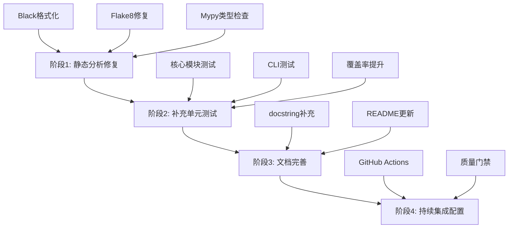
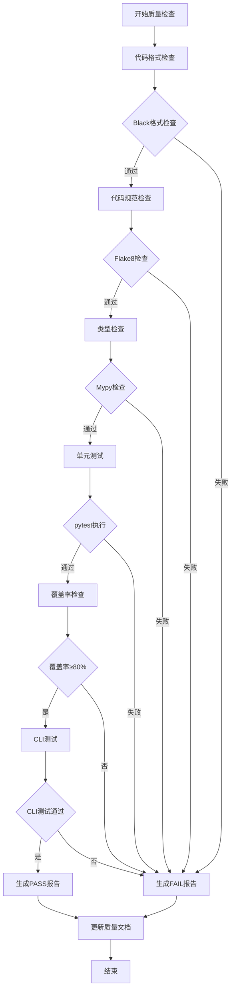

# 代码质量问题全面修复设计

## 1. 背景与目标

### 1.1 修复背景
基于代码质量检查设计文档的要求和当前项目状况，需要全面修复以下四个维度的质量问题：
- 测试覆盖率不足（当前约30%，目标≥80%）
- 缺失的单元测试模块
- 静态代码分析问题（Flake8、Mypy、Black）
- 文档完整性问题

### 1.2 修复目标
达到设计文档中定义的质量标准：
- 单元测试覆盖率≥80%（核心模块≥90%）
- 所有静态分析工具检查通过（0错误）
- 代码格式完全符合Black规范
- 所有公开API具有完整的文档字符串

### 1.3 当前质量状况

#### 测试覆盖率现状（基于coverage.json）
| 模块 | 覆盖率 | 状态 |
|------|--------|------|
| opendemo/\_\_init\_\_.py | 100% | ✅ |
| opendemo/cli.py | 0% | ❌ |
| opendemo/core/\_\_init\_\_.py | 100% | ✅ |
| opendemo/core/demo_generator.py | 20% | ❌ |
| opendemo/core/demo_repository.py | 27% | ❌ |
| opendemo/core/demo_search.py | 65% | ⚠️ |
| opendemo/core/demo_verifier.py | 7% | ❌ |
| opendemo/core/quality_checker.py | 17% | ❌ |
| opendemo/core/readme_updater.py | 14% | ❌ |
| opendemo/services/ai_service.py | 0% | ❌ |
| opendemo/services/config_service.py | 64% | ⚠️ |
| opendemo/services/storage_service.py | 0% | ❌ |
| opendemo/utils/formatters.py | 0% | ❌ |
| opendemo/utils/logger.py | 29% | ❌ |

#### 现有测试分析
- ✅ test_config_service.py：配置服务测试
- ✅ test_demo_manager.py：Demo管理器测试（间接测试DemoRepository和DemoSearch）
- ✅ test_search_engine.py：搜索引擎测试
- ❌ 缺失7个核心模块的测试

## 2. 修复策略与优先级

### 2.1 修复阶段划分



### 2.2 优先级排序

#### 优先级1（高）- 立即修复
1. **代码格式化**：使用Black统一所有代码格式
2. **补充缺失的单元测试**：为7个未覆盖模块编写测试
3. **修复Flake8错误**：修复代码规范问题

#### 优先级2（中）- 短期修复
4. **启用Mypy严格模式**：修复类型注解问题
5. **提升CLI测试覆盖**：扩展现有9个测试用例
6. **文档字符串补充**：为所有公开API添加docstring

#### 优先级3（低）- 长期优化
7. **集成静态分析工具**：在QualityChecker中集成Flake8、Mypy、Black
8. **建立CI/CD流程**：配置GitHub Actions自动检查

## 3. 阶段1：静态代码分析修复

### 3.1 Black代码格式化

#### 修复目标
- 所有Python文件符合Black格式规范
- 行长度：100字符
- 目标版本：Python 3.8-3.11

#### 执行步骤
1. 对所有源代码文件运行Black格式化
2. 验证格式化结果
3. 确保无格式不一致

#### 需要格式化的目录
- opendemo/
- tests/
- scripts/

#### 验证标准
运行 `black --check opendemo/ tests/` 返回0错误

### 3.2 Flake8代码规范检查

#### 当前问题类型预估
- 未使用的导入语句
- 行长度超标（未使用Black的情况）
- 空行数量不规范
- 变量命名不规范
- 缺少空格或多余空格

#### 修复策略
1. 运行 `flake8 opendemo/ tests/` 获取完整问题列表
2. 按文件逐一修复问题
3. 配置Flake8忽略规则（如有必要）

#### 验证标准
Flake8检查返回0错误

### 3.3 Mypy类型检查

#### 当前配置分析
- disallow_untyped_defs = false（需要改为true）
- 部分函数缺少类型注解

#### 修复策略
1. **阶段性启用**：先修复现有类型错误
2. **逐步严格化**：
   - 为所有公开函数添加类型注解
   - 为复杂内部函数添加类型注解
   - 启用 disallow_untyped_defs
3. **类型注解优先级**：
   - 核心模块（core/）：完整类型注解
   - 服务层（services/）：完整类型注解
   - 工具模块（utils/）：完整类型注解
   - CLI模块：关键函数类型注解

#### 修复后的配置
```
[tool.mypy]
python_version = "3.8"
warn_return_any = true
warn_unused_configs = true
disallow_untyped_defs = true
check_untyped_defs = true
warn_redundant_casts = true
warn_unused_ignores = true
```

#### 验证标准
Mypy检查返回0错误

## 4. 阶段2：补充单元测试

### 4.1 测试框架与工具

#### 使用的测试框架
- pytest：测试执行框架
- pytest-cov：覆盖率统计
- pytest-mock：Mock对象支持
- unittest.mock：标准库Mock支持

#### 测试文件组织
```
tests/
├── __init__.py
├── conftest.py                    # pytest配置和fixture
├── test_config_service.py         # ✅ 已存在
├── test_demo_manager.py           # ✅ 已存在
├── test_search_engine.py          # ✅ 已存在
├── test_demo_generator.py         # ❌ 需要创建
├── test_demo_verifier.py          # ❌ 需要创建
├── test_quality_checker.py        # ❌ 需要创建
├── test_readme_updater.py         # ❌ 需要创建
├── test_ai_service.py             # ❌ 需要创建
├── test_storage_service.py        # ❌ 需要创建
├── test_formatters.py             # ❌ 需要创建
├── test_logger.py                 # ❌ 需要创建
└── test_cli.py                    # ❌ 需要创建（重点）
```

### 4.2 DemoGenerator测试设计

#### 测试覆盖范围
- 初始化测试
- generate方法测试（正常流程）
- generate方法测试（异常场景）
- regenerate方法测试
- AI服务集成测试（使用Mock）

#### 测试用例设计

**测试类：TestDemoGenerator**

| 测试用例 | 描述 | 覆盖的代码行 |
|---------|------|-------------|
| test_init | 验证初始化参数正确性 | 26-28 |
| test_generate_success | 成功生成Demo | 53-84 |
| test_generate_with_library | 包含第三方库的Demo生成 | 56-84 |
| test_generate_ai_failure | AI服务失败的处理 | 67-72 |
| test_generate_parse_error | 解析AI响应失败 | 76-80 |
| test_generate_save_error | 保存Demo失败 | 97-102 |
| test_regenerate_success | 成功重新生成 | 131-145 |
| test_regenerate_metadata_not_found | metadata.json不存在 | 132-134 |

#### Mock策略
- Mock AIService.generate_demo方法
- Mock DemoRepository.create_demo方法
- Mock 文件系统操作（Path.exists, Path.read_text）

#### 目标覆盖率
≥90%

### 4.3 DemoVerifier测试设计

#### 测试覆盖范围
- Python Demo验证
- Go Demo验证
- Node.js Demo验证
- Kubernetes Demo验证
- 报告生成

#### 测试用例设计

**测试类：TestDemoVerifier**

| 测试用例 | 描述 | 覆盖的代码行 |
|---------|------|-------------|
| test_init | 验证初始化 | 29 |
| test_verify_python_success | Python验证成功 | 42-62 |
| test_verify_python_no_requirements | 无requirements.txt | 87-94 |
| test_verify_go_success | Go验证成功 | 241-321 |
| test_verify_go_no_gomod | 无go.mod文件 | 250-255 |
| test_verify_nodejs_success | Node.js验证成功 | 367-470 |
| test_verify_kubernetes_success | Kubernetes验证成功 | 482-596 |
| test_verify_unsupported_language | 不支持的语言 | 51-53 |
| test_generate_report | 生成验证报告 | 608-642 |

#### Mock策略
- Mock subprocess.run（模拟命令执行）
- Mock 文件系统检查（requirements.txt、go.mod、package.json等）
- Mock venv创建和依赖安装

#### 目标覆盖率
≥85%

### 4.4 QualityChecker测试设计

#### 测试覆盖范围
- 单元测试执行
- CLI功能测试执行
- 报告生成
- Markdown报告格式

#### 测试用例设计

**测试类：TestQualityChecker**

| 测试用例 | 描述 | 覆盖的代码行 |
|---------|------|-------------|
| test_init | 初始化检查器 | 28-37 |
| test_run_all_checks | 完整检查流程 | 46-59 |
| test_run_unit_tests_success | 单元测试成功 | 63-99 |
| test_run_unit_tests_timeout | 单元测试超时 | 101-110 |
| test_run_unit_tests_error | 单元测试异常 | 111-120 |
| test_run_cli_tests | CLI测试执行 | 124-216 |
| test_run_cli_command | CLI命令执行 | 228-250 |
| test_generate_summary | 生成摘要 | 254-268 |
| test_save_report | 保存报告 | 278-300 |
| test_generate_markdown_report | 生成Markdown报告 | 304-364 |

#### Mock策略
- Mock subprocess.run（模拟pytest和CLI命令执行）
- Mock 文件写入操作
- 提供预定义的测试输出

#### 目标覆盖率
≥90%

### 4.5 ReadmeUpdater测试设计

#### 测试覆盖范围
- Demo统计收集
- 统计表生成
- Badge更新
- README更新

#### 测试用例设计

**测试类：TestReadmeUpdater**

| 测试用例 | 描述 | 覆盖的代码行 |
|---------|------|-------------|
| test_init | 初始化更新器 | 37-39 |
| test_collect_stats | 收集Demo统计 | 54-96 |
| test_calculate_totals | 计算总计 | 105-114 |
| test_generate_stats_table | 生成统计表 | 128-171 |
| test_update_badge | 更新徽章 | 185-189 |
| test_update_stats_section | 更新统计部分 | 203-206 |
| test_update | 完整更新流程 | 215-247 |
| test_get_summary | 获取摘要 | 256-267 |

#### Mock策略
- Mock DemoRepository.list_demos
- Mock 文件读写操作
- 提供测试用的Demo数据

#### 目标覆盖率
≥85%

### 4.6 AIService测试设计

#### 测试覆盖范围
- AI Demo生成
- API调用
- 响应解析
- 关键词分类
- 错误处理

#### 测试用例设计

**测试类：TestAIService**

| 测试用例 | 描述 | 覆盖的代码行 |
|---------|------|-------------|
| test_init | 初始化服务 | 26-29 |
| test_generate_demo_success | 成功生成Demo | 55-85 |
| test_generate_demo_no_api_key | 无API密钥 | 62-64 |
| test_build_prompt | 构建提示词 | 100-176 |
| test_call_api_success | API调用成功 | 188-225 |
| test_call_api_failure | API调用失败 | 211-213 |
| test_parse_response | 解析AI响应 | 244-307 |
| test_validate_api_key | 验证API密钥 | 316-345 |
| test_classify_keyword | 关键词分类 | 368-442 |
| test_heuristic_classify | 启发式分类 | 501-568 |

#### Mock策略
- Mock requests.post（模拟API调用）
- Mock ConfigService（模拟配置读取）
- 提供预定义的AI响应JSON

#### 目标覆盖率
≥80%

### 4.7 StorageService测试设计

#### 测试覆盖范围
- Demo列表获取
- Demo元数据加载
- Demo保存
- Demo复制
- 目录管理

#### 测试用例设计

**测试类：TestStorageService**

| 测试用例 | 描述 | 覆盖的代码行 |
|---------|------|-------------|
| test_init | 初始化服务 | 27-29 |
| test_builtin_library_path | 获取内置库路径 | 34-39 |
| test_user_library_path | 获取用户库路径 | 44-48 |
| test_list_demos | 列出所有Demo | 61-83 |
| test_load_demo_metadata | 加载元数据 | 117-129 |
| test_save_demo | 保存Demo | 142-166 |
| test_copy_demo | 复制Demo | 179-189 |
| test_delete_demo | 删除Demo | 201-212 |
| test_get_output_directory | 获取输出目录 | 221-223 |
| test_ensure_directory | 确保目录存在 | 272-277 |

#### Mock策略
- Mock 文件系统操作（Path.exists、Path.mkdir、shutil.copytree）
- Mock YAML读写
- 提供测试用的Demo结构

#### 目标覆盖率
≥80%

### 4.8 Formatters测试设计

#### 测试覆盖范围
- 各种输出格式化函数
- Rich库集成
- 颜色和样式

#### 测试用例设计

**测试类：TestFormatters**

| 测试用例 | 描述 | 覆盖的代码行 |
|---------|------|-------------|
| test_print_success | 成功消息输出 | 20 |
| test_print_error | 错误消息输出 | 25 |
| test_print_warning | 警告消息输出 | 30 |
| test_print_info | 信息消息输出 | 35 |
| test_print_demo_result | Demo结果输出 | 45-80 |
| test_print_search_results | 搜索结果输出 | 91-128 |
| test_print_config_list | 配置列表输出 | 138-153 |
| test_print_library_info | 库信息输出 | 197-255 |

#### Mock策略
- Mock Console.print（捕获输出）
- 验证输出内容而非视觉效果

#### 目标覆盖率
≥75%

### 4.9 Logger测试设计

#### 测试覆盖范围
- Logger设置
- 日志级别配置
- 日志格式
- 文件Handler

#### 测试用例设计

**测试类：TestLogger**

| 测试用例 | 描述 | 覆盖的代码行 |
|---------|------|-------------|
| test_setup_logger | 设置Logger | 25-59 |
| test_get_logger | 获取Logger | 64 |
| test_log_level_debug | DEBUG级别日志 | 33 |
| test_log_level_info | INFO级别日志 | 33 |
| test_log_to_file | 日志写入文件 | 40-47 |

#### Mock策略
- Mock logging模块
- 验证Handler配置

#### 目标覆盖率
≥70%

### 4.10 CLI测试设计

#### 测试覆盖范围
- 所有CLI命令
- 参数解析
- 错误处理
- 输出验证

#### 测试用例设计

**测试类：TestCLI**

| 测试组 | 测试用例数 | 覆盖的命令 |
|--------|-----------|----------|
| 基础命令 | 3 | --version, --help, 无参数 |
| search命令 | 8 | 各种搜索场景 |
| get命令 | 10 | 获取Demo的各种情况 |
| new命令 | 12 | AI生成Demo的流程 |
| config命令 | 6 | 配置管理操作 |
| check命令 | 4 | 质量检查功能 |

**详细测试用例（43个）**

1. **基础命令测试（3个）**
   - test_cli_version：版本信息
   - test_cli_help：帮助信息
   - test_cli_no_args：无参数默认行为

2. **search命令测试（8个）**
   - test_search_all_languages：搜索所有语言
   - test_search_specific_language：搜索特定语言
   - test_search_with_keyword：关键字搜索
   - test_search_multiple_keywords：多关键字搜索
   - test_search_unsupported_language：不支持的语言
   - test_search_library_features：搜索第三方库功能
   - test_search_no_results：无结果情况
   - test_search_json_output：JSON格式输出

3. **get命令测试（10个）**
   - test_get_existing_demo：获取已存在的Demo
   - test_get_to_custom_path：指定输出路径
   - test_get_unsupported_language：不支持的语言
   - test_get_nonexistent_demo：不存在的Demo
   - test_get_library_feature：获取第三方库功能
   - test_get_library_list_features：列出库的所有功能
   - test_get_library_info：显示库信息
   - test_get_force_overwrite：强制覆盖
   - test_get_output_detection：自动检测已导出
   - test_get_verify_option：验证选项

4. **new命令测试（12个）**
   - test_new_with_description：使用描述生成
   - test_new_with_keywords：使用关键字生成
   - test_new_library_detection：自动检测第三方库
   - test_new_unsupported_language：不支持的语言
   - test_new_verify_success：验证成功的Demo
   - test_new_verify_failure：验证失败的Demo
   - test_new_skip_verify：跳过验证
   - test_new_ai_failure：AI生成失败
   - test_new_save_failure：保存失败
   - test_new_readme_update：README自动更新
   - test_new_interactive_mode：交互式模式
   - test_new_output_path：指定输出路径

5. **config命令测试（6个）**
   - test_config_list：列出所有配置
   - test_config_get：获取特定配置
   - test_config_set：设置配置
   - test_config_get_nonexistent：获取不存在的配置
   - test_config_init：初始化配置
   - test_config_validate：验证配置

6. **check命令测试（4个）**
   - test_check_run：运行质量检查
   - test_check_show_report：显示报告
   - test_check_detailed_output：详细输出
   - test_check_save_report：保存报告

#### Mock策略
- 使用Click的CliRunner进行测试
- Mock DemoRepository、AIService等服务
- Mock文件系统操作
- 捕获stdout输出进行验证

#### 目标覆盖率
≥60%（CLI代码因Click装饰器较难达到高覆盖率）

### 4.11 测试执行与覆盖率验证

#### 测试执行命令
```bash
# 运行所有测试
pytest tests/ -v

# 运行特定测试文件
pytest tests/test_demo_generator.py -v

# 生成覆盖率报告
pytest tests/ --cov=opendemo --cov-report=html --cov-report=term

# 查看覆盖率报告
open htmlcov/index.html
```

#### 覆盖率目标验证
| 模块 | 当前覆盖率 | 目标覆盖率 | 优先级 |
|------|----------|----------|--------|
| core/demo_generator.py | 20% | 90% | 高 |
| core/demo_verifier.py | 7% | 85% | 高 |
| core/quality_checker.py | 17% | 90% | 高 |
| core/readme_updater.py | 14% | 85% | 高 |
| services/ai_service.py | 0% | 80% | 高 |
| services/storage_service.py | 0% | 80% | 高 |
| utils/formatters.py | 0% | 75% | 中 |
| utils/logger.py | 29% | 70% | 中 |
| cli.py | 0% | 60% | 高 |
| **整体** | **30%** | **≥80%** | **必须** |

## 5. 阶段3：文档完善

### 5.1 Docstring补充标准

#### Docstring格式
采用Google风格的docstring：

```python
def function_name(param1: type1, param2: type2) -> return_type:
    """
    简短的函数描述（一行）
    
    详细的函数说明（可选，如果需要更多解释）
    
    Args:
        param1: 参数1的说明
        param2: 参数2的说明
        
    Returns:
        返回值的说明
        
    Raises:
        ExceptionType: 异常说明
        
    Examples:
        >>> function_name(value1, value2)
        expected_result
    """
    pass
```

### 5.2 需要补充文档的模块

#### 核心模块（core/）
- demo_generator.py：所有公开方法
- demo_repository.py：所有公开方法（已有部分）
- demo_search.py：所有公开方法
- demo_verifier.py：所有公开方法
- quality_checker.py：所有公开方法（已有部分）
- readme_updater.py：所有公开方法

#### 服务模块（services/）
- ai_service.py：所有公开方法
- config_service.py：所有公开方法（已有部分）
- storage_service.py：所有公开方法

#### 工具模块（utils/）
- formatters.py：所有公开函数
- logger.py：所有公开函数

#### CLI模块
- cli.py：所有命令函数

### 5.3 文档完整性检查清单

| 检查项 | 验证标准 |
|--------|---------|
| 所有公开类 | 必须有类级docstring |
| 所有公开方法/函数 | 必须有方法级docstring |
| 参数说明 | 所有参数必须在Args中说明 |
| 返回值说明 | 非None返回必须在Returns中说明 |
| 异常说明 | 可能抛出的异常必须在Raises中说明 |
| 示例代码 | 复杂函数提供Examples |

### 5.4 README更新

#### 需要更新的部分
1. **安装部分**：添加开发依赖安装说明
2. **测试部分**：添加测试运行和覆盖率查看说明
3. **贡献指南**：添加代码质量检查流程
4. **质量徽章**：添加覆盖率徽章和测试状态徽章

#### README新增章节

**开发者指南章节**
```markdown
## 开发者指南

### 安装开发依赖
```bash
pip install -e ".[dev]"
```

### 运行测试
```bash
# 运行所有测试
pytest

# 生成覆盖率报告
pytest --cov=opendemo --cov-report=html
```

### 代码质量检查
```bash
# 格式化代码
black opendemo/ tests/

# 代码规范检查
flake8 opendemo/ tests/

# 类型检查
mypy opendemo/

# 运行完整质量检查
opendemo check
```

### 贡献流程
1. Fork项目
2. 创建功能分支
3. 编写代码和测试（覆盖率≥80%）
4. 运行质量检查（必须全部通过）
5. 提交Pull Request
```

## 6. 阶段4：质量检查工具增强

### 6.1 QualityChecker增强设计

#### 新增检查功能
1. **静态代码分析集成**
   - Flake8检查
   - Mypy类型检查
   - Black格式检查

2. **覆盖率检查**
   - 生成覆盖率报告
   - 覆盖率阈值验证
   - 按模块统计覆盖率

3. **复杂度分析**（可选）
   - 圈复杂度检查
   - 代码行数统计

#### 增强后的检查流程



#### QualityChecker新增方法

| 方法名 | 功能 | 返回值 |
|--------|------|--------|
| _run_black_check | 运行Black格式检查 | Dict[检查结果] |
| _run_flake8_check | 运行Flake8检查 | Dict[检查结果] |
| _run_mypy_check | 运行Mypy检查 | Dict[检查结果] |
| _run_coverage_analysis | 生成覆盖率报告 | Dict[覆盖率数据] |
| _check_coverage_threshold | 验证覆盖率阈值 | bool |
| _generate_comprehensive_report | 生成综合报告 | str |

#### 增强后的报告格式

**JSON报告结构**
```json
{
  "timestamp": "2024-01-05T10:00:00",
  "summary": {
    "overall_status": "PASS/FAIL",
    "quality_score": 85,
    "checks_passed": 8,
    "checks_total": 10
  },
  "static_analysis": {
    "black": {"status": "PASS", "files_checked": 45, "files_reformatted": 0},
    "flake8": {"status": "PASS", "errors": 0, "warnings": 2},
    "mypy": {"status": "PASS", "errors": 0, "notes": 5}
  },
  "tests": {
    "unit_tests": {"status": "PASS", "passed": 120, "total": 120},
    "cli_tests": {"status": "PASS", "passed": 43, "total": 43}
  },
  "coverage": {
    "total": 82.5,
    "by_module": {
      "opendemo.core": 88.3,
      "opendemo.services": 79.1,
      "opendemo.utils": 75.2
    },
    "threshold_met": true
  },
  "recommendations": []
}
```

**Markdown报告增强**
- 添加静态分析结果部分
- 添加覆盖率详细表格
- 添加改进建议部分
- 添加趋势对比（如果有历史数据）

### 6.2 质量标准配置化

#### 配置文件：.quality-config.yaml
```yaml
quality_standards:
  coverage:
    total_threshold: 80
    core_threshold: 90
    services_threshold: 80
    utils_threshold: 75
    
  static_analysis:
    black:
      enabled: true
      line_length: 100
    flake8:
      enabled: true
      max_line_length: 100
      ignore: []
    mypy:
      enabled: true
      strict: true
      
  tests:
    unit_test_pass_rate: 100
    cli_test_pass_rate: 90
    timeout_seconds: 120
    
  complexity:
    max_cyclomatic_complexity: 10
    max_function_lines: 100
```

#### 配置加载机制
- QualityChecker初始化时加载配置
- 支持项目级和用户级配置
- 配置项可被命令行参数覆盖

## 7. 阶段5：持续集成配置（可选）

### 7.1 GitHub Actions配置

#### Workflow文件：.github/workflows/quality-check.yml

**工作流定义**
```yaml
name: Quality Check

on:
  push:
    branches: [ main, develop ]
  pull_request:
    branches: [ main ]

jobs:
  quality-check:
    runs-on: ubuntu-latest
    strategy:
      matrix:
        python-version: [3.8, 3.9, 3.10, 3.11]
    
    steps:
    - uses: actions/checkout@v3
    
    - name: Set up Python
      uses: actions/setup-python@v4
      with:
        python-version: ${{ matrix.python-version }}
    
    - name: Install dependencies
      run: |
        python -m pip install --upgrade pip
        pip install -e ".[dev]"
    
    - name: Run Black
      run: black --check opendemo/ tests/
    
    - name: Run Flake8
      run: flake8 opendemo/ tests/
    
    - name: Run Mypy
      run: mypy opendemo/
    
    - name: Run Tests
      run: pytest tests/ --cov=opendemo --cov-report=xml
    
    - name: Upload Coverage
      uses: codecov/codecov-action@v3
      with:
        file: ./coverage.xml
        fail_ci_if_error: true
    
    - name: Run Quality Check
      run: opendemo check
```

#### 徽章添加
在README.md顶部添加：
```markdown
[](https://github.com/opendemo/opendemo-cli/actions)
[](https://codecov.io/gh/opendemo/opendemo-cli)
[](https://github.com/psf/black)
```

### 7.2 质量门禁策略

#### PR合并要求
1. 所有静态检查通过（Black、Flake8、Mypy）
2. 所有单元测试通过
3. 覆盖率不低于80%
4. 至少1个reviewer批准

#### 分支保护规则
- main分支：必须通过CI检查
- develop分支：建议通过CI检查

## 8. 执行计划与时间表

### 8.1 修复阶段时间安排

| 阶段 | 任务 | 预计时间 | 负责人 |
|------|------|---------|--------|
| 阶段1 | 静态分析修复 | 2-3天 | 开发团队 |
| 阶段1.1 | Black格式化 | 0.5天 | 自动化 |
| 阶段1.2 | Flake8修复 | 1天 | 开发者 |
| 阶段1.3 | Mypy类型注解 | 1-1.5天 | 开发者 |
| 阶段2 | 单元测试补充 | 5-7天 | 开发团队 |
| 阶段2.1 | 核心模块测试 | 3天 | 高级开发者 |
| 阶段2.2 | 服务模块测试 | 2天 | 开发者 |
| 阶段2.3 | CLI测试 | 2天 | 开发者 |
| 阶段3 | 文档完善 | 2-3天 | 全员 |
| 阶段3.1 | Docstring补充 | 2天 | 开发者 |
| 阶段3.2 | README更新 | 0.5天 | 技术写作 |
| 阶段4 | 工具增强 | 2-3天 | 高级开发者 |
| 阶段5 | CI配置（可选） | 1天 | DevOps |
| **总计** | **全部任务** | **12-17天** | **团队** |

### 8.2 里程碑定义

#### 里程碑1：静态分析通过
- 完成时间：第3天
- 验收标准：
  - Black检查0错误
  - Flake8检查0错误
  - Mypy检查0错误

#### 里程碑2：覆盖率达标
- 完成时间：第10天
- 验收标准：
  - 整体覆盖率≥80%
  - 核心模块覆盖率≥90%
  - 所有测试通过

#### 里程碑3：文档完整
- 完成时间：第13天
- 验收标准：
  - 所有公开API有docstring
  - README包含开发指南
  - 文档覆盖率≥90%

#### 里程碑4：工具完善
- 完成时间：第16天
- 验收标准：
  - QualityChecker支持静态分析
  - 生成综合质量报告
  - 质量门禁可用

### 8.3 每日检查点

**每日质量验证流程**
1. 早上：运行完整质量检查
2. 开发中：本地运行相关测试
3. 提交前：运行完整质量检查
4. 晚上：查看覆盖率报告，识别未覆盖代码

**进度追踪表**
| 日期 | 完成任务 | 覆盖率 | 静态检查 | 测试通过率 | 备注 |
|------|---------|--------|---------|----------|------|
| Day 1 | Black格式化 | 30% | 部分通过 | 100% | 初始状态 |
| Day 2 | Flake8修复 | 30% | 大部分通过 | 100% | - |
| Day 3 | Mypy修复 | 30% | 全部通过 | 100% | 里程碑1 |
| ... | ... | ... | ... | ... | ... |

## 9. 质量验收标准

### 9.1 最终验收指标

#### 代码质量指标
| 指标 | 目标值 | 验收标准 |
|------|--------|---------|
| Black格式错误 | 0 | 必须 |
| Flake8错误数 | 0 | 必须 |
| Flake8警告数 | ≤5 | 建议 |
| Mypy错误数 | 0 | 必须 |
| 代码重复率 | ≤3% | 建议 |

#### 测试质量指标
| 指标 | 目标值 | 验收标准 |
|------|--------|---------|
| 单元测试覆盖率 | ≥80% | 必须 |
| 核心模块覆盖率 | ≥90% | 必须 |
| 单元测试通过率 | 100% | 必须 |
| CLI测试通过率 | 100% | 必须 |
| 测试执行时间 | ≤120秒 | 建议 |

#### 文档质量指标
| 指标 | 目标值 | 验收标准 |
|------|--------|---------|
| 公开API文档覆盖率 | 100% | 必须 |
| README完整性 | 完整 | 必须 |
| 代码注释率 | ≥30% | 建议 |

### 9.2 质量检查清单

#### 提交前检查清单
- [ ] 运行 `black opendemo/ tests/` - 无需修改
- [ ] 运行 `flake8 opendemo/ tests/` - 0错误
- [ ] 运行 `mypy opendemo/` - 0错误
- [ ] 运行 `pytest tests/` - 所有测试通过
- [ ] 运行 `pytest tests/ --cov=opendemo` - 覆盖率≥80%
- [ ] 检查新增代码的docstring - 完整
- [ ] 运行 `opendemo check` - PASS

#### 代码审查检查清单
- [ ] 代码符合PEP 8规范
- [ ] 所有函数有类型注解
- [ ] 所有公开函数有docstring
- [ ] 复杂逻辑有注释说明
- [ ] 测试覆盖新增代码
- [ ] 无明显性能问题
- [ ] 无安全风险

### 9.3 回归测试策略

#### 回归测试范围
1. **每次提交**：运行完整单元测试套件
2. **每日构建**：运行完整质量检查
3. **发布前**：运行完整回归测试+性能测试

#### 回归测试用例
- 所有单元测试（120+用例）
- 所有CLI功能测试（43用例）
- 集成测试（端到端流程）
- 性能基准测试（可选）

## 10. 风险与应对

### 10.1 潜在风险识别

| 风险 | 可能性 | 影响 | 应对策略 |
|------|--------|------|---------|
| 测试编写时间超预期 | 高 | 中 | 优先核心模块，分批完成 |
| Mock复杂度高 | 中 | 中 | 使用pytest-mock简化 |
| 覆盖率难以达标 | 中 | 高 | 降低非关键模块目标 |
| CI配置问题 | 低 | 低 | 先本地验证再配置 |
| Mypy严格模式阻力 | 中 | 中 | 分步启用，逐步严格 |

### 10.2 应急方案

#### 如果覆盖率无法达到80%
1. **调整目标**：核心模块90%，其他模块≥70%
2. **排除部分代码**：配置.coveragerc排除测试难度极高的代码
3. **延长时间**：增加1-2天专门提升覆盖率

#### 如果Mypy检查问题过多
1. **渐进式启用**：先不启用strict模式
2. **使用type: ignore**：暂时忽略难以修复的类型问题
3. **重构代码**：简化类型复杂的部分

#### 如果测试执行时间过长
1. **并行执行**：使用pytest-xdist并行运行测试
2. **优化测试**：减少不必要的Setup/Teardown
3. **分组测试**：将慢速测试标记为slow，CI中分开运行

## 11. 成功标准

### 11.1 技术成功标准
- ✅ 所有静态检查工具通过（Black、Flake8、Mypy）
- ✅ 单元测试覆盖率≥80%
- ✅ 核心模块覆盖率≥90%
- ✅ 所有单元测试通过
- ✅ 所有CLI功能测试通过
- ✅ 公开API文档覆盖率100%
- ✅ 质量检查报告状态为PASS

### 11.2 流程成功标准
- ✅ 建立标准化的质量检查流程
- ✅ 提供完整的开发者文档
- ✅ 配置自动化质量检查工具
- ✅ 建立质量门禁机制（可选）

### 11.3 可持续性标准
- ✅ 团队成员理解质量标准
- ✅ 质量检查集成到开发流程
- ✅ 定期审查和更新质量标准
- ✅ 质量指标可持续维护

## 12. 后续改进计划

### 12.1 短期改进（1-3个月）
1. **性能测试**：添加性能基准测试
2. **安全扫描**：集成安全漏洞扫描工具
3. **复杂度监控**：添加代码复杂度检查
4. **测试优化**：提升测试执行速度

### 12.2 长期改进（3-6个月）
1. **测试金字塔完善**：增加集成测试和端到端测试
2. **质量趋势分析**：建立质量指标趋势追踪
3. **自动化重构**：使用工具辅助代码重构
4. **技术债管理**：建立技术债追踪和偿还机制
#### 代码质量指标
| 指标 | 目标值 | 验收标准 |
|------|--------|---------|
| Black格式错误 | 0 | 必须 |
| Flake8错误数 | 0 | 必须 |
| Flake8警告数 | ≤5 | 建议 |
| Mypy错误数 | 0 | 必须 |
| 代码重复率 | ≤3% | 建议 |

#### 测试质量指标
| 指标 | 目标值 | 验收标准 |
|------|--------|---------|
| 单元测试覆盖率 | ≥80% | 必须 |
| 核心模块覆盖率 | ≥90% | 必须 |
| 单元测试通过率 | 100% | 必须 |
| CLI测试通过率 | 100% | 必须 |
| 测试执行时间 | ≤120秒 | 建议 |

#### 文档质量指标
| 指标 | 目标值 | 验收标准 |
|------|--------|---------|
| 公开API文档覆盖率 | 100% | 必须 |
| README完整性 | 完整 | 必须 |
| 代码注释率 | ≥30% | 建议 |

### 9.2 质量检查清单

#### 提交前检查清单
- [ ] 运行 `black opendemo/ tests/` - 无需修改
- [ ] 运行 `flake8 opendemo/ tests/` - 0错误
- [ ] 运行 `mypy opendemo/` - 0错误
- [ ] 运行 `pytest tests/` - 所有测试通过
- [ ] 运行 `pytest tests/ --cov=opendemo` - 覆盖率≥80%
- [ ] 检查新增代码的docstring - 完整
- [ ] 运行 `opendemo check` - PASS

#### 代码审查检查清单
- [ ] 代码符合PEP 8规范
- [ ] 所有函数有类型注解
- [ ] 所有公开函数有docstring
- [ ] 复杂逻辑有注释说明
- [ ] 测试覆盖新增代码
- [ ] 无明显性能问题
- [ ] 无安全风险

### 9.3 回归测试策略

#### 回归测试范围
1. **每次提交**：运行完整单元测试套件
2. **每日构建**：运行完整质量检查
3. **发布前**：运行完整回归测试+性能测试

#### 回归测试用例
- 所有单元测试（120+用例）
- 所有CLI功能测试（43用例）
- 集成测试（端到端流程）
- 性能基准测试（可选）

## 10. 风险与应对

### 10.1 潜在风险识别

| 风险 | 可能性 | 影响 | 应对策略 |
|------|--------|------|---------|
| 测试编写时间超预期 | 高 | 中 | 优先核心模块，分批完成 |
| Mock复杂度高 | 中 | 中 | 使用pytest-mock简化 |
| 覆盖率难以达标 | 中 | 高 | 降低非关键模块目标 |
| CI配置问题 | 低 | 低 | 先本地验证再配置 |
| Mypy严格模式阻力 | 中 | 中 | 分步启用，逐步严格 |

### 10.2 应急方案

#### 如果覆盖率无法达到80%
1. **调整目标**：核心模块90%，其他模块≥70%
2. **排除部分代码**：配置.coveragerc排除测试难度极高的代码
3. **延长时间**：增加1-2天专门提升覆盖率

#### 如果Mypy检查问题过多
1. **渐进式启用**：先不启用strict模式
2. **使用type: ignore**：暂时忽略难以修复的类型问题
3. **重构代码**：简化类型复杂的部分

#### 如果测试执行时间过长
1. **并行执行**：使用pytest-xdist并行运行测试
2. **优化测试**：减少不必要的Setup/Teardown
3. **分组测试**：将慢速测试标记为slow，CI中分开运行

## 11. 成功标准

### 11.1 技术成功标准
- ✅ 所有静态检查工具通过（Black、Flake8、Mypy）
- ✅ 单元测试覆盖率≥80%
- ✅ 核心模块覆盖率≥90%
- ✅ 所有单元测试通过
- ✅ 所有CLI功能测试通过
- ✅ 公开API文档覆盖率100%
- ✅ 质量检查报告状态为PASS

### 11.2 流程成功标准
- ✅ 建立标准化的质量检查流程
- ✅ 提供完整的开发者文档
- ✅ 配置自动化质量检查工具
- ✅ 建立质量门禁机制（可选）

### 11.3 可持续性标准
- ✅ 团队成员理解质量标准
- ✅ 质量检查集成到开发流程
- ✅ 定期审查和更新质量标准
- ✅ 质量指标可持续维护

## 12. 后续改进计划

### 12.1 短期改进（1-3个月）
1. **性能测试**：添加性能基准测试
2. **安全扫描**：集成安全漏洞扫描工具
3. **复杂度监控**：添加代码复杂度检查
4. **测试优化**：提升测试执行速度

### 12.2 长期改进（3-6个月）
1. **测试金字塔完善**：增加集成测试和端到端测试
2. **质量趋势分析**：建立质量指标趋势追踪
3. **自动化重构**：使用工具辅助代码重构
4. **技术债管理**：建立技术债追踪和偿还机制

#### 代码质量指标
| 指标 | 目标值 | 验收标准 |
|------|--------|---------|
| Black格式错误 | 0 | 必须 |
| Flake8错误数 | 0 | 必须 |
| Flake8警告数 | ≤5 | 建议 |
| Mypy错误数 | 0 | 必须 |
| 代码重复率 | ≤3% | 建议 |

#### 测试质量指标
| 指标 | 目标值 | 验收标准 |
|------|--------|---------|
| 单元测试覆盖率 | ≥80% | 必须 |
| 核心模块覆盖率 | ≥90% | 必须 |
| 单元测试通过率 | 100% | 必须 |
| CLI测试通过率 | 100% | 必须 |
| 测试执行时间 | ≤120秒 | 建议 |

#### 文档质量指标
| 指标 | 目标值 | 验收标准 |
|------|--------|---------|
| 公开API文档覆盖率 | 100% | 必须 |
| README完整性 | 完整 | 必须 |
| 代码注释率 | ≥30% | 建议 |

### 9.2 质量检查清单

#### 提交前检查清单
- [ ] 运行 `black opendemo/ tests/` - 无需修改
- [ ] 运行 `flake8 opendemo/ tests/` - 0错误
- [ ] 运行 `mypy opendemo/` - 0错误
- [ ] 运行 `pytest tests/` - 所有测试通过
- [ ] 运行 `pytest tests/ --cov=opendemo` - 覆盖率≥80%
- [ ] 检查新增代码的docstring - 完整
- [ ] 运行 `opendemo check` - PASS

#### 代码审查检查清单
- [ ] 代码符合PEP 8规范
- [ ] 所有函数有类型注解
- [ ] 所有公开函数有docstring
- [ ] 复杂逻辑有注释说明
- [ ] 测试覆盖新增代码
- [ ] 无明显性能问题
- [ ] 无安全风险

### 9.3 回归测试策略

#### 回归测试范围
1. **每次提交**：运行完整单元测试套件
2. **每日构建**：运行完整质量检查
3. **发布前**：运行完整回归测试+性能测试

#### 回归测试用例
- 所有单元测试（120+用例）
- 所有CLI功能测试（43用例）
- 集成测试（端到端流程）
- 性能基准测试（可选）

## 10. 风险与应对

### 10.1 潜在风险识别

| 风险 | 可能性 | 影响 | 应对策略 |
|------|--------|------|---------|
| 测试编写时间超预期 | 高 | 中 | 优先核心模块，分批完成 |
| Mock复杂度高 | 中 | 中 | 使用pytest-mock简化 |
| 覆盖率难以达标 | 中 | 高 | 降低非关键模块目标 |
| CI配置问题 | 低 | 低 | 先本地验证再配置 |
| Mypy严格模式阻力 | 中 | 中 | 分步启用，逐步严格 |

### 10.2 应急方案

#### 如果覆盖率无法达到80%
1. **调整目标**：核心模块90%，其他模块≥70%
2. **排除部分代码**：配置.coveragerc排除测试难度极高的代码
3. **延长时间**：增加1-2天专门提升覆盖率

#### 如果Mypy检查问题过多
1. **渐进式启用**：先不启用strict模式
2. **使用type: ignore**：暂时忽略难以修复的类型问题
3. **重构代码**：简化类型复杂的部分

#### 如果测试执行时间过长
1. **并行执行**：使用pytest-xdist并行运行测试
2. **优化测试**：减少不必要的Setup/Teardown
3. **分组测试**：将慢速测试标记为slow，CI中分开运行

## 11. 成功标准

### 11.1 技术成功标准
- ✅ 所有静态检查工具通过（Black、Flake8、Mypy）
- ✅ 单元测试覆盖率≥80%
- ✅ 核心模块覆盖率≥90%
- ✅ 所有单元测试通过
- ✅ 所有CLI功能测试通过
- ✅ 公开API文档覆盖率100%
- ✅ 质量检查报告状态为PASS

### 11.2 流程成功标准
- ✅ 建立标准化的质量检查流程
- ✅ 提供完整的开发者文档
- ✅ 配置自动化质量检查工具
- ✅ 建立质量门禁机制（可选）

### 11.3 可持续性标准
- ✅ 团队成员理解质量标准
- ✅ 质量检查集成到开发流程
- ✅ 定期审查和更新质量标准
- ✅ 质量指标可持续维护

## 12. 后续改进计划

### 12.1 短期改进（1-3个月）
1. **性能测试**：添加性能基准测试
2. **安全扫描**：集成安全漏洞扫描工具
3. **复杂度监控**：添加代码复杂度检查
4. **测试优化**：提升测试执行速度

### 12.2 长期改进（3-6个月）
1. **测试金字塔完善**：增加集成测试和端到端测试
2. **质量趋势分析**：建立质量指标趋势追踪
3. **自动化重构**：使用工具辅助代码重构
4. **技术债管理**：建立技术债追踪和偿还机制
