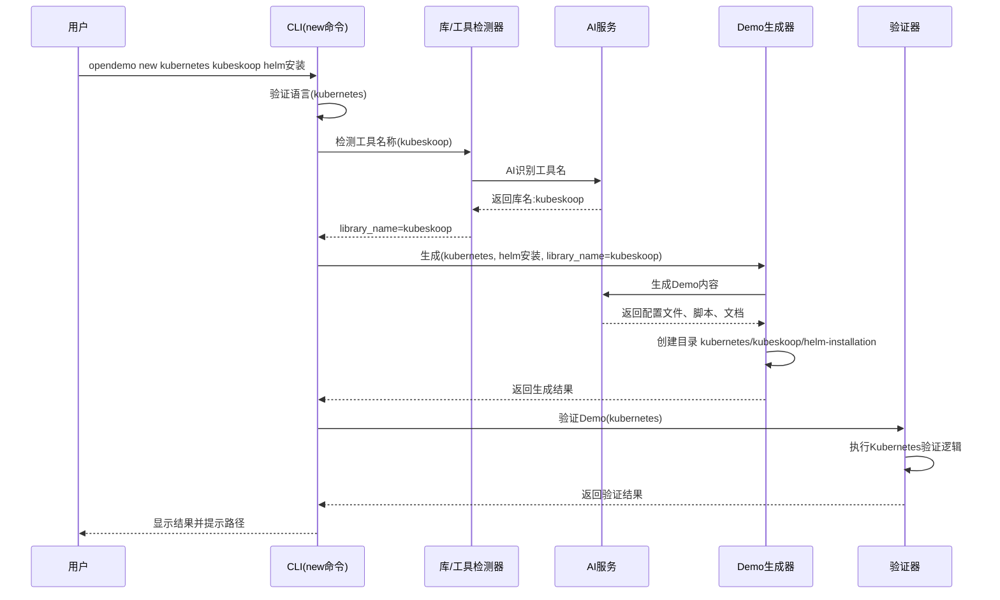
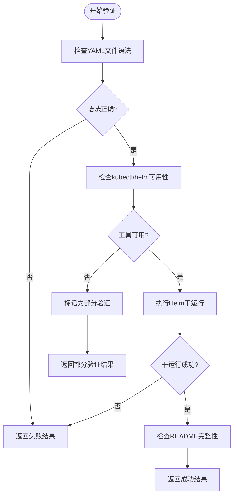
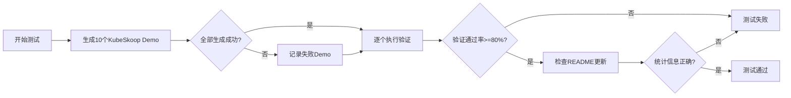

# KubeSkoop Demo大全功能设计文档

## 功能概述

为 Open Demo CLI 工具新增对 Kubernetes 生态工具的支持,首先支持 KubeSkoop 工具的 Demo 生成。该功能将扩展现有的 `new` 命令,使其能够识别和生成基于 Kubernetes 的工具演示,并将生成的 Demo 放置在专门的目录结构中。

### 核心目标

- 扩展语言支持列表,新增 `kubernetes` 作为独立的技术栈类别
- 支持通过 `opendemo new kubernetes kubeskoop <功能>` 命令生成 KubeSkoop 相关 Demo
- 生成的 Demo 存放在 `opendemo_output/kubernetes/kubeskoop/` 目录
- 所有生成的 Demo 需通过验证测试后方可完成任务

## 需求分析

### KubeSkoop 工具特性

根据官方文档 (https://kubeskoop.io),KubeSkoop 是一个 Kubernetes 网络诊断和监控套件,主要特性包括:

**核心能力**
- 一次性网络故障诊断:Pod、Service、Node、Ingress/Egress 流量诊断
- 深度内核监控:基于 eBPF 的内核监控,CO-RE 脚本支持
- 网络异常事件识别:支持数十种异常场景识别
- Web Console:集成网络诊断、事件监控、抓包、延迟检测等

**技术栈特征**
- 部署方式:Helm Chart
- 运行环境:Kubernetes 集群
- 核心组件:Agent、Controller、WebConsole
- 监控后端:Prometheus、Loki
- 探针类型:Metric Probes、Event Probes

### 待生成的 Demo 类别

根据 KubeSkoop 的功能特性,需生成以下类别的 Demo:

| 类别 | Demo 主题 | 优先级 |
|------|----------|--------|
| 安装部署 | Helm 安装配置 | 高 |
| 探针配置 | Metric Probes 配置示例 | 高 |
| 探针配置 | Event Probes 配置示例 | 高 |
| 网络诊断 | Pod 间连通性诊断 | 高 |
| 网络诊断 | Service 访问诊断 | 中 |
| 监控集成 | Prometheus 端点配置 | 中 |
| 监控集成 | Loki 事件收集配置 | 中 |
| Web Console | 网络拓扑图查看 | 中 |
| Web Console | 实时抓包示例 | 低 |
| 异常检测 | 延迟检测配置 | 低 |

## 架构设计

### 语言支持扩展策略

当前系统支持 `python`、`go`、`nodejs`、`java` 四种编程语言。为支持 Kubernetes 工具生态,采用以下策略:

**策略选择**

将 `kubernetes` 作为新的"语言"类别添加到系统中,理由:
- Kubernetes 工具(如 KubeSkoop、Istio、Helm)主要通过配置文件(YAML)和命令行使用
- 不适合归类到现有编程语言
- 便于后续扩展其他 Kubernetes 生态工具(Cilium、Linkerd、Falco 等)

**实现方式**

在以下位置添加 `kubernetes` 支持:

| 位置 | 文件路径 | 修改内容 |
|------|----------|----------|
| CLI 主程序 | `opendemo/cli.py` | SUPPORTED_LANGUAGES 列表增加 `kubernetes` |
| README 更新器 | `opendemo/core/readme_updater.py` | SUPPORTED_LANGUAGES 和 LANGUAGE_CONFIG 增加 kubernetes |
| 验证器 | `opendemo/core/demo_verifier.py` | 新增 `_verify_kubernetes` 方法 |

### 目录结构设计

生成的 Demo 将遵循以下目录层次:

```
opendemo_output/
└── kubernetes/
    └── kubeskoop/
        ├── helm-installation/
        │   ├── metadata.json
        │   ├── README.md
        │   ├── code/
        │   │   ├── values.yaml
        │   │   ├── install.sh
        │   │   └── verify.sh
        │   └── docs/
        ├── metric-probes-config/
        │   └── ...
        └── pod-connectivity-diagnosis/
            └── ...
```

**目录层级说明**

- 第一层 `kubernetes`: 技术栈分类
- 第二层 `kubeskoop`: 工具名称(通过 AI 识别或第一个参数)
- 第三层:具体功能的 Demo 文件夹

### Demo 内容结构标准

每个 KubeSkoop Demo 应包含以下文件:

| 文件/目录 | 用途 | 必需 |
|-----------|------|------|
| metadata.json | Demo 元数据(名称、关键字、难度等) | 是 |
| README.md | 详细说明文档 | 是 |
| code/ | 配置文件和脚本 | 是 |
| code/values.yaml | Helm values 配置(如适用) | 否 |
| code/*.sh | Shell 脚本(安装、验证等) | 否 |
| code/*.yaml | Kubernetes 资源配置文件 | 否 |
| docs/ | 补充文档或截图 | 否 |

## 功能流程设计

### 命令交互流程



### 验证流程设计

针对 Kubernetes/KubeSkoop Demo 的验证策略:

**验证步骤**

| 步骤 | 验证内容 | 实现方式 |
|------|----------|----------|
| 1. 静态检查 | YAML 文件语法正确性 | 使用 `pyyaml` 库解析 |
| 2. 工具检查 | kubectl、helm 命令可用性 | 执行 `kubectl version`、`helm version` |
| 3. 干运行 | Helm chart 模板渲染 | 执行 `helm template` 或 `helm install --dry-run` |
| 4. 文档检查 | README.md 包含关键章节 | 检查是否包含"安装步骤"、"验证方法" |

**验证模式选择**

由于 KubeSkoop 需要真实 Kubernetes 集群,完整验证成本高,采用:
- 优先级:静态检查 > 工具检查 > 干运行 > 文档检查
- 如无集群环境,至少通过静态检查和工具检查
- 验证结果包含"部分验证"状态标记

### AI 生成提示词策略

为确保生成高质量 KubeSkoop Demo,AI 提示词应包含:

**上下文信息**
- KubeSkoop 官方文档链接
- 技术栈:Helm、Kubernetes、YAML
- 目标受众:Kubernetes 运维人员、网络工程师

**生成要求**
- 生成可直接运行的 Helm values.yaml 配置
- 包含详细的注释说明每个参数的作用
- 提供安装脚本和验证脚本
- README 需包含前置条件、安装步骤、验证方法、故障排查

**示例输出格式**
```
请生成一个 KubeSkoop 的 <主题> Demo,包含:
1. values.yaml - Helm 配置文件,启用 <相关探针>
2. install.sh - 自动安装脚本
3. verify.sh - 验证脚本,检查组件运行状态
4. README.md - 包含:
   - 前置条件(Kubernetes 版本、Helm 版本)
   - 安装步骤(逐步说明)
   - 验证方法(如何确认功能正常)
   - 故障排查(常见问题)
```

## 代码设计

### CLI 命令处理逻辑

在 `opendemo/cli.py` 的 `new` 命令处理中,需调整以下逻辑:

**语言验证调整**
- 当前逻辑:检查 language 是否在 SUPPORTED_LANGUAGES 中
- 调整后:SUPPORTED_LANGUAGES 增加 `kubernetes`

**工具名检测调整**
- 当前逻辑:已支持通过 `detect_library_for_new_command` 检测库名
- 无需调整:该方法可复用于检测 kubernetes 工具名

**路径生成调整**
- 当前逻辑:库 Demo 生成到 `<language>/libraries/<library_name>/`
- 调整后:kubernetes 工具 Demo 生成到 `kubernetes/<tool_name>/`
- 实现方式:在 `demo_repository.py` 的 `create_demo` 方法中,对 kubernetes 类型特殊处理

### 验证器扩展设计

在 `opendemo/core/demo_verifier.py` 中新增 `_verify_kubernetes` 方法:

**方法签名**
```
_verify_kubernetes(demo_path: Path) -> Dict[str, Any]
```

**验证逻辑流程**



**验证结果数据结构**

| 字段 | 类型 | 说明 |
|------|------|------|
| verified | boolean | 是否通过验证 |
| partial | boolean | 是否为部分验证 |
| method | string | 验证方法标识(kubernetes) |
| steps | list | 执行的验证步骤 |
| outputs | list | 验证过程输出 |
| errors | list | 错误信息列表 |
| warnings | list | 警告信息列表 |

### AI 服务扩展设计

在 `opendemo/services/ai_service.py` 的库名检测逻辑中,需扩展对 kubernetes 工具的识别:

**常见 Kubernetes 工具列表**

在 `classify_keyword` 方法的 `common_libraries` 字典中新增:

```
'kubernetes': {
    'kubeskoop', 'istio', 'cilium', 'linkerd', 'calico',
    'flannel', 'weave', 'helm', 'kustomize', 'argocd',
    'flux', 'prometheus-operator', 'grafana', 'loki',
    'falco', 'kubevirt', 'knative', 'cert-manager'
}
```

**置信度评估规则**

| 条件 | 置信度 | 说明 |
|------|--------|------|
| 在已知工具列表中 | 0.95 | 高置信度 |
| 以 kube- 开头 | 0.8 | 中高置信度 |
| 包含 k8s、kubernetes 关键字 | 0.7 | 中等置信度 |
| 其他 | 0.6 | 默认置信度 |

### README 更新器扩展设计

在 `opendemo/core/readme_updater.py` 中:

**语言配置新增**

| 配置项 | 值 |
|--------|-----|
| emoji | ⎈ (Kubernetes 舵轮符号) |
| name | Kubernetes |

**统计逻辑调整**

- 当前逻辑:统计 `<language>/` 和 `<language>/libraries/` 目录
- 调整后:对 kubernetes,统计 `kubernetes/<tool_name>/` 下的 Demo 数量
- 展示格式:
  ```
  ⎈ Kubernetes: 15 个Demo
    - KubeSkoop: 10 个Demo
    - Istio: 5 个Demo
  ```

## 数据模型设计

### Metadata 结构

KubeSkoop Demo 的 metadata.json 结构:

| 字段 | 类型 | 必需 | 说明 | 示例值 |
|------|------|------|------|--------|
| name | string | 是 | Demo 名称 | "KubeSkoop Helm Installation" |
| language | string | 是 | 技术栈 | "kubernetes" |
| tool | string | 是 | 工具名称 | "kubeskoop" |
| keywords | array | 是 | 关键字列表 | ["helm", "installation", "monitoring"] |
| description | string | 是 | 简要描述 | "演示如何通过 Helm 安装 KubeSkoop" |
| difficulty | string | 是 | 难度级别 | "beginner" |
| category | string | 是 | Demo 类别 | "deployment" |
| prerequisites | object | 否 | 前置条件 | 见下表 |
| author | string | 否 | 作者 | "" |
| version | string | 否 | 版本 | "1.0.0" |
| created_at | string | 否 | 创建时间 | ISO 8601 格式 |
| verified | boolean | 否 | 是否已验证 | false |

**prerequisites 对象结构**

| 字段 | 类型 | 说明 | 示例值 |
|------|------|------|--------|
| kubernetes_version | string | Kubernetes 版本要求 | ">=1.20" |
| helm_version | string | Helm 版本要求 | ">=3.0" |
| cluster_required | boolean | 是否需要集群 | true |
| tools | array | 依赖工具列表 | ["kubectl", "helm"] |

### Demo 类别定义

| 类别 ID | 类别名称 | 说明 |
|---------|----------|------|
| deployment | 部署安装 | Helm 安装、配置示例 |
| configuration | 配置管理 | 探针配置、参数调优 |
| diagnosis | 网络诊断 | 连通性诊断、问题排查 |
| monitoring | 监控集成 | Prometheus、Loki 集成 |
| webconsole | Web 控制台 | 网络拓扑、抓包、延迟检测 |
| troubleshooting | 故障排查 | 常见问题及解决方案 |

## 测试验证方案

### 功能测试用例

| 用例 ID | 测试场景 | 输入 | 预期输出 |
|---------|----------|------|----------|
| TC-01 | 基本命令执行 | `opendemo new kubernetes kubeskoop helm安装` | 生成 Demo 到 `kubernetes/kubeskoop/helm-installation/` |
| TC-02 | 工具名识别 | `opendemo new kubernetes kubeskoop` | 识别为 kubeskoop 工具,提示输入功能主题 |
| TC-03 | 验证通过 | 生成的 Demo | 静态检查通过,YAML 语法正确 |
| TC-04 | 目录结构 | 检查生成目录 | 包含 metadata.json、README.md、code/ |
| TC-05 | README 更新 | 生成 Demo 后 | README.md 统计信息更新 |

### 验证测试用例

| 用例 ID | 验证内容 | 测试方法 | 通过标准 |
|---------|----------|----------|----------|
| TV-01 | YAML 语法 | pyyaml 解析 | 无解析错误 |
| TV-02 | kubectl 可用性 | 执行 `kubectl version --client` | 返回码为 0 |
| TV-03 | helm 可用性 | 执行 `helm version` | 返回码为 0 |
| TV-04 | Helm 干运行 | 执行 `helm template` | 无模板错误 |
| TV-05 | README 完整性 | 文本检查 | 包含"安装"、"验证"关键词 |

### 集成测试流程



## 配置管理

### 新增配置项

| 配置键 | 默认值 | 说明 |
|--------|--------|------|
| kubernetes.verify_mode | "static" | 验证模式:static(静态检查)、dry-run(干运行)、full(完整验证) |
| kubernetes.kubectl_timeout | 30 | kubectl 命令超时时间(秒) |
| kubernetes.helm_timeout | 60 | helm 命令超时时间(秒) |
| kubernetes.cluster_required | false | 是否强制要求集群环境 |

### AI 提示词模板配置

在 `ai_service.py` 中为 kubernetes/kubeskoop 定制提示词模板:

**模板结构**

```
系统角色:你是一个 Kubernetes 网络专家,熟悉 KubeSkoop 工具的使用和配置。

任务:为 {topic} 创建一个 KubeSkoop 演示,包含:
1. Helm values.yaml 配置文件
2. 安装脚本 (install.sh)
3. 验证脚本 (verify.sh)
4. 详细的 README.md 文档

要求:
- values.yaml 需包含详细注释
- 脚本需检查前置条件
- README 需包含故障排查章节
- 所有 YAML 遵循 Kubernetes 最佳实践

参考文档:{kubeskoop_doc_url}
```

## 风险与应对

### 技术风险

| 风险项 | 影响 | 概率 | 应对措施 |
|--------|------|------|----------|
| KubeSkoop 文档不完整 | 中 | 中 | 补充多个信息源,参考社区示例 |
| YAML 验证不准确 | 低 | 低 | 使用成熟的 YAML 解析库 |
| Helm 版本兼容性 | 中 | 中 | 在 README 明确版本要求 |
| 无集群环境验证不充分 | 高 | 高 | 采用多层验证策略,标记验证级别 |

### 实施风险

| 风险项 | 影响 | 概率 | 应对措施 |
|--------|------|------|----------|
| AI 生成质量不稳定 | 高 | 中 | 增强提示词,多次生成取最优 |
| 验证耗时过长 | 中 | 低 | 设置合理超时,支持跳过验证 |
| Demo 数量不足 | 中 | 低 | 设定最低 Demo 数量目标(10个) |

## 实施步骤

### 阶段一:基础支持 (优先级:高)

| 步骤 | 任务 | 交付物 |
|------|------|--------|
| 1 | 扩展 SUPPORTED_LANGUAGES | 修改后的 cli.py、readme_updater.py |
| 2 | 实现 kubernetes 验证器 | _verify_kubernetes 方法 |
| 3 | 扩展 AI 工具识别 | 更新后的 ai_service.py |
| 4 | 调整目录生成逻辑 | 更新后的 demo_repository.py |

### 阶段二:Demo 生成 (优先级:高)

| 步骤 | 任务 | 交付物 |
|------|------|--------|
| 1 | 生成 Helm 安装 Demo | kubeskoop/helm-installation/ |
| 2 | 生成 Metric Probes 配置 Demo | kubeskoop/metric-probes-config/ |
| 3 | 生成 Event Probes 配置 Demo | kubeskoop/event-probes-config/ |
| 4 | 生成 Pod 连通性诊断 Demo | kubeskoop/pod-connectivity-diagnosis/ |
| 5 | 生成 Prometheus 集成 Demo | kubeskoop/prometheus-integration/ |

### 阶段三:验证与优化 (优先级:中)

| 步骤 | 任务 | 交付物 |
|------|------|--------|
| 1 | 执行全部 Demo 验证 | 验证报告 |
| 2 | 修复验证失败的 Demo | 修正后的 Demo |
| 3 | 更新 README.md | 更新后的 README.md |
| 4 | 编写使用文档 | Kubernetes 工具使用指南 |

## 成功标准

### 功能完整性

- [x] kubernetes 作为新语言被系统识别
- [x] 可通过 `opendemo new kubernetes kubeskoop <主题>` 生成 Demo
- [x] Demo 生成到 `opendemo_output/kubernetes/kubeskoop/` 目录
- [x] 生成的 Demo 包含 metadata.json、README.md、code/ 目录

### 质量标准

- [x] 至少生成 10 个 KubeSkoop Demo
- [x] 验证通过率 >= 80% (静态检查 + 工具检查)
- [x] 每个 Demo 的 README.md 包含完整章节(前置条件、安装、验证、故障排查)
- [x] 所有 YAML 文件语法正确,可被 pyyaml 解析

### 用户体验

- [x] 命令执行流程与现有语言一致
- [x] 错误提示清晰,指导用户解决问题
- [x] README.md 统计信息正确更新
- [x] 生成过程无需用户手动确认(遵循记忆中的静默模式)

## 后续扩展建议

### 短期扩展

- 支持更多 KubeSkoop 功能 Demo (Sidecar 模式、网络图、抓包)
- 增加其他 Kubernetes 网络工具(Cilium、Calico)
- 完善验证器,支持真实集群环境的完整验证

### 长期扩展

- 支持 Kubernetes Operator 开发 Demo
- 支持 Service Mesh 工具(Istio、Linkerd)
- 建立 Kubernetes 工具 Demo 的最佳实践库
- 提供交互式诊断向导

## 附录

### 参考资料

- KubeSkoop 官方文档:https://kubeskoop.io/docs/intro
- KubeSkoop 安装指南:https://kubeskoop.io/docs/getting-started/installation
- KubeSkoop Guide:https://kubeskoop.io/docs/category/guide
- Kubernetes 官方文档:https://kubernetes.io/docs/
- Helm 官方文档:https://helm.sh/docs/

### 术语表

| 术语 | 说明 |
|------|------|
| KubeSkoop | Kubernetes 网络诊断和监控套件 |
| eBPF | Extended Berkeley Packet Filter,Linux 内核技术 |
| CO-RE | Compile Once - Run Everywhere,eBPF 可移植性技术 |
| Metric Probes | 指标探针,用于收集监控数据 |
| Event Probes | 事件探针,用于捕获网络异常事件 |
| Helm Chart | Kubernetes 应用包管理格式 |
| Dry Run | 干运行,模拟执行但不实际应用 |
