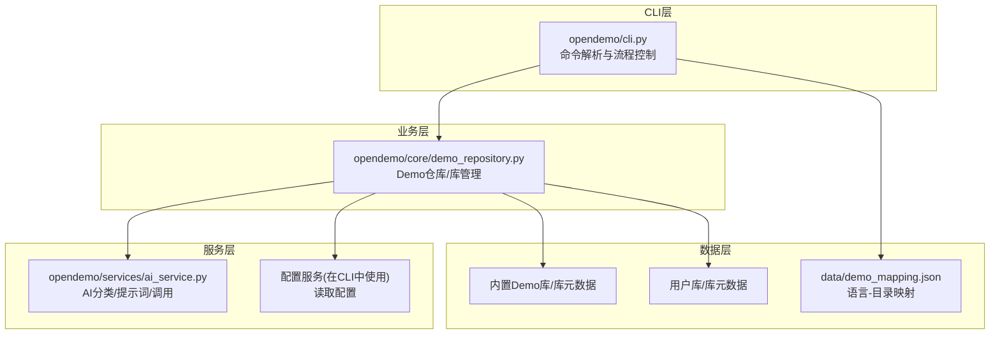
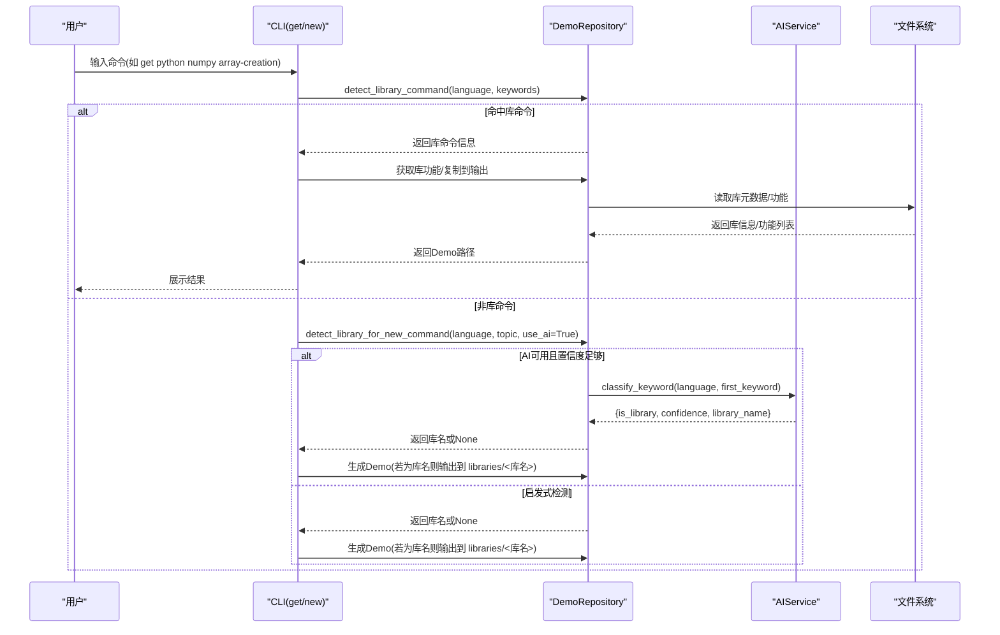
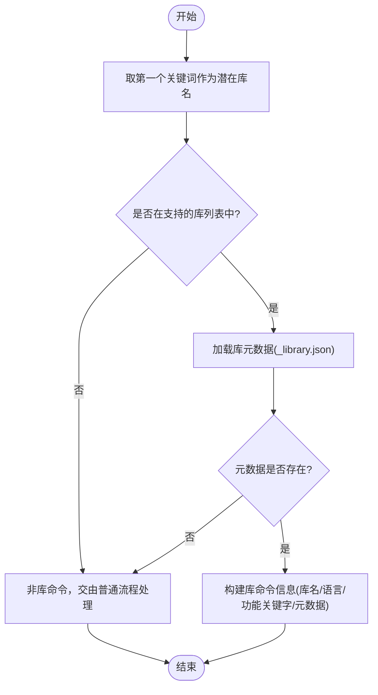
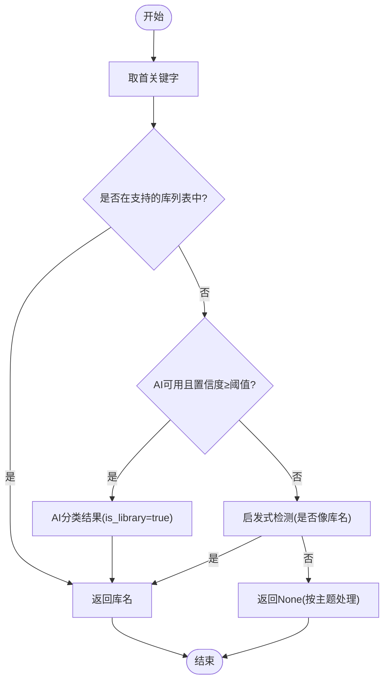
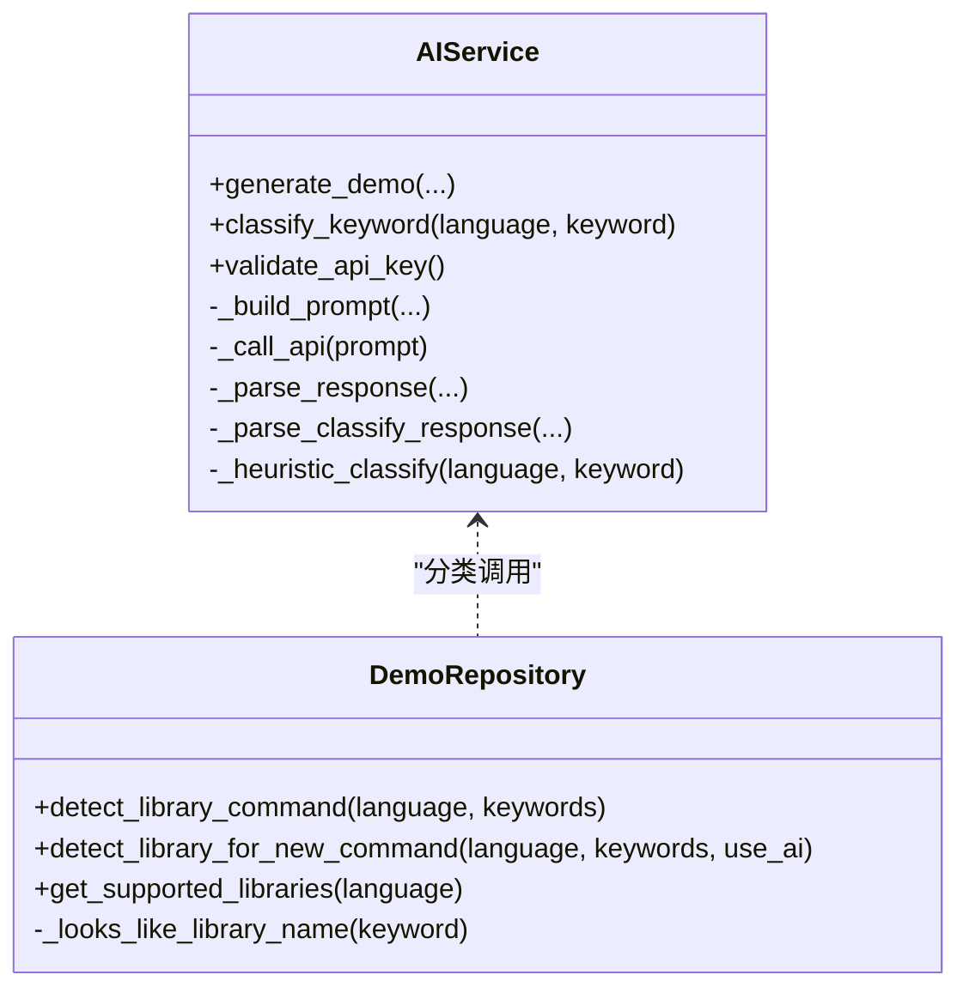
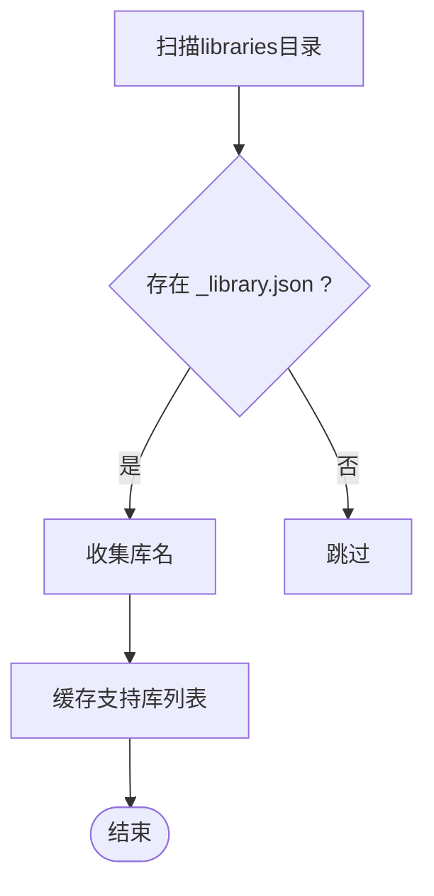
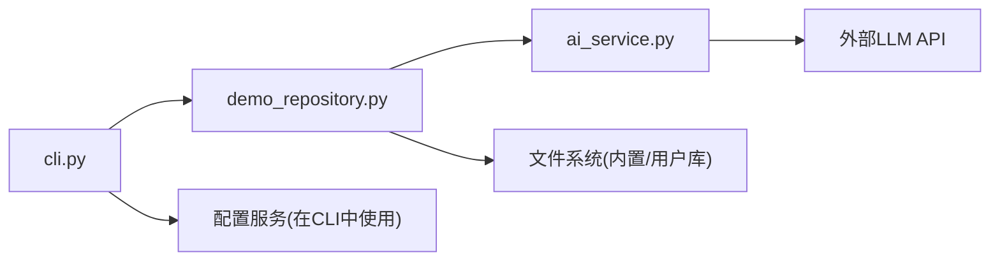

# AI库名检测

<cite>
**本文引用的文件**
- [README.md](file://README.md)
- [ABOUT.md](file://ABOUT.md)
- [pyproject.toml](file://pyproject.toml)
- [opendemo/cli.py](file://opendemo/cli.py)
- [opendemo/services/ai_service.py](file://opendemo/services/ai_service.py)
- [opendemo/core/demo_repository.py](file://opendemo/core/demo_repository.py)
- [data/demo_mapping.json](file://data/demo_mapping.json)
</cite>

## 目录
1. [引言](#引言)
2. [项目结构](#项目结构)
3. [核心组件](#核心组件)
4. [架构总览](#架构总览)
5. [详细组件分析](#详细组件分析)
6. [依赖关系分析](#依赖关系分析)
7. [性能考量](#性能考量)
8. [故障排查指南](#故障排查指南)
9. [结论](#结论)
10. [附录](#附录)

## 引言
本文件围绕“AI库名检测”能力进行系统化文档化，聚焦于CLI命令在识别用户输入中的“库名”与“编程主题”的区分逻辑，以及AI与启发式双通道的判定流程。该能力贯穿命令解析、库命令处理、新建Demo时的库名识别等多个环节，确保用户输入既能命中已注册库的功能，也能在未注册库的情况下通过AI智能识别，从而决定Demo的输出路径（普通主题或libraries目录）。

## 项目结构
- CLI层：命令入口与用户交互，负责解析命令、调用业务层与服务层。
- 业务层：Demo仓库管理与库管理，包含库命令检测、库信息加载、功能扫描等。
- 服务层：AI服务与配置服务，提供LLM分类与配置读取。
- 数据层：内置Demo库、用户库、映射配置等。

图表来源
- [opendemo/cli.py](file://opendemo/cli.py#L316-L766)
- [opendemo/core/demo_repository.py](file://opendemo/core/demo_repository.py#L300-L499)
- [opendemo/services/ai_service.py](file://opendemo/services/ai_service.py#L1-L551)
- [data/demo_mapping.json](file://data/demo_mapping.json#L1-L200)

章节来源
- [README.md](file://README.md#L96-L141)
- [ABOUT.md](file://ABOUT.md#L313-L341)

## 核心组件
- CLI命令层：负责解析get/new/search/config等命令，调用仓库与服务层，处理库命令与AI生成流程。
- Demo仓库：统一管理Demo与库，提供库命令检测、库信息加载、功能扫描、库名启发式判断等。
- AI服务：封装LLM调用，提供“关键字是库名还是主题”的分类能力，支持回退到启发式检测。

章节来源
- [opendemo/cli.py](file://opendemo/cli.py#L316-L766)
- [opendemo/core/demo_repository.py](file://opendemo/core/demo_repository.py#L300-L499)
- [opendemo/services/ai_service.py](file://opendemo/services/ai_service.py#L1-L551)

## 架构总览
AI库名检测贯穿两条主线：
- 库命令检测：当用户输入形如“opendemo get python numpy array-creation”，CLI先判定是否为库命令，若是则进入库功能获取流程。
- 新建命令库名识别：当用户输入“opendemo new python numpy”，仓库通过AI或启发式判断首关键字是否为库名，决定输出到libraries/<库名>还是语言根目录。

图表来源
- [opendemo/cli.py](file://opendemo/cli.py#L316-L766)
- [opendemo/core/demo_repository.py](file://opendemo/core/demo_repository.py#L309-L400)
- [opendemo/services/ai_service.py](file://opendemo/services/ai_service.py#L330-L468)

## 详细组件分析

### 组件A：库命令检测（get命令）
- 目标：识别“语言 + 库名 + 功能关键字”的库命令形式，避免误判为普通主题。
- 关键流程：
  - 从关键词列表取第一个作为潜在库名。
  - 检查该库是否在“支持的库列表”中（来自内置/用户库的库元数据目录）。
  - 若命中，加载库元数据与功能列表，返回库命令信息给CLI处理。
- 输出路径：命中库命令时，CLI会直接从库中复制功能Demo到输出目录，不触发AI生成。

图表来源
- [opendemo/core/demo_repository.py](file://opendemo/core/demo_repository.py#L309-L348)
- [opendemo/cli.py](file://opendemo/cli.py#L349-L363)

章节来源
- [opendemo/core/demo_repository.py](file://opendemo/core/demo_repository.py#L309-L348)
- [opendemo/cli.py](file://opendemo/cli.py#L349-L363)

### 组件B：新建命令库名识别（new命令）
- 目标：在用户输入“opendemo new python numpy”时，判断首关键字是否为库名，决定输出路径。
- 关键流程：
  - 若库名已在支持列表中，直接返回库名。
  - 否则，若AI可用且置信度≥阈值，则返回库名；否则返回None。
  - 若均失败，使用启发式规则判断首关键字是否像库名（不含中文、长度、字符集、开头等）。
- 输出路径：若为库名，生成到 opendemo_output/<语言>/libraries/<库名>/；否则到语言根目录。

图表来源
- [opendemo/core/demo_repository.py](file://opendemo/core/demo_repository.py#L350-L400)
- [opendemo/services/ai_service.py](file://opendemo/services/ai_service.py#L330-L468)

章节来源
- [opendemo/core/demo_repository.py](file://opendemo/core/demo_repository.py#L350-L400)
- [opendemo/services/ai_service.py](file://opendemo/services/ai_service.py#L330-L468)

### 组件C：AI分类与回退
- AI分类：向LLM发送提示词，要求判断关键字是“库名/主题”，并返回JSON结构（is_library、confidence、library_name、description）。若失败或未配置API密钥，则回退到启发式检测。
- 启发式规则：首关键字不含中文、长度2-30、仅允许字母数字连字符下划线、以字母开头、且为单个单词，才视为库名。

图表来源
- [opendemo/services/ai_service.py](file://opendemo/services/ai_service.py#L1-L551)
- [opendemo/core/demo_repository.py](file://opendemo/core/demo_repository.py#L350-L499)

章节来源
- [opendemo/services/ai_service.py](file://opendemo/services/ai_service.py#L330-L551)
- [opendemo/core/demo_repository.py](file://opendemo/core/demo_repository.py#L938-L979)

### 组件D：库信息与功能扫描
- 库元数据：通过“_library.json”加载库元数据，包含库基本信息与功能分类。
- 功能扫描：遍历库目录下的功能子目录，读取各功能的metadata.json，形成功能列表。
- 支持库列表：从内置/用户库的libraries目录扫描，收集具备“_library.json”的库名。

图表来源
- [opendemo/core/demo_repository.py](file://opendemo/core/demo_repository.py#L402-L439)
- [opendemo/core/demo_repository.py](file://opendemo/core/demo_repository.py#L441-L468)
- [opendemo/core/demo_repository.py](file://opendemo/core/demo_repository.py#L470-L520)

章节来源
- [opendemo/core/demo_repository.py](file://opendemo/core/demo_repository.py#L402-L520)

## 依赖关系分析
- CLI依赖DemoRepository进行库命令检测与Demo复制；依赖AIService进行AI分类；依赖配置服务读取AI配置。
- DemoRepository依赖文件系统加载库元数据与功能；依赖AIService进行AI分类；依赖配置服务读取缓存与路径。
- AIService依赖外部LLM API，内部包含重试、超时、JSON解析与回退逻辑。

图表来源
- [opendemo/cli.py](file://opendemo/cli.py#L316-L766)
- [opendemo/core/demo_repository.py](file://opendemo/core/demo_repository.py#L300-L499)
- [opendemo/services/ai_service.py](file://opendemo/services/ai_service.py#L1-L551)

章节来源
- [opendemo/cli.py](file://opendemo/cli.py#L316-L766)
- [opendemo/core/demo_repository.py](file://opendemo/core/demo_repository.py#L300-L499)
- [opendemo/services/ai_service.py](file://opendemo/services/ai_service.py#L1-L551)

## 性能考量
- 缓存策略：Demo仓库对Demo、库元数据、功能列表、支持库列表均做缓存，减少重复IO与解析开销。
- IO优化：库元数据与功能扫描仅在需要时触发，且通过目录扫描与JSON读取实现。
- AI调用：分类与生成均支持重试与超时控制，避免因网络波动导致失败。

章节来源
- [opendemo/core/demo_repository.py](file://opendemo/core/demo_repository.py#L94-L100)
- [opendemo/core/demo_repository.py](file://opendemo/core/demo_repository.py#L840-L897)
- [opendemo/core/demo_repository.py](file://opendemo/core/demo_repository.py#L898-L937)
- [opendemo/services/ai_service.py](file://opendemo/services/ai_service.py#L68-L86)

## 故障排查指南
- AI未配置：若未设置AI API密钥，AI分类会回退到启发式检测；若仍无法识别库名，CLI会按普通主题处理。
- 库未注册：若首关键字不在“支持的库列表”中，且AI/启发式均未识别为库名，则不会输出到libraries目录。
- 库元数据缺失：若库目录缺少“_library.json”，将无法加载库信息，库命令检测失败。
- 输出路径异常：确认CLI输出目录配置与语言支持列表；检查是否强制new导致生成到新目录。

章节来源
- [opendemo/cli.py](file://opendemo/cli.py#L333-L363)
- [opendemo/services/ai_service.py](file://opendemo/services/ai_service.py#L330-L468)
- [opendemo/core/demo_repository.py](file://opendemo/core/demo_repository.py#L309-L348)
- [opendemo/core/demo_repository.py](file://opendemo/core/demo_repository.py#L402-L439)

## 结论
AI库名检测通过“库命令检测 + 新建命令库名识别 + AI分类 + 启发式回退”的组合，在保证准确性的同时兼顾易用性。其核心价值在于：
- 将“库名”与“编程主题”清晰分离，决定Demo输出到libraries还是语言根目录。
- 在未注册库的情况下，借助AI实现“未知库名”的智能识别，提升用户体验。
- 通过缓存与最小化IO，保障整体性能与稳定性。

## 附录
- 语言支持：CLI层支持python/java/go/nodejs；库命令检测依赖库元数据目录结构。
- 配置要点：AI模型、温度、最大token、重试次数与间隔等可通过配置服务读取。
- 数据映射：data/demo_mapping.json提供语言到目录名的映射，辅助CLI扫描与展示。

章节来源
- [pyproject.toml](file://pyproject.toml#L29-L67)
- [ABOUT.md](file://ABOUT.md#L313-L341)
- [data/demo_mapping.json](file://data/demo_mapping.json#L1-L200)