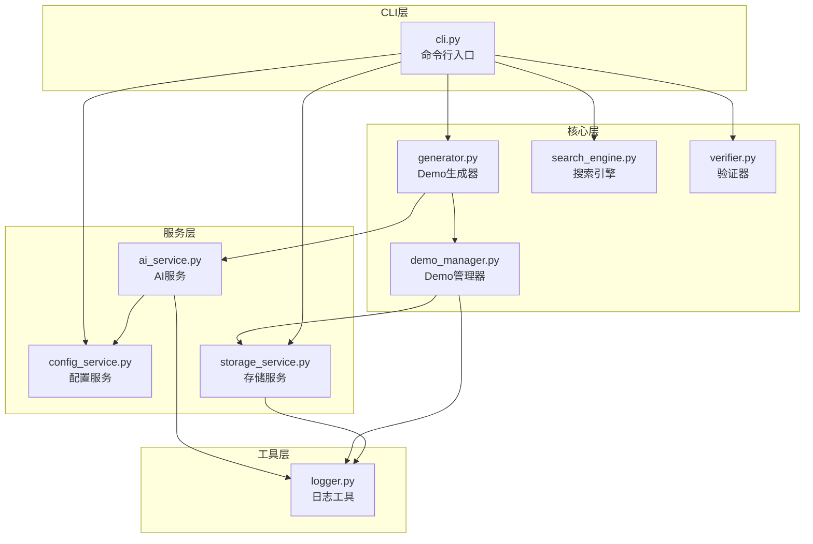
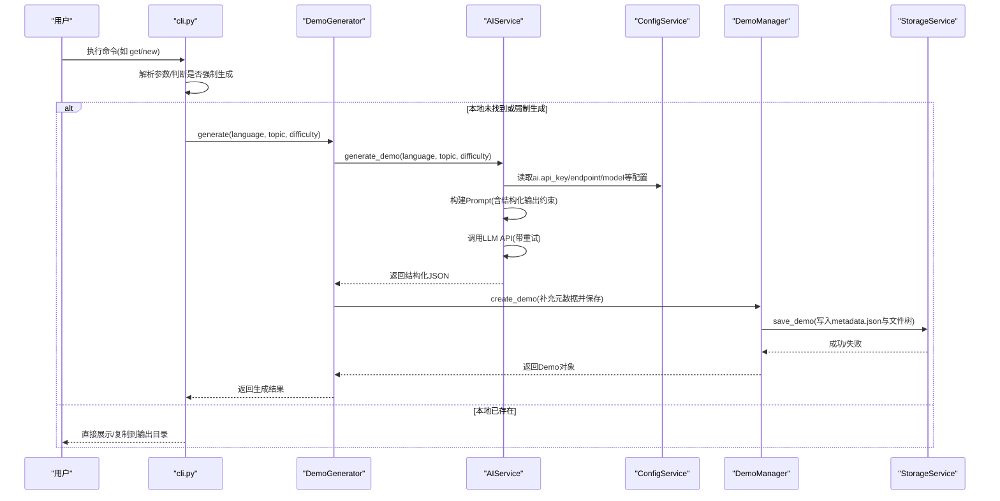
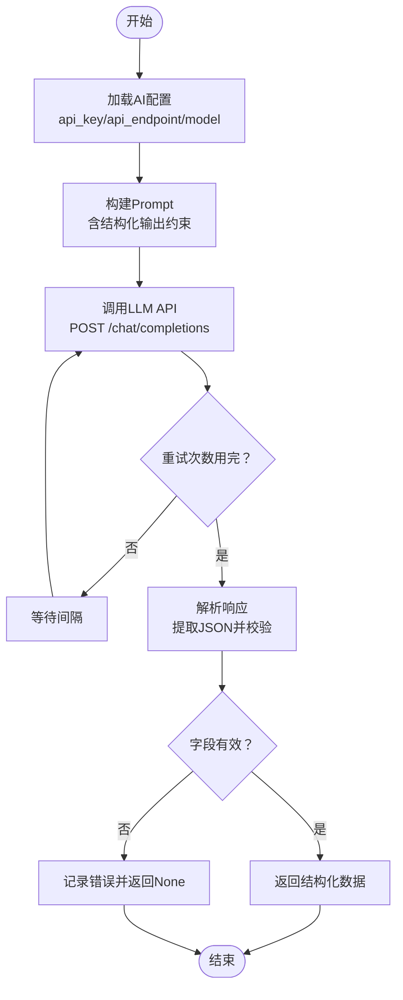
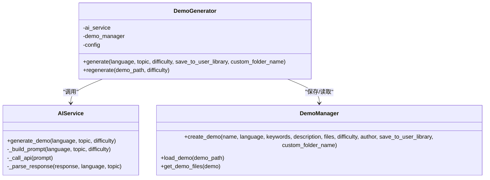
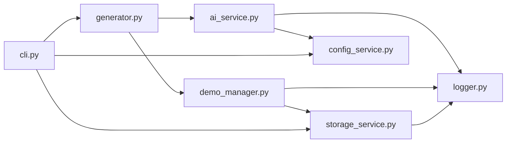

# AI智能生成功能

<cite>
**本文引用的文件**
- [ai_service.py](file://opendemo/services/ai_service.py)
- [generator.py](file://opendemo/core/generator.py)
- [config_service.py](file://opendemo/services/config_service.py)
- [cli.py](file://opendemo/cli.py)
- [demo_manager.py](file://opendemo/core/demo_manager.py)
- [storage_service.py](file://opendemo/services/storage_service.py)
- [logger.py](file://opendemo/utils/logger.py)
- [README.md](file://README.md)
- [verifier.py](file://opendemo/core/verifier.py)
</cite>

## 目录
1. [引言](#引言)
2. [项目结构](#项目结构)
3. [核心组件](#核心组件)
4. [架构总览](#架构总览)
5. [详细组件分析](#详细组件分析)
6. [依赖关系分析](#依赖关系分析)
7. [性能考虑](#性能考虑)
8. [故障排查指南](#故障排查指南)
9. [结论](#结论)
10. [附录](#附录)

## 引言
本文件围绕“AI智能生成功能”展开，重点阐述其与OpenAI等LLM API的集成方式，包括：
- HTTP请求构建与发送
- 响应解析与结构化输出
- 错误重试机制
- Prompt设计原则与输出约束
- 触发条件（本地未找到时）与生成流程
- 初学者入门与开发者进阶（API调用、认证、性能优化）

## 项目结构
Open Demo CLI采用清晰的分层架构：CLI入口负责用户交互与流程编排；核心模块负责业务逻辑（生成器、搜索、验证）；服务层负责外部集成（AI、配置、存储）；工具模块提供通用能力（日志、格式化）。



图表来源
- [cli.py](file://opendemo/cli.py#L1-L120)
- [generator.py](file://opendemo/core/generator.py#L1-L135)
- [demo_manager.py](file://opendemo/core/demo_manager.py#L1-L120)
- [ai_service.py](file://opendemo/services/ai_service.py#L1-L120)
- [config_service.py](file://opendemo/services/config_service.py#L1-L120)
- [storage_service.py](file://opendemo/services/storage_service.py#L1-L120)
- [logger.py](file://opendemo/utils/logger.py#L1-L65)

章节来源
- [README.md](file://README.md#L60-L110)
- [cli.py](file://opendemo/cli.py#L1-L120)

## 核心组件
- AIService：封装与LLM API交互，负责构建Prompt、调用API、解析响应、重试与校验。
- DemoGenerator：协调AI生成与Demo落地，补充元数据并创建文件树。
- ConfigService：统一加载与合并全局/项目配置，提供键值访问与持久化。
- StorageService：抽象文件系统操作，负责Demo的保存、复制、删除与输出目录管理。
- DemoManager：面向Demo实体的高层封装，负责元数据读写、文件枚举、缓存与复制。
- Logger：统一日志输出，支持文件与控制台双通道。
- Verifier：可选的Demo可执行性验证，按语言执行依赖安装与代码运行。

章节来源
- [ai_service.py](file://opendemo/services/ai_service.py#L1-L120)
- [generator.py](file://opendemo/core/generator.py#L1-L100)
- [config_service.py](file://opendemo/services/config_service.py#L1-L120)
- [storage_service.py](file://opendemo/services/storage_service.py#L1-L120)
- [demo_manager.py](file://opendemo/core/demo_manager.py#L1-L120)
- [logger.py](file://opendemo/utils/logger.py#L1-L65)
- [verifier.py](file://opendemo/core/verifier.py#L1-L80)

## 架构总览
AI智能生成功能的关键流程：
- CLI根据用户输入选择“本地匹配/复制/AI生成”，若本地未找到则进入AI生成分支。
- DemoGenerator委托AIService生成结构化JSON，随后由DemoManager与StorageService落地文件。
- AIService内部完成Prompt构造、HTTP请求、响应解析与重试。
- 可选的验证器对生成的Demo进行可执行性检查。



图表来源
- [cli.py](file://opendemo/cli.py#L196-L324)
- [generator.py](file://opendemo/core/generator.py#L31-L103)
- [ai_service.py](file://opendemo/services/ai_service.py#L38-L120)
- [demo_manager.py](file://opendemo/core/demo_manager.py#L132-L201)
- [storage_service.py](file://opendemo/services/storage_service.py#L130-L166)

## 详细组件分析

### AIService：与LLM API集成
- 配置加载：首次使用时从ConfigService读取ai.api_key、ai.api_endpoint、ai.model等，并缓存。
- Prompt构建：依据语言选择编码规范与依赖文件命名，明确输出结构（metadata与files），并约束输出为JSON。
- 请求发送：构造消息数组（system+user），携带temperature、max_tokens等参数，使用requests.post发送至配置的API端点。
- 响应解析：支持直接JSON或```json包裹的混合格式，提取JSON并校验必需字段，补全缺失的metadata字段。
- 重试策略：基于配置的retry_times与retry_interval进行指数退避式重试，异常时记录日志。
- 密钥校验：发送最小化请求验证API密钥有效性。



图表来源
- [ai_service.py](file://opendemo/services/ai_service.py#L38-L120)
- [ai_service.py](file://opendemo/services/ai_service.py#L177-L225)
- [ai_service.py](file://opendemo/services/ai_service.py#L226-L291)

章节来源
- [ai_service.py](file://opendemo/services/ai_service.py#L1-L120)
- [ai_service.py](file://opendemo/services/ai_service.py#L177-L225)
- [ai_service.py](file://opendemo/services/ai_service.py#L226-L291)

### DemoGenerator：协调AI生成与落地
- 输入：语言、主题、难度、是否保存到用户库、自定义文件夹名。
- 调用AIService生成结构化数据，补充作者、时间戳、版本、验证标记等元数据。
- 交由DemoManager创建Demo，指定保存路径（输出目录或用户库），并写入metadata.json与文件树。
- 返回包含Demo对象、路径、文件清单与元数据的结果字典。



图表来源
- [generator.py](file://opendemo/core/generator.py#L1-L103)
- [ai_service.py](file://opendemo/services/ai_service.py#L38-L120)
- [demo_manager.py](file://opendemo/core/demo_manager.py#L132-L201)

章节来源
- [generator.py](file://opendemo/core/generator.py#L1-L103)
- [demo_manager.py](file://opendemo/core/demo_manager.py#L132-L201)

### Prompt设计原则与结构化输出解析
- 设计原则
  - 明确角色与任务：强调“编程导师与示例生成器”的身份，聚焦主题与难度。
  - 输出结构约束：要求返回JSON，包含metadata与files两部分，避免自然语言混杂。
  - 语言与规范：针对不同语言给出编码规范与依赖文件命名约定。
  - 内容完整性：要求生成README.md、metadata.json、若干代码文件与依赖声明。
  - 约束与边界：限制代码行数、跨平台兼容性、可直接运行等。
- 结构化输出解析
  - 支持多种包裹形式：纯JSON、```json...```、以及非JSON包裹的代码块。
  - 字段校验：确保包含metadata与files；若缺少name/language/keywords，自动补全。
  - 错误处理：捕获JSON解析异常与通用异常，记录调试信息并返回None。

章节来源
- [ai_service.py](file://opendemo/services/ai_service.py#L87-L176)
- [ai_service.py](file://opendemo/services/ai_service.py#L226-L291)

### 触发条件与生成流程
- 触发条件
  - CLI命令get时，若未显式传入“new”且本地未匹配到Demo，则进入AI生成分支。
  - CLI命令new时，直接走AI生成分支。
- 流程要点
  - 优先在输出目录扫描，再在内置/用户库搜索，最后AI生成。
  - 若强制生成（get ... new），生成独立输出目录并避免覆盖。
  - 生成完成后可选验证，最终展示快速开始步骤与文件清单。

章节来源
- [cli.py](file://opendemo/cli.py#L196-L324)
- [cli.py](file://opendemo/cli.py#L326-L472)

### 配置与认证
- 配置来源与优先级
  - 默认配置位于ConfigService中，包含输出目录、用户库路径、验证开关、AI参数等。
  - 全局配置文件位于用户家目录下的.yaml，项目配置位于当前目录的.yaml。
  - 合并策略：项目配置覆盖全局配置，最终以内存缓存形式提供。
- AI认证
  - 通过ConfigService.get('ai.api_key')读取密钥；若为空，CLI会提示配置。
  - AIService.validate_api_key()可进行最小化请求验证。

章节来源
- [config_service.py](file://opendemo/services/config_service.py#L16-L120)
- [config_service.py](file://opendemo/services/config_service.py#L147-L203)
- [ai_service.py](file://opendemo/services/ai_service.py#L292-L329)
- [cli.py](file://opendemo/cli.py#L283-L309)

### 可选验证（开发者进阶）
- Python验证：创建虚拟环境、安装requirements.txt、逐个执行代码文件，记录步骤、输出与错误。
- 验证开关：受enable_verification与verification_method影响。
- 报告生成：将验证过程与结果汇总为可读报告。

章节来源
- [verifier.py](file://opendemo/core/verifier.py#L1-L120)
- [verifier.py](file://opendemo/core/verifier.py#L120-L200)
- [verifier.py](file://opendemo/core/verifier.py#L225-L270)

## 依赖关系分析
- 组件耦合
  - DemoGenerator依赖AIService与DemoManager，耦合度低，职责清晰。
  - AIService依赖ConfigService与Logger，便于配置与可观测性。
  - DemoManager依赖StorageService，抽象文件系统操作。
  - CLI作为编排者，依赖各服务与工具模块。
- 外部依赖
  - requests：用于HTTP请求LLM API。
  - yaml：用于配置文件读写。
  - subprocess：用于可选验证的进程执行。
- 潜在循环依赖
  - 当前模块间无循环导入迹象，分层清晰。



图表来源
- [cli.py](file://opendemo/cli.py#L1-L120)
- [generator.py](file://opendemo/core/generator.py#L1-L60)
- [ai_service.py](file://opendemo/services/ai_service.py#L1-L60)
- [demo_manager.py](file://opendemo/core/demo_manager.py#L1-L60)
- [storage_service.py](file://opendemo/services/storage_service.py#L1-L60)
- [config_service.py](file://opendemo/services/config_service.py#L1-L60)
- [logger.py](file://opendemo/utils/logger.py#L1-L65)

## 性能考虑
- 请求超时与重试
  - AIService使用timeout与固定重试次数/间隔，避免长时间阻塞。
  - 建议在高并发场景下增加并发控制与速率限制。
- Prompt长度与Token上限
  - 通过max_tokens控制输出规模；复杂主题可适当降低temperature提升稳定性。
- I/O开销
  - DemoManager对Demo对象做缓存，减少重复读取元数据的开销。
  - StorageService批量写入文件，避免频繁IO。
- 验证耗时
  - Python验证涉及虚拟环境创建与依赖安装，建议在CI或离线场景启用验证，本地开发可关闭。

[本节为通用建议，无需特定文件引用]

## 故障排查指南
- API密钥未配置
  - 现象：CLI提示未配置或AIService返回None。
  - 处理：使用配置命令设置ai.api_key；或在全局/项目配置中写入。
- API请求失败
  - 现象：日志记录错误，重试后仍失败。
  - 处理：检查网络连通性、端点URL、模型名称；适当增大timeout与重试间隔。
- 响应解析失败
  - 现象：日志提示JSON解析错误或字段缺失。
  - 处理：确认Prompt输出严格为JSON；必要时调整模型参数或提示词。
- 生成的Demo无法运行
  - 现象：验证阶段依赖安装失败或代码执行报错。
  - 处理：检查requirements.txt与Python版本；调整验证超时；或暂时关闭验证。

章节来源
- [cli.py](file://opendemo/cli.py#L283-L309)
- [ai_service.py](file://opendemo/services/ai_service.py#L60-L120)
- [ai_service.py](file://opendemo/services/ai_service.py#L226-L291)
- [verifier.py](file://opendemo/core/verifier.py#L1-L120)

## 结论
本项目通过清晰的分层设计与严格的结构化输出约束，实现了从Prompt到可执行Demo的端到端自动化。AIService承担了与LLM API交互的核心职责，DemoGenerator负责流程编排与落地，ConfigService与StorageService提供了可靠的配置与I/O支撑。对于初学者，建议先掌握基本命令与配置；对于开发者，可进一步优化Prompt、引入速率限制与缓存策略，并扩展更多语言与验证能力。

[本节为总结性内容，无需特定文件引用]

## 附录
- 常用命令与配置
  - 配置初始化与设置：参见README与CLI配置子命令。
  - Demo结构：metadata.json、README.md、code/目录、依赖声明文件。
- 开发建议
  - 在本地未找到时才触发AI生成，减少成本。
  - 为不同语言定制更精细的Prompt模板与输出约束。
  - 对外网请求增加熔断与降级策略，提升鲁棒性。

章节来源
- [README.md](file://README.md#L92-L110)
- [cli.py](file://opendemo/cli.py#L473-L610)