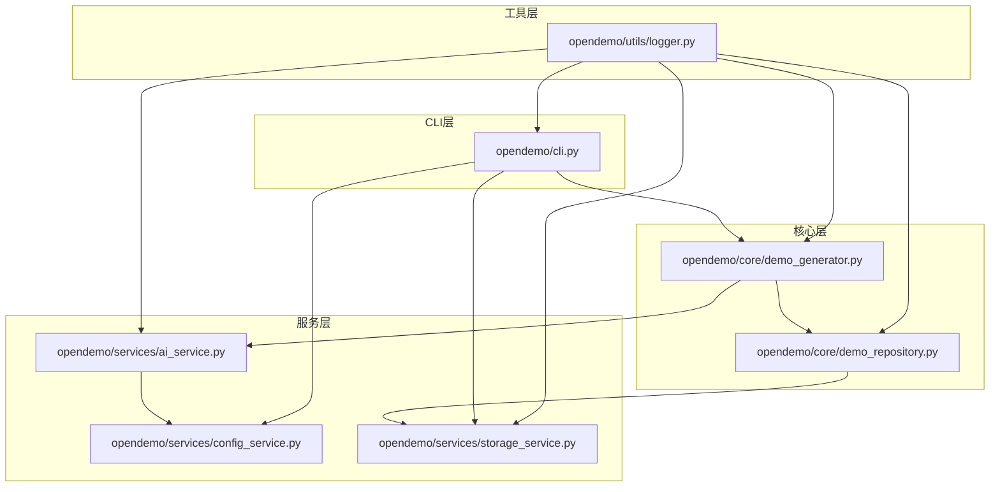
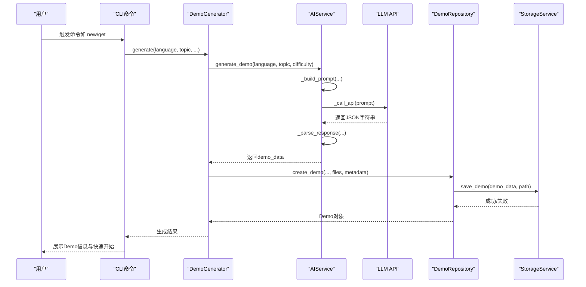
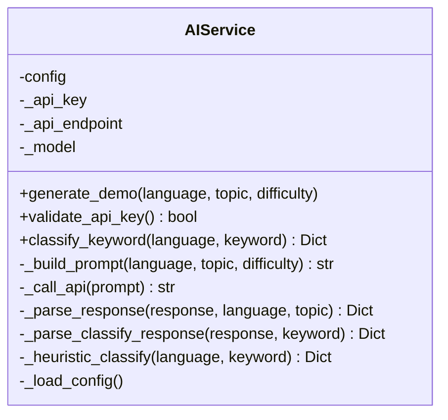
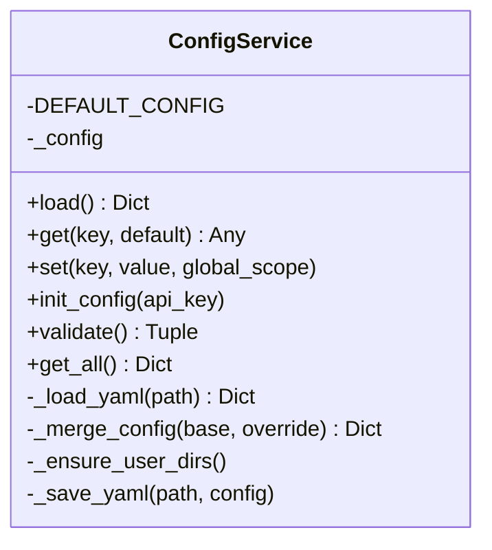
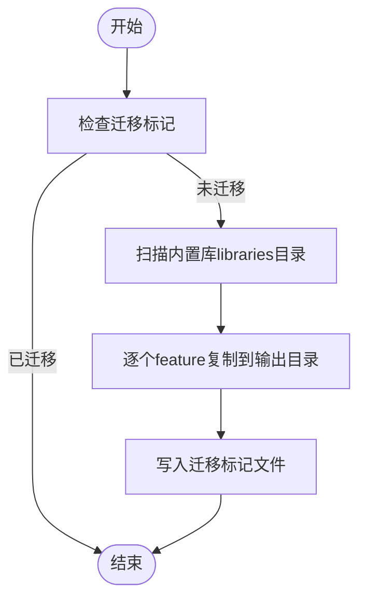
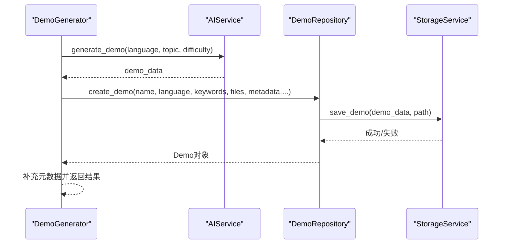
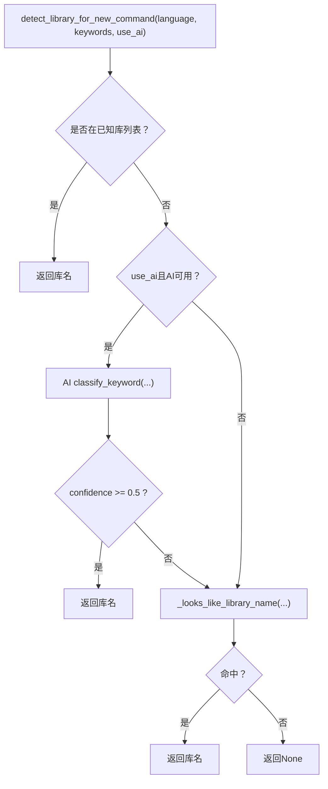
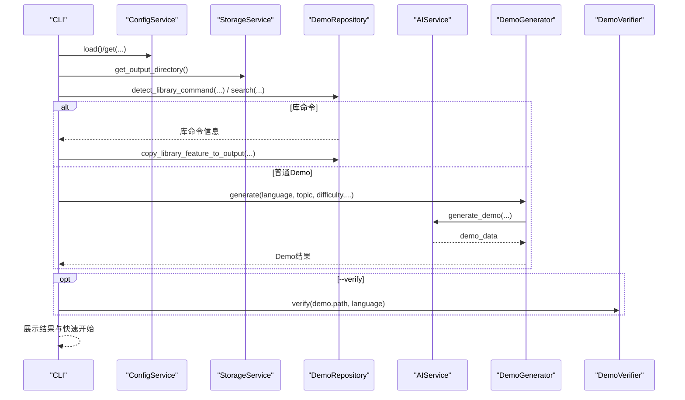
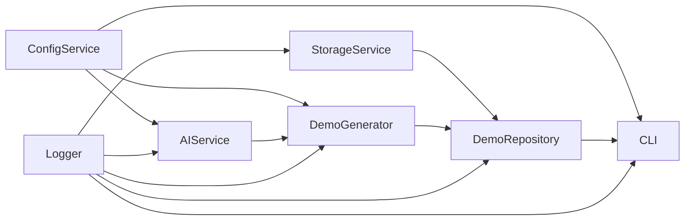

# AI服务增强

<cite>
**本文引用的文件**
- [opendemo/services/ai_service.py](file://opendemo/services/ai_service.py)
- [opendemo/services/config_service.py](file://opendemo/services/config_service.py)
- [opendemo/services/storage_service.py](file://opendemo/services/storage_service.py)
- [opendemo/core/demo_generator.py](file://opendemo/core/demo_generator.py)
- [opendemo/core/demo_repository.py](file://opendemo/core/demo_repository.py)
- [opendemo/cli.py](file://opendemo/cli.py)
- [opendemo/utils/logger.py](file://opendemo/utils/logger.py)
- [README.md](file://README.md)
- [tests/test_ai_service.py](file://tests/test_ai_service.py)
</cite>

## 目录
1. [简介](#简介)
2. [项目结构](#项目结构)
3. [核心组件](#核心组件)
4. [架构总览](#架构总览)
5. [详细组件分析](#详细组件分析)
6. [依赖关系分析](#依赖关系分析)
7. [性能考量](#性能考量)
8. [故障排查指南](#故障排查指南)
9. [结论](#结论)
10. [附录](#附录)

## 简介
本文件围绕“AI服务增强”主题，系统梳理 opendemo-cli 项目中与大模型（LLM）交互、提示词工程、响应解析、库名识别与分类、以及与CLI命令链路的集成方式。重点包括：
- AI服务如何构建提示词、调用外部LLM API、解析并校验响应；
- 如何在CLI命令中触发AI生成流程，并与仓库管理、存储服务协同；
- 如何通过库名分类能力，将“第三方库”与“编程主题”区分，从而决定Demo的目录结构；
- 配置服务如何集中管理AI相关的参数（模型、端点、超时、重试等）；
- 日志与测试如何保障稳定性与可观测性。

## 项目结构
项目采用分层架构：CLI入口负责命令解析与流程编排，服务层封装AI与存储能力，核心层负责仓库管理与生成协调，工具层提供日志与格式化。

图表来源
- [opendemo/cli.py](file://opendemo/cli.py#L1-L120)
- [opendemo/core/demo_generator.py](file://opendemo/core/demo_generator.py#L1-L120)
- [opendemo/core/demo_repository.py](file://opendemo/core/demo_repository.py#L1-L120)
- [opendemo/services/ai_service.py](file://opendemo/services/ai_service.py#L1-L120)
- [opendemo/services/config_service.py](file://opendemo/services/config_service.py#L1-L120)
- [opendemo/services/storage_service.py](file://opendemo/services/storage_service.py#L1-L120)
- [opendemo/utils/logger.py](file://opendemo/utils/logger.py#L1-L60)

章节来源
- [README.md](file://README.md#L485-L520)

## 核心组件
- AI服务（AIService）：负责提示词构建、LLM调用、响应解析与库名分类。
- 配置服务（ConfigService）：集中管理全局与项目级配置，支持嵌套键读取、合并与持久化。
- 存储服务（StorageService）：负责文件系统操作、Demo目录结构管理、内置/用户库迁移。
- Demo生成器（DemoGenerator）：协调AI生成与仓库创建，补充元数据并返回结果。
- Demo仓库（DemoRepository）：统一管理Demo与库Demo，提供库检测、复制、贡献等功能。
- CLI（cli.py）：命令入口，串联配置、存储、仓库、生成器、AI服务与验证器。

章节来源
- [opendemo/services/ai_service.py](file://opendemo/services/ai_service.py#L1-L120)
- [opendemo/services/config_service.py](file://opendemo/services/config_service.py#L1-L120)
- [opendemo/services/storage_service.py](file://opendemo/services/storage_service.py#L1-L120)
- [opendemo/core/demo_generator.py](file://opendemo/core/demo_generator.py#L1-L120)
- [opendemo/core/demo_repository.py](file://opendemo/core/demo_repository.py#L1-L120)
- [opendemo/cli.py](file://opendemo/cli.py#L1-L120)

## 架构总览
AI服务增强贯穿于“生成流程”与“库名识别”两条主线：
- 生成流程：CLI -> DemoGenerator -> AIService -> LLM API -> AIService解析 -> DemoRepository保存 -> CLI展示。
- 库名识别：CLI/DemoRepository通过AI或启发式判断关键字是否为库名，决定Demo的目录结构（libraries/...）。

图表来源
- [opendemo/cli.py](file://opendemo/cli.py#L344-L481)
- [opendemo/core/demo_generator.py](file://opendemo/core/demo_generator.py#L30-L114)
- [opendemo/services/ai_service.py](file://opendemo/services/ai_service.py#L40-L120)
- [opendemo/core/demo_repository.py](file://opendemo/core/demo_repository.py#L147-L229)
- [opendemo/services/storage_service.py](file://opendemo/services/storage_service.py#L132-L168)

## 详细组件分析

### AIService：提示词构建、API调用与响应解析
- 提示词构建：根据语言选择编码规范与依赖文件模板，明确输出结构（metadata与files），并约束代码规模与跨平台兼容性。
- API调用：支持自定义端点、模型、温度、最大token与超时；内部重试与间隔配置来自配置服务。
- 响应解析：兼容多种包裹形式（纯JSON、带markdown代码块），提取metadata与files，补全缺失字段（如folder_name）。
- 库名分类：优先使用AI判断，失败回退到启发式规则（中文、常见库名集合、命名特征等）。

图表来源
- [opendemo/services/ai_service.py](file://opendemo/services/ai_service.py#L16-L627)

章节来源
- [opendemo/services/ai_service.py](file://opendemo/services/ai_service.py#L40-L212)
- [opendemo/services/ai_service.py](file://opendemo/services/ai_service.py#L213-L450)
- [opendemo/services/ai_service.py](file://opendemo/services/ai_service.py#L451-L627)

### ConfigService：配置加载、合并与持久化
- 默认配置包含输出目录、语言、验证开关、AI参数（provider、api_key、api_endpoint、model、temperature、max_tokens、timeout、retry_times、retry_interval）、贡献配置、显示配置等。
- 支持全局与项目级配置文件合并，嵌套键读取（如“ai.api_key”）。
- 提供初始化、设置、获取、校验与保存能力。

图表来源
- [opendemo/services/config_service.py](file://opendemo/services/config_service.py#L15-L281)

章节来源
- [opendemo/services/config_service.py](file://opendemo/services/config_service.py#L19-L106)
- [opendemo/services/config_service.py](file://opendemo/services/config_service.py#L146-L203)
- [opendemo/services/config_service.py](file://opendemo/services/config_service.py#L219-L281)

### StorageService：文件系统与Demo库管理
- 负责内置库与用户库路径管理、Demo目录扫描、元数据读取、Demo保存/复制/删除、输出目录与迁移标记。
- 迁移流程：扫描内置库libraries目录，复制到输出目录并打上迁移标记，避免重复迁移。

图表来源
- [opendemo/services/storage_service.py](file://opendemo/services/storage_service.py#L280-L380)

章节来源
- [opendemo/services/storage_service.py](file://opendemo/services/storage_service.py#L1-L120)
- [opendemo/services/storage_service.py](file://opendemo/services/storage_service.py#L120-L225)
- [opendemo/services/storage_service.py](file://opendemo/services/storage_service.py#L280-L380)

### DemoGenerator：生成协调器
- 调用AIService生成demo_data，补充作者、时间戳、版本、验证标记等元数据，然后委托DemoRepository创建Demo。
- 支持重新生成（删除旧Demo并按相同主题生成新Demo）。

图表来源
- [opendemo/core/demo_generator.py](file://opendemo/core/demo_generator.py#L30-L114)
- [opendemo/core/demo_repository.py](file://opendemo/core/demo_repository.py#L147-L229)
- [opendemo/services/storage_service.py](file://opendemo/services/storage_service.py#L132-L168)

章节来源
- [opendemo/core/demo_generator.py](file://opendemo/core/demo_generator.py#L30-L114)

### DemoRepository：仓库管理与库检测
- 统一管理Demo与库Demo，支持库命令解析、库信息查询、功能列表、Demo复制到输出目录。
- 库名检测：优先使用AI分类（confidence阈值），否则回退到启发式规则；支持kubernetes工具的特殊目录结构。

图表来源
- [opendemo/core/demo_repository.py](file://opendemo/core/demo_repository.py#L357-L405)
- [opendemo/core/demo_repository.py](file://opendemo/core/demo_repository.py#L406-L470)

章节来源
- [opendemo/core/demo_repository.py](file://opendemo/core/demo_repository.py#L318-L405)
- [opendemo/core/demo_repository.py](file://opendemo/core/demo_repository.py#L406-L470)

### CLI：命令编排与展示
- get/new/search/check等命令串联配置、存储、仓库、生成器、AI服务与验证器。
- get命令支持“库命令”解析与“强制重新生成”（new后缀）。
- new命令支持库名智能识别与README更新。

图表来源
- [opendemo/cli.py](file://opendemo/cli.py#L344-L481)
- [opendemo/cli.py](file://opendemo/cli.py#L483-L542)
- [opendemo/cli.py](file://opendemo/cli.py#L544-L628)

章节来源
- [opendemo/cli.py](file://opendemo/cli.py#L344-L481)
- [opendemo/cli.py](file://opendemo/cli.py#L483-L542)
- [opendemo/cli.py](file://opendemo/cli.py#L544-L628)

## 依赖关系分析
- AIService依赖ConfigService读取AI参数，依赖Logger记录日志。
- DemoGenerator依赖AIService与DemoRepository，间接依赖StorageService。
- DemoRepository依赖StorageService与ConfigService，必要时依赖AIService进行库名分类。
- CLI依赖各服务与核心模块，负责流程编排与用户交互。

图表来源
- [opendemo/services/ai_service.py](file://opendemo/services/ai_service.py#L16-L60)
- [opendemo/core/demo_generator.py](file://opendemo/core/demo_generator.py#L14-L39)
- [opendemo/core/demo_repository.py](file://opendemo/core/demo_repository.py#L75-L100)
- [opendemo/cli.py](file://opendemo/cli.py#L1-L60)

章节来源
- [opendemo/services/ai_service.py](file://opendemo/services/ai_service.py#L16-L60)
- [opendemo/core/demo_generator.py](file://opendemo/core/demo_generator.py#L14-L39)
- [opendemo/core/demo_repository.py](file://opendemo/core/demo_repository.py#L75-L100)
- [opendemo/cli.py](file://opendemo/cli.py#L1-L60)

## 性能考量
- 提示词构建与响应解析：通过严格的JSON提取与字段校验，减少后续处理成本。
- 重试与超时：AI调用具备重试次数与间隔配置，避免瞬时网络波动导致失败。
- 缓存：DemoRepository对Demo、库元数据、功能列表与支持库列表进行缓存，降低重复扫描与IO开销。
- 目录扫描：StorageService使用递归遍历与按语言过滤，减少无关目录扫描。
- 日志轮转：统一日志配置，避免日志过大影响性能。

章节来源
- [opendemo/services/ai_service.py](file://opendemo/services/ai_service.py#L60-L120)
- [opendemo/core/demo_repository.py](file://opendemo/core/demo_repository.py#L90-L120)
- [opendemo/services/storage_service.py](file://opendemo/services/storage_service.py#L86-L107)
- [opendemo/utils/logger.py](file://opendemo/utils/logger.py#L12-L55)

## 故障排查指南
- API密钥未配置：CLI在new/get命令中会检查ai.api_key，未配置会提示设置。
- API调用失败：AIService内部重试与异常捕获；可通过日志定位具体错误。
- 响应解析失败：AIService支持多种包裹形式，若仍失败，检查LLM输出格式或网络返回。
- 库名识别失败：AI失败时回退到启发式规则；可手动确认关键字是否符合库名特征。
- 验证失败：CLI支持--verify选项，验证器会输出错误明细并更新元数据。

章节来源
- [opendemo/cli.py](file://opendemo/cli.py#L443-L470)
- [opendemo/services/ai_service.py](file://opendemo/services/ai_service.py#L60-L120)
- [opendemo/services/ai_service.py](file://opendemo/services/ai_service.py#L213-L292)
- [opendemo/core/demo_repository.py](file://opendemo/core/demo_repository.py#L357-L405)
- [opendemo/cli.py](file://opendemo/cli.py#L777-L794)

## 结论
本项目通过“提示词工程 + LLM API + 响应解析 + 库名识别”的闭环，实现了高质量、可执行的Demo生成与管理。AI服务增强了CLI的智能化能力，ConfigService提供了灵活的参数化配置，StorageService与DemoRepository保证了Demo的可维护性与可扩展性。整体架构清晰、职责分离、可观测性强，适合进一步扩展更多语言与库的Demo生态。

## 附录
- 配置项概览（节选）：输出目录、默认语言、验证开关、AI参数（provider、api_key、api_endpoint、model、temperature、max_tokens、timeout、retry_times、retry_interval）、贡献配置、显示配置。
- 测试覆盖：单元测试覆盖提示词构建、API调用、响应解析、库名分类、重试与边界条件等关键路径。

章节来源
- [opendemo/services/config_service.py](file://opendemo/services/config_service.py#L19-L68)
- [tests/test_ai_service.py](file://tests/test_ai_service.py#L1-L120)
- [tests/test_ai_service.py](file://tests/test_ai_service.py#L172-L247)
- [tests/test_ai_service.py](file://tests/test_ai_service.py#L249-L313)
- [tests/test_ai_service.py](file://tests/test_ai_service.py#L314-L391)