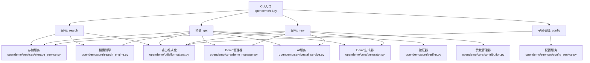
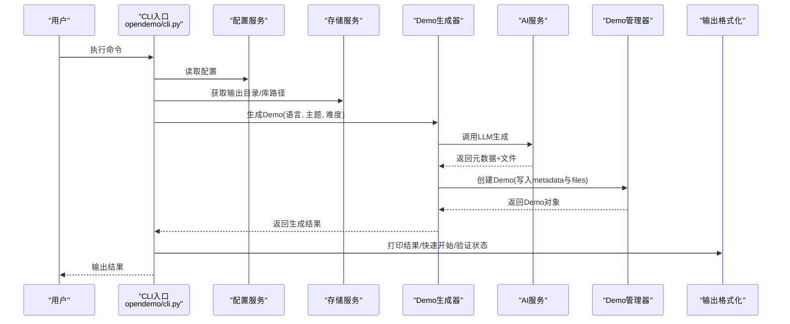
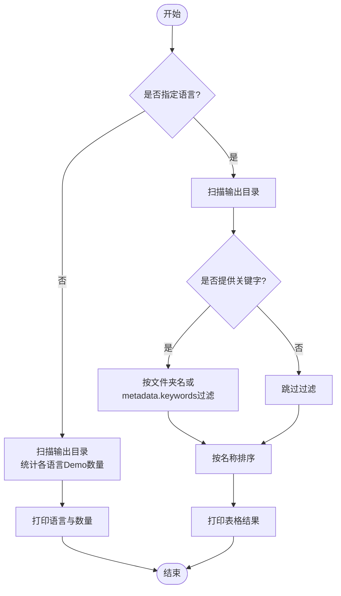
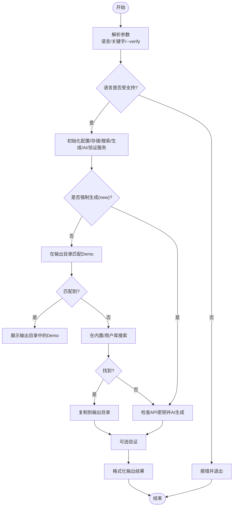
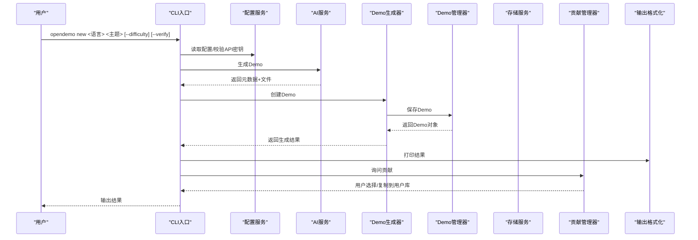
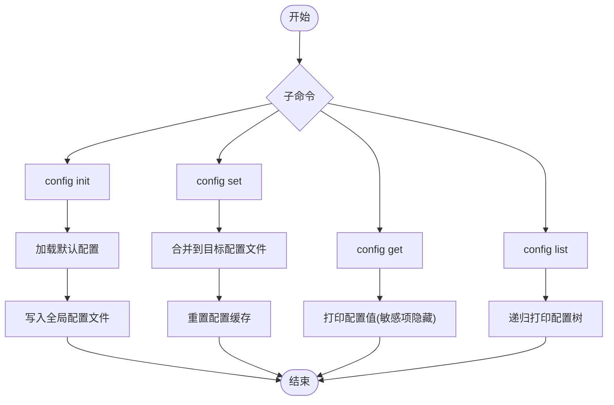
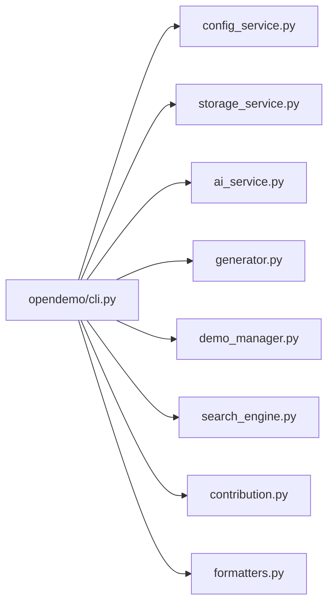

# CLI命令参考

<cite>
**本文引用的文件**
- [opendemo/cli.py](file://opendemo/cli.py)
- [ABOUT.md](file://ABOUT.md)
- [opendemo/core/demo_repository.py](file://opendemo/core/demo_repository.py)
- [opendemo/services/config_service.py](file://opendemo/services/config_service.py)
</cite>

## 目录
1. [简介](#简介)
2. [项目结构](#项目结构)
3. [核心组件](#核心组件)
4. [架构总览](#架构总览)
5. [详细组件分析](#详细组件分析)
6. [依赖关系分析](#依赖关系分析)
7. [性能考量](#性能考量)
8. [故障排查指南](#故障排查指南)
9. [结论](#结论)
10. [附录](#附录)

## 简介
本文件为 opendemo-cli 的 CLI 命令参考，围绕核心命令 search、get、new 和 config 展开，系统梳理参数、选项、标志与行为，并结合 ABOUT.md 中的实际使用示例，解释 get 命令的匹配优先级（精确匹配 > 语义匹配 > AI生成）与 new 命令的 AI生成流程。文档同时提供面向初学者的命令概览与面向开发者的命令解析与执行流程图示，便于快速上手与深入理解。

## 项目结构
opendemo-cli 的 CLI 入口位于 opendemo/cli.py，围绕该文件，命令解析与执行流程贯穿服务层（AI、配置、存储）、核心业务层（Demo管理、搜索、生成、贡献）与工具层（格式化输出、日志）。

图表来源
- [opendemo/cli.py](file://opendemo/cli.py#L1-L610)
- [opendemo/services/storage_service.py](file://opendemo/services/storage_service.py#L1-L277)
- [opendemo/core/search_engine.py](file://opendemo/core/search_engine.py#L1-L264)
- [opendemo/core/demo_manager.py](file://opendemo/core/demo_manager.py#L1-L328)
- [opendemo/services/ai_service.py](file://opendemo/services/ai_service.py#L1-L329)
- [opendemo/core/generator.py](file://opendemo/core/generator.py#L1-L135)
- [opendemo/core/contribution.py](file://opendemo/core/contribution.py#L1-L176)
- [opendemo/utils/formatters.py](file://opendemo/utils/formatters.py#L1-L188)

章节来源
- [opendemo/cli.py](file://opendemo/cli.py#L1-L610)

## 核心组件
- CLI 命令入口与分组：使用 Click 定义命令组与子命令，统一版本选项与日志初始化。
- 服务层：
  - 配置服务：加载/合并全局与项目配置，提供键值访问与持久化。
  - 存储服务：管理内置/用户库、输出目录、文件系统操作。
  - AI服务：封装 LLM API 调用、Prompt 构建、响应解析与重试策略。
- 核心业务层：
  - Demo管理器：加载/保存/复制Demo、生成目录名、更新元数据、列举文件。
  - 搜索引擎：按语言/关键字/难度过滤与评分排序。
  - 生成器：协调 AI 生成、补充元数据、创建Demo。
  - 贡献管理器：询问贡献、校验Demo、复制到用户库、生成贡献信息。
- 工具层：
  - 输出格式化：Rich 面板/表格/Markdown/进度提示。
  - 日志：统一日志初始化与异常记录。

章节来源
- [opendemo/cli.py](file://opendemo/cli.py#L1-L610)
- [opendemo/services/config_service.py](file://opendemo/services/config_service.py#L1-L280)
- [opendemo/services/storage_service.py](file://opendemo/services/storage_service.py#L1-L277)
- [opendemo/services/ai_service.py](file://opendemo/services/ai_service.py#L1-L329)
- [opendemo/core/demo_manager.py](file://opendemo/core/demo_manager.py#L1-L328)
- [opendemo/core/search_engine.py](file://opendemo/core/search_engine.py#L1-L264)
- [opendemo/core/generator.py](file://opendemo/core/generator.py#L1-L135)
- [opendemo/core/contribution.py](file://opendemo/core/contribution.py#L1-L176)
- [opendemo/utils/formatters.py](file://opendemo/utils/formatters.py#L1-L188)

## 架构总览
CLI 命令在入口处完成参数解析与服务初始化，随后根据命令职责调用相应服务与核心模块，最终通过格式化工具输出结果。AI生成流程由生成器协调 AI 服务完成，生成的 Demo 由 Demo 管理器落盘并可选地进行验证与贡献。

图表来源
- [opendemo/cli.py](file://opendemo/cli.py#L196-L324)
- [opendemo/core/generator.py](file://opendemo/core/generator.py#L31-L103)
- [opendemo/services/ai_service.py](file://opendemo/services/ai_service.py#L38-L86)
- [opendemo/core/demo_manager.py](file://opendemo/core/demo_manager.py#L132-L201)
- [opendemo/utils/formatters.py](file://opendemo/utils/formatters.py#L38-L81)

## 详细组件分析

### 命令：search
- 功能概述
  - 列出 opendemo_output/<语言>/ 下的 Demo，支持按关键字过滤；未指定语言时列出各语言的 Demo 数量。
- 参数与选项
  - 语言：可选，若省略则列出可用语言及对应数量。
  - 关键字：可变长，用于过滤输出目录中的 Demo。
- 执行流程
  - 若未指定语言：扫描输出目录，按语言统计数量并输出。
  - 指定语言：扫描输出目录，按名称排序，输出表格形式的搜索结果。
- 输出格式
  - 使用表格输出 Demo 列表，包含名称、语言、关键字、难度等字段。
- 关键实现要点
  - 语言支持白名单，非法语言会报错并提示支持列表。
  - 结果排序基于名称，过滤逻辑基于文件夹名或 metadata 中的关键字。

图表来源
- [opendemo/cli.py](file://opendemo/cli.py#L326-L384)

章节来源
- [opendemo/cli.py](file://opendemo/cli.py#L326-L384)
- [ABOUT.md](file://ABOUT.md#L121-L148)
- [USAGE_GUIDE.md](file://USAGE_GUIDE.md#L27-L55)

### 命令：get
- 功能概述
  - 优先在输出目录中查找匹配 Demo；若未找到或显式传入 new，则调用 AI 生成新 Demo。
- 匹配优先级
  1) 精确匹配：文件夹名与关键字完全一致；
  2) 语义匹配：文件夹名包含关键字或 metadata.keywords 包含关键字；
  3) AI生成：本地未找到时，使用 AI 生成（需配置 API 密钥）。
- 参数与选项
  - 语言：必填，支持白名单。
  - 关键字：可变长，至少一个；末尾附加 new 表示强制重新生成。
  - --verify：可选，启用自动验证。
- 执行流程
  - 语言校验与服务初始化；
  - 若非强制生成：先在输出目录匹配，命中则直接展示；否则在内置/用户库中搜索并复制到输出目录；
  - 若强制生成或未命中：检查 API 密钥，生成自定义文件夹名（带 -new 后缀），调用生成器生成 Demo；
  - 可选验证并通过格式化输出结果与快速开始步骤。
- 输出格式
  - 成功/警告/错误提示，以及 Demo 基本信息、文件列表、验证状态、快速开始步骤等。

图表来源
- [opendemo/cli.py](file://opendemo/cli.py#L196-L324)

章节来源
- [opendemo/cli.py](file://opendemo/cli.py#L196-L324)
- [ABOUT.md](file://ABOUT.md#L149-L188)
- [USAGE_GUIDE.md](file://USAGE_GUIDE.md#L56-L97)

### 命令：new
- 功能概述
  - 使用 AI 生成全新 Demo，支持指定难度级别；生成后可选验证，并可询问是否贡献到公共库。
- 参数与选项
  - 语言：必填，支持白名单。
  - 主题：可变长，至少一个。
  - --difficulty：可选，取值 beginner/intermediate/advanced，默认 beginner。
  - --verify：可选，启用自动验证。
- 执行流程
  - 语言校验与 API 密钥检查；
  - 初始化服务并生成 Demo；
  - 可选验证；
  - 格式化输出结果；
  - 询问贡献，若同意则复制到用户库并生成贡献信息。
- 输出格式
  - 成功/验证状态/文件列表/快速开始/贡献提示等。

图表来源
- [opendemo/cli.py](file://opendemo/cli.py#L386-L471)
- [opendemo/core/generator.py](file://opendemo/core/generator.py#L31-L103)
- [opendemo/services/ai_service.py](file://opendemo/services/ai_service.py#L38-L86)
- [opendemo/core/contribution.py](file://opendemo/core/contribution.py#L28-L47)

章节来源
- [opendemo/cli.py](file://opendemo/cli.py#L386-L471)
- [ABOUT.md](file://ABOUT.md#L189-L204)
- [USAGE_GUIDE.md](file://USAGE_GUIDE.md#L98-L106)

### 命令：config
- 子命令组：config
  - config init：初始化全局配置文件，可交互输入 API 密钥。
  - config set：设置配置项，支持布尔/整数类型自动转换，可选择作用域为全局或项目。
  - config get：获取配置项，敏感项（如 key/password）会隐藏部分内容。
  - config list：列出所有配置项。
- 执行流程
  - 初始化配置服务，按需加载全局/项目配置；
  - set/get/list 根据参数执行相应操作；
  - init 生成默认配置并写入全局配置文件。
- 输出格式
  - set 成功提示；
  - get 输出键值；
  - list 输出树形配置列表，敏感项隐藏。

图表来源
- [opendemo/cli.py](file://opendemo/cli.py#L473-L539)
- [opendemo/services/config_service.py](file://opendemo/services/config_service.py#L160-L203)
- [opendemo/utils/formatters.py](file://opendemo/utils/formatters.py#L131-L154)

章节来源
- [opendemo/cli.py](file://opendemo/cli.py#L473-L539)
- [opendemo/services/config_service.py](file://opendemo/services/config_service.py#L1-L280)
- [ABOUT.md](file://ABOUT.md#L204-L221)

## 依赖关系分析
- 命令层依赖
  - get/new/config 均依赖配置服务与存储服务；
  - get/new 依赖 AI 服务与生成器；
  - get 依赖搜索引擎与验证器；
  - new 依赖贡献管理器。
- 模块耦合
  - CLI 通过服务抽象解耦核心业务；
  - 格式化工具独立于业务逻辑，仅消费数据结构；
  - 配置服务提供统一键值访问，避免硬编码。
- 外部依赖
  - requests 用于调用 LLM API；
  - rich 用于终端输出美化；
  - yaml 用于配置文件读写。

图表来源
- [opendemo/cli.py](file://opendemo/cli.py#L1-L610)
- [opendemo/services/config_service.py](file://opendemo/services/config_service.py#L1-L280)
- [opendemo/services/storage_service.py](file://opendemo/services/storage_service.py#L1-L277)
- [opendemo/services/ai_service.py](file://opendemo/services/ai_service.py#L1-L329)
- [opendemo/core/generator.py](file://opendemo/core/generator.py#L1-L135)
- [opendemo/core/demo_manager.py](file://opendemo/core/demo_manager.py#L1-L328)
- [opendemo/core/search_engine.py](file://opendemo/core/search_engine.py#L1-L264)
- [opendemo/core/contribution.py](file://opendemo/core/contribution.py#L1-L176)
- [opendemo/utils/formatters.py](file://opendemo/utils/formatters.py#L1-L188)

章节来源
- [opendemo/cli.py](file://opendemo/cli.py#L1-L610)

## 性能考量
- 搜索与匹配
  - 输出目录扫描与过滤为 O(N) 遍历，N 为目录下 Demo 数量；建议合理组织输出目录层级以减少遍历成本。
  - 搜索引擎评分涉及多字段匹配，复杂度与关键字数量成正比；建议控制关键字数量与长度。
- AI 生成
  - API 调用具备重试机制与超时控制；合理设置温度、最大 token 等参数以平衡质量与速度。
- I/O 操作
  - 复制/保存 Demo 为文件系统操作，建议确保磁盘空间充足与权限正确。

## 故障排查指南
- 语言不受支持
  - 现象：提示不支持的语言并列出支持列表。
  - 处理：确认语言参数在白名单内。
- API 密钥未配置
  - 现象：new/get 强制生成时报错，提示配置密钥。
  - 处理：使用 config init 或 config set 设置 ai.api_key。
- 搜索结果为空
  - 现象：search 输出“未找到匹配的demo”。
  - 处理：确认输出目录存在且包含 metadata.json；尝试更宽泛的关键字。
- 验证失败
  - 现象：验证未通过或跳过。
  - 处理：查看详细错误信息，检查依赖安装、代码兼容性或禁用验证。
- 贡献流程
  - 现象：未触发贡献提示或贡献失败。
  - 处理：检查 contribution.auto_prompt 与 README/元数据完整性。

章节来源
- [opendemo/cli.py](file://opendemo/cli.py#L211-L216)
- [opendemo/cli.py](file://opendemo/cli.py#L283-L288)
- [opendemo/cli.py](file://opendemo/cli.py#L540-L557)
- [opendemo/core/contribution.py](file://opendemo/core/contribution.py#L28-L47)

## 结论
opendemo-cli 通过清晰的命令分层与服务抽象，实现了“本地优先 + AI 辅助”的 Demo 获取与生成能力。search 命令提供高效检索，get 命令在输出目录、内置/用户库与 AI 之间形成明确优先级，new 命令则完整串联了 AI 生成、验证与贡献流程。配合 config 子命令，用户可灵活管理配置与输出路径，满足不同使用场景。

## 附录
- 常用示例（摘自 ABOUT.md 与 USAGE_GUIDE.md）
  - 搜索：opendemo search python；opendemo search python async
  - 获取：opendemo get python logging；opendemo get python logging new
  - 新建：opendemo new python 装饰器；opendemo new python 设计模式 --difficulty intermediate
  - 配置：opendemo config list；opendemo config get ai.model；opendemo config set ai.api_key sk-xxx

章节来源
- [ABOUT.md](file://ABOUT.md#L110-L221)
- [USAGE_GUIDE.md](file://USAGE_GUIDE.md#L27-L127)