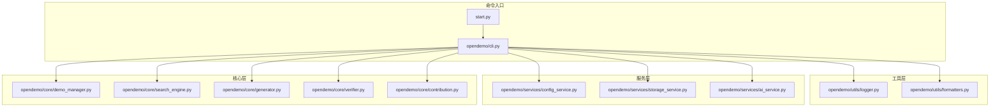
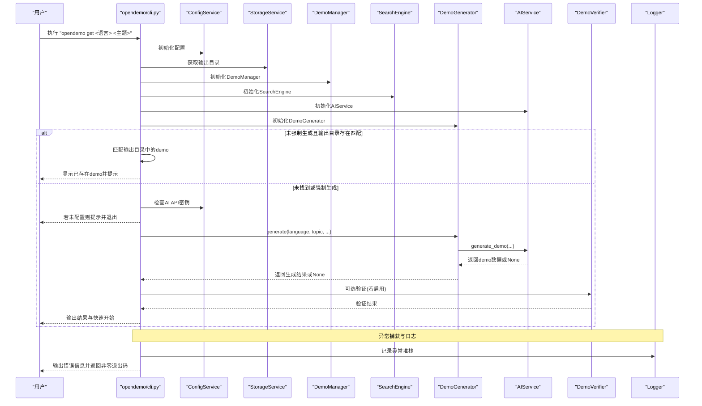
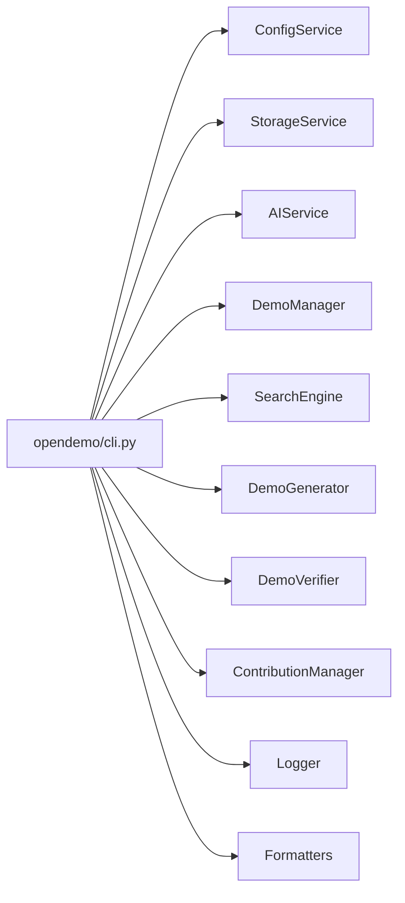

# CLI异常处理机制

<cite>
**本文引用的文件**
- [README.md](file://README.md)
- [start.py](file://start.py)
- [opendemo/cli.py](file://opendemo/cli.py)
- [opendemo/utils/logger.py](file://opendemo/utils/logger.py)
- [opendemo/utils/formatters.py](file://opendemo/utils/formatters.py)
- [opendemo/services/ai_service.py](file://opendemo/services/ai_service.py)
- [opendemo/services/config_service.py](file://opendemo/services/config_service.py)
- [opendemo/services/storage_service.py](file://opendemo/services/storage_service.py)
- [opendemo/core/demo_manager.py](file://opendemo/core/demo_manager.py)
- [opendemo/core/search_engine.py](file://opendemo/core/search_engine.py)
- [opendemo/core/generator.py](file://opendemo/core/generator.py)
- [opendemo/core/verifier.py](file://opendemo/core/verifier.py)
- [opendemo/core/contribution.py](file://opendemo/core/contribution.py)
- [pyproject.toml](file://pyproject.toml)
</cite>

## 目录
1. [引言](#引言)
2. [项目结构](#项目结构)
3. [核心组件](#核心组件)
4. [架构总览](#架构总览)
5. [详细组件分析](#详细组件分析)
6. [依赖关系分析](#依赖关系分析)
7. [性能与可靠性考量](#性能与可靠性考量)
8. [故障排查指南](#故障排查指南)
9. [结论](#结论)

## 引言
本文件聚焦于OpenDemo CLI的异常处理机制，系统梳理从命令入口到各服务层的错误捕获、降级与恢复策略，以及日志记录与用户反馈的统一规范。通过对CLI主程序、服务层、核心引擎与工具模块的逐层分析，帮助开发者理解在不同环节如何安全地处理异常，并在出现错误时提供清晰的提示与可操作的修复建议。

## 项目结构
OpenDemo CLI采用分层架构：命令入口负责参数解析与流程编排；服务层封装配置、存储、AI与验证等能力；核心层组织Demo生命周期与搜索匹配；工具层提供日志与输出格式化。异常处理贯穿各层，形成“显式校验+异常捕获+日志记录+用户提示”的闭环。

图表来源
- [opendemo/cli.py](file://opendemo/cli.py#L1-L610)
- [start.py](file://start.py#L1-L116)
- [opendemo/utils/logger.py](file://opendemo/utils/logger.py#L1-L65)
- [opendemo/utils/formatters.py](file://opendemo/utils/formatters.py#L1-L188)
- [opendemo/services/config_service.py](file://opendemo/services/config_service.py#L1-L280)
- [opendemo/services/storage_service.py](file://opendemo/services/storage_service.py#L1-L277)
- [opendemo/services/ai_service.py](file://opendemo/services/ai_service.py#L1-L329)
- [opendemo/core/demo_manager.py](file://opendemo/core/demo_manager.py#L1-L329)
- [opendemo/core/search_engine.py](file://opendemo/core/search_engine.py#L1-L264)
- [opendemo/core/generator.py](file://opendemo/core/generator.py#L1-L135)
- [opendemo/core/verifier.py](file://opendemo/core/verifier.py#L1-L270)
- [opendemo/core/contribution.py](file://opendemo/core/contribution.py#L1-L176)

章节来源
- [README.md](file://README.md#L62-L110)
- [pyproject.toml](file://pyproject.toml#L53-L55)

## 核心组件
- 命令入口与流程编排：在命令入口集中捕获键盘中断与未处理异常，统一输出错误信息并记录日志，保证CLI退出码合理。
- 日志系统：统一初始化日志器，同时输出到控制台与滚动文件，便于定位问题。
- 配置服务：提供配置加载、合并、校验与保存，异常时记录错误并返回默认值或空值，避免崩溃。
- 存储服务：封装文件系统操作，对读写、复制、删除等操作进行异常捕获与日志记录。
- AI服务：对外部API调用进行重试、超时与解析异常处理，失败时返回None并记录日志。
- 核心引擎：Demo管理、搜索、生成、验证、贡献流程均在关键节点进行异常捕获与降级处理。
- 输出格式化：统一错误、警告、信息、成功等消息样式，提升用户体验。

章节来源
- [opendemo/cli.py](file://opendemo/cli.py#L594-L610)
- [opendemo/utils/logger.py](file://opendemo/utils/logger.py#L13-L65)
- [opendemo/services/config_service.py](file://opendemo/services/config_service.py#L76-L107)
- [opendemo/services/storage_service.py](file://opendemo/services/storage_service.py#L130-L166)
- [opendemo/services/ai_service.py](file://opendemo/services/ai_service.py#L68-L86)
- [opendemo/core/demo_manager.py](file://opendemo/core/demo_manager.py#L230-L251)
- [opendemo/utils/formatters.py](file://opendemo/utils/formatters.py#L18-L81)

## 架构总览
下面的序列图展示了CLI主流程在“获取demo”命令中的异常处理路径：从命令入口到服务层、核心引擎，再到验证与输出，每个环节都具备明确的错误捕获与降级策略。

图表来源
- [opendemo/cli.py](file://opendemo/cli.py#L196-L324)
- [opendemo/services/config_service.py](file://opendemo/services/config_service.py#L243-L280)
- [opendemo/services/ai_service.py](file://opendemo/services/ai_service.py#L38-L86)
- [opendemo/core/generator.py](file://opendemo/core/generator.py#L31-L103)
- [opendemo/core/verifier.py](file://opendemo/core/verifier.py#L31-L60)
- [opendemo/utils/logger.py](file://opendemo/utils/logger.py#L13-L65)

## 详细组件分析

### 命令入口与全局异常处理
- 键盘中断：捕获键盘中断并优雅退出，返回0退出码，避免产生错误信号。
- 未处理异常：捕获通用异常，输出错误信息，记录异常堆栈，返回非零退出码，确保外部脚本可感知失败。
- 日志初始化：在命令入口处初始化日志器，确保后续组件可直接获取日志器记录事件。

章节来源
- [opendemo/cli.py](file://opendemo/cli.py#L594-L610)
- [opendemo/cli.py](file://opendemo/cli.py#L32-L40)

### 配置服务异常处理
- 配置加载：加载全局与项目配置时，对文件读取异常进行捕获并记录错误，返回空字典，避免影响主流程。
- 配置合并：递归合并嵌套字典，避免类型不匹配导致崩溃。
- 配置校验：对AI密钥、输出目录、验证超时等关键配置进行有效性检查，返回错误列表供上层处理。
- 配置保存：保存YAML时捕获异常并抛出，上层可据此决定是否回滚或提示用户。

章节来源
- [opendemo/services/config_service.py](file://opendemo/services/config_service.py#L108-L146)
- [opendemo/services/config_service.py](file://opendemo/services/config_service.py#L147-L169)
- [opendemo/services/config_service.py](file://opendemo/services/config_service.py#L204-L219)
- [opendemo/services/config_service.py](file://opendemo/services/config_service.py#L243-L280)

### 存储服务异常处理
- 文件系统操作：读取、写入、复制、删除、创建目录等均进行异常捕获，记录错误并返回布尔值或None，避免中断主流程。
- 输出目录：确保输出目录存在，失败时记录错误并返回None，上层根据返回值决定是否终止。

章节来源
- [opendemo/services/storage_service.py](file://opendemo/services/storage_service.py#L224-L240)
- [opendemo/services/storage_service.py](file://opendemo/services/storage_service.py#L241-L260)
- [opendemo/services/storage_service.py](file://opendemo/services/storage_service.py#L167-L189)
- [opendemo/services/storage_service.py](file://opendemo/services/storage_service.py#L190-L212)
- [opendemo/services/storage_service.py](file://opendemo/services/storage_service.py#L213-L223)

### AI服务异常处理
- API调用：对外部API进行重试（次数与间隔由配置控制），每次失败记录错误日志并在最后一次失败后返回None。
- 响应解析：对JSON解析异常进行捕获与调试日志记录，避免因LLM输出格式不稳定导致崩溃。
- 密钥校验：提供API密钥有效性验证方法，失败时返回False并记录错误。

章节来源
- [opendemo/services/ai_service.py](file://opendemo/services/ai_service.py#L68-L86)
- [opendemo/services/ai_service.py](file://opendemo/services/ai_service.py#L243-L291)
- [opendemo/services/ai_service.py](file://opendemo/services/ai_service.py#L292-L329)

### Demo管理器异常处理
- 元数据加载：加载metadata.json失败时返回None，上层根据返回值决定是否终止。
- 元数据更新：更新metadata时捕获异常并记录错误，返回False，避免损坏文件。
- 文件遍历：遍历demo文件时跳过隐藏文件与缓存目录，减少异常风险。

章节来源
- [opendemo/core/demo_manager.py](file://opendemo/core/demo_manager.py#L87-L110)
- [opendemo/core/demo_manager.py](file://opendemo/core/demo_manager.py#L230-L251)
- [opendemo/core/demo_manager.py](file://opendemo/core/demo_manager.py#L273-L302)

### 搜索引擎异常处理
- 空库处理：当demo库为空时直接返回空列表，避免后续计算。
- 匹配评分：关键字匹配失败时返回0分，确保不纳入结果。
- 统计与查询：统计信息聚合过程中对缺失字段进行安全访问，避免KeyError。

章节来源
- [opendemo/core/search_engine.py](file://opendemo/core/search_engine.py#L45-L66)
- [opendemo/core/search_engine.py](file://opendemo/core/search_engine.py#L67-L129)
- [opendemo/core/search_engine.py](file://opendemo/core/search_engine.py#L226-L264)

### 生成器异常处理
- AI生成失败：当AI返回None时，记录错误并返回None，上层据此提示失败。
- Demo保存失败：保存demo失败时记录错误并返回None，上层提示失败并建议检查权限与磁盘空间。

章节来源
- [opendemo/core/generator.py](file://opendemo/core/generator.py#L52-L103)

### 验证器异常处理
- 验证关闭：当配置禁用验证时，返回跳过状态，避免执行耗时验证。
- Python验证：创建虚拟环境、安装依赖、执行脚本等步骤均捕获异常，记录错误并返回包含错误列表的结果。
- 超时处理：对子进程超时进行专门捕获，返回超时错误信息。

章节来源
- [opendemo/core/verifier.py](file://opendemo/core/verifier.py#L42-L60)
- [opendemo/core/verifier.py](file://opendemo/core/verifier.py#L120-L129)
- [opendemo/core/verifier.py](file://opendemo/core/verifier.py#L198-L203)

### 贡献管理器异常处理
- 交互提示：用户输入异常时记录错误并返回False，避免阻塞流程。
- 贡献验证：对必需文件、代码目录与README长度进行检查，失败时返回错误列表。
- 复制到用户库：复制失败时返回None，上层提示失败原因。

章节来源
- [opendemo/core/contribution.py](file://opendemo/core/contribution.py#L28-L47)
- [opendemo/core/contribution.py](file://opendemo/core/contribution.py#L48-L83)
- [opendemo/core/contribution.py](file://opendemo/core/contribution.py#L120-L147)

### 日志系统与输出格式化
- 日志初始化：避免重复添加处理器，控制台与文件处理器分别输出，文件使用滚动策略。
- 输出格式化：统一错误、警告、信息、成功消息样式，便于用户识别状态。

章节来源
- [opendemo/utils/logger.py](file://opendemo/utils/logger.py#L13-L65)
- [opendemo/utils/formatters.py](file://opendemo/utils/formatters.py#L18-L81)

## 依赖关系分析
- CLI主程序依赖配置、存储、AI、Demo管理、搜索、生成、验证与贡献模块，形成清晰的控制流。
- 服务层与核心层之间通过接口解耦，异常在边界被捕获并向上层传递。
- 工具层提供日志与输出格式化，不引入业务逻辑，降低耦合度。

图表来源
- [opendemo/cli.py](file://opendemo/cli.py#L13-L27)
- [opendemo/cli.py](file://opendemo/cli.py#L196-L324)

章节来源
- [opendemo/cli.py](file://opendemo/cli.py#L13-L27)

## 性能与可靠性考量
- 重试与超时：AI服务对API调用进行重试与超时控制，避免瞬时网络波动导致失败。
- 验证策略：验证可配置开关与超时，避免在CI或离线环境下阻塞。
- 日志滚动：文件日志采用滚动策略，防止日志过大影响性能。
- 缓存与懒加载：Demo管理器对元数据进行缓存，减少重复IO。

章节来源
- [opendemo/services/ai_service.py](file://opendemo/services/ai_service.py#L68-L86)
- [opendemo/core/verifier.py](file://opendemo/core/verifier.py#L42-L60)
- [opendemo/utils/logger.py](file://opendemo/utils/logger.py#L49-L58)
- [opendemo/core/demo_manager.py](file://opendemo/core/demo_manager.py#L87-L110)

## 故障排查指南
- 无法连接AI服务
  - 现象：生成失败或返回None。
  - 排查：确认AI API密钥已配置；检查网络连通性；查看日志文件定位具体错误。
  - 参考路径
    - [opendemo/services/ai_service.py](file://opendemo/services/ai_service.py#L55-L86)
    - [opendemo/services/config_service.py](file://opendemo/services/config_service.py#L243-L280)
- 配置文件读取失败
  - 现象：配置加载异常或返回空字典。
  - 排查：检查YAML语法与权限；查看日志错误信息；尝试重建配置。
  - 参考路径
    - [opendemo/services/config_service.py](file://opendemo/services/config_service.py#L108-L146)
- 输出目录不可写
  - 现象：保存或复制失败。
  - 排查：检查输出目录权限与磁盘空间；确认路径存在。
  - 参考路径
    - [opendemo/services/storage_service.py](file://opendemo/services/storage_service.py#L130-L166)
    - [opendemo/services/storage_service.py](file://opendemo/services/storage_service.py#L167-L189)
- 验证失败
  - 现象：验证返回错误列表或超时。
  - 排查：检查依赖安装、Python版本与超时设置；查看验证报告。
  - 参考路径
    - [opendemo/core/verifier.py](file://opendemo/core/verifier.py#L120-L129)
    - [opendemo/core/verifier.py](file://opendemo/core/verifier.py#L198-L203)
- 贡献流程异常
  - 现象：贡献提示失败或复制到用户库失败。
  - 排查：确认必需文件与README内容；检查用户库路径权限。
  - 参考路径
    - [opendemo/core/contribution.py](file://opendemo/core/contribution.py#L28-L47)
    - [opendemo/core/contribution.py](file://opendemo/core/contribution.py#L120-L147)

## 结论
OpenDemo CLI的异常处理机制遵循“显式校验+异常捕获+日志记录+用户提示”的设计原则。命令入口统一捕获未处理异常与键盘中断，服务层与核心层在关键操作处进行异常捕获与降级，日志系统提供可追溯的审计线索，输出格式化确保用户获得清晰的状态反馈。通过配置化重试、超时与验证策略，系统在复杂环境中仍能保持稳健与可用。