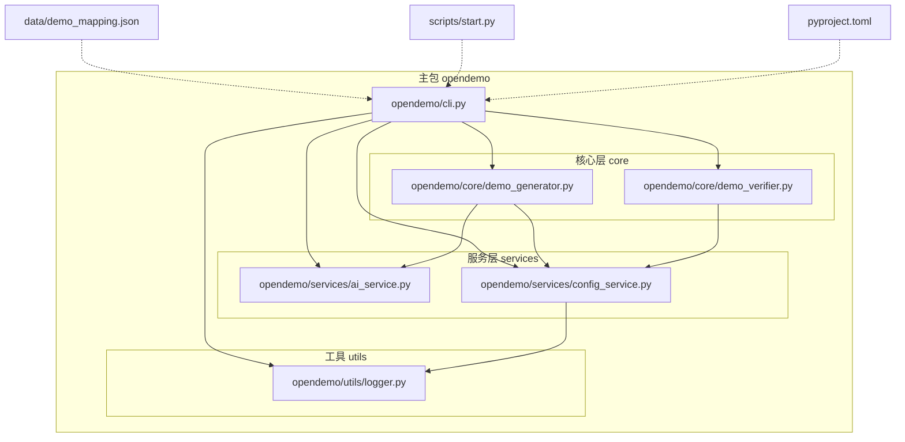
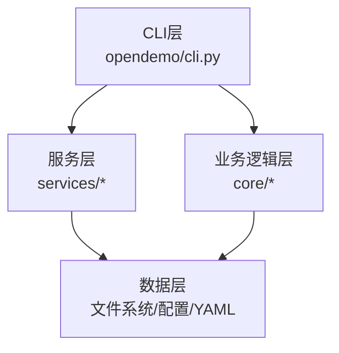
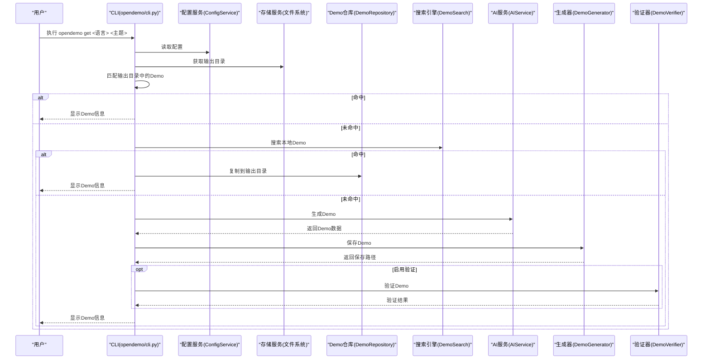
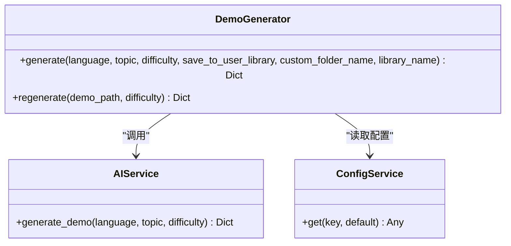
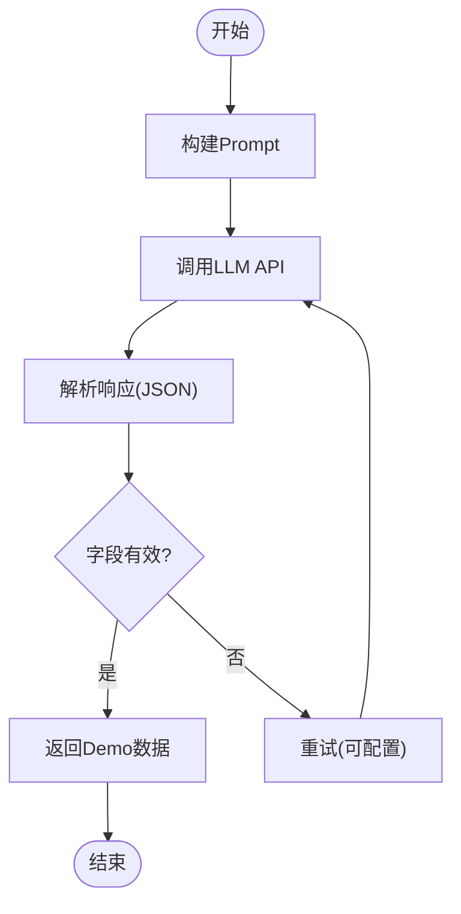
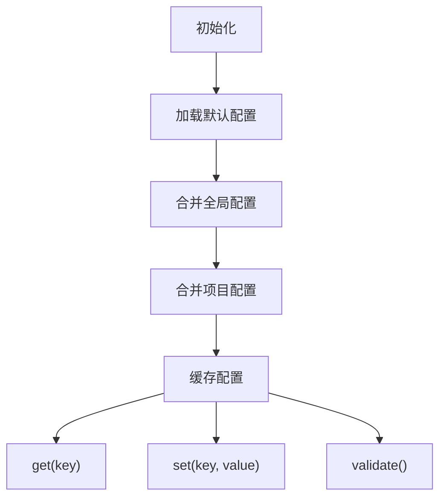
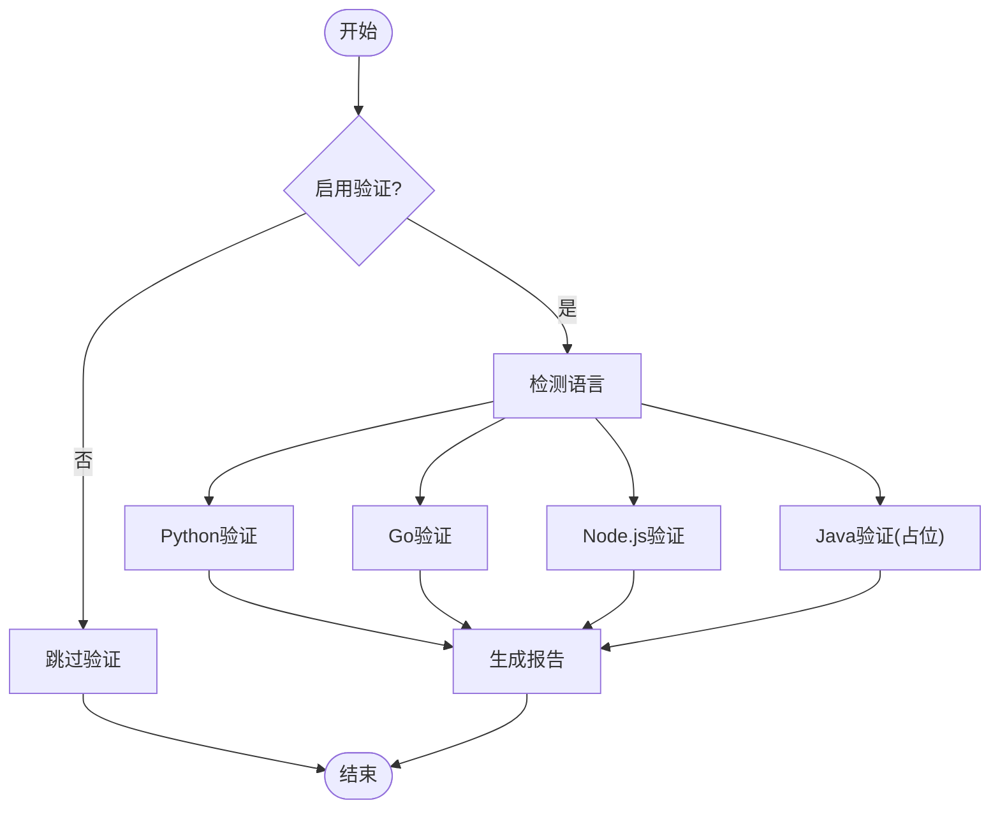
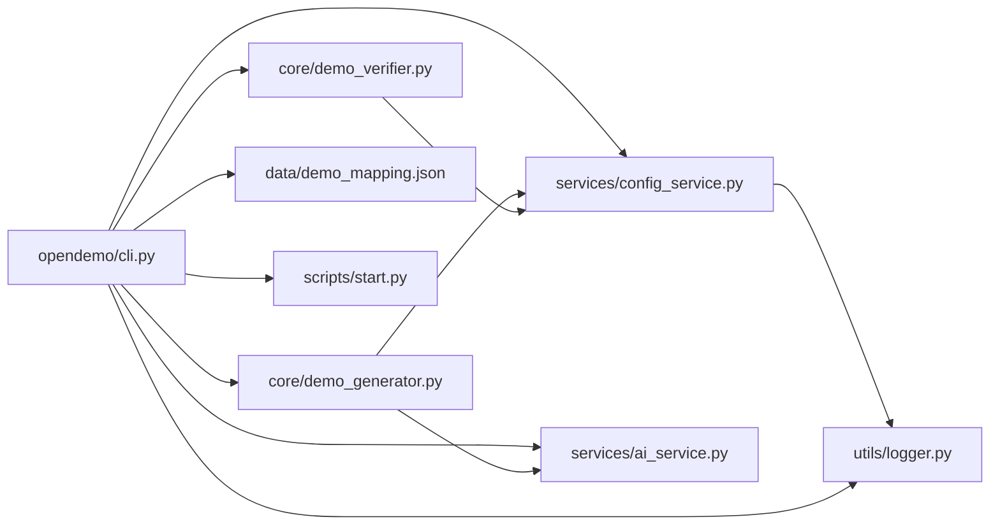

# Demo仓库重构

<cite>
**本文引用的文件**
- [README.md](file://README.md)
- [ABOUT.md](file://ABOUT.md)
- [pyproject.toml](file://pyproject.toml)
- [opendemo/cli.py](file://opendemo/cli.py)
- [opendemo/core/demo_generator.py](file://opendemo/core/demo_generator.py)
- [opendemo/services/ai_service.py](file://opendemo/services/ai_service.py)
- [opendemo/services/config_service.py](file://opendemo/services/config_service.py)
- [opendemo/core/demo_verifier.py](file://opendemo/core/demo_verifier.py)
- [opendemo/utils/logger.py](file://opendemo/utils/logger.py)
- [scripts/start.py](file://scripts/start.py)
- [data/demo_mapping.json](file://data/demo_mapping.json)
- [tests/test_config_service.py](file://tests/test_config_service.py)
- [tests/test_demo_manager.py](file://tests/test_demo_manager.py)
</cite>

## 目录
1. [引言](#引言)
2. [项目结构](#项目结构)
3. [核心组件](#核心组件)
4. [架构总览](#架构总览)
5. [详细组件分析](#详细组件分析)
6. [依赖关系分析](#依赖关系分析)
7. [性能考量](#性能考量)
8. [故障排查指南](#故障排查指南)
9. [结论](#结论)
10. [附录](#附录)

## 引言
本项目是一个智能化的编程学习辅助CLI工具，旨在帮助开发者快速获取高质量、可执行的编程语言Demo代码。它支持在本地Demo库中搜索与匹配，也支持在未找到时通过AI生成Demo，并可选地对生成的Demo进行可执行性验证。项目提供多语言支持（Python、Go、Node.js），并具备交互式启动脚本与完善的配置管理。

## 项目结构
项目采用分层清晰的包结构，围绕CLI入口、核心业务逻辑、服务层与工具模块组织，同时包含数据映射文件与批量生成脚本。

图表来源
- [opendemo/cli.py](file://opendemo/cli.py#L1-L766)
- [opendemo/core/demo_generator.py](file://opendemo/core/demo_generator.py#L1-L137)
- [opendemo/core/demo_verifier.py](file://opendemo/core/demo_verifier.py#L1-L515)
- [opendemo/services/ai_service.py](file://opendemo/services/ai_service.py#L1-L551)
- [opendemo/services/config_service.py](file://opendemo/services/config_service.py#L1-L280)
- [opendemo/utils/logger.py](file://opendemo/utils/logger.py#L1-L65)
- [data/demo_mapping.json](file://data/demo_mapping.json#L1-L1043)
- [scripts/start.py](file://scripts/start.py#L1-L116)
- [pyproject.toml](file://pyproject.toml#L1-L84)

章节来源
- [README.md](file://README.md#L96-L141)
- [ABOUT.md](file://ABOUT.md#L313-L340)

## 核心组件
- CLI层：提供命令入口与交互，负责解析命令、组织业务流程、调用服务层与核心模块，并输出结果。
- 核心业务层：封装Demo生成、验证、匹配与复制等核心逻辑。
- 服务层：封装配置、AI与存储相关的通用服务。
- 工具模块：提供日志、格式化输出等通用能力。

章节来源
- [opendemo/cli.py](file://opendemo/cli.py#L1-L766)
- [opendemo/core/demo_generator.py](file://opendemo/core/demo_generator.py#L1-L137)
- [opendemo/core/demo_verifier.py](file://opendemo/core/demo_verifier.py#L1-L515)
- [opendemo/services/ai_service.py](file://opendemo/services/ai_service.py#L1-L551)
- [opendemo/services/config_service.py](file://opendemo/services/config_service.py#L1-L280)
- [opendemo/utils/logger.py](file://opendemo/utils/logger.py#L1-L65)

## 架构总览
系统采用“CLI层 → 业务逻辑层 → 服务层 → 数据层”的分层架构，CLI负责命令解析与流程编排，业务层封装领域逻辑，服务层提供跨模块共享能力，数据层通过文件系统承载Demo库与配置。

图表来源
- [opendemo/cli.py](file://opendemo/cli.py#L1-L766)
- [opendemo/services/config_service.py](file://opendemo/services/config_service.py#L1-L280)
- [opendemo/services/ai_service.py](file://opendemo/services/ai_service.py#L1-L551)
- [opendemo/core/demo_generator.py](file://opendemo/core/demo_generator.py#L1-L137)
- [opendemo/core/demo_verifier.py](file://opendemo/core/demo_verifier.py#L1-L515)

## 详细组件分析

### CLI命令与流程
- get命令：优先在输出目录匹配，其次在本地库搜索，最后通过AI生成；支持强制重新生成与可选验证。
- search命令：列出支持语言与对应Demo数量，支持按关键字过滤。
- new命令：创建新Demo，支持难度级别与可选验证；支持库Demo识别与贡献流程。
- config子命令：初始化、设置、获取与列出配置项。

图表来源
- [opendemo/cli.py](file://opendemo/cli.py#L316-L463)
- [opendemo/services/config_service.py](file://opendemo/services/config_service.py#L1-L280)
- [opendemo/services/ai_service.py](file://opendemo/services/ai_service.py#L1-L551)
- [opendemo/core/demo_generator.py](file://opendemo/core/demo_generator.py#L1-L137)
- [opendemo/core/demo_verifier.py](file://opendemo/core/demo_verifier.py#L1-L515)

章节来源
- [opendemo/cli.py](file://opendemo/cli.py#L316-L463)
- [opendemo/cli.py](file://opendemo/cli.py#L465-L523)
- [opendemo/cli.py](file://opendemo/cli.py#L525-L627)
- [opendemo/cli.py](file://opendemo/cli.py#L629-L713)

### Demo生成器
- 职责：协调AI生成Demo，补充元数据并保存到仓库。
- 关键流程：调用AI服务生成Demo数据 → 补充作者、时间戳、版本等元数据 → 创建Demo并返回结果。

图表来源
- [opendemo/core/demo_generator.py](file://opendemo/core/demo_generator.py#L1-L137)
- [opendemo/services/ai_service.py](file://opendemo/services/ai_service.py#L1-L551)
- [opendemo/services/config_service.py](file://opendemo/services/config_service.py#L1-L280)

章节来源
- [opendemo/core/demo_generator.py](file://opendemo/core/demo_generator.py#L1-L137)

### AI服务
- 职责：与LLM API交互，构建Prompt，解析响应，提供关键字分类与API密钥校验。
- 关键流程：构建Prompt → 调用API → 解析JSON响应 → 分类关键字（AI或启发式）。

图表来源
- [opendemo/services/ai_service.py](file://opendemo/services/ai_service.py#L1-L551)

章节来源
- [opendemo/services/ai_service.py](file://opendemo/services/ai_service.py#L1-L551)

### 配置服务
- 职责：加载与合并全局与项目配置，提供键值访问与保存能力；初始化配置文件。
- 关键流程：加载默认配置 → 合并全局配置 → 合并项目配置 → 提供get/set/get_all/validate。

图表来源
- [opendemo/services/config_service.py](file://opendemo/services/config_service.py#L1-L280)

章节来源
- [opendemo/services/config_service.py](file://opendemo/services/config_service.py#L1-L280)

### Demo验证器
- 职责：根据语言执行可执行性验证，支持Python、Go、Node.js；Java验证为占位。
- 关键流程：按语言分支 → 创建临时目录 → 复制Demo → 安装依赖 → 执行代码 → 汇总结果。

图表来源
- [opendemo/core/demo_verifier.py](file://opendemo/core/demo_verifier.py#L1-L515)

章节来源
- [opendemo/core/demo_verifier.py](file://opendemo/core/demo_verifier.py#L1-L515)

### 日志工具
- 职责：统一日志初始化与获取，支持控制台与文件输出（轮转）。
- 关键流程：setup_logger → 创建formatter → 添加console handler → 可选添加file handler → get_logger。

章节来源
- [opendemo/utils/logger.py](file://opendemo/utils/logger.py#L1-L65)

### 交互式启动脚本
- 职责：提供菜单式交互，便于未安装或初次使用的用户快速上手。
- 关键流程：检查安装状态 → 显示菜单 → 调用CLI命令 → 处理异常。

章节来源
- [scripts/start.py](file://scripts/start.py#L1-L116)

## 依赖关系分析
- CLI依赖服务层与核心模块，形成清晰的调用链。
- 生成器依赖AI服务与配置服务，验证器依赖配置服务。
- 配置服务依赖YAML与文件系统，日志工具依赖logging与文件系统。
- 数据映射文件为CLI与搜索提供索引信息。

图表来源
- [opendemo/cli.py](file://opendemo/cli.py#L1-L766)
- [opendemo/services/config_service.py](file://opendemo/services/config_service.py#L1-L280)
- [opendemo/services/ai_service.py](file://opendemo/services/ai_service.py#L1-L551)
- [opendemo/core/demo_generator.py](file://opendemo/core/demo_generator.py#L1-L137)
- [opendemo/core/demo_verifier.py](file://opendemo/core/demo_verifier.py#L1-L515)
- [opendemo/utils/logger.py](file://opendemo/utils/logger.py#L1-L65)
- [data/demo_mapping.json](file://data/demo_mapping.json#L1-L1043)
- [scripts/start.py](file://scripts/start.py#L1-L116)

章节来源
- [pyproject.toml](file://pyproject.toml#L30-L67)

## 性能考量
- 生成流程：AI调用与重试次数、超时时间、解析响应的健壮性直接影响整体性能与稳定性。
- 验证流程：各语言验证步骤的顺序与超时设置影响验证耗时；Python依赖安装与Go依赖tidy可能成为瓶颈。
- 日志与文件系统：日志轮转与频繁I/O操作需关注磁盘空间与吞吐。
- 建议优化方向：
  - 合理设置AI重试次数与间隔，避免阻塞。
  - 对Go依赖安装与Python依赖安装增加进度提示与超时保护。
  - 对CLI输出进行分页与缓存，减少重复扫描。

[本节为通用指导，不直接分析具体文件]

## 故障排查指南
- 配置问题
  - AI API密钥未配置：在CLI中提示并引导设置；可通过config子命令初始化与设置。
  - 验证未启用：验证器会返回跳过状态；可在配置中开启或在命令行加--verify。
- 生成失败
  - AI响应解析失败：检查响应格式与JSON有效性；必要时降低温度或调整提示。
  - 生成后未保存：检查输出目录权限与路径。
- 验证失败
  - Python：确认虚拟环境创建与依赖安装成功；检查超时设置。
  - Go：确认go命令可用与go.mod存在；检查构建与运行步骤。
  - Node.js：确认node命令可用与package.json存在；检查主文件或npm start。
- 日志定位
  - 日志文件位于用户目录下的logs目录；可查看详细错误堆栈。

章节来源
- [opendemo/services/config_service.py](file://opendemo/services/config_service.py#L243-L280)
- [opendemo/core/demo_verifier.py](file://opendemo/core/demo_verifier.py#L1-L515)
- [opendemo/utils/logger.py](file://opendemo/utils/logger.py#L1-L65)

## 结论
该仓库通过清晰的分层设计与模块化组件，实现了从CLI到业务再到服务与数据的完整闭环。其核心优势在于：
- 以CLI为中心的命令体系与交互体验；
- 以AI驱动的Demo生成与可选验证；
- 可扩展的配置与日志体系；
- 便于维护与测试的模块边界。

建议后续在验证器完善（Java）、生成Prompt优化、以及测试覆盖率提升方面持续改进。

[本节为总结性内容，不直接分析具体文件]

## 附录

### 命令参考
- get：获取Demo，支持强制重新生成与验证。
- search：列出语言与Demo，支持关键字过滤。
- new：创建新Demo，支持难度与验证。
- config：初始化、设置、获取与列出配置。

章节来源
- [opendemo/cli.py](file://opendemo/cli.py#L316-L463)
- [opendemo/cli.py](file://opendemo/cli.py#L465-L523)
- [opendemo/cli.py](file://opendemo/cli.py#L525-L627)
- [opendemo/cli.py](file://opendemo/cli.py#L629-L713)

### 配置项说明
- 输出目录、用户Demo库、默认语言、验证开关与方法、AI相关参数、贡献相关参数、显示参数等。

章节来源
- [opendemo/services/config_service.py](file://opendemo/services/config_service.py#L16-L49)
- [ABOUT.md](file://ABOUT.md#L287-L310)

### 测试要点
- 配置服务：键值访问、嵌套合并、默认值与验证。
- Demo仓库：安全命名生成、文件描述、缓存与加载。

章节来源
- [tests/test_config_service.py](file://tests/test_config_service.py#L1-L119)
- [tests/test_demo_manager.py](file://tests/test_demo_manager.py#L1-L184)