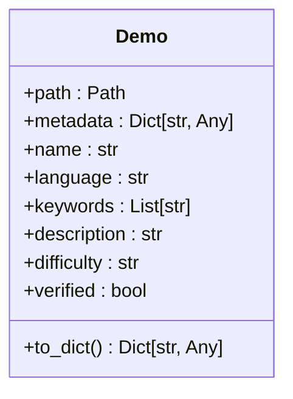
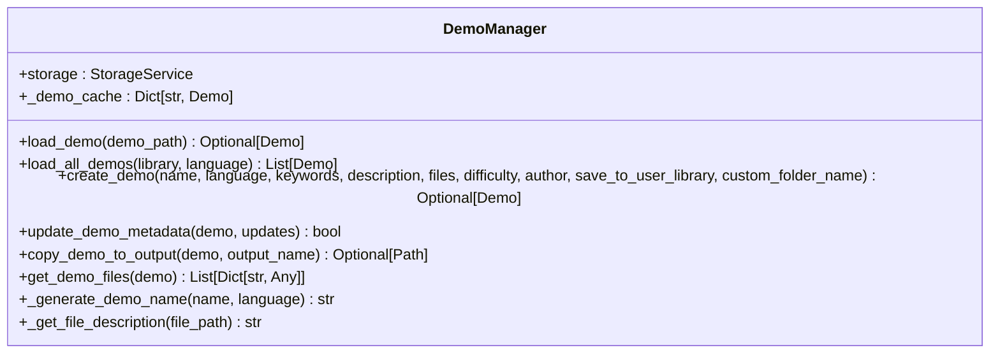
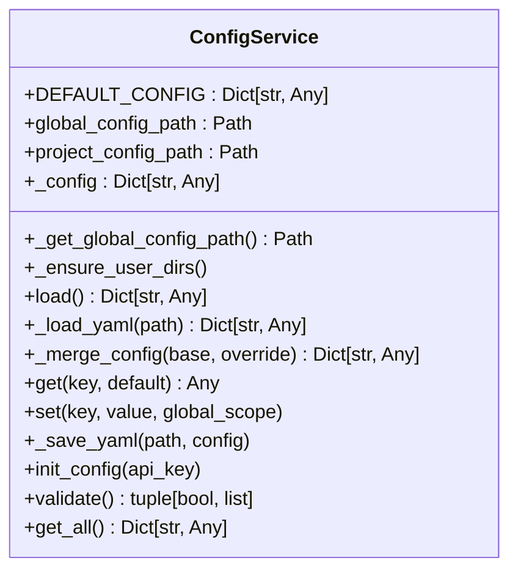
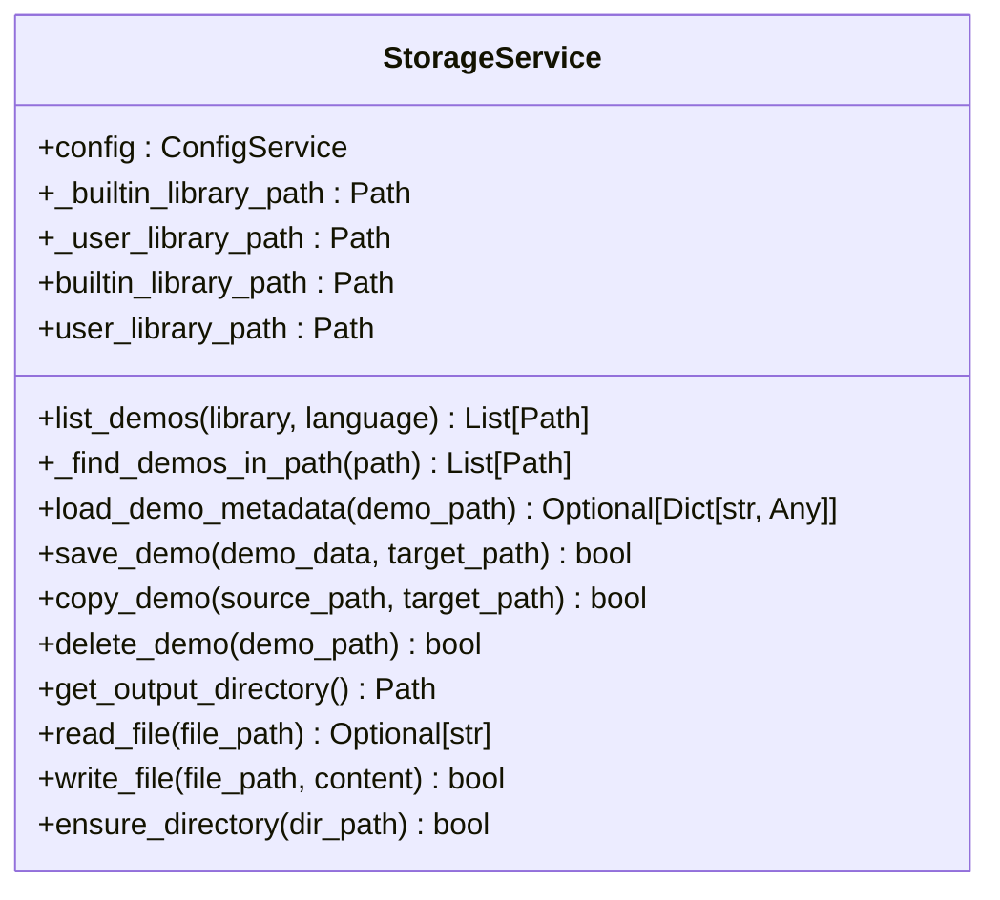
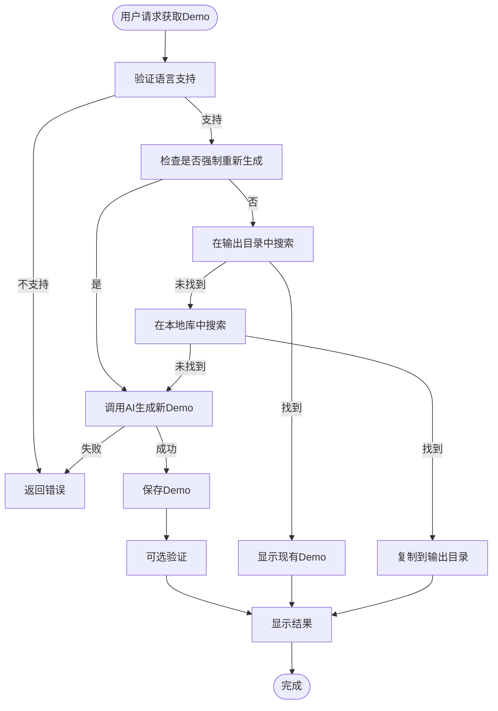
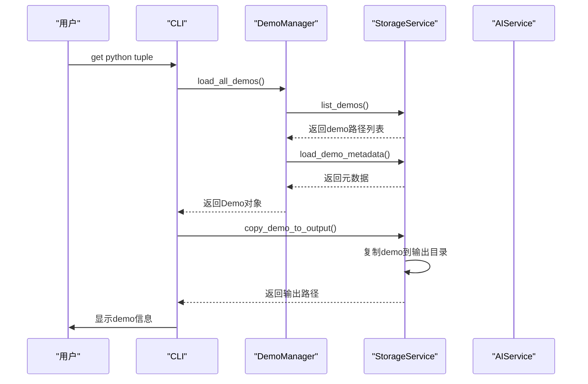

# Demo导出目录结构

<cite>
**本文档引用的文件**  
- [README.md](file://README.md)
- [start.py](file://start.py)
- [cli.py](file://opendemo/cli.py)
- [demo_manager.py](file://opendemo/core/demo_manager.py)
- [generator.py](file://opendemo/core/generator.py)
- [storage_service.py](file://opendemo/services/storage_service.py)
- [config_service.py](file://opendemo/services/config_service.py)
- [logger.py](file://opendemo/utils/logger.py)
- [python-tuple-basics/metadata.json](file://opendemo/builtin_demos/python/python-tuple-basics/metadata.json)
- [python-tuple-basics/README.md](file://opendemo/builtin_demos/python/python-tuple-basics/README.md)
- [python-tuple-basics/code/tuple_basics.py](file://opendemo/builtin_demos/python/python-tuple-basics/code/tuple_basics.py)
- [python-tuple-basics/requirements.txt](file://opendemo/builtin_demos/python/python-tuple-basics/requirements.txt)
- [async-programming/metadata.json](file://opendemo_output/python/async-programming/metadata.json)
</cite>

## 目录

1. [简介](#简介)
2. [项目结构概览](#项目结构概览)
3. [Demo导出目录结构](#demo导出目录结构)
4. [核心组件分析](#核心组件分析)
5. [配置与存储机制](#配置与存储机制)
6. [Demo生成与管理流程](#demo生成与管理流程)
7. [实际输出示例](#实际输出示例)
8. [总结](#总结)

## 简介

Open Demo CLI 是一个智能化的编程学习辅助命令行工具，旨在帮助开发者快速获取高质量、可执行的编程语言示例代码。该工具支持通过简单命令获取特定编程语言和主题的完整示例代码，当本地库中未找到匹配的demo时，可自动调用AI生成高质量代码。本项目的核心功能包括快速获取Demo、AI智能生成、可选验证、智能搜索和社区贡献。

**本节来源**  
- [README.md](file://README.md#L1-L145)

## 项目结构概览

该项目采用模块化设计，主要分为以下几个核心部分：

```
opendemo/
├── opendemo/              # 主包
│   ├── __init__.py
│   ├── cli.py             # CLI入口
│   ├── core/              # 核心业务逻辑
│   │   ├── demo_manager.py
│   │   ├── search_engine.py
│   │   ├── generator.py
│   │   └── verifier.py
│   ├── services/          # 服务层
│   │   ├── ai_service.py
│   │   ├── config_service.py
│   │   └── storage_service.py
│   ├── utils/             # 工具函数
│   │   ├── logger.py
│   │   └── formatters.py
│   └── builtin_demos/     # 内置demo库
│       ├── python/
│       └── java/
├── tests/                 # 测试文件
├── pyproject.toml         # 项目配置
└── README.md              # 说明文档
```

这种结构清晰地分离了不同职责的组件，便于维护和扩展。

**本节来源**  
- [README.md](file://README.md#L62-L86)

## Demo导出目录结构

Open Demo CLI 工具在执行 `get` 命令时会将demo导出到指定的输出目录。默认情况下，输出目录为 `./opendemo_output`，但可以通过配置文件进行自定义。

### 基本目录结构

导出的demo遵循统一的目录结构，确保一致性和可预测性：

```
opendemo_output/
└── <language>/
    └── <demo-folder-name>/
        ├── code/
        │   ├── *.py
        │   └── ...
        ├── README.md
        ├── metadata.json
        ├── requirements.txt
        └── ...
```

其中：
- `<language>`：编程语言名称（如 python、java）
- `<demo-folder-name>`：根据demo主题生成的文件夹名称

### 目录结构详解

每个导出的demo包含以下核心组件：

1. **code/**：存放实际的代码文件，通常以 `.py` 扩展名结尾
2. **README.md**：详细的实操指南文档，包含简介、学习目标、环境要求、逐步实操指南和代码解析
3. **metadata.json**：demo的元数据文件，包含名称、语言、关键字、描述、难度级别等信息
4. **requirements.txt**：Python依赖声明文件（对于Python项目）
5. **其他可选文件**：如测试文件、配置文件等

这种结构设计使得每个demo都是一个独立、完整的项目单元，便于学习和使用。

**本节来源**  
- [README.md](file://README.md#L102-L110)
- [cli.py](file://opendemo/cli.py#L196-L610)
- [demo_manager.py](file://opendemo/core/demo_manager.py#L16-L329)

## 核心组件分析

### Demo类

`Demo` 类是表示一个demo的核心数据结构，封装了demo的所有相关信息：



**图表来源**  
- [demo_manager.py](file://opendemo/core/demo_manager.py#L16-L72)

### DemoManager类

`DemoManager` 类负责demo的加载、保存和管理，是核心业务逻辑的重要组成部分：



**图表来源**  
- [demo_manager.py](file://opendemo/core/demo_manager.py#L74-L329)

## 配置与存储机制

### 配置服务

`ConfigService` 类负责管理应用程序的配置，支持全局配置和项目级配置的合并：



**图表来源**  
- [config_service.py](file://opendemo/services/config_service.py#L16-L280)

### 存储服务

`StorageService` 类负责文件系统操作和demo库管理，提供了对demo的增删改查功能：



**图表来源**  
- [storage_service.py](file://opendemo/services/storage_service.py#L16-L277)

## Demo生成与管理流程

### 生成流程

当用户请求获取一个demo时，系统会按照以下流程处理：



**图表来源**  
- [cli.py](file://opendemo/cli.py#L196-L324)
- [generator.py](file://opendemo/core/generator.py#L15-L135)

### 管理流程

Demo的管理涉及多个组件的协作：



**图表来源**  
- [cli.py](file://opendemo/cli.py#L244-L273)
- [demo_manager.py](file://opendemo/core/demo_manager.py#L252-L271)
- [storage_service.py](file://opendemo/services/storage_service.py#L167-L185)

## 实际输出示例

### 元组基础操作Demo

以 `python-tuple-basics` demo为例，其实际结构如下：

```
python-tuple-basics/
├── code/
│   ├── tuple_basics.py
│   └── tuple_operations.py
├── README.md
├── metadata.json
└── requirements.txt
```

#### metadata.json

```json
{
  "name": "python-tuple-basics",
  "language": "python",
  "keywords": ["元组", "tuple", "基础", "数据结构"],
  "description": "Python元组基础操作demo",
  "difficulty": "beginner",
  "author": "Open Demo Team",
  "created_at": "2024-12-10T00:00:00",
  "updated_at": "2024-12-10T00:00:00",
  "version": "1.0.0",
  "dependencies": {},
  "verified": true
}
```

#### README.md

该文件提供了详细的实操指南，包括学习目标、环境要求、逐步实操指南和代码解析等内容。

#### 代码文件

`tuple_basics.py` 文件演示了元组的基本操作，包括创建、访问、切片等。

**本节来源**  
- [python-tuple-basics/metadata.json](file://opendemo/builtin_demos/python/python-tuple-basics/metadata.json#L1-L14)
- [python-tuple-basics/README.md](file://opendemo/builtin_demos/python/python-tuple-basics/README.md#L1-L89)
- [python-tuple-basics/code/tuple_basics.py](file://opendemo/builtin_demos/python/python-tuple-basics/code/tuple_basics.py#L1-L87)
- [python-tuple-basics/requirements.txt](file://opendemo/builtin_demos/python/python-tuple-basics/requirements.txt#L1-L2)

## 总结

Open Demo CLI 工具通过精心设计的目录结构和组件架构，实现了高效、可扩展的demo管理功能。其核心特点包括：

1. **标准化的目录结构**：每个demo都遵循统一的结构，便于用户理解和使用
2. **灵活的配置系统**：支持全局和项目级配置，满足不同使用场景的需求
3. **模块化的架构设计**：各组件职责清晰，便于维护和扩展
4. **智能的搜索与生成机制**：优先匹配现有demo，必要时调用AI生成新内容
5. **完善的元数据管理**：通过metadata.json文件记录demo的详细信息

这种设计不仅提高了用户体验，也为未来的功能扩展奠定了坚实的基础。