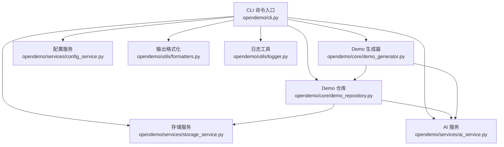
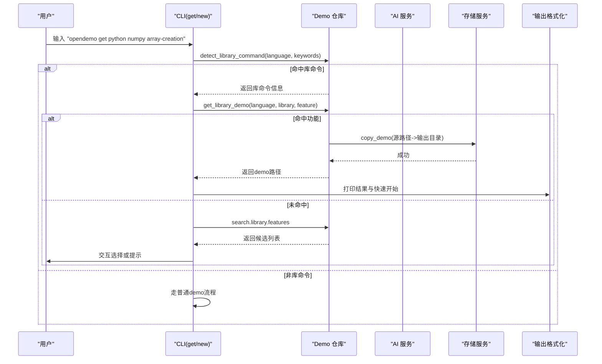
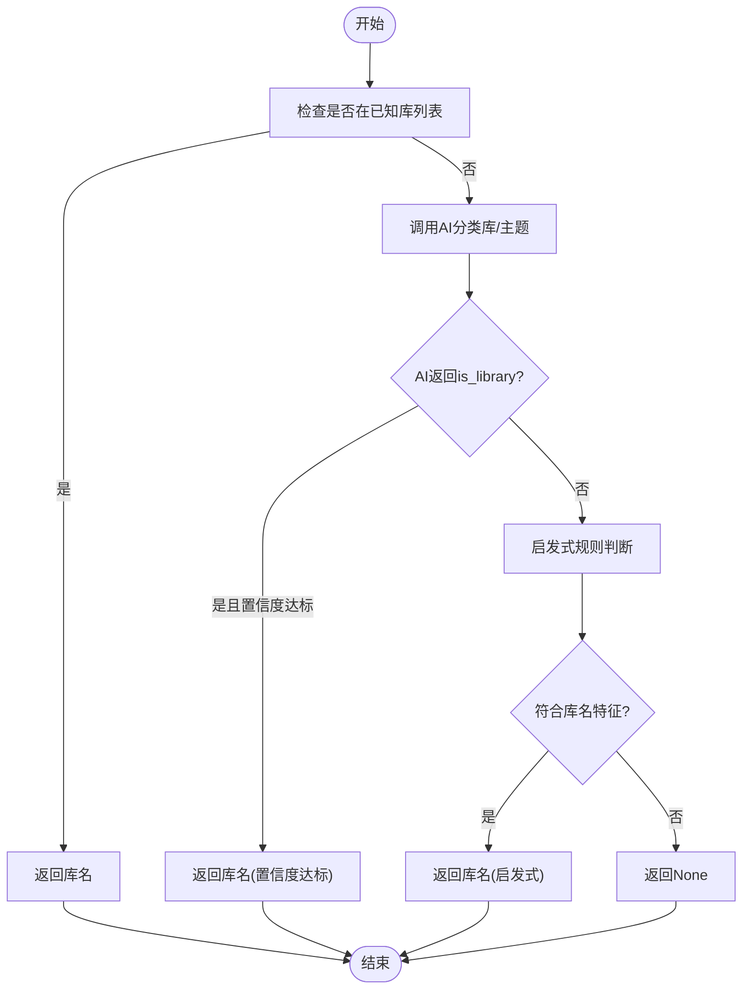
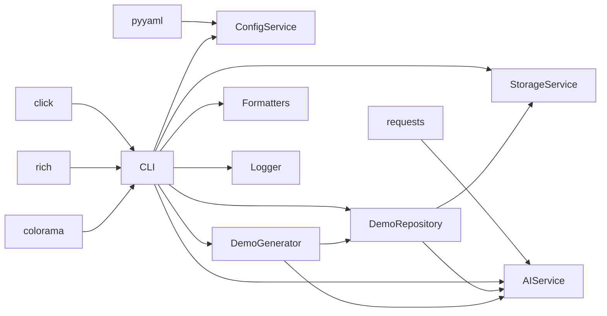

# 第三方库支持

<cite>
**本文引用的文件**
- [README.md](file://README.md)
- [pyproject.toml](file://pyproject.toml)
- [opendemo/cli.py](file://opendemo/cli.py)
- [opendemo/services/ai_service.py](file://opendemo/services/ai_service.py)
- [opendemo/services/storage_service.py](file://opendemo/services/storage_service.py)
- [opendemo/services/config_service.py](file://opendemo/services/config_service.py)
- [opendemo/core/demo_repository.py](file://opendemo/core/demo_repository.py)
- [opendemo/core/demo_generator.py](file://opendemo/core/demo_generator.py)
- [opendemo/utils/formatters.py](file://opendemo/utils/formatters.py)
- [opendemo/utils/logger.py](file://opendemo/utils/logger.py)
- [data/demo_mapping.json](file://data/demo_mapping.json)
</cite>

## 目录
1. [简介](#简介)
2. [项目结构](#项目结构)
3. [核心组件](#核心组件)
4. [架构总览](#架构总览)
5. [组件深度分析](#组件深度分析)
6. [依赖关系分析](#依赖关系分析)
7. [性能考量](#性能考量)
8. [故障排查指南](#故障排查指南)
9. [结论](#结论)
10. [附录](#附录)

## 简介
本项目提供“第三方库支持”的核心能力：在用户输入“语言 + 库名 + 功能关键词”的命令时，系统能够自动识别库名、定位库内功能模块、将对应 demo 复制到输出目录，并以友好的方式展示快速开始步骤。同时，对于未注册的库名，系统可通过 AI 智能判断或启发式规则进行识别，从而实现对“未知库”的支持。

## 项目结构
围绕“第三方库支持”，本项目的关键模块与职责如下：
- CLI 层：解析用户命令，调度仓库、搜索、生成与验证流程
- 服务层：
  - 配置服务：加载全局/项目配置，提供键值访问与校验
  - 存储服务：负责文件系统操作、内置/用户库扫描、输出目录管理
  - AI 服务：与 LLM API 交互，生成 demo、分类关键字（库/主题）、校验 API Key
- 核心业务层：
  - Demo 仓库：统一管理 Demo（普通与库 demo），支持库检测、库信息与功能列表查询、复制到输出目录等
  - Demo 生成器：协调 AI 生成 demo，补充元数据并落盘
- 工具层：日志、输出格式化

图表来源
- [opendemo/cli.py](file://opendemo/cli.py#L316-L766)
- [opendemo/core/demo_repository.py](file://opendemo/core/demo_repository.py#L75-L120)
- [opendemo/core/demo_generator.py](file://opendemo/core/demo_generator.py#L14-L105)
- [opendemo/services/storage_service.py](file://opendemo/services/storage_service.py#L17-L60)
- [opendemo/services/config_service.py](file://opendemo/services/config_service.py#L16-L60)
- [opendemo/services/ai_service.py](file://opendemo/services/ai_service.py#L16-L40)
- [opendemo/utils/formatters.py](file://opendemo/utils/formatters.py#L1-L40)
- [opendemo/utils/logger.py](file://opendemo/utils/logger.py#L13-L40)

章节来源
- [README.md](file://README.md#L96-L141)
- [opendemo/cli.py](file://opendemo/cli.py#L316-L766)

## 核心组件
- 库命令检测与处理
  - CLI 层在 get/new 命令中检测“库命令”（语言 + 库名 + 功能关键词），若命中则进入库流程；否则走普通 demo 获取/生成流程
- 库名识别
  - 先查“已知库列表”，再通过 AI 分类（库/主题）+ 置信度阈值，最后回退到启发式规则
- 库信息与功能列表
  - 从内置/用户库扫描 _library.json，加载库元数据与功能模块列表
- 库功能 demo 复制
  - 优先从输出/用户/内置库定位功能 demo，复制到输出目录
- 输出目录组织
  - 普通主题 demo 放在语言根目录；库 demo 放在 language/libraries/library_name/feature_name 层级

章节来源
- [opendemo/cli.py](file://opendemo/cli.py#L316-L766)
- [opendemo/core/demo_repository.py](file://opendemo/core/demo_repository.py#L309-L439)
- [opendemo/services/ai_service.py](file://opendemo/services/ai_service.py#L330-L551)
- [opendemo/services/storage_service.py](file://opendemo/services/storage_service.py#L214-L241)

## 架构总览
下面的时序图展示了“库命令识别 + 库功能获取”的关键流程。

图表来源
- [opendemo/cli.py](file://opendemo/cli.py#L316-L766)
- [opendemo/core/demo_repository.py](file://opendemo/core/demo_repository.py#L309-L439)
- [opendemo/services/storage_service.py](file://opendemo/services/storage_service.py#L168-L209)
- [opendemo/utils/formatters.py](file://opendemo/utils/formatters.py#L38-L129)

## 组件深度分析

### 组件A：库命令识别与处理（CLI）
- 关键点
  - get/new 命令均会调用 detect_library_command，若返回非空，则进入库流程
  - 库流程中，若功能精确匹配，直接复制到输出目录；否则模糊搜索并交互选择
  - 若非库命令，走普通 demo 获取/生成流程
- 输出组织
  - 库 demo 输出到 language/libraries/library_name/feature_name
  - 普通主题 demo 输出到 language/<主题名>

章节来源
- [opendemo/cli.py](file://opendemo/cli.py#L316-L766)
- [opendemo/core/demo_repository.py](file://opendemo/core/demo_repository.py#L309-L439)

### 组件B：库名识别（AI + 启发式）
- 关键点
  - detect_library_for_new_command：先查已知库列表，再调用 AI classify_keyword，最后启发式规则
  - classify_keyword：AI 返回 is_library + confidence + library_name；失败回退到启发式
  - 启发式规则：中文关键字判为主题；常见库集合 + 库名特征（长度、字符、首字母）
- 性能与鲁棒性
  - AI 失败时快速回退，避免阻塞
  - 置信度阈值过滤低置信度识别

图表来源
- [opendemo/core/demo_repository.py](file://opendemo/core/demo_repository.py#L350-L401)
- [opendemo/services/ai_service.py](file://opendemo/services/ai_service.py#L330-L551)

章节来源
- [opendemo/core/demo_repository.py](file://opendemo/core/demo_repository.py#L350-L401)
- [opendemo/services/ai_service.py](file://opendemo/services/ai_service.py#L330-L551)

### 组件C：库信息与功能列表（仓库）
- 关键点
  - get_supported_libraries：扫描内置/用户库，收集有 _library.json 的库名
  - list_library_features：从内置/用户/输出目录扫描功能模块，去重并缓存
  - get_library_info：加载库元数据 + 功能列表
  - get_library_demo：优先从输出/用户/内置库定位功能 demo
  - copy_library_feature_to_output：复制到输出目录
- 目录结构
  - language/libraries/library_name/feature_name

章节来源
- [opendemo/core/demo_repository.py](file://opendemo/core/demo_repository.py#L402-L596)
- [opendemo/services/storage_service.py](file://opendemo/services/storage_service.py#L214-L241)

### 组件D：AI 服务（生成与分类）
- 关键点
  - generate_demo：构建 prompt，调用 LLM API，解析 JSON，返回 demo 数据
  - classify_keyword：判断关键字是库名还是主题，支持 JSON 结果解析与回退
  - validate_api_key：快速校验 API Key 有效性
- 配置
  - 通过 ConfigService 读取 ai.api_key、ai.model、ai.temperature、ai.max_tokens、ai.timeout、ai.retry_times/retry_interval

章节来源
- [opendemo/services/ai_service.py](file://opendemo/services/ai_service.py#L16-L225)
- [opendemo/services/ai_service.py](file://opendemo/services/ai_service.py#L292-L468)
- [opendemo/services/ai_service.py](file://opendemo/services/ai_service.py#L469-L551)
- [opendemo/services/config_service.py](file://opendemo/services/config_service.py#L16-L60)

### 组件E：存储服务（文件系统）
- 关键点
  - get_output_directory：输出目录管理
  - list_demos：扫描内置/用户库中的 demo
  - save_demo/copy_demo/delete_demo：文件系统操作
  - migrate_builtin_libraries：内置库迁移至输出目录（带迁移标记）

章节来源
- [opendemo/services/storage_service.py](file://opendemo/services/storage_service.py#L17-L60)
- [opendemo/services/storage_service.py](file://opendemo/services/storage_service.py#L214-L375)

## 依赖关系分析
- 外部依赖
  - requests：LLM API 请求
  - rich/colorama：CLI 输出美化
  - pyyaml：配置文件读写
  - click：命令行接口
- 内部依赖
  - CLI 依赖 ConfigService、StorageService、DemoRepository、DemoGenerator、DemoVerifier、AIService、Formatters、Logger
  - DemoRepository 依赖 StorageService、ConfigService、AIService
  - DemoGenerator 依赖 AIService、DemoRepository、ConfigService
  - StorageService 依赖 ConfigService
  - AI 服务依赖 ConfigService

图表来源
- [pyproject.toml](file://pyproject.toml#L30-L55)
- [opendemo/cli.py](file://opendemo/cli.py#L1-L40)
- [opendemo/services/ai_service.py](file://opendemo/services/ai_service.py#L16-L40)
- [opendemo/services/storage_service.py](file://opendemo/services/storage_service.py#L17-L60)
- [opendemo/services/config_service.py](file://opendemo/services/config_service.py#L16-L60)
- [opendemo/core/demo_repository.py](file://opendemo/core/demo_repository.py#L75-L120)
- [opendemo/core/demo_generator.py](file://opendemo/core/demo_generator.py#L14-L39)
- [opendemo/utils/formatters.py](file://opendemo/utils/formatters.py#L1-L20)
- [opendemo/utils/logger.py](file://opendemo/utils/logger.py#L13-L40)

章节来源
- [pyproject.toml](file://pyproject.toml#L30-L55)
- [opendemo/cli.py](file://opendemo/cli.py#L1-L40)

## 性能考量
- 缓存策略
  - DemoRepository 对 demo、库元数据、库功能、支持库列表做缓存，减少重复 IO
- I/O 优化
  - 批量扫描内置/用户库时，仅在存在 metadata.json 的目录下收集 demo
- 网络与重试
  - AIService 对 API 调用进行重试与超时控制，降低偶发失败影响
- 输出目录组织
  - 库 demo 采用 libraries/library_name/feature_name 层级，便于后续搜索与复制

章节来源
- [opendemo/core/demo_repository.py](file://opendemo/core/demo_repository.py#L90-L120)
- [opendemo/services/ai_service.py](file://opendemo/services/ai_service.py#L61-L86)
- [opendemo/services/storage_service.py](file://opendemo/services/storage_service.py#L50-L84)

## 故障排查指南
- AI API Key 未配置
  - 现象：生成 demo 报错或无法分类
  - 排查：使用 config init 或 config set 设置 ai.api_key
  - 参考
    - [opendemo/cli.py](file://opendemo/cli.py#L422-L427)
    - [opendemo/services/config_service.py](file://opendemo/services/config_service.py#L220-L242)
- AI API Key 无效
  - 现象：validate_api_key 返回 False
  - 排查：使用 AIService.validate_api_key 快速验证
  - 参考
    - [opendemo/services/ai_service.py](file://opendemo/services/ai_service.py#L292-L329)
- 库命令未识别
  - 现象：get python numpy 未进入库流程
  - 排查：确认 numpy 是否在已知库列表；若不在，AI 分类置信度是否足够；或是否触发启发式规则
  - 参考
    - [opendemo/core/demo_repository.py](file://opendemo/core/demo_repository.py#L309-L401)
    - [opendemo/services/ai_service.py](file://opendemo/services/ai_service.py#L330-L551)
- 库功能未找到
  - 现象：get python numpy array-creation 未命中
  - 排查：确认内置/用户/输出目录是否存在对应功能；或使用 search 查看可用功能
  - 参考
    - [opendemo/core/demo_repository.py](file://opendemo/core/demo_repository.py#L539-L596)
- 输出目录权限问题
  - 现象：save_demo/copy_demo 失败
  - 排查：检查输出目录是否存在且可写
  - 参考
    - [opendemo/services/storage_service.py](file://opendemo/services/storage_service.py#L131-L209)

章节来源
- [opendemo/cli.py](file://opendemo/cli.py#L422-L427)
- [opendemo/services/ai_service.py](file://opendemo/services/ai_service.py#L292-L329)
- [opendemo/core/demo_repository.py](file://opendemo/core/demo_repository.py#L309-L401)
- [opendemo/services/storage_service.py](file://opendemo/services/storage_service.py#L131-L209)

## 结论
本项目通过“库命令识别 + AI 分类 + 启发式规则 + 库元数据与功能扫描”的组合，实现了对第三方库的全面支持。其核心优势在于：
- 对“未知库”具备智能识别能力，降低用户门槛
- 以标准化的目录结构组织库 demo，便于维护与复用
- 通过缓存与重试机制提升稳定性与性能
- CLI 输出友好，配合快速开始步骤提升用户体验

## 附录
- 配置项参考
  - ai.api_key、ai.model、ai.temperature、ai.max_tokens、ai.timeout、ai.retry_times、ai.retry_interval
  - output_directory、user_demo_library、enable_verification、contribution.*
  - 参考
    - [opendemo/services/config_service.py](file://opendemo/services/config_service.py#L16-L60)
    - [opendemo/services/config_service.py](file://opendemo/services/config_service.py#L220-L242)
- 输出目录结构参考
  - language/libraries/library_name/feature_name
  - 参考
    - [README.md](file://README.md#L120-L141)
    - [opendemo/services/storage_service.py](file://opendemo/services/storage_service.py#L214-L241)