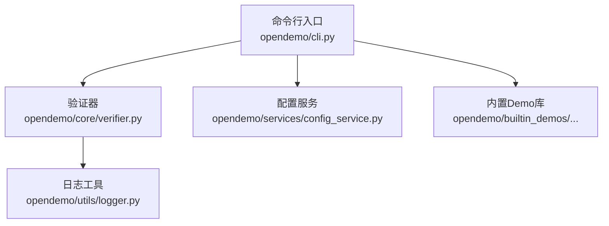
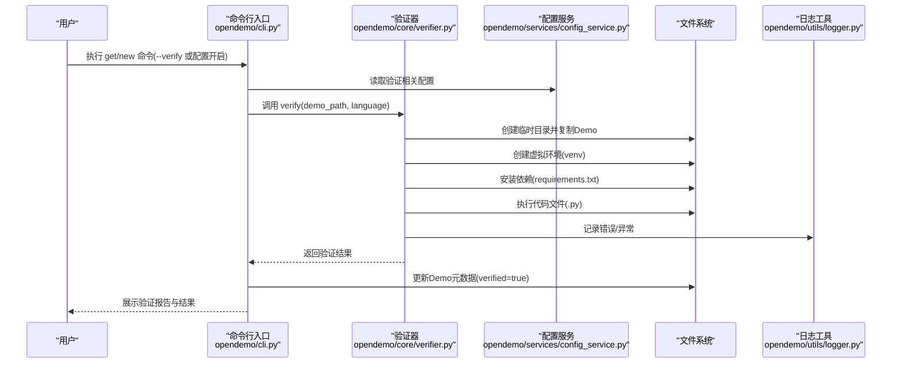
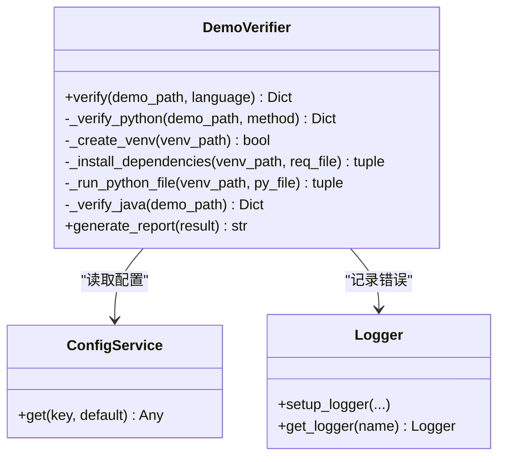
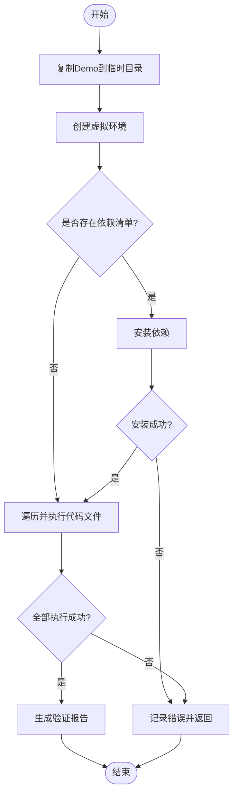
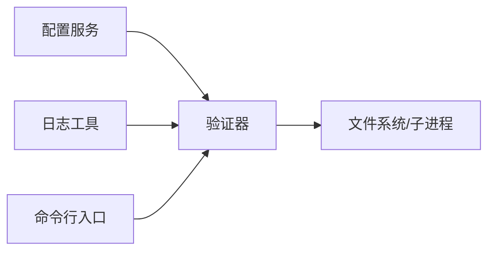

# 可选验证机制

<cite>
**本文引用的文件**
- [opendemo/core/verifier.py](file://opendemo/core/verifier.py)
- [opendemo/cli.py](file://opendemo/cli.py)
- [opendemo/services/config_service.py](file://opendemo/services/config_service.py)
- [opendemo/utils/logger.py](file://opendemo/utils/logger.py)
- [PROJECT_SUMMARY.md](file://PROJECT_SUMMARY.md)
- [opendemo/builtin_demos/python/python-tuple-basics/README.md](file://opendemo/builtin_demos/python/python-tuple-basics/README.md)
- [opendemo/builtin_demos/python/python-tuple-basics/metadata.json](file://opendemo/builtin_demos/python/python-tuple-basics/metadata.json)
- [opendemo/builtin_demos/python/python-tuple-basics/requirements.txt](file://opendemo/builtin_demos/python/python-tuple-basics/requirements.txt)
- [opendemo/builtin_demos/python/python-tuple-basics/code/tuple_basics.py](file://opendemo/builtin_demos/python/python-tuple-basics/code/tuple_basics.py)
- [opendemo/builtin_demos/python/python-tuple-basics/code/tuple_operations.py](file://opendemo/builtin_demos/python/python-tuple-basics/code/tuple_operations.py)
</cite>

## 目录
1. [简介](#简介)
2. [项目结构](#项目结构)
3. [核心组件](#核心组件)
4. [架构总览](#架构总览)
5. [详细组件分析](#详细组件分析)
6. [依赖关系分析](#依赖关系分析)
7. [性能考量](#性能考量)
8. [故障排查指南](#故障排查指南)
9. [结论](#结论)
10. [附录](#附录)

## 简介
本文件围绕“可选验证机制”展开，聚焦于如何通过验证器确保生成Demo的可执行性与质量。我们将深入解析验证器的实现细节，包括虚拟环境创建、依赖安装、代码执行与错误处理，并结合配置项说明验证超时、报告生成与隔离设计的重要性。同时提供面向初学者的使用方法与面向高级用户的实现技术深度。

## 项目结构
Open Demo CLI 的验证机制位于核心层，由命令行入口触发，经由配置服务与验证器协作完成。内置Demo库提供可直接执行的示例，便于验证流程落地。

图表来源
- [opendemo/cli.py](file://opendemo/cli.py#L196-L324)
- [opendemo/core/verifier.py](file://opendemo/core/verifier.py#L31-L60)
- [opendemo/services/config_service.py](file://opendemo/services/config_service.py#L16-L49)
- [opendemo/utils/logger.py](file://opendemo/utils/logger.py#L13-L65)

章节来源
- [opendemo/cli.py](file://opendemo/cli.py#L196-L324)
- [opendemo/core/verifier.py](file://opendemo/core/verifier.py#L31-L60)
- [opendemo/services/config_service.py](file://opendemo/services/config_service.py#L16-L49)

## 核心组件
- 验证器（DemoVerifier）：负责根据语言选择验证策略，执行虚拟环境创建、依赖安装与代码执行，并汇总结果与报告。
- 配置服务（ConfigService）：提供验证开关、验证方法、超时时间等配置项，支持全局与项目级配置合并。
- 日志工具（Logger）：统一记录验证过程中的错误与异常，便于定位问题。
- 命令行入口（CLI）：在 get/new 命令中按需触发验证，并展示验证结果与更新元数据。

章节来源
- [opendemo/core/verifier.py](file://opendemo/core/verifier.py#L31-L60)
- [opendemo/services/config_service.py](file://opendemo/services/config_service.py#L16-L49)
- [opendemo/utils/logger.py](file://opendemo/utils/logger.py#L13-L65)
- [opendemo/cli.py](file://opendemo/cli.py#L540-L557)

## 架构总览
验证流程在命令行层面被触发，随后由验证器在临时环境中执行，最终生成可读的验证报告并更新Demo元数据。

图表来源
- [opendemo/cli.py](file://opendemo/cli.py#L540-L557)
- [opendemo/core/verifier.py](file://opendemo/core/verifier.py#L61-L129)
- [opendemo/services/config_service.py](file://opendemo/services/config_service.py#L147-L168)
- [opendemo/utils/logger.py](file://opendemo/utils/logger.py#L13-L65)

## 详细组件分析

### 验证器类（DemoVerifier）分析
- 功能职责
  - 根据语言选择验证策略（Python/Java），Python路径下支持虚拟环境隔离与依赖安装。
  - 在临时目录中复制Demo，创建虚拟环境，安装依赖，执行代码文件，收集输出与错误。
  - 生成结构化验证报告，包含状态、方法、步骤、输出与错误信息。
- 关键方法
  - verify：对外入口，依据配置决定是否跳过验证；按语言路由到具体验证方法。
  - _verify_python：核心验证流程，包含复制、创建虚拟环境、安装依赖、执行代码、汇总结果。
  - _create_venv/_install_dependencies/_run_python_file：分别负责虚拟环境创建、依赖安装与代码执行。
  - generate_report：将验证结果格式化为可读报告。
- 错误处理
  - 对子进程异常、超时、平台差异（Windows vs Unix）进行捕获与分类处理。
  - 记录日志，保证可追踪性。

图表来源
- [opendemo/core/verifier.py](file://opendemo/core/verifier.py#L31-L269)
- [opendemo/services/config_service.py](file://opendemo/services/config_service.py#L147-L168)
- [opendemo/utils/logger.py](file://opendemo/utils/logger.py#L13-L65)

章节来源
- [opendemo/core/verifier.py](file://opendemo/core/verifier.py#L31-L269)

### 验证流程步骤详解
- 步骤1：复制Demo到临时目录
  - 将目标Demo完整复制到临时工作空间，避免污染源目录。
- 步骤2：创建虚拟环境
  - 使用标准库创建隔离环境，Windows与Unix路径差异已处理。
- 步骤3：安装依赖
  - 若存在依赖清单，则调用对应平台的pip安装，支持超时控制。
- 步骤4：执行代码
  - 遍历代码目录下的Python文件，逐个执行，收集标准输出与错误。
- 步骤5：汇总与报告
  - 生成结构化报告，包含步骤、输出与错误，便于用户与维护者诊断。

图表来源
- [opendemo/core/verifier.py](file://opendemo/core/verifier.py#L61-L129)

章节来源
- [opendemo/core/verifier.py](file://opendemo/core/verifier.py#L61-L129)

### 配置与超时控制
- 配置项
  - enable_verification：是否启用验证（默认关闭）。
  - verification_method：验证方法（默认venv，后续可扩展docker）。
  - verification_timeout：验证超时秒数（默认300）。
- 验证超时
  - 虚拟环境创建、依赖安装与代码执行均设置超时，防止长时间阻塞。
- 配置加载与校验
  - 支持全局与项目级配置合并，提供配置有效性校验（如超时必须为正整数）。

章节来源
- [opendemo/services/config_service.py](file://opendemo/services/config_service.py#L16-L49)
- [opendemo/services/config_service.py](file://opendemo/services/config_service.py#L243-L271)
- [opendemo/core/verifier.py](file://opendemo/core/verifier.py#L130-L203)

### 错误处理与报告生成
- 错误处理
  - 子进程超时捕获并返回明确提示。
  - 平台差异导致的路径问题已内建处理。
  - 通用异常捕获并记录日志。
- 报告生成
  - 包含状态、方法、步骤、输出与错误，便于用户理解验证过程与失败原因。

章节来源
- [opendemo/core/verifier.py](file://opendemo/core/verifier.py#L130-L203)
- [opendemo/core/verifier.py](file://opendemo/core/verifier.py#L225-L269)
- [opendemo/utils/logger.py](file://opendemo/utils/logger.py#L13-L65)

### 验证方法对比：venv 与 docker
- venv（默认）
  - 优点：轻量、易用、无需额外容器运行时。
  - 适用场景：Python生态验证、快速验证。
- docker（扩展建议）
  - 优点：更强隔离、跨平台一致性、可复现环境。
  - 实施要点：需要在验证器中新增docker方法分支，拉起容器、挂载临时目录、执行命令并处理超时与错误。
  - 注意事项：镜像选择、网络与权限、资源限制与清理。

章节来源
- [PROJECT_SUMMARY.md](file://PROJECT_SUMMARY.md#L292-L308)
- [opendemo/core/verifier.py](file://opendemo/core/verifier.py#L31-L60)

### 使用方法（面向初学者）
- 启用验证
  - 在配置中开启验证：设置 enable_verification 为 true。
  - 或在命令行使用 --verify 选项触发一次性验证。
- 触发验证
  - get/new 命令在满足条件时会自动验证，验证通过后会更新Demo元数据。
- 查看报告
  - 验证器会生成结构化报告，包含步骤、输出与错误，便于定位问题。

章节来源
- [opendemo/cli.py](file://opendemo/cli.py#L540-L557)
- [opendemo/services/config_service.py](file://opendemo/services/config_service.py#L147-L168)
- [opendemo/core/verifier.py](file://opendemo/core/verifier.py#L225-L269)

### 高级实践（面向高级用户）
- 自定义验证方法
  - 在验证器中扩展 _verify_python 的方法分支，支持docker等方案。
- 超时与资源控制
  - 根据Demo复杂度调整 verification_timeout，避免误判。
- 日志与可观测性
  - 结合日志工具定位异常，必要时增加更细粒度的日志级别。
- 依赖与执行策略
  - 对于大型依赖或外部资源，可在依赖安装阶段加入重试与降级策略。

章节来源
- [opendemo/core/verifier.py](file://opendemo/core/verifier.py#L31-L60)
- [opendemo/services/config_service.py](file://opendemo/services/config_service.py#L16-L49)
- [opendemo/utils/logger.py](file://opendemo/utils/logger.py#L13-L65)

## 依赖关系分析
- 组件耦合
  - 验证器依赖配置服务读取验证开关、方法与超时；依赖日志工具记录错误；依赖文件系统进行临时目录与虚拟环境操作。
- 外部依赖
  - Python标准库（subprocess、tempfile、shutil、pathlib）。
  - 平台差异处理（Windows vs Unix）。
- 潜在循环依赖
  - 当前结构清晰，无明显循环依赖迹象。

图表来源
- [opendemo/core/verifier.py](file://opendemo/core/verifier.py#L31-L60)
- [opendemo/services/config_service.py](file://opendemo/services/config_service.py#L147-L168)
- [opendemo/utils/logger.py](file://opendemo/utils/logger.py#L13-L65)
- [opendemo/cli.py](file://opendemo/cli.py#L540-L557)

章节来源
- [opendemo/core/verifier.py](file://opendemo/core/verifier.py#L31-L60)
- [opendemo/services/config_service.py](file://opendemo/services/config_service.py#L147-L168)
- [opendemo/utils/logger.py](file://opendemo/utils/logger.py#L13-L65)
- [opendemo/cli.py](file://opendemo/cli.py#L540-L557)

## 性能考量
- 虚拟环境创建与依赖安装
  - 创建虚拟环境与pip安装通常耗时较长，建议合理设置超时并避免不必要的依赖。
- 代码执行
  - 通过超时控制避免长时间阻塞；对于I/O密集型Demo，适当提高超时阈值。
- 报告生成
  - 报告为纯文本拼接，开销极低，不会成为瓶颈。

[本节为通用性能建议，不直接分析具体文件]

## 故障排查指南
- 验证被跳过
  - 检查配置项 enable_verification 是否为 true；若为 false，验证将直接返回跳过状态。
- 依赖安装失败
  - 确认 requirements.txt 是否存在且语法正确；检查网络与代理；适当提高 verification_timeout。
- 代码执行超时
  - 提升 verification_timeout；检查代码中是否存在死循环或长阻塞操作。
- 平台路径问题
  - Windows与Unix的可执行路径不同，验证器已内置处理；若自定义路径，请确认路径正确。
- 日志定位
  - 查看日志文件（默认位于用户目录下的日志目录），定位异常堆栈与错误信息。

章节来源
- [opendemo/core/verifier.py](file://opendemo/core/verifier.py#L130-L203)
- [opendemo/services/config_service.py](file://opendemo/services/config_service.py#L243-L271)
- [opendemo/utils/logger.py](file://opendemo/utils/logger.py#L13-L65)

## 结论
可选验证机制通过虚拟环境隔离、依赖安装验证与代码执行验证，显著提升了Demo的可执行性与质量。配合配置项与报告生成，用户能够快速定位问题并持续改进。未来可进一步扩展docker等验证方法，以满足更复杂的环境需求。

[本节为总结性内容，不直接分析具体文件]

## 附录

### 验证流程与内置Demo示例
- 内置Demo结构
  - 包含元数据、README、代码与依赖清单，便于验证器直接使用。
- 示例文件
  - 元数据：用于标识语言、关键字、难度与验证状态。
  - 依赖清单：声明运行所需依赖。
  - 代码示例：包含基础与高级操作，验证器将逐一执行。

章节来源
- [opendemo/builtin_demos/python/python-tuple-basics/README.md](file://opendemo/builtin_demos/python/python-tuple-basics/README.md#L1-L89)
- [opendemo/builtin_demos/python/python-tuple-basics/metadata.json](file://opendemo/builtin_demos/python/python-tuple-basics/metadata.json#L1-L14)
- [opendemo/builtin_demos/python/python-tuple-basics/requirements.txt](file://opendemo/builtin_demos/python/python-tuple-basics/requirements.txt#L1-L2)
- [opendemo/builtin_demos/python/python-tuple-basics/code/tuple_basics.py](file://opendemo/builtin_demos/python/python-tuple-basics/code/tuple_basics.py#L1-L87)
- [opendemo/builtin_demos/python/python-tuple-basics/code/tuple_operations.py](file://opendemo/builtin_demos/python/python-tuple-basics/code/tuple_operations.py#L1-L111)

### 设计亮点与隔离重要性
- 可选验证作为设计亮点之一，强调了虚拟环境隔离、自动依赖安装与代码执行验证的价值。
- 隔离设计确保验证过程不影响宿主环境，提升安全性与可重复性。

章节来源
- [PROJECT_SUMMARY.md](file://PROJECT_SUMMARY.md#L241-L270)