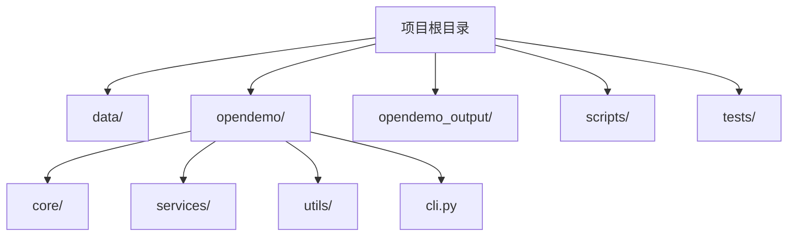
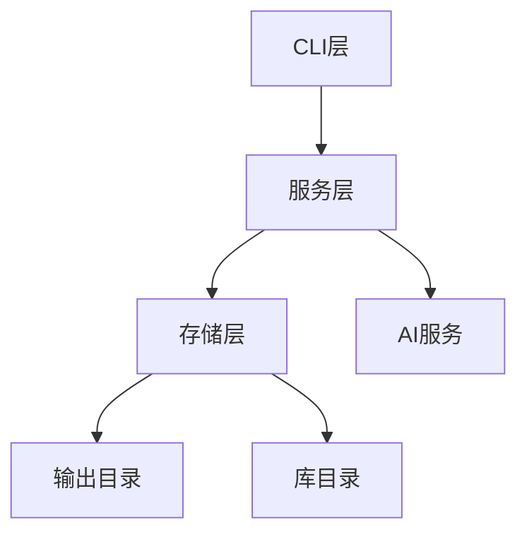
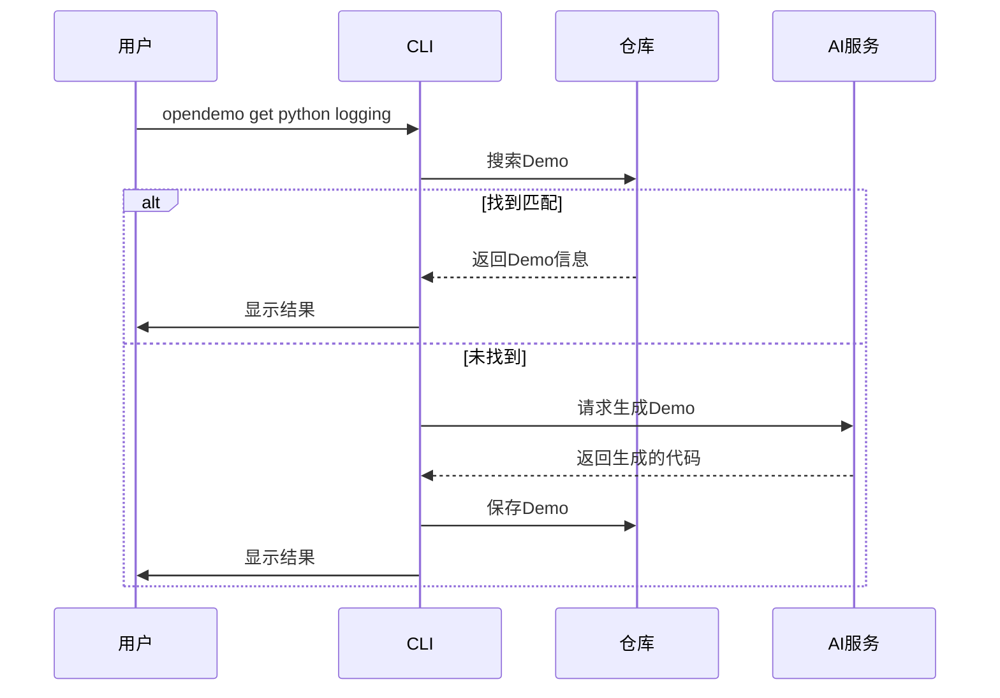
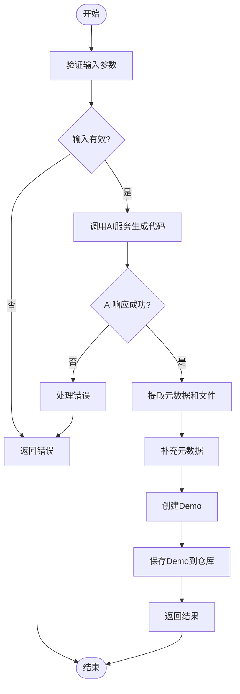
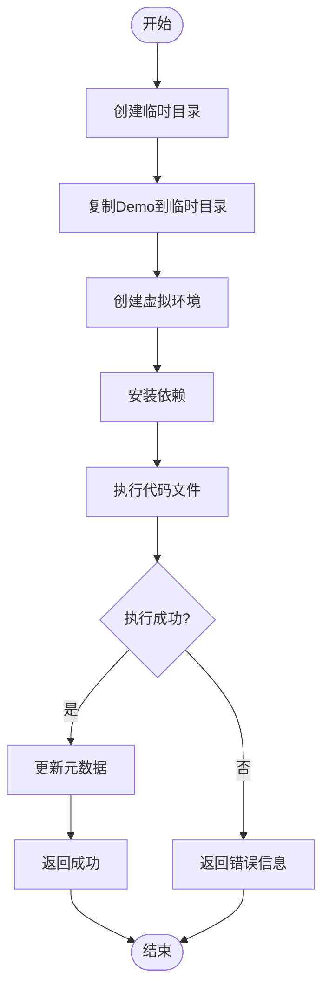
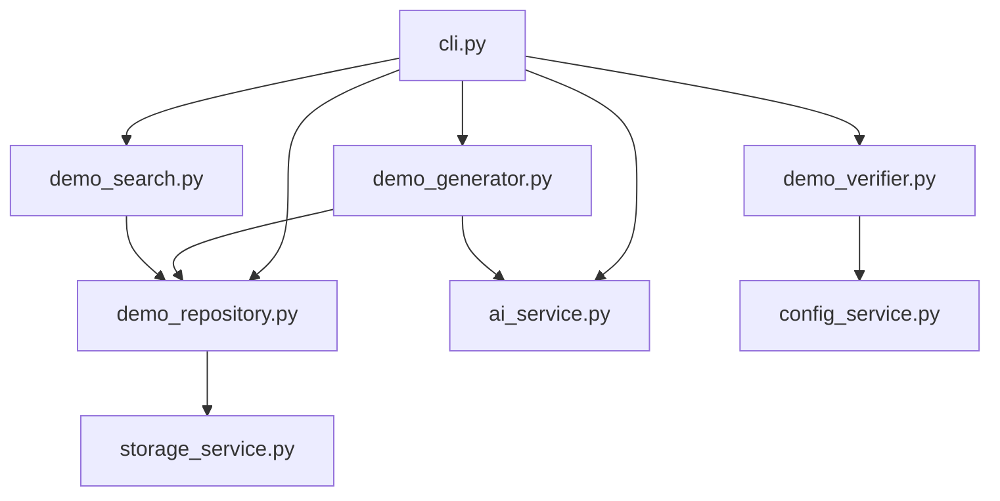

# 多语言Demo验证

<cite>
**本文档引用的文件**   
- [README.md](file://README.md)
- [cli.py](file://opendemo/cli.py)
- [demo_generator.py](file://opendemo/core/demo_generator.py)
- [demo_verifier.py](file://opendemo/core/demo_verifier.py)
- [demo_search.py](file://opendemo/core/demo_search.py)
- [ai_service.py](file://opendemo/services/ai_service.py)
- [demo_repository.py](file://opendemo/core/demo_repository.py)
- [formatters.py](file://opendemo/utils/formatters.py)
- [readme_updater.py](file://opendemo/core/readme_updater.py)
- [demo_mapping.json](file://data/demo_mapping.json)
</cite>

## 目录
1. [简介](#简介)
2. [项目结构](#项目结构)
3. [核心组件](#核心组件)
4. [架构概述](#架构概述)
5. [详细组件分析](#详细组件分析)
6. [依赖分析](#依赖分析)
7. [性能考虑](#性能考虑)
8. [故障排除指南](#故障排除指南)
9. [结论](#结论)

## 简介
本项目是一个智能化的编程学习CLI工具，旨在为开发者提供高质量、可执行的多语言Demo代码。通过集成AI服务，用户可以快速获取各种编程主题的示例代码，涵盖Python、Go、Node.js和Kubernetes等多种技术栈。项目支持搜索、获取和创建Demo，并具备自动验证功能以确保代码的可执行性。

**Section sources**
- [README.md](file://README.md#L1-L563)

## 项目结构
项目采用模块化设计，主要分为以下几个部分：
- `data/`: 存放Demo映射数据
- `opendemo/`: 核心代码包
  - `core/`: 业务逻辑实现
  - `services/`: 服务层
  - `utils/`: 工具函数
  - `cli.py`: CLI入口
- `opendemo_output/`: Demo输出目录
- `scripts/`: 辅助脚本
- `tests/`: 测试代码

**Diagram sources**
- [README.md](file://README.md#L1-L563)

**Section sources**
- [README.md](file://README.md#L1-L563)

## 核心组件
项目的核心组件包括CLI接口、Demo生成器、验证器、搜索引擎和仓库管理器。这些组件协同工作，为用户提供完整的Demo获取和管理体验。

**Section sources**
- [cli.py](file://opendemo/cli.py#L1-L885)
- [demo_generator.py](file://opendemo/core/demo_generator.py#L1-L142)
- [demo_verifier.py](file://opendemo/core/demo_verifier.py#L1-L623)
- [demo_search.py](file://opendemo/core/demo_search.py#L1-L363)
- [demo_repository.py](file://opendemo/core/demo_repository.py#L1-L1029)

## 架构概述
项目采用分层架构设计，从上到下分为CLI层、服务层和存储层。CLI层负责用户交互，服务层处理业务逻辑，存储层管理数据持久化。

**Diagram sources**
- [cli.py](file://opendemo/cli.py#L1-L885)
- [demo_repository.py](file://opendemo/core/demo_repository.py#L1-L1029)

## 详细组件分析

### CLI组件分析
CLI组件是用户与系统交互的主要入口，提供了搜索、获取和创建Demo的功能。

#### CLI命令流程

**Diagram sources**
- [cli.py](file://opendemo/cli.py#L344-L481)

### Demo生成器分析
Demo生成器负责协调AI服务生成Demo代码，并补充必要的元数据。

#### Demo生成流程

**Diagram sources**
- [demo_generator.py](file://opendemo/core/demo_generator.py#L30-L113)

### Demo验证器分析
Demo验证器负责验证生成的Demo代码是否可执行，支持多种编程语言。

#### Python验证流程

**Diagram sources**
- [demo_verifier.py](file://opendemo/core/demo_verifier.py#L59-L114)

## 依赖分析
项目依赖关系清晰，各组件之间耦合度低，便于维护和扩展。

**Diagram sources**
- [cli.py](file://opendemo/cli.py#L13-L21)
- [demo_generator.py](file://opendemo/core/demo_generator.py#L17-L28)
- [demo_verifier.py](file://opendemo/core/demo_verifier.py#L21-L28)
- [demo_search.py](file://opendemo/core/demo_search.py#L32-L39)
- [demo_repository.py](file://opendemo/core/demo_repository.py#L81-L92)

**Section sources**
- [cli.py](file://opendemo/cli.py#L1-L885)
- [demo_generator.py](file://opendemo/core/demo_generator.py#L1-L142)
- [demo_verifier.py](file://opendemo/core/demo_verifier.py#L1-L623)
- [demo_search.py](file://opendemo/core/demo_search.py#L1-L363)
- [demo_repository.py](file://opendemo/core/demo_repository.py#L1-L1029)

## 性能考虑
项目在设计时考虑了性能因素，通过缓存机制和异步处理来提高响应速度。AI服务调用具有重试机制，确保在网络不稳定的情况下仍能成功生成Demo。

## 故障排除指南
常见问题包括AI API密钥未配置、网络连接问题和依赖安装失败。建议检查配置文件、网络连接和系统环境。

**Section sources**
- [cli.py](file://opendemo/cli.py#L444-L447)
- [demo_verifier.py](file://opendemo/core/demo_verifier.py#L77-L78)

## 结论
该项目提供了一个完整的多语言Demo生成和管理解决方案，通过智能化的CLI工具，大大降低了学习新技术的门槛。系统架构清晰，组件职责明确，具有良好的可扩展性和维护性。