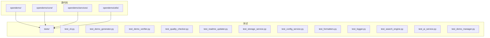
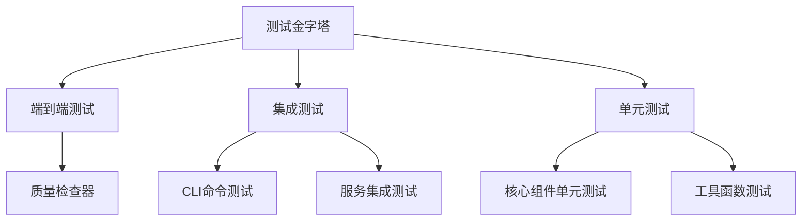
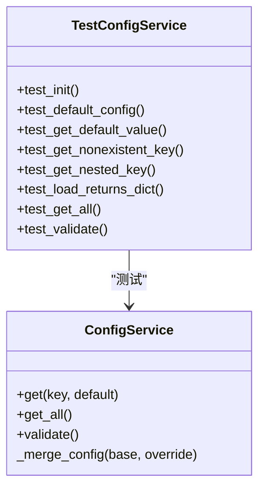
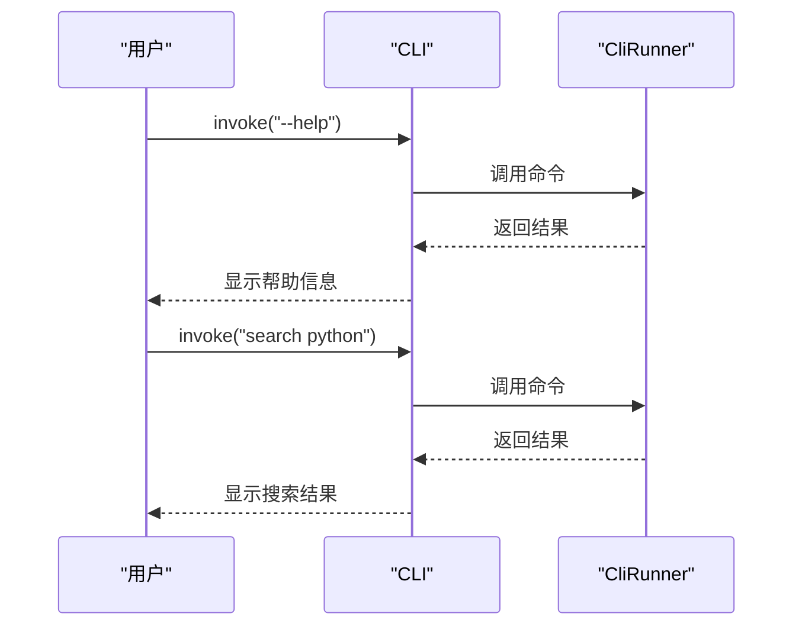
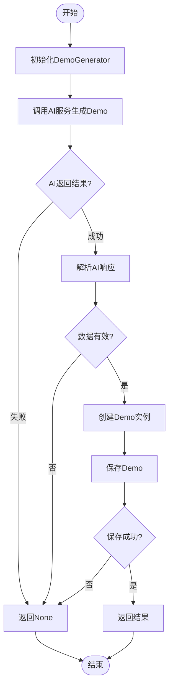
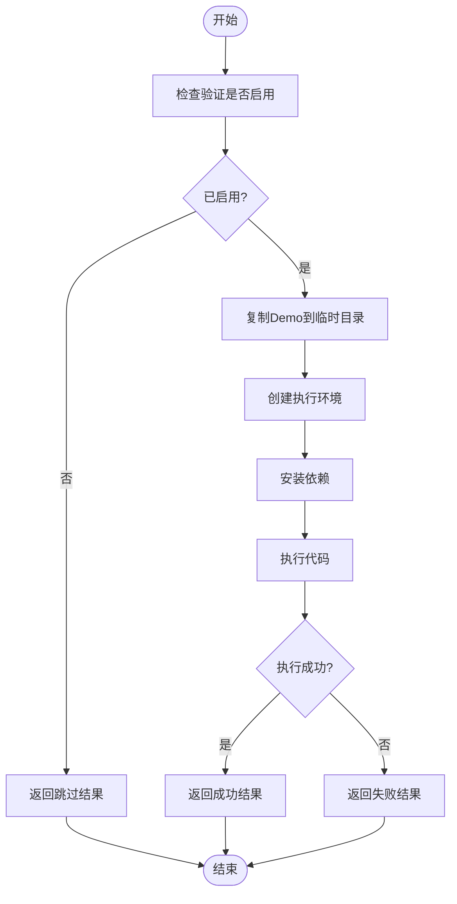
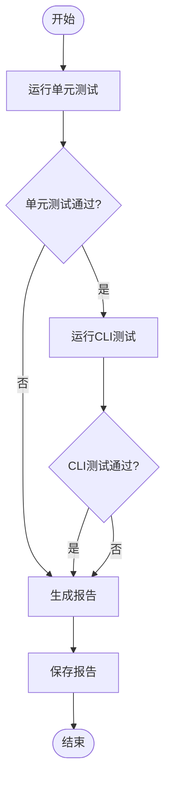

# 完整测试套件

<cite>
**本文档引用的文件**   
- [conftest.py](file://tests/conftest.py)
- [test_cli.py](file://tests/test_cli.py)
- [test_demo_generator.py](file://tests/test_demo_generator.py)
- [test_demo_verifier.py](file://tests/test_demo_verifier.py)
- [test_quality_checker.py](file://tests/test_quality_checker.py)
- [test_readme_updater.py](file://tests/test_readme_updater.py)
- [test_storage_service.py](file://tests/test_storage_service.py)
- [test_config_service.py](file://tests/test_config_service.py)
- [test_formatters.py](file://tests/test_formatters.py)
- [test_logger.py](file://tests/test_logger.py)
- [test_search_engine.py](file://tests/test_search_engine.py)
- [test_ai_service.py](file://tests/test_ai_service.py)
- [test_demo_manager.py](file://tests/test_demo_manager.py)
- [README.md](file://README.md)
</cite>

## 目录
1. [简介](#简介)
2. [项目结构](#项目结构)
3. [核心组件](#核心组件)
4. [架构概述](#架构概述)
5. [详细组件分析](#详细组件分析)
6. [依赖分析](#依赖分析)
7. [性能考虑](#性能考虑)
8. [故障排除指南](#故障排除指南)
9. [结论](#结论)

## 简介
OpenDemo CLI 是一个智能化编程学习工具，旨在帮助开发者快速获取高质量、可执行的代码示例。该项目提供了一个完整的测试套件，确保所有功能的正确性和稳定性。测试套件覆盖了从CLI命令到核心业务逻辑的各个方面，包括单元测试、集成测试和质量检查。通过全面的测试策略，项目保证了代码质量和用户体验。

## 项目结构
项目采用分层架构设计，主要分为核心业务逻辑、服务层和工具层。测试文件位于 `tests/` 目录下，与源代码结构相对应。每个核心模块都有对应的测试文件，遵循 `test_<module_name>.py` 的命名约定。

**Diagram sources**
- [test_cli.py](file://tests/test_cli.py)
- [test_demo_generator.py](file://tests/test_demo_generator.py)
- [test_demo_verifier.py](file://tests/test_demo_verifier.py)
- [test_quality_checker.py](file://tests/test_quality_checker.py)
- [test_readme_updater.py](file://tests/test_readme_updater.py)
- [test_storage_service.py](file://tests/test_storage_service.py)
- [test_config_service.py](file://tests/test_config_service.py)
- [test_formatters.py](file://tests/test_formatters.py)
- [test_logger.py](file://tests/test_logger.py)
- [test_search_engine.py](file://tests/test_search_engine.py)
- [test_ai_service.py](file://tests/test_ai_service.py)
- [test_demo_manager.py](file://tests/test_demo_manager.py)

**Section sources**
- [README.md](file://README.md)

## 核心组件
测试套件的核心组件包括配置测试、CLI测试、Demo生成器测试、验证器测试、质量检查器测试等。每个组件都通过独立的测试文件进行验证，确保功能的正确性。测试使用pytest框架，结合unittest.mock进行依赖模拟，实现了高覆盖率的测试。

**Section sources**
- [conftest.py](file://tests/conftest.py)
- [test_cli.py](file://tests/test_cli.py)
- [test_demo_generator.py](file://tests/test_demo_generator.py)
- [test_demo_verifier.py](file://tests/test_demo_verifier.py)
- [test_quality_checker.py](file://tests/test_quality_checker.py)

## 架构概述
测试套件采用分层测试架构，从单元测试到集成测试再到端到端测试，形成了完整的测试金字塔。底层是单元测试，验证单个函数和类的行为；中间层是集成测试，验证组件间的交互；顶层是质量检查，验证整体系统质量。

**Diagram sources**
- [test_quality_checker.py](file://tests/test_quality_checker.py)
- [test_cli.py](file://tests/test_cli.py)
- [test_storage_service.py](file://tests/test_storage_service.py)
- [test_demo_generator.py](file://tests/test_demo_generator.py)

## 详细组件分析

### 配置测试组件
配置测试组件验证系统配置的正确加载和使用。通过mock配置服务，测试各种配置场景。

**Diagram sources**
- [test_config_service.py](file://tests/test_config_service.py)

**Section sources**
- [test_config_service.py](file://tests/test_config_service.py)

### CLI测试组件
CLI测试组件验证命令行接口的各种功能，包括帮助信息、版本查询和具体命令的执行。

**Diagram sources**
- [test_cli.py](file://tests/test_cli.py)

**Section sources**
- [test_cli.py](file://tests/test_cli.py)

### Demo生成器测试组件
Demo生成器测试组件验证AI生成Demo的完整流程，包括成功生成、错误处理和重新生成等功能。

**Diagram sources**
- [test_demo_generator.py](file://tests/test_demo_generator.py)

**Section sources**
- [test_demo_generator.py](file://tests/test_demo_generator.py)

### Demo验证器测试组件
Demo验证器测试组件验证不同编程语言Demo的可执行性，包括Python、Go、Node.js和Kubernetes等。

**Diagram sources**
- [test_demo_verifier.py](file://tests/test_demo_verifier.py)

**Section sources**
- [test_demo_verifier.py](file://tests/test_demo_verifier.py)

### 质量检查器测试组件
质量检查器测试组件执行全面的质量检查，包括单元测试和CLI测试的运行，并生成综合报告。

**Diagram sources**
- [test_quality_checker.py](file://tests/test_quality_checker.py)

**Section sources**
- [test_quality_checker.py](file://tests/test_quality_checker.py)

## 依赖分析
测试套件的依赖关系清晰，每个测试文件主要依赖对应的源代码模块。通过pytest的fixture机制，实现了测试数据和mock对象的共享，减少了重复代码。

```mermaid
graph TD
A[conftest.py] --> B[test_cli.py]
A --> C[test_demo_generator.py]
A --> D[test_demo_verifier.py]
A --> E[test_quality_checker.py]
A --> F[test_readme_updater.py]
A --> G[test_storage_service.py]
A --> H[test_config_service.py]
A --> I[test_formatters.py]
A --> J[test_logger.py]
A --> K[test_search_engine.py]
A --> L[test_ai_service.py]
A --> M[test_demo_manager.py]
B --> N[opendemo.cli]
C --> O[opendemo.core.demo_generator]
D --> P[opendemo.core.demo_verifier]
E --> Q[opendemo.core.quality_checker]
F --> R[opendemo.core.readme_updater]
G --> S[opendemo.services.storage_service]
H --> T[opendemo.services.config_service]
I --> U[opendemo.utils.formatters]
J --> V[opendemo.utils.logger]
K --> W[opendemo.core.demo_search]
L --> X[opendemo.services.ai_service]
M --> Y[opendemo.core.demo_repository]
```

**Diagram sources**
- [conftest.py](file://tests/conftest.py)
- [test_cli.py](file://tests/test_cli.py)
- [test_demo_generator.py](file://tests/test_demo_generator.py)
- [test_demo_verifier.py](file://tests/test_demo_verifier.py)
- [test_quality_checker.py](file://tests/test_quality_checker.py)
- [test_readme_updater.py](file://tests/test_readme_updater.py)
- [test_storage_service.py](file://tests/test_storage_service.py)
- [test_config_service.py](file://tests/test_config_service.py)
- [test_formatters.py](file://tests/test_formatters.py)
- [test_logger.py](file://tests/test_logger.py)
- [test_search_engine.py](file://tests/test_search_engine.py)
- [test_ai_service.py](file://tests/test_ai_service.py)
- [test_demo_manager.py](file://tests/test_demo_manager.py)

## 性能考虑
测试套件在设计时考虑了性能因素，通过并行执行测试和使用fixture缓存来提高测试效率。质量检查器还实现了超时机制，防止测试无限期挂起。

**Section sources**
- [test_quality_checker.py](file://tests/test_quality_checker.py)
- [test_demo_verifier.py](file://tests/test_demo_verifier.py)

## 故障排除指南
当测试失败时，可以按照以下步骤进行排查：
1. 检查测试环境配置是否正确
2. 查看具体的失败信息和堆栈跟踪
3. 验证mock对象的配置是否符合预期
4. 检查测试数据是否正确
5. 确认依赖服务是否正常运行

**Section sources**
- [conftest.py](file://tests/conftest.py)
- [test_demo_verifier.py](file://tests/test_demo_verifier.py)

## 结论
OpenDemo CLI的测试套件设计全面，覆盖了所有核心功能。通过分层测试架构和详细的测试用例，确保了代码的质量和稳定性。测试套件不仅验证了功能的正确性，还考虑了错误处理、边界条件和性能等方面，为项目的持续发展提供了坚实的基础。