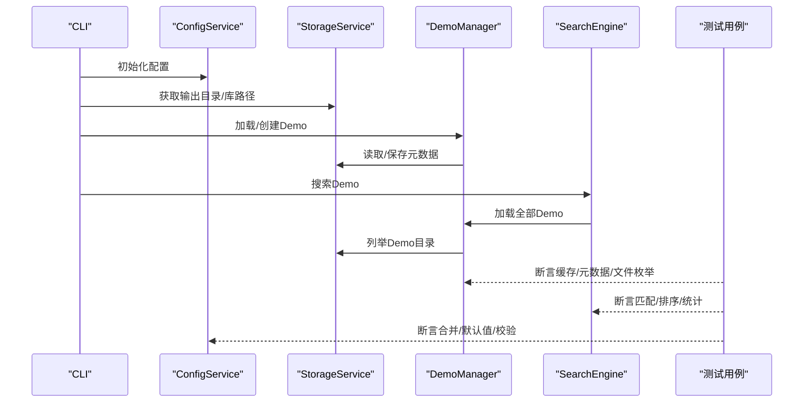
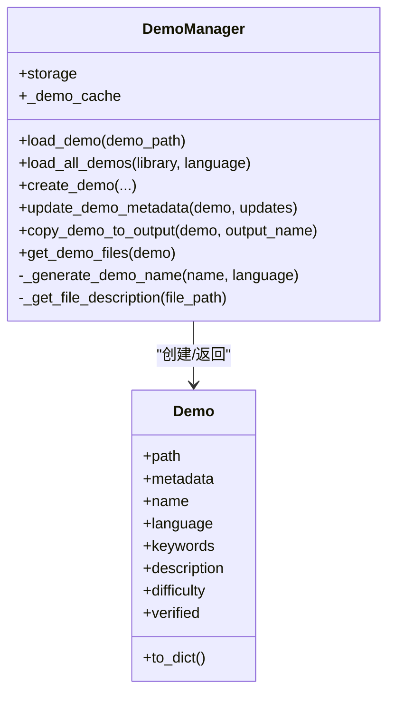
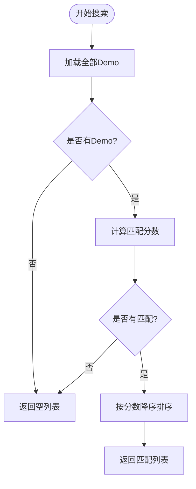
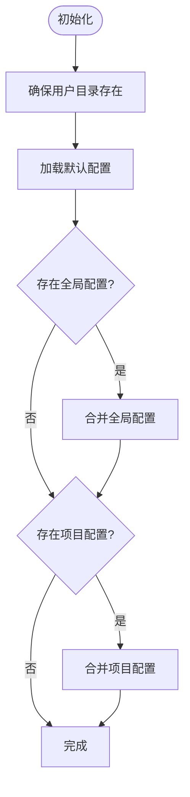
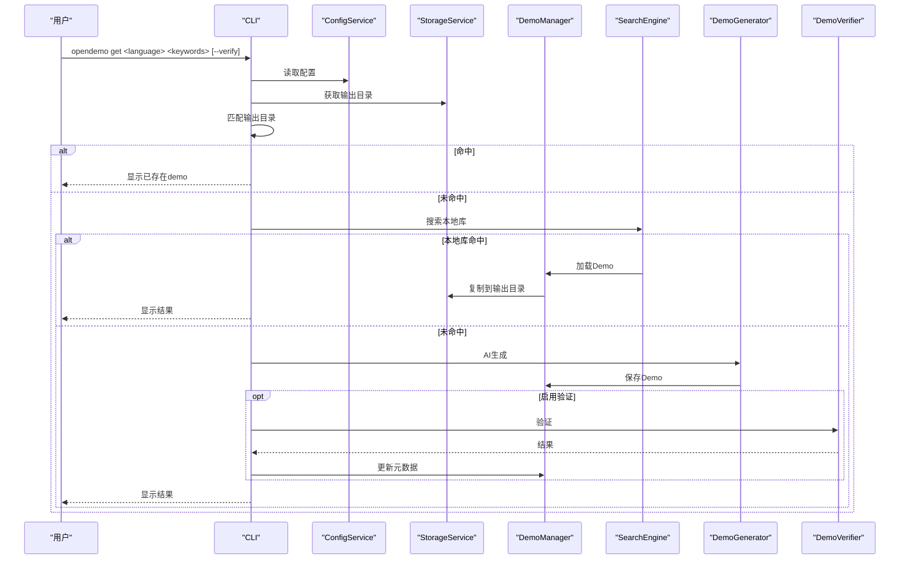
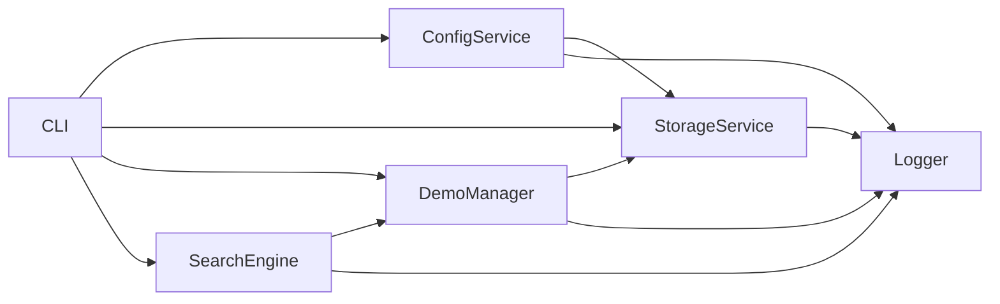

# Demo管理器测试

<cite>
**本文引用的文件**
- [README.md](file://README.md)
- [tests/test_demo_manager.py](file://tests/test_demo_manager.py)
- [tests/test_config_service.py](file://tests/test_config_service.py)
- [tests/test_search_engine.py](file://tests/test_search_engine.py)
- [opendemo/core/demo_manager.py](file://opendemo/core/demo_manager.py)
- [opendemo/core/search_engine.py](file://opendemo/core/search_engine.py)
- [opendemo/services/config_service.py](file://opendemo/services/config_service.py)
- [opendemo/services/storage_service.py](file://opendemo/services/storage_service.py)
- [opendemo/utils/logger.py](file://opendemo/utils/logger.py)
- [opendemo/cli.py](file://opendemo/cli.py)
</cite>

## 目录
1. [简介](#简介)
2. [项目结构](#项目结构)
3. [核心组件](#核心组件)
4. [架构总览](#架构总览)
5. [详细组件分析](#详细组件分析)
6. [依赖关系分析](#依赖关系分析)
7. [性能考量](#性能考量)
8. [故障排查指南](#故障排查指南)
9. [结论](#结论)
10. [附录](#附录)

## 简介
本文件聚焦于Demo管理器相关测试与实现，围绕Demo类、DemoManager、SearchEngine、ConfigService等核心模块，系统梳理其职责、交互流程、数据结构与测试覆盖情况，并以可视化图示呈现关键流程，帮助读者快速理解与定位问题。

## 项目结构
- 测试位于 tests/ 目录，分别覆盖 Demo 管理、配置服务、搜索引擎等模块。
- 核心业务逻辑位于 opendemo/core/，包括 Demo 管理与搜索。
- 服务层位于 opendemo/services/，包括配置、存储、AI等服务。
- 工具与日志位于 opendemo/utils/。
- CLI 入口位于 opendemo/cli.py，串联各服务与核心模块。

```mermaid
graph TB
subgraph "测试"
TDM["tests/test_demo_manager.py"]
TCS["tests/test_config_service.py"]
TSE["tests/test_search_engine.py"]
end
subgraph "核心"
DM["opendemo/core/demo_manager.py"]
SE["opendemo/core/search_engine.py"]
end
subgraph "服务"
CS["opendemo/services/config_service.py"]
SS["opendemo/services/storage_service.py"]
end
subgraph "工具"
LOG["opendemo/utils/logger.py"]
end
subgraph "CLI"
CLI["opendemo/cli.py"]
end
TDM --> DM
TSE --> SE
TCS --> CS
SE --> DM
DM --> SS
CS --> SS
CLI --> CS
CLI --> SS
CLI --> DM
CLI --> SE
DM --> LOG
SE --> LOG
CS --> LOG
SS --> LOG
```

图表来源
- [tests/test_demo_manager.py](file://tests/test_demo_manager.py#L1-L176)
- [tests/test_config_service.py](file://tests/test_config_service.py#L1-L119)
- [tests/test_search_engine.py](file://tests/test_search_engine.py#L1-L194)
- [opendemo/core/demo_manager.py](file://opendemo/core/demo_manager.py#L1-L329)
- [opendemo/core/search_engine.py](file://opendemo/core/search_engine.py#L1-L264)
- [opendemo/services/config_service.py](file://opendemo/services/config_service.py#L1-L280)
- [opendemo/services/storage_service.py](file://opendemo/services/storage_service.py#L1-L277)
- [opendemo/utils/logger.py](file://opendemo/utils/logger.py#L1-L65)
- [opendemo/cli.py](file://opendemo/cli.py#L1-L610)

章节来源
- [README.md](file://README.md#L60-L120)

## 核心组件
- Demo：封装单个demo的路径与元数据，提供常用属性访问与序列化。
- DemoManager：负责加载、创建、复制、更新元数据、枚举文件等。
- SearchEngine：基于关键字、难度等条件检索与排序demo。
- ConfigService：加载/合并/查询/设置配置，支持全局与项目配置。
- StorageService：抽象文件系统操作，提供demo库扫描、元数据读写、复制删除等。
- Logger：统一日志输出，便于测试与运行时排错。

章节来源
- [opendemo/core/demo_manager.py](file://opendemo/core/demo_manager.py#L16-L120)
- [opendemo/core/search_engine.py](file://opendemo/core/search_engine.py#L14-L160)
- [opendemo/services/config_service.py](file://opendemo/services/config_service.py#L16-L120)
- [opendemo/services/storage_service.py](file://opendemo/services/storage_service.py#L16-L120)
- [opendemo/utils/logger.py](file://opendemo/utils/logger.py#L13-L65)

## 架构总览
Demo管理器测试关注以下关键流程：
- Demo加载与缓存命中
- Demo创建与元数据持久化
- 搜索与匹配评分
- 配置加载与合并
- CLI工作流（get/new/search）



图表来源
- [opendemo/cli.py](file://opendemo/cli.py#L196-L324)
- [opendemo/core/demo_manager.py](file://opendemo/core/demo_manager.py#L87-L130)
- [opendemo/core/search_engine.py](file://opendemo/core/search_engine.py#L26-L66)
- [opendemo/services/storage_service.py](file://opendemo/services/storage_service.py#L49-L105)
- [opendemo/services/config_service.py](file://opendemo/services/config_service.py#L76-L107)
- [tests/test_demo_manager.py](file://tests/test_demo_manager.py#L92-L176)
- [tests/test_search_engine.py](file://tests/test_search_engine.py#L13-L172)
- [tests/test_config_service.py](file://tests/test_config_service.py#L13-L91)

## 详细组件分析

### Demo类与DemoManager测试
- Demo类属性覆盖：名称、语言、关键字、描述、难度、验证标记；默认值策略清晰。
- DemoManager初始化与缓存：构造函数注入存储服务，内部维护缓存字典，避免重复加载。
- 名称生成：规范化输入，生成合法目录名。
- 文件描述映射：根据文件名/扩展名给出中文描述，便于UI展示。
- 加载与缓存：首次加载从存储读取元数据并实例化Demo，后续直接返回缓存对象。
- 未找到场景：当元数据缺失时返回None，避免异常传播。
- 加载全部Demo：委托存储列举路径，逐个加载并过滤None结果。



图表来源
- [opendemo/core/demo_manager.py](file://opendemo/core/demo_manager.py#L16-L120)
- [opendemo/core/demo_manager.py](file://opendemo/core/demo_manager.py#L132-L329)

章节来源
- [tests/test_demo_manager.py](file://tests/test_demo_manager.py#L14-L91)
- [tests/test_demo_manager.py](file://tests/test_demo_manager.py#L92-L176)
- [opendemo/core/demo_manager.py](file://opendemo/core/demo_manager.py#L87-L130)
- [opendemo/core/demo_manager.py](file://opendemo/core/demo_manager.py#L202-L329)

### 搜索引擎测试
- 初始化：接收DemoManager实例，依赖其加载全部Demo能力。
- 空库返回：无Demo时直接返回空列表。
- 无过滤条件：返回按名称排序的全部Demo。
- 关键字匹配：名称>关键字列表>描述>整体文本，按匹配比例加权，难度精确匹配。
- 精确查找：按名称严格匹配。
- 语言/关键字/统计：提供聚合查询能力，便于UI展示。



图表来源
- [opendemo/core/search_engine.py](file://opendemo/core/search_engine.py#L26-L66)
- [opendemo/core/search_engine.py](file://opendemo/core/search_engine.py#L67-L129)
- [opendemo/core/search_engine.py](file://opendemo/core/search_engine.py#L148-L160)
- [tests/test_search_engine.py](file://tests/test_search_engine.py#L13-L172)

章节来源
- [tests/test_search_engine.py](file://tests/test_search_engine.py#L13-L172)
- [opendemo/core/search_engine.py](file://opendemo/core/search_engine.py#L14-L160)

### 配置服务测试
- 初始化与默认配置：默认值集合明确，嵌套键支持。
- 加载顺序：默认配置 -> 全局配置 -> 项目配置，后者覆盖前者。
- 嵌套键读取：支持“点”式键访问，不存在返回默认值。
- 合并策略：递归合并字典，非字典键直接覆盖。
- 校验：检查AI密钥、输出目录可写、超时参数合法性。
- 设置与保存：支持全局/项目范围设置，自动重建缓存。



图表来源
- [opendemo/services/config_service.py](file://opendemo/services/config_service.py#L51-L107)
- [opendemo/services/config_service.py](file://opendemo/services/config_service.py#L126-L146)
- [tests/test_config_service.py](file://tests/test_config_service.py#L13-L91)

章节来源
- [tests/test_config_service.py](file://tests/test_config_service.py#L13-L119)
- [opendemo/services/config_service.py](file://opendemo/services/config_service.py#L16-L120)
- [opendemo/services/config_service.py](file://opendemo/services/config_service.py#L120-L203)

### CLI工作流与集成测试要点
- get命令：优先在输出目录匹配，其次在本地库搜索，最后AI生成；支持强制重新生成与自动验证。
- search命令：列出语言与对应数量，支持关键字过滤。
- new命令：生成并可选验证，支持贡献流程。
- 日志：统一初始化日志文件，便于定位问题。



图表来源
- [opendemo/cli.py](file://opendemo/cli.py#L196-L324)
- [opendemo/core/demo_manager.py](file://opendemo/core/demo_manager.py#L252-L302)
- [opendemo/core/search_engine.py](file://opendemo/core/search_engine.py#L26-L66)
- [opendemo/services/storage_service.py](file://opendemo/services/storage_service.py#L167-L189)
- [opendemo/core/generator.py](file://opendemo/core/generator.py#L31-L103)

章节来源
- [opendemo/cli.py](file://opendemo/cli.py#L196-L324)
- [opendemo/core/generator.py](file://opendemo/core/generator.py#L31-L103)

## 依赖关系分析
- DemoManager依赖StorageService进行文件系统操作与元数据读写。
- SearchEngine依赖DemoManager加载全部Demo，再进行过滤与排序。
- ConfigService为各模块提供配置，支持全局与项目配置合并。
- CLI作为编排者，组合上述组件并驱动测试与实际运行。
- Logger贯穿各模块，统一输出与错误记录。



图表来源
- [opendemo/cli.py](file://opendemo/cli.py#L196-L324)
- [opendemo/core/demo_manager.py](file://opendemo/core/demo_manager.py#L74-L120)
- [opendemo/core/search_engine.py](file://opendemo/core/search_engine.py#L14-L32)
- [opendemo/services/config_service.py](file://opendemo/services/config_service.py#L76-L107)
- [opendemo/services/storage_service.py](file://opendemo/services/storage_service.py#L49-L105)
- [opendemo/utils/logger.py](file://opendemo/utils/logger.py#L13-L65)

章节来源
- [opendemo/cli.py](file://opendemo/cli.py#L196-L324)
- [opendemo/core/demo_manager.py](file://opendemo/core/demo_manager.py#L74-L120)
- [opendemo/core/search_engine.py](file://opendemo/core/search_engine.py#L14-L32)
- [opendemo/services/config_service.py](file://opendemo/services/config_service.py#L76-L107)
- [opendemo/services/storage_service.py](file://opendemo/services/storage_service.py#L49-L105)
- [opendemo/utils/logger.py](file://opendemo/utils/logger.py#L13-L65)

## 性能考量
- 缓存优化：DemoManager对已加载Demo进行缓存，避免重复I/O与解析，提升多次加载同一Demo的性能。
- 列举策略：StorageService按需遍历目录并仅在存在metadata.json时视为Demo，减少无效读取。
- 搜索评分：SearchEngine对关键字匹配采用多层级权重与比例调整，兼顾准确性与性能。
- 验证流程：DemoVerifier在启用时进行依赖安装与执行，建议合理设置超时与平台差异处理，避免长时间阻塞。

章节来源
- [opendemo/core/demo_manager.py](file://opendemo/core/demo_manager.py#L87-L110)
- [opendemo/services/storage_service.py](file://opendemo/services/storage_service.py#L99-L104)
- [opendemo/core/search_engine.py](file://opendemo/core/search_engine.py#L67-L129)
- [opendemo/core/verifier.py](file://opendemo/core/verifier.py#L180-L203)

## 故障排查指南
- 配置加载失败：确认全局/项目配置文件是否存在，键名是否正确；使用ConfigService.get_all()核对合并结果。
- Demo未找到：检查StorageService.list_demos返回路径是否包含metadata.json；确认语言子目录结构是否正确。
- 搜索无结果：确认SearchEngine过滤条件（语言/难度/关键字）是否过于严格；使用get_all_languages/get_all_keywords辅助定位。
- 验证失败：查看DemoVerifier输出的步骤、输出与错误信息；检查依赖安装与执行超时设置。
- 日志定位：CLI初始化日志文件路径，结合各模块logger输出定位具体环节。

章节来源
- [tests/test_config_service.py](file://tests/test_config_service.py#L83-L119)
- [tests/test_search_engine.py](file://tests/test_search_engine.py#L141-L172)
- [opendemo/services/storage_service.py](file://opendemo/services/storage_service.py#L106-L129)
- [opendemo/core/verifier.py](file://opendemo/core/verifier.py#L120-L203)
- [opendemo/utils/logger.py](file://opendemo/utils/logger.py#L13-L65)

## 结论
本测试文档系统梳理了Demo管理器相关模块的职责、交互与测试覆盖，明确了缓存、配置合并、搜索评分与CLI工作流的关键路径。通过可视化图示与分层讲解，有助于开发者快速理解实现细节、定位问题并进行优化。

## 附录
- 运行测试：在项目根目录执行pytest，确保各模块测试均通过。
- 常见问题：配置键不存在返回None且可提供默认值；搜索评分依赖关键字匹配比例；验证流程受配置控制。