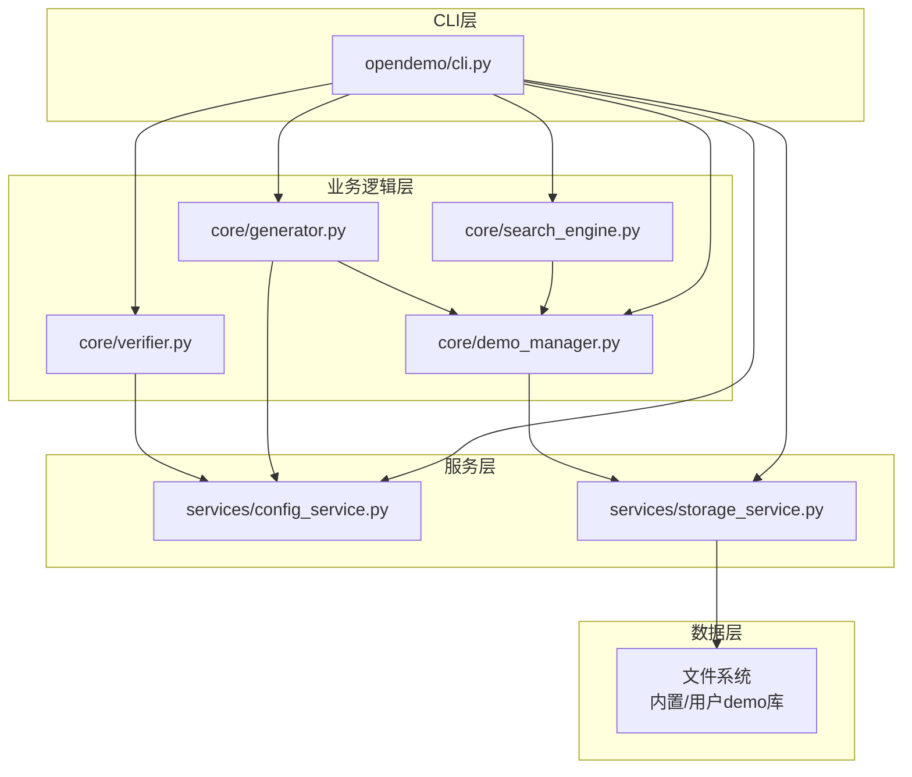
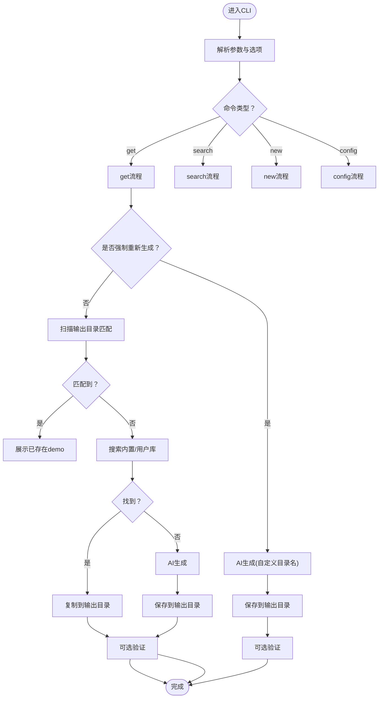
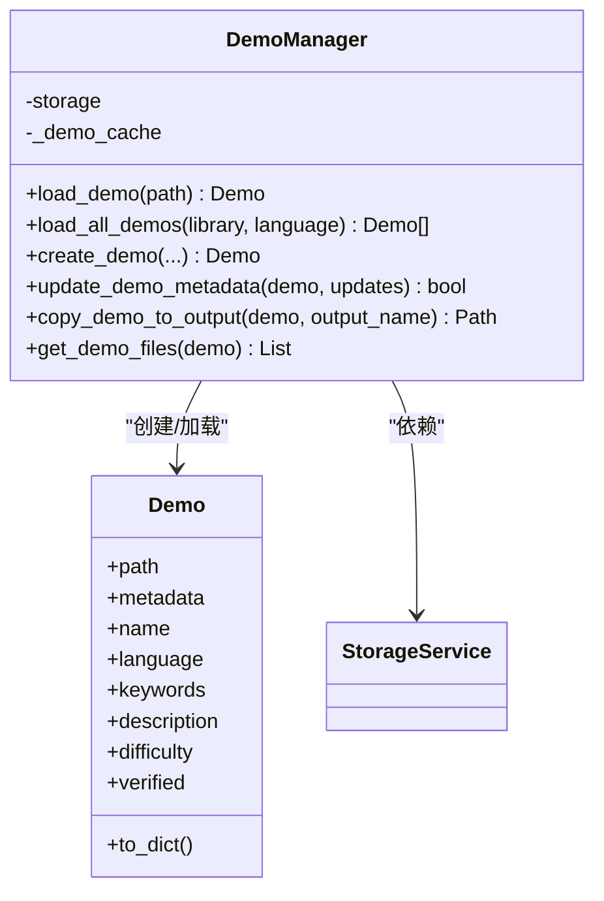
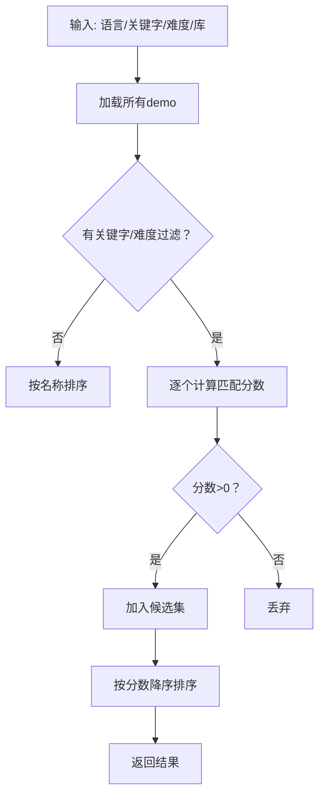
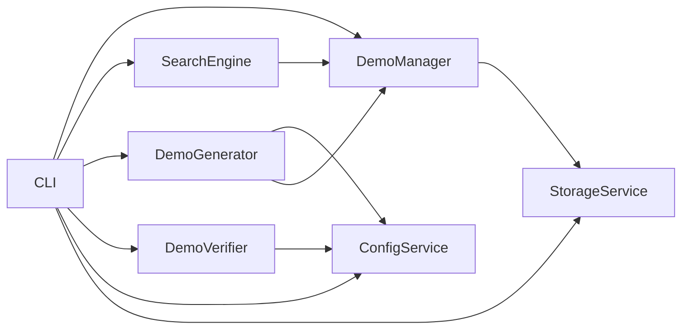

# 开发者指南

<cite>
**本文引用的文件**
- [PROJECT_SUMMARY.md](file://PROJECT_SUMMARY.md)
- [README.md](file://README.md)
- [pyproject.toml](file://pyproject.toml)
- [opendemo/cli.py](file://opendemo/cli.py)
- [opendemo/core/demo_manager.py](file://opendemo/core/demo_manager.py)
- [opendemo/core/search_engine.py](file://opendemo/core/search_engine.py)
- [opendemo/core/generator.py](file://opendemo/core/generator.py)
- [opendemo/core/verifier.py](file://opendemo/core/verifier.py)
- [opendemo/services/config_service.py](file://opendemo/services/config_service.py)
- [opendemo/services/storage_service.py](file://opendemo/services/storage_service.py)
- [opendemo/utils/formatters.py](file://opendemo/utils/formatters.py)
- [opendemo/builtin_demos/python/python-tuple-basics/metadata.json](file://opendemo/builtin_demos/python/python-tuple-basics/metadata.json)
- [opendemo/builtin_demos/python/python-tuple-basics/README.md](file://opendemo/builtin_demos/python/python-tuple-basics/README.md)
- [opendemo/builtin_demos/python/python-tuple-basics/requirements.txt](file://opendemo/builtin_demos/python/python-tuple-basics/requirements.txt)
</cite>

## 目录
1. [简介](#简介)
2. [项目结构](#项目结构)
3. [核心组件](#核心组件)
4. [架构总览](#架构总览)
5. [详细组件分析](#详细组件分析)
6. [依赖关系分析](#依赖关系分析)
7. [性能考量](#性能考量)
8. [故障排查指南](#故障排查指南)
9. [结论](#结论)
10. [附录](#附录)

## 简介
本指南面向希望参与 opendemo-cli 开发的贡献者，系统阐述其分层架构（CLI 层 → 业务逻辑层 → 服务层 → 数据层）、技术栈选择理由、开发与测试流程、以及模块化设计带来的优势与扩展点。读者将获得从命令入口到数据落盘的完整开发路径，并掌握如何在现有架构上新增特性或修复问题。

## 项目结构
opendemo-cli 采用清晰的分层组织：
- CLI 层：命令入口与用户交互，负责解析参数、调度业务逻辑、展示结果
- 业务逻辑层：Demo 管理、搜索、生成、验证、贡献管理
- 服务层：配置、存储、AI 服务
- 数据层：文件系统与内置/用户 demo 库



图表来源
- [opendemo/cli.py](file://opendemo/cli.py#L1-L610)
- [opendemo/core/demo_manager.py](file://opendemo/core/demo_manager.py#L1-L328)
- [opendemo/core/search_engine.py](file://opendemo/core/search_engine.py#L1-L264)
- [opendemo/core/generator.py](file://opendemo/core/generator.py#L1-L135)
- [opendemo/core/verifier.py](file://opendemo/core/verifier.py#L1-L270)
- [opendemo/services/config_service.py](file://opendemo/services/config_service.py#L1-L280)
- [opendemo/services/storage_service.py](file://opendemo/services/storage_service.py#L1-L277)

章节来源
- [PROJECT_SUMMARY.md](file://PROJECT_SUMMARY.md#L126-L157)
- [README.md](file://README.md#L62-L87)

## 核心组件
- CLI 命令组与子命令：get、search、new、config（init/set/get/list），统一通过 Click 框架实现
- Demo 管理器：封装 Demo 对象、元数据、文件组织、缓存与复制
- 搜索引擎：基于关键字与难度的评分与排序
- 生成器：协调 AI 服务生成 demo 并交由 Demo 管理器落盘
- 验证器：按语言执行可选验证，Python 使用虚拟环境隔离
- 配置服务：全局/项目配置合并、YAML 存储、校验
- 存储服务：双层 demo 库（内置只读 + 用户可写）与文件系统抽象
- 输出格式化：Rich 实现彩色输出、表格、面板与进度提示

章节来源
- [opendemo/cli.py](file://opendemo/cli.py#L1-L610)
- [opendemo/core/demo_manager.py](file://opendemo/core/demo_manager.py#L1-L328)
- [opendemo/core/search_engine.py](file://opendemo/core/search_engine.py#L1-L264)
- [opendemo/core/generator.py](file://opendemo/core/generator.py#L1-L135)
- [opendemo/core/verifier.py](file://opendemo/core/verifier.py#L1-L270)
- [opendemo/services/config_service.py](file://opendemo/services/config_service.py#L1-L280)
- [opendemo/services/storage_service.py](file://opendemo/services/storage_service.py#L1-L277)
- [opendemo/utils/formatters.py](file://opendemo/utils/formatters.py#L1-L188)

## 架构总览
分层设计理念与组件交互如下：
- CLI 层仅负责参数解析与流程编排，不直接操作文件系统
- 业务逻辑层专注领域模型与算法，如 Demo、评分与排序
- 服务层提供横切关注点，如配置合并、存储抽象、AI 适配
- 数据层通过存储服务屏蔽文件系统差异，支持内置与用户库

```mermaid
sequenceDiagram
participant U as "用户"
participant CLI as "CLI命令(get)"
participant CFG as "配置服务"
participant ST as "存储服务"
participant DM as "Demo管理器"
participant SE as "搜索引擎"
participant GEN as "生成器"
participant AI as "AI服务"
participant VER as "验证器"
U->>CLI : 输入语言+关键字
CLI->>CFG : 读取配置
CLI->>ST : 获取输出目录
CLI->>CLI : 检查是否强制重新生成
alt 非强制
CLI->>CLI : 扫描输出目录匹配
opt 匹配到
CLI-->>U : 展示已存在demo
CLI->>VER : 可选验证
VER-->>CLI : 验证结果
CLI-->>U : 展示结果
else 未匹配
CLI->>SE : 搜索内置/用户库
alt 搜索到
CLI->>DM : 复制到输出目录
CLI->>VER : 可选验证
VER-->>CLI : 验证结果
CLI-->>U : 展示结果
else 未搜索到
CLI->>GEN : 调用AI生成
GEN->>AI : 生成demo
AI-->>GEN : 返回结构化数据
GEN->>DM : 保存到输出目录
CLI->>VER : 可选验证
VER-->>CLI : 验证结果
CLI-->>U : 展示结果
end
end
else 强制重新生成
CLI->>GEN : 调用AI生成(自定义目录名)
GEN->>AI : 生成demo
AI-->>GEN : 返回结构化数据
GEN->>DM : 保存到输出目录
CLI->>VER : 可选验证
VER-->>CLI : 验证结果
CLI-->>U : 展示结果
end
```

图表来源
- [opendemo/cli.py](file://opendemo/cli.py#L196-L324)
- [opendemo/core/search_engine.py](file://opendemo/core/search_engine.py#L26-L66)
- [opendemo/core/generator.py](file://opendemo/core/generator.py#L31-L103)
- [opendemo/core/verifier.py](file://opendemo/core/verifier.py#L31-L129)
- [opendemo/services/config_service.py](file://opendemo/services/config_service.py#L76-L107)
- [opendemo/services/storage_service.py](file://opendemo/services/storage_service.py#L213-L222)

## 详细组件分析

### CLI 层（命令与交互）
- 命令分组：version、get、search、new、config（init/set/get/list）
- 语言支持：python、java（预留）
- 输出：统一通过 Rich 格式化，含成功/错误/警告/信息/进度等
- 流程控制：异常捕获、键盘中断处理、日志记录



图表来源
- [opendemo/cli.py](file://opendemo/cli.py#L196-L324)
- [opendemo/utils/formatters.py](file://opendemo/utils/formatters.py#L1-L188)

章节来源
- [opendemo/cli.py](file://opendemo/cli.py#L1-L610)
- [opendemo/utils/formatters.py](file://opendemo/utils/formatters.py#L1-L188)

### 业务逻辑层

#### Demo 管理器（DemoManager）
- Demo 类：封装路径、元数据与属性访问
- 缓存：按绝对路径缓存 Demo，避免重复加载
- 功能：加载、创建、复制、文件枚举、元数据更新



图表来源
- [opendemo/core/demo_manager.py](file://opendemo/core/demo_manager.py#L16-L328)
- [opendemo/services/storage_service.py](file://opendemo/services/storage_service.py#L1-L277)

章节来源
- [opendemo/core/demo_manager.py](file://opendemo/core/demo_manager.py#L1-L328)

#### 搜索引擎（SearchEngine）
- 加载所有 demo，按关键字与难度计算匹配分数
- 排序策略：按分数降序；无过滤条件时按名称排序
- 统计与查询：按语言/难度统计、关键词聚合、精确查找



图表来源
- [opendemo/core/search_engine.py](file://opendemo/core/search_engine.py#L26-L66)

章节来源
- [opendemo/core/search_engine.py](file://opendemo/core/search_engine.py#L1-L264)

#### 生成器（DemoGenerator）
- 协调 AI 服务生成 demo，补充元数据并交由 Demo 管理器保存
- 支持重新生成：删除旧 demo 后生成新 demo

章节来源
- [opendemo/core/generator.py](file://opendemo/core/generator.py#L1-L135)

#### 验证器（DemoVerifier）
- Python：虚拟环境隔离、依赖安装、代码执行、超时控制
- Java：占位实现（提示未完全实现）
- 报告生成：汇总步骤、输出与错误

章节来源
- [opendemo/core/verifier.py](file://opendemo/core/verifier.py#L1-L270)

### 服务层

#### 配置服务（ConfigService）
- 默认配置、全局/项目配置合并、YAML 存储
- 键值访问支持点分隔嵌套键
- 校验：API 密钥、输出目录、超时参数等

章节来源
- [opendemo/services/config_service.py](file://opendemo/services/config_service.py#L1-L280)

#### 存储服务（StorageService）
- 双层 demo 库：内置只读库与用户可写库
- 文件系统抽象：元数据读写、demo 复制/删除、输出目录管理
- 辅助：读写文件、确保目录存在

章节来源
- [opendemo/services/storage_service.py](file://opendemo/services/storage_service.py#L1-L277)

### 数据层
- 内置 demo 库：随包分发，路径通过包定位
- 用户 demo 库：默认位于用户目录，可配置
- 输出目录：默认 ./opendemo_output，可配置

章节来源
- [opendemo/services/storage_service.py](file://opendemo/services/storage_service.py#L30-L48)
- [opendemo/services/config_service.py](file://opendemo/services/config_service.py#L21-L27)

### 工具模块
- 输出格式化：彩色输出、表格、面板、Markdown、进度提示
- 日志：统一日志初始化与记录

章节来源
- [opendemo/utils/formatters.py](file://opendemo/utils/formatters.py#L1-L188)

## 依赖关系分析
- CLI 依赖：业务逻辑层（DemoManager、SearchEngine、DemoGenerator、DemoVerifier）、服务层（ConfigService、StorageService）、工具（formatters、logger）
- 业务逻辑层：DemoManager 依赖 StorageService；SearchEngine 依赖 DemoManager；Generator 依赖 AI 服务与 DemoManager；Verifier 依赖 ConfigService
- 服务层：ConfigService 与 StorageService 分别被各层复用
- 外部依赖：Click、Rich、PyYAML、Requests、colorama（可选 docker/git）



图表来源
- [opendemo/cli.py](file://opendemo/cli.py#L1-L610)
- [opendemo/core/demo_manager.py](file://opendemo/core/demo_manager.py#L1-L328)
- [opendemo/core/search_engine.py](file://opendemo/core/search_engine.py#L1-L264)
- [opendemo/core/generator.py](file://opendemo/core/generator.py#L1-L135)
- [opendemo/core/verifier.py](file://opendemo/core/verifier.py#L1-L270)
- [opendemo/services/config_service.py](file://opendemo/services/config_service.py#L1-L280)
- [opendemo/services/storage_service.py](file://opendemo/services/storage_service.py#L1-L277)

章节来源
- [pyproject.toml](file://pyproject.toml#L30-L52)

## 性能考量
- 缓存：DemoManager 对 Demo 对象进行缓存，减少重复加载
- I/O：批量复制/删除 demo 前先检查目标路径，避免不必要的 I/O
- 搜索：按关键字与难度评分，命中率高的 demo 优先返回
- 验证：Python 验证使用虚拟环境隔离，避免污染系统环境；超时控制防止长时间阻塞

章节来源
- [opendemo/core/demo_manager.py](file://opendemo/core/demo_manager.py#L87-L110)
- [opendemo/services/storage_service.py](file://opendemo/services/storage_service.py#L167-L189)
- [opendemo/core/search_engine.py](file://opendemo/core/search_engine.py#L67-L129)
- [opendemo/core/verifier.py](file://opendemo/core/verifier.py#L185-L193)

## 故障排查指南
- 配置问题
  - 确认全局/项目配置文件存在且可读
  - 使用 config list 查看当前配置，隐藏敏感信息
  - 使用 config validate 校验关键项（如 API 密钥、输出目录）
- AI 生成失败
  - 检查 AI API 密钥是否配置
  - 观察生成器日志与错误输出
- 验证失败
  - Python 验证：确认虚拟环境创建、依赖安装、执行脚本返回码
  - 超时：适当提高 verification_timeout
- 搜索不到 demo
  - 确认关键字拼写与大小写
  - 使用 search 无参查看支持语言与数量
- 输出目录权限
  - 确认输出目录可写，必要时调整权限或更换目录

章节来源
- [opendemo/services/config_service.py](file://opendemo/services/config_service.py#L243-L271)
- [opendemo/cli.py](file://opendemo/cli.py#L473-L538)
- [opendemo/core/verifier.py](file://opendemo/core/verifier.py#L185-L203)

## 结论
opendemo-cli 通过清晰的分层架构与模块化设计，实现了 CLI 交互、业务逻辑、服务与数据层的职责分离。Click、Rich、PyYAML 等库的选择提升了开发效率与用户体验。建议贡献者遵循现有分层与依赖约定，在服务层扩展新能力，在业务逻辑层完善算法与模型，在 CLI 层保持薄层编排与良好输出。

## 附录

### 技术栈选择理由
- Click：命令行框架，简洁易用，适合 CLI 工具
- Rich：终端输出美化，支持表格、面板、Markdown，提升可读性
- PyYAML：配置文件存储，支持嵌套键与合并
- Requests：HTTP 请求，便于对接外部 API
- colorama：跨平台彩色输出支持

章节来源
- [PROJECT_SUMMARY.md](file://PROJECT_SUMMARY.md#L100-L108)
- [pyproject.toml](file://pyproject.toml#L30-L36)

### 开发环境设置
- 克隆仓库并安装开发依赖
- 运行命令：pip install -e ".[dev]"

章节来源
- [README.md](file://README.md#L113-L119)

### 运行测试与代码格式化
- 运行测试：pytest
- 代码格式化：black opendemo/

章节来源
- [README.md](file://README.md#L121-L131)
- [pyproject.toml](file://pyproject.toml#L78-L84)

### 模块化设计优势与扩展点
- 优势
  - 耦合度低：各层职责清晰，易于独立演进
  - 可测试性强：依赖注入与接口抽象便于单元测试
  - 可扩展：新增语言/库只需扩展对应层与服务
- 扩展点
  - 新增语言：在 CLI 层增加语言支持、在存储层扩展库路径、在验证器扩展语言验证
  - 新增服务：新增服务类并在 CLI/业务逻辑层注入使用
  - 新增命令：在 CLI 层注册新命令并编写流程

章节来源
- [PROJECT_SUMMARY.md](file://PROJECT_SUMMARY.md#L242-L275)
- [opendemo/cli.py](file://opendemo/cli.py#L196-L324)

### Demo 结构与内置示例
- 典型结构：metadata.json、README.md、code/、requirements.txt、tests/（可选）
- 内置示例：python-tuple-basics 展示了标准 demo 的组织方式与文档规范

章节来源
- [README.md](file://README.md#L102-L109)
- [opendemo/builtin_demos/python/python-tuple-basics/metadata.json](file://opendemo/builtin_demos/python/python-tuple-basics/metadata.json#L1-L14)
- [opendemo/builtin_demos/python/python-tuple-basics/README.md](file://opendemo/builtin_demos/python/python-tuple-basics/README.md#L1-L89)
- [opendemo/builtin_demos/python/python-tuple-basics/requirements.txt](file://opendemo/builtin_demos/python/python-tuple-basics/requirements.txt#L1-L2)