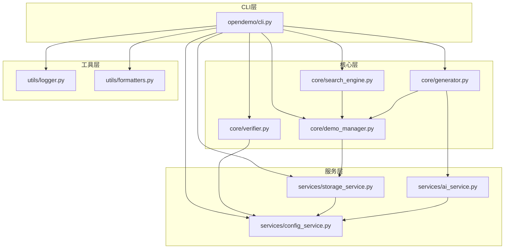
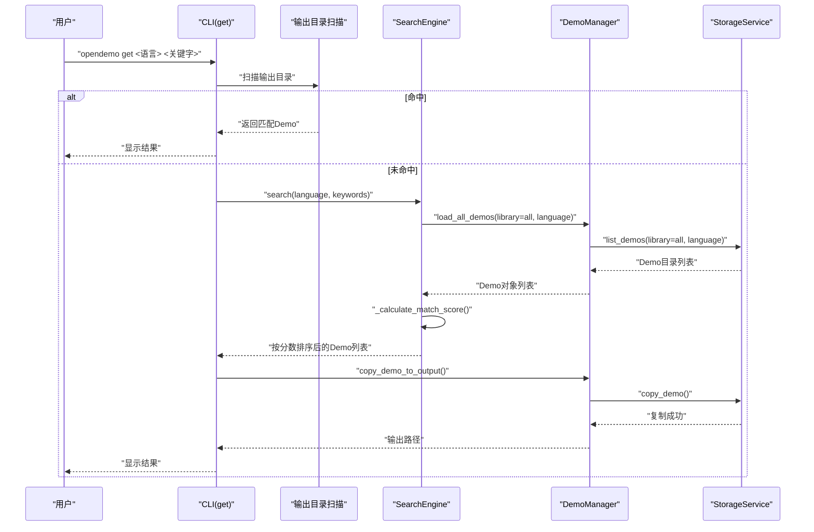
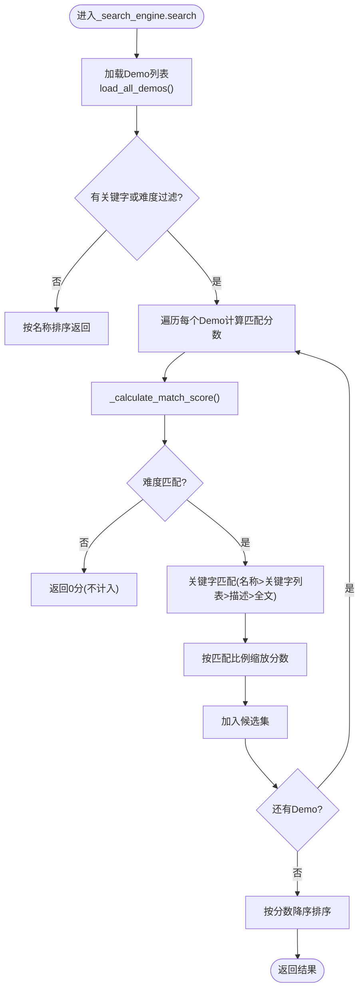
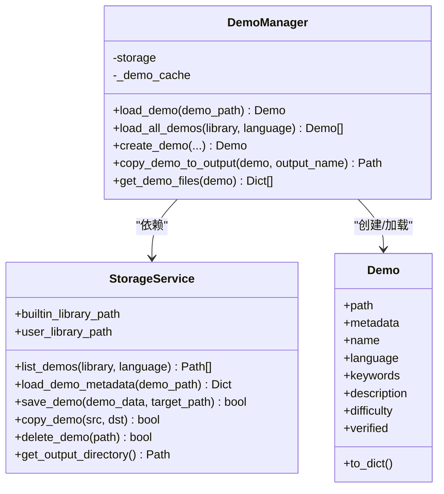
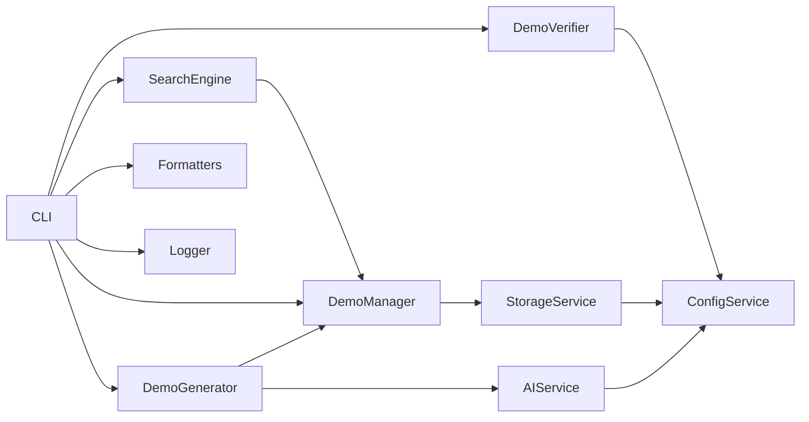

# 搜索引擎测试

<cite>
**本文引用的文件**
- [opendemo/core/search_engine.py](file://opendemo/core/search_engine.py)
- [opendemo/core/demo_manager.py](file://opendemo/core/demo_manager.py)
- [opendemo/services/storage_service.py](file://opendemo/services/storage_service.py)
- [opendemo/services/ai_service.py](file://opendemo/services/ai_service.py)
- [opendemo/core/generator.py](file://opendemo/core/generator.py)
- [opendemo/core/verifier.py](file://opendemo/core/verifier.py)
- [opendemo/services/config_service.py](file://opendemo/services/config_service.py)
- [opendemo/utils/logger.py](file://opendemo/utils/logger.py)
- [opendemo/utils/formatters.py](file://opendemo/utils/formatters.py)
- [opendemo/cli.py](file://opendemo/cli.py)
- [tests/test_search_engine.py](file://tests/test_search_engine.py)
- [README.md](file://README.md)
</cite>

## 目录
1. [引言](#引言)
2. [项目结构](#项目结构)
3. [核心组件](#核心组件)
4. [架构总览](#架构总览)
5. [详细组件分析](#详细组件分析)
6. [依赖关系分析](#依赖关系分析)
7. [性能考量](#性能考量)
8. [故障排查指南](#故障排查指南)
9. [结论](#结论)
10. [附录](#附录)

## 引言
本文件围绕“搜索引擎测试”主题，系统梳理与“搜索”能力相关的代码结构、数据流与测试策略，帮助读者快速理解如何在该CLI工具中实现并验证Demo的检索与匹配能力。文档同时给出面向非技术用户的可读性说明，并通过图示展示关键流程与依赖关系。

## 项目结构
该项目采用分层架构：CLI入口负责命令编排，服务层提供配置、存储、AI等基础能力，核心层封装业务逻辑（Demo管理、搜索、生成、验证），工具层提供日志与输出格式化。搜索功能由“搜索引擎”主导，依赖“Demo管理器”加载Demo，后者通过“存储服务”扫描与读取Demo目录及元数据。

图表来源
- [opendemo/cli.py](file://opendemo/cli.py#L1-L120)
- [opendemo/core/search_engine.py](file://opendemo/core/search_engine.py#L1-L60)
- [opendemo/core/demo_manager.py](file://opendemo/core/demo_manager.py#L1-L60)
- [opendemo/services/storage_service.py](file://opendemo/services/storage_service.py#L1-L60)
- [opendemo/services/ai_service.py](file://opendemo/services/ai_service.py#L1-L60)
- [opendemo/core/generator.py](file://opendemo/core/generator.py#L1-L40)
- [opendemo/core/verifier.py](file://opendemo/core/verifier.py#L1-L40)
- [opendemo/services/config_service.py](file://opendemo/services/config_service.py#L1-L60)
- [opendemo/utils/logger.py](file://opendemo/utils/logger.py#L1-L40)
- [opendemo/utils/formatters.py](file://opendemo/utils/formatters.py#L1-L40)

章节来源
- [README.md](file://README.md#L60-L110)

## 核心组件
- 搜索引擎(SearchEngine)
  - 负责在Demo库中按语言、关键字、难度进行过滤与评分排序；提供精确查找、关键字查找、统计查询等能力。
- Demo管理器(DemoManager)
  - 负责加载Demo、缓存、创建/复制/列举Demo文件等；依赖存储服务进行文件系统操作。
- 存储服务(StorageService)
  - 负责扫描内置与用户库、读写元数据、复制/删除Demo、输出目录管理等。
- CLI入口(cli.py)
  - 提供get/search/new等命令，串联配置、存储、搜索、生成、验证等流程。

章节来源
- [opendemo/core/search_engine.py](file://opendemo/core/search_engine.py#L1-L120)
- [opendemo/core/demo_manager.py](file://opendemo/core/demo_manager.py#L74-L131)
- [opendemo/services/storage_service.py](file://opendemo/services/storage_service.py#L49-L105)
- [opendemo/cli.py](file://opendemo/cli.py#L196-L324)

## 架构总览
搜索流程从CLI入口发起，优先在输出目录匹配，再回退到本地库搜索，最后在未命中时通过AI生成。搜索的核心在于“评分+排序”，并在无过滤条件时按名称排序返回全部Demo。

图表来源
- [opendemo/cli.py](file://opendemo/cli.py#L240-L274)
- [opendemo/core/search_engine.py](file://opendemo/core/search_engine.py#L26-L66)
- [opendemo/core/demo_manager.py](file://opendemo/core/demo_manager.py#L111-L131)
- [opendemo/services/storage_service.py](file://opendemo/services/storage_service.py#L49-L83)

## 详细组件分析

### 搜索引擎(SearchEngine)分析
- 能力概览
  - 搜索：支持语言、关键字、难度过滤；无过滤条件时按名称排序返回。
  - 精确查找：按名称精确匹配。
  - 关键字查找：快捷调用搜索接口。
  - 统计：统计总数、按语言/难度分布、已验证数量。
  - 词库：获取所有语言、关键字集合。
- 匹配评分算法
  - 难度精确匹配，不匹配直接返回0分。
  - 名称匹配权重最高，关键字列表匹配次之，描述匹配再次之，整体文本匹配最低。
  - 最终分数按“匹配关键字比例”进行缩放。
- 排序策略
  - 当无过滤条件时，按Demo名称升序排序；否则按匹配分数降序排序。

图表来源
- [opendemo/core/search_engine.py](file://opendemo/core/search_engine.py#L26-L129)
- [opendemo/core/search_engine.py](file://opendemo/core/search_engine.py#L131-L159)

章节来源
- [opendemo/core/search_engine.py](file://opendemo/core/search_engine.py#L26-L207)

### Demo管理器(DemoManager)分析
- 职责
  - 加载单个Demo并缓存，避免重复IO。
  - 加载全部Demo，支持按库(内置/用户/全部)与语言过滤。
  - 创建Demo(生成metadata与文件)，复制到输出目录，列举文件信息。
- 关键点
  - 缓存键基于绝对路径，更新元数据后清理对应缓存。
  - 文件列举时跳过隐藏文件与缓存目录，自动识别常见文件类型并给出描述。

图表来源
- [opendemo/core/demo_manager.py](file://opendemo/core/demo_manager.py#L16-L73)
- [opendemo/core/demo_manager.py](file://opendemo/core/demo_manager.py#L74-L131)
- [opendemo/services/storage_service.py](file://opendemo/services/storage_service.py#L16-L83)

章节来源
- [opendemo/core/demo_manager.py](file://opendemo/core/demo_manager.py#L74-L329)
- [opendemo/services/storage_service.py](file://opendemo/services/storage_service.py#L16-L277)

### 存储服务(StorageService)分析
- 职责
  - 确定内置与用户Demo库根路径。
  - 扫描Demo目录(包含metadata.json即视为Demo)。
  - 读写元数据、保存/复制/删除Demo、确保输出目录存在。
- 关键点
  - 按库与语言组合搜索，支持递归遍历。
  - 读写文件均带异常处理与日志记录。

章节来源
- [opendemo/services/storage_service.py](file://opendemo/services/storage_service.py#L16-L277)

### CLI入口(cli.py)与搜索命令
- get命令
  - 优先在输出目录按关键字匹配，若未命中再在本地库搜索；未命中且未强制new时，检查AI密钥后通过生成器调用AI生成。
- search命令
  - 支持列出某语言全部Demo或按关键字过滤，按名称排序展示。
- new命令
  - 通过生成器调用AI生成新Demo，可选择难度并可选验证。

章节来源
- [opendemo/cli.py](file://opendemo/cli.py#L196-L384)
- [opendemo/cli.py](file://opendemo/cli.py#L386-L471)

### 测试用例(test_search_engine.py)分析
- 覆盖点
  - 初始化、空库返回、无过滤返回全部、关键字过滤、难度过滤、精确查找、语言与统计查询、排序正确性。
- 方法映射
  - 搜索与评分：_calculate_match_score
  - 排序：_sort_demos
  - 精确查找：find_exact
  - 语言/统计：get_all_languages、get_statistics

章节来源
- [tests/test_search_engine.py](file://tests/test_search_engine.py#L1-L194)

## 依赖关系分析
- 搜索引擎依赖Demo管理器加载Demo；Demo管理器依赖存储服务进行文件系统操作。
- CLI层在不同命令中按需注入配置、存储、搜索、生成、验证等服务。
- 日志与输出格式化贯穿各层，保证可观测性与用户体验。

图表来源
- [opendemo/core/search_engine.py](file://opendemo/core/search_engine.py#L1-L40)
- [opendemo/core/demo_manager.py](file://opendemo/core/demo_manager.py#L74-L110)
- [opendemo/services/storage_service.py](file://opendemo/services/storage_service.py#L16-L48)
- [opendemo/cli.py](file://opendemo/cli.py#L1-L60)
- [opendemo/core/generator.py](file://opendemo/core/generator.py#L15-L38)
- [opendemo/core/verifier.py](file://opendemo/core/verifier.py#L19-L40)
- [opendemo/services/ai_service.py](file://opendemo/services/ai_service.py#L16-L37)
- [opendemo/services/config_service.py](file://opendemo/services/config_service.py#L16-L49)
- [opendemo/utils/formatters.py](file://opendemo/utils/formatters.py#L1-L40)
- [opendemo/utils/logger.py](file://opendemo/utils/logger.py#L1-L40)

## 性能考量
- 缓存
  - Demo管理器对已加载的Demo进行缓存，减少重复读取元数据与构造对象的成本。
- IO优化
  - 存储服务扫描Demo时使用递归遍历，建议在大型库中合理组织目录结构，避免过多层级。
- 排序复杂度
  - 无过滤时按名称排序；有过滤时对候选集进行一次评分与排序，整体复杂度近似O(n)评分+O(m log m)排序。
- 并发与重试
  - AI服务具备重试机制，可在网络波动时提升成功率。

章节来源
- [opendemo/core/demo_manager.py](file://opendemo/core/demo_manager.py#L87-L110)
- [opendemo/services/storage_service.py](file://opendemo/services/storage_service.py#L84-L105)
- [opendemo/core/search_engine.py](file://opendemo/core/search_engine.py#L26-L66)
- [opendemo/services/ai_service.py](file://opendemo/services/ai_service.py#L68-L86)

## 故障排查指南
- 搜索无结果
  - 确认Demo库中是否存在对应语言与关键字；可通过统计接口确认Demo总量与分布。
  - 若输出目录为空，检查输出目录配置与权限。
- 精确查找失败
  - 注意大小写与命名规范；精确查找严格匹配名称。
- AI生成失败
  - 检查AI API密钥配置；查看重试次数与间隔设置；确认网络连通性。
- 验证失败
  - Python依赖安装失败或代码执行超时；检查requirements与执行脚本；适当提高超时配置。

章节来源
- [opendemo/core/search_engine.py](file://opendemo/core/search_engine.py#L161-L179)
- [opendemo/services/config_service.py](file://opendemo/services/config_service.py#L220-L280)
- [opendemo/services/ai_service.py](file://opendemo/services/ai_service.py#L292-L329)
- [opendemo/core/verifier.py](file://opendemo/core/verifier.py#L19-L60)

## 结论
该搜索功能以“评分+排序”的方式在Demo库中高效定位目标，结合输出目录优先匹配与AI生成回退，形成闭环体验。测试用例覆盖了关键路径，保障了稳定性。建议在生产环境中持续关注缓存命中率、IO路径与网络重试策略，以进一步提升性能与可靠性。

## 附录
- 常用命令参考
  - 搜索Demo：opendemo search <语言> [关键字]
  - 获取Demo：opendemo get <语言> <关键字> [new]
  - 新建Demo：opendemo new <语言> "<主题>" [--difficulty <级别>] [--verify]
- 配置项参考
  - output_directory、user_demo_library、enable_verification、ai.api_key、ai.model、ai.retry_times、ai.retry_interval、ai.timeout、ai.temperature、ai.max_tokens

章节来源
- [README.md](file://README.md#L27-L60)
- [opendemo/services/config_service.py](file://opendemo/services/config_service.py#L16-L49)