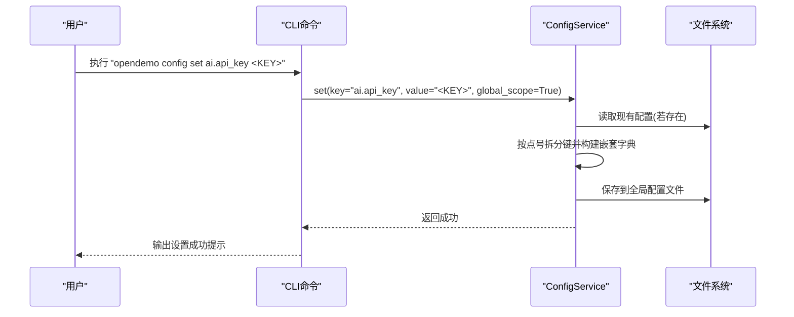
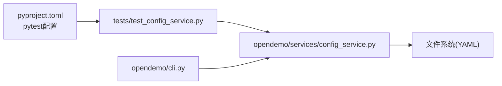

# 配置服务测试

<cite>
**本文引用的文件**
- [tests/test_config_service.py](file://tests/test_config_service.py)
- [opendemo/services/config_service.py](file://opendemo/services/config_service.py)
- [opendemo/cli.py](file://opendemo/cli.py)
- [pyproject.toml](file://pyproject.toml)
- [README.md](file://README.md)
- [tests/test_demo_manager.py](file://tests/test_demo_manager.py)
- [tests/test_search_engine.py](file://tests/test_search_engine.py)
</cite>

## 目录
1. [引言](#引言)
2. [项目结构](#项目结构)
3. [核心组件](#核心组件)
4. [架构总览](#架构总览)
5. [详细组件分析](#详细组件分析)
6. [依赖关系分析](#依赖关系分析)
7. [性能考量](#性能考量)
8. [故障排查指南](#故障排查指南)
9. [结论](#结论)
10. [附录](#附录)

## 引言
本文件聚焦于“配置服务测试”，围绕配置服务的单元测试用例、配置服务实现、以及与之相关的CLI命令行为进行系统化梳理。目标是帮助读者理解配置服务如何被测试、如何加载与合并配置、如何设置与校验配置，并在CLI中如何体现配置的影响。

## 项目结构
- 测试位于 tests/ 目录，其中 tests/test_config_service.py 是本次关注的核心测试文件。
- 配置服务实现位于 opendemo/services/config_service.py。
- CLI入口位于 opendemo/cli.py，其中包含配置相关的命令组与命令，贯穿配置服务的使用路径。
- 项目使用 pytest 作为测试框架，测试配置在 pyproject.toml 中定义。

```mermaid
graph TB
subgraph "测试"
T1["tests/test_config_service.py"]
T2["tests/test_demo_manager.py"]
T3["tests/test_search_engine.py"]
end
subgraph "服务层"
C1["opendemo/services/config_service.py"]
end
subgraph "CLI"
CLI["opendemo/cli.py"]
end
T1 --> C1
CLI --> C1
T2 --> C1
T3 --> C1
```

图表来源
- [tests/test_config_service.py](file://tests/test_config_service.py#L1-L119)
- [opendemo/services/config_service.py](file://opendemo/services/config_service.py#L1-L280)
- [opendemo/cli.py](file://opendemo/cli.py#L473-L540)

章节来源
- [pyproject.toml](file://pyproject.toml#L78-L84)
- [README.md](file://README.md#L62-L87)

## 核心组件
- 配置服务：负责默认配置、全局与项目配置的加载、合并、键访问、设置写入、初始化、校验与全量导出。
- CLI配置命令：提供 config init、config set、config get、config list 等命令，直接调用配置服务完成配置生命周期管理。
- 测试用例：覆盖初始化、默认配置、键访问（含嵌套）、不存在键、全量导出、校验、合并策略等。

章节来源
- [opendemo/services/config_service.py](file://opendemo/services/config_service.py#L16-L280)
- [tests/test_config_service.py](file://tests/test_config_service.py#L10-L119)
- [opendemo/cli.py](file://opendemo/cli.py#L473-L540)

## 架构总览
配置服务在CLI中的典型调用链路如下：
- CLI解析命令后，构造 ConfigService 实例
- 通过 get/set/init/validate/get_all 等方法完成配置管理
- CLI在执行 get/new 等命令前，会读取配置决定行为（例如是否启用验证、API密钥是否存在）



图表来源
- [opendemo/cli.py](file://opendemo/cli.py#L488-L510)
- [opendemo/services/config_service.py](file://opendemo/services/config_service.py#L170-L203)

## 详细组件分析

### 配置服务类与测试要点
- 初始化与默认配置
  - 初始化时确定全局配置路径与项目配置路径，确保用户目录存在。
  - 默认配置包含输出目录、AI配置、贡献配置、显示配置等。
- 加载与合并
  - 加载顺序：默认配置 -> 全局配置 -> 项目配置；后者覆盖前者。
  - 合并策略：字典递归合并，非字典键直接覆盖。
- 键访问与嵌套键
  - 支持点号分隔的嵌套键访问；不存在键返回 None 或默认值。
- 设置与保存
  - 支持设置全局或项目范围配置；按点号构建嵌套结构并写回YAML。
- 校验
  - 校验AI API密钥、输出目录可写性、验证超时等。
- 全量导出
  - 返回配置副本，避免外部修改影响内部状态。

测试覆盖点
- 初始化与默认配置键存在性
- get/get_all/get嵌套键与不存在键行为
- validate 返回有效性与错误列表
- 合并策略（简单与嵌套）

章节来源
- [opendemo/services/config_service.py](file://opendemo/services/config_service.py#L51-L106)
- [opendemo/services/config_service.py](file://opendemo/services/config_service.py#L108-L146)
- [opendemo/services/config_service.py](file://opendemo/services/config_service.py#L147-L168)
- [opendemo/services/config_service.py](file://opendemo/services/config_service.py#L170-L203)
- [opendemo/services/config_service.py](file://opendemo/services/config_service.py#L220-L242)
- [opendemo/services/config_service.py](file://opendemo/services/config_service.py#L243-L280)
- [tests/test_config_service.py](file://tests/test_config_service.py#L13-L119)

### CLI配置命令与配置服务联动
- config init：初始化全局配置文件，可传入API密钥。
- config set：设置配置项（支持布尔、整数类型转换），默认写入全局配置。
- config get：读取配置项，隐藏敏感信息。
- config list：列出全部配置。

这些命令均直接调用配置服务的方法，形成端到端的测试场景。

章节来源
- [opendemo/cli.py](file://opendemo/cli.py#L473-L540)
- [opendemo/services/config_service.py](file://opendemo/services/config_service.py#L220-L242)
- [opendemo/services/config_service.py](file://opendemo/services/config_service.py#L170-L203)
- [opendemo/services/config_service.py](file://opendemo/services/config_service.py#L272-L280)

### 配置服务与其它组件的交互
- 与存储服务：输出目录由配置驱动，存储服务据此创建/读写。
- 与AI服务：AI配置（模型、温度、超时、重试等）来自配置。
- 与演示管理器：演示管理器在创建/复制演示时依赖输出目录与用户库路径。
- 与搜索引擎：搜索结果排序与统计依赖演示库路径与语言集合。

章节来源
- [opendemo/services/storage_service.py](file://opendemo/services/storage_service.py#L213-L222)
- [opendemo/services/ai_service.py](file://opendemo/services/ai_service.py#L19-L37)
- [opendemo/core/demo_manager.py](file://opendemo/core/demo_manager.py#L168-L174)
- [opendemo/core/search_engine.py](file://opendemo/core/search_engine.py#L193-L207)

## 依赖关系分析
- 测试依赖
  - tests/test_config_service.py 依赖 opendemo/services/config_service.py。
  - CLI命令依赖配置服务，从而间接依赖文件系统与YAML。
- 外部依赖
  - YAML解析与请求调用由第三方库提供，配置服务在加载/保存时使用。
- 测试运行配置
  - pytest 在 pyproject.toml 中配置了测试路径、命名约定与覆盖率报告选项。



图表来源
- [pyproject.toml](file://pyproject.toml#L78-L84)
- [tests/test_config_service.py](file://tests/test_config_service.py#L1-L119)
- [opendemo/services/config_service.py](file://opendemo/services/config_service.py#L1-L280)
- [opendemo/cli.py](file://opendemo/cli.py#L473-L540)

章节来源
- [pyproject.toml](file://pyproject.toml#L78-L84)

## 性能考量
- 配置缓存
  - 配置服务在首次加载后缓存结果，后续调用直接返回，避免重复I/O。
- 合并复杂度
  - 递归合并字典的时间复杂度与嵌套深度和键数量相关；默认配置规模较小，通常不影响性能。
- YAML读写
  - 仅在设置配置或初始化时触发写入；读取频率较高但受缓存保护。
- CLI调用
  - CLI命令在执行前会多次读取配置，得益于缓存机制，开销可控。

章节来源
- [opendemo/services/config_service.py](file://opendemo/services/config_service.py#L76-L106)
- [opendemo/services/config_service.py](file://opendemo/services/config_service.py#L126-L146)

## 故障排查指南
- 配置文件无法加载
  - 现象：加载配置时出现错误日志。
  - 排查：确认全局/项目配置文件路径是否存在、权限是否正确、YAML语法是否合法。
  - 参考实现：加载异常时记录错误并返回空配置。
- 设置配置失败
  - 现象：config set 保存失败。
  - 排查：检查目标路径可写性、磁盘空间、YAML序列化是否异常。
  - 参考实现：保存异常会抛出异常并记录错误。
- API密钥缺失导致AI调用失败
  - 现象：AI服务报错或返回None。
  - 排查：使用 config get 检查 ai.api_key 是否已设置；必要时使用 config init 或 config set。
- 验证失败
  - 现象：validate 返回错误列表。
  - 排查：检查输出目录可写性、验证超时配置是否为正整数。
- CLI命令报错
  - 现象：命令执行中断或提示配置缺失。
  - 排查：根据CLI提示运行 config init 或设置相应配置项。

章节来源
- [opendemo/services/config_service.py](file://opendemo/services/config_service.py#L108-L125)
- [opendemo/services/config_service.py](file://opendemo/services/config_service.py#L204-L219)
- [opendemo/services/config_service.py](file://opendemo/services/config_service.py#L243-L271)
- [opendemo/cli.py](file://opendemo/cli.py#L283-L288)
- [opendemo/cli.py](file://opendemo/cli.py#L410-L414)

## 结论
配置服务测试覆盖了初始化、默认配置、键访问、合并策略、设置写入、校验与全量导出等关键路径。CLI配置命令与配置服务紧密耦合，测试应围绕这些命令与配置服务方法展开，确保配置在不同场景下的正确性与鲁棒性。建议持续补充针对边界条件（如非法YAML、空值、类型转换）与异常流程（文件权限、网络异常）的测试用例。

## 附录

### 配置服务方法与测试对应关系
- 初始化与默认配置
  - 测试：test_init、test_default_config
  - 方法：__init__、DEFAULT_CONFIG
- 键访问与嵌套键
  - 测试：test_get_default_value、test_get_nested_key、test_get_nonexistent_key
  - 方法：get
- 全量导出
  - 测试：test_get_all
  - 方法：get_all
- 合并策略
  - 测试：test_merge_simple、test_merge_nested
  - 方法：_merge_config
- 校验
  - 测试：test_validate
  - 方法：validate
- 设置与保存
  - 测试：无显式测试（可通过集成测试覆盖）
  - 方法：set、_save_yaml、init_config

章节来源
- [tests/test_config_service.py](file://tests/test_config_service.py#L13-L119)
- [opendemo/services/config_service.py](file://opendemo/services/config_service.py#L16-L280)

### CLI配置命令与配置服务方法映射
- config init -> init_config
- config set -> set
- config get -> get
- config list -> get_all

章节来源
- [opendemo/cli.py](file://opendemo/cli.py#L479-L540)
- [opendemo/services/config_service.py](file://opendemo/services/config_service.py#L220-L242)
- [opendemo/services/config_service.py](file://opendemo/services/config_service.py#L170-L203)
- [opendemo/services/config_service.py](file://opendemo/services/config_service.py#L272-L280)