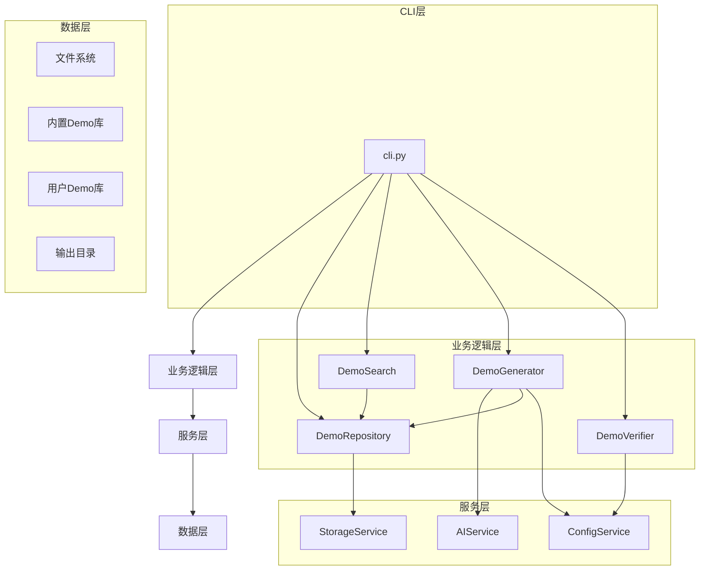

# 项目概述

<cite>
**本文档引用的文件**   
- [README.md](file://README.md)
- [ABOUT.md](file://ABOUT.md)
</cite>

## 目录
1. [简介](#简介)
2. [项目结构](#项目结构)
3. [核心功能](#核心功能)
4. [架构设计](#架构设计)
5. [技术决策与权衡](#技术决策与权衡)
6. [使用示例](#使用示例)
7. [配置管理](#配置管理)
8. [贡献机制](#贡献机制)
9. [结论](#结论)

## 简介

Open Demo CLI 是一个智能化的编程学习辅助命令行工具，旨在帮助开发者快速获取高质量、可执行的编程语言示例代码。该项目结合了本地Demo库搜索和AI智能生成两种方式，为开发者提供了一种高效的学习和开发辅助手段。

该工具的核心价值在于其能够通过简单的命令行操作，快速获取特定编程语言和主题的完整示例代码。当本地库中存在匹配的Demo时，工具会优先提供这些经过验证的高质量示例；当本地库中没有匹配项时，工具会自动调用AI服务生成新的Demo，确保用户总能获得所需的学习资源。

项目目前支持多种编程语言，包括Python、Go和Node.js。其中，内置了51个高质量的Python教学Demo，覆盖了Python的核心知识点；89个Go语言Demo，包含完整的DevOps/SRE支持；67个Node.js Demo，同样包含完整的DevOps/SRE支持。未来计划扩展支持Java等更多编程语言。

**Section sources**
- [README.md](file://README.md#L3-L15)
- [ABOUT.md](file://ABOUT.md#L5-L7)

## 项目结构

Open Demo CLI 项目采用了清晰的分层架构设计，将不同的功能模块分离到不同的目录中，便于维护和扩展。

```
opendemo/
├── opendemo/                    # 主包
│   ├── __init__.py
│   ├── cli.py                   # CLI入口
│   ├── core/                    # 核心业务逻辑
│   │   ├── demo_generator.py    # Demo生成器
│   │   ├── demo_repository.py   # Demo仓库
│   │   ├── demo_search.py       # 搜索引擎
│   │   └── demo_verifier.py     # 验证器
│   ├── services/                # 服务层
│   │   ├── ai_service.py        # AI服务
│   │   ├── config_service.py    # 配置服务
│   │   └── storage_service.py   # 存储服务
│   ├── utils/                   # 工具函数
│   │   ├── formatters.py        # 输出格式化
│   │   └── logger.py            # 日志工具
│   └── builtin_demos/           # 内置Demo库
│       ├── python/              # Python demo
│       ├── go/                  # Go demo
│       ├── nodejs/              # Node.js demo
│       └── java/                # Java demo
├── opendemo_output/             # Demo输出目录
│   ├── python/                  # Python demo
│   ├── go/                      # Go demo
│   └── nodejs/                  # Node.js demo
├── scripts/                     # 工具脚本
│   ├── generate_demos.py        # 批量生成脚本
│   ├── quick_generate.py        # 快速生成脚本
│   └── start.py                 # 交互式启动脚本
├── data/                        # 数据文件目录
│   └── demo_mapping.json        # Demo映射配置
├── tests/                       # 测试文件
├── pyproject.toml               # 项目配置
├── README.md                    # 项目说明
└── ABOUT.md                     # 本文件
```

项目结构清晰地分为以下几个主要部分：
- **主包 (opendemo/)**：包含项目的核心代码
- **CLI入口 (cli.py)**：命令行接口的入口点
- **核心业务逻辑 (core/)**：实现主要业务功能的模块
- **服务层 (services/)**：提供各种服务功能
- **工具函数 (utils/)**：提供通用的工具函数
- **内置Demo库 (builtin_demos/)**：包含预置的示例代码
- **Demo输出目录 (opendemo_output/)**：生成的Demo保存位置
- **工具脚本 (scripts/)**：提供批量生成和交互式启动等功能
- **数据文件目录 (data/)**：存放项目相关的数据文件

这种分层结构使得项目具有良好的可维护性和可扩展性，每个模块都有明确的职责，降低了模块间的耦合度。

**Section sources**
- [README.md](file://README.md#L62-L86)
- [ABOUT.md](file://ABOUT.md#L20-L72)

## 核心功能

Open Demo CLI 提供了四个主要的命令来满足开发者的需求：`search`、`get`、`new` 和 `config`。

### search - 搜索Demo

`search` 命令允许用户在本地Demo库中搜索相关的示例代码。用户可以按编程语言和关键字进行搜索，系统会返回匹配的Demo列表。

```bash
# 查看所有支持的语言
opendemo search

# 列出所有Python Demo
opendemo search python

# 按关键字过滤
opendemo search python async
opendemo search go prometheus
```

搜索功能支持模糊匹配，能够根据Demo的名称、关键字和描述进行匹配，并按照相关性评分进行排序，确保最相关的Demo排在前面。

### get - 获取Demo

`get` 命令用于获取特定的Demo代码。系统会按照优先级顺序查找Demo：首先在输出目录中精确匹配，然后进行语义匹配，最后在内置库和用户库中搜索。

```bash
# 精确匹配已有Demo
opendemo get python logging

# 语义匹配（list → list-operations）
opendemo get python list

# 强制重新生成（添加-new后缀）
opendemo get python logging new
```

当本地库中没有找到匹配的Demo时，系统会自动调用AI服务生成新的Demo（需要配置API密钥）。

### new - 创建新Demo

`new` 命令允许用户使用AI生成全新的Demo。用户可以指定编程语言、主题和难度级别，系统会调用AI服务生成相应的示例代码。

```bash
# 生成新Demo
opendemo new python 网络爬虫

# 指定难度级别
opendemo new python 设计模式 --difficulty intermediate

# 生成并验证
opendemo new python 异步IO --verify
```

生成的Demo会包含完整的代码文件、依赖声明、元数据和实操指南文档，确保用户可以直接运行和学习。

### config - 配置管理

`config` 命令用于管理工具的配置。用户可以初始化配置、设置和获取配置项、列出所有配置等。

```bash
# 初始化配置文件
opendemo config init

# 查看所有配置
opendemo config list

# 获取特定配置
opendemo config get ai.model

# 设置配置项
opendemo config set ai.api_key sk-xxx
opendemo config set output_directory ./my_demos
```

配置管理支持全局配置和项目配置，项目配置的优先级高于全局配置，允许用户在不同项目中使用不同的配置。

**Section sources**
- [README.md](file://README.md#L37-L60)
- [ABOUT.md](file://ABOUT.md#L110-L220)

## 架构设计

Open Demo CLI 采用了分层架构设计，将系统分为四个主要层次：CLI层、业务逻辑层、服务层和数据层。这种分层设计遵循了关注点分离的原则，使得每个层次都有明确的职责，降低了系统的复杂性。

### 分层架构



**Diagram sources**
- [README.md](file://README.md#L91-L98)
- [ABOUT.md](file://ABOUT.md#L348-L357)

### 各层职责

#### CLI层

CLI层是用户与系统交互的入口，负责解析命令行参数、调用相应的业务逻辑，并将结果以友好的格式输出给用户。该层使用Click框架实现，提供了简洁的命令行接口。

#### 业务逻辑层

业务逻辑层是系统的核心，包含了主要的业务功能实现：
- **DemoRepository**：负责Demo的加载、保存和管理
- **DemoSearch**：负责在Demo库中搜索和匹配
- **DemoGenerator**：协调AI服务生成新的Demo
- **DemoVerifier**：验证生成的Demo是否可执行

#### 服务层

服务层提供了基础服务支持：
- **AIService**：封装与AI服务的交互，负责生成代码
- **ConfigService**：管理配置文件的加载和保存
- **StorageService**：处理文件系统操作和Demo库管理

#### 数据层

数据层是系统的数据存储部分，包括：
- **文件系统**：存储Demo代码和相关文件
- **内置Demo库**：预置的高质量Demo集合
- **用户Demo库**：用户贡献的Demo存储位置
- **输出目录**：生成的Demo保存位置

### 交互关系

各层之间的交互遵循单向依赖原则，即高层可以调用低层的服务，但低层不能直接调用高层的功能。这种设计确保了系统的松耦合性，使得各层可以独立开发和测试。

例如，当用户执行`opendemo get python logging`命令时，系统的调用流程如下：
1. CLI层解析命令参数，调用业务逻辑层的`get`函数
2. `get`函数首先调用`DemoSearch`在本地库中搜索匹配的Demo
3. 如果找到匹配项，调用`DemoRepository`将Demo复制到输出目录
4. 如果未找到匹配项，调用`DemoGenerator`生成新的Demo
5. `DemoGenerator`调用`AIService`生成代码，然后调用`DemoRepository`保存Demo
6. 最后，CLI层将结果格式化输出给用户

这种清晰的调用链使得系统的执行流程易于理解和维护。

**Section sources**
- [README.md](file://README.md#L62-L86)
- [ABOUT.md](file://ABOUT.md#L348-L357)
- [opendemo/cli.py](file://opendemo/cli.py#L196-L324)

## 技术决策与权衡

Open Demo CLI 在技术选型上做出了多项关键决策，这些决策基于项目需求、开发效率和用户体验的综合考虑。

### 技术栈选择

#### Click框架

项目选择了Click作为CLI框架，主要基于以下考虑：
- **易用性**：Click提供了简洁的装饰器语法，使得命令行接口的定义非常直观
- **功能丰富**：支持参数解析、选项、子命令、帮助文档生成等完整功能
- **社区支持**：作为Python生态中广泛使用的CLI框架，有良好的文档和社区支持
- **类型提示**：支持Python类型提示，提高了代码的可读性和可维护性

#### PyYAML

配置管理使用PyYAML库处理YAML格式的配置文件，原因包括：
- **可读性**：YAML格式比JSON更易于人类阅读和编辑
- **注释支持**：YAML支持注释，方便用户理解配置项的用途
- **复杂数据结构**：YAML能很好地表示嵌套的数据结构，适合配置文件的需求
- **广泛使用**：YAML是配置文件的常用格式，在开发社区中有广泛认知

#### Requests

HTTP请求使用Requests库，主要因为：
- **简洁的API**：Requests提供了非常简洁和直观的API，减少了代码复杂性
- **功能完整**：支持各种HTTP方法、认证、会话、超时等完整功能
- **异常处理**：提供了良好的异常处理机制，便于错误处理
- **SSL支持**：内置了SSL/TLS支持，确保与AI服务的安全通信

#### Rich

输出格式化使用Rich库，主要优势包括：
- **彩色输出**：支持丰富的文本颜色和样式，提升用户体验
- **表格和面板**：提供了表格、面板、进度条等高级输出组件
- **Markdown支持**：可以直接渲染Markdown内容，便于显示文档
- **跨平台**：在不同操作系统上都能提供一致的输出效果

### 架构权衡

在架构设计上，项目做出了一些重要的权衡：

#### 本地搜索优先 vs AI生成

系统设计为优先使用本地Demo库，只有在本地未找到匹配项时才调用AI生成。这种设计的权衡考虑：
- **优点**：确保了响应速度和可靠性，避免了对AI服务的过度依赖
- **缺点**：需要维护一个高质量的内置Demo库，增加了初始开发成本
- **折中**：通过社区贡献机制，鼓励用户共同维护和扩展Demo库

#### 双层Demo库架构

项目采用了双层Demo库架构，包括内置公共库（只读）和用户本地库（可写）：
- **优点**：既保证了基础Demo的质量和稳定性，又允许用户扩展和自定义
- **缺点**：增加了库管理的复杂性，需要处理库的优先级和冲突
- **折中**：通过清晰的查找优先级规则（输出目录 > 用户库 > 内置库），简化了使用体验

#### 可选验证功能

验证功能设计为可选，用户可以根据需要启用或禁用：
- **优点**：提供了灵活性，用户可以在开发和学习时快速获取Demo，而在生产使用时确保质量
- **缺点**：增加了系统的复杂性，需要实现虚拟环境隔离和依赖管理
- **折中**：通过配置项控制，默认禁用验证，降低使用门槛

#### 配置管理

配置系统支持全局配置和项目配置，项目配置优先级高于全局配置：
- **优点**：允许用户在不同项目中使用不同的配置，提高了灵活性
- **缺点**：增加了配置查找和合并的复杂性
- **折中**：通过清晰的配置文件位置和合并规则，确保了配置管理的可预测性

这些技术决策和权衡体现了项目在功能、性能、可用性和可维护性之间的平衡，旨在为用户提供一个既强大又易用的编程学习辅助工具。

**Section sources**
- [ABOUT.md](file://ABOUT.md#L100-L108)
- [opendemo/services/config_service.py](file://opendemo/services/config_service.py#L16-L48)

## 使用示例

以下是一些典型的使用场景和示例，展示了Open Demo CLI的实际应用。

### 搜索Demo

用户可以通过`search`命令查找感兴趣的Demo：

```bash
$ opendemo search python

找到 51 个匹配的demo:

┌──────┬───────────────────────┬────────────┬───────────────────────┬──────────────┐
│ #    │ 名称                  │ 语言       │ 关键字                │ 难度         │
├──────┼───────────────────────┼────────────┼───────────────────────┼──────────────┤
│ 1    │ abc-interfaces        │ python     │ abc, interfaces       │ beginner     │
│ 2    │ async-programming     │ python     │ async, programming    │ beginner     │
│ 3    │ logging               │ python     │ logging               │ beginner     │
│ ... │ ...                   │ ...        │ ...                   │ ...          │
└──────┴───────────────────────┴────────────┴───────────────────────┴──────────────┘
```

这个命令列出了所有可用的Python Demo，用户可以根据名称、关键字和难度级别选择感兴趣的示例。

### 获取Demo

用户可以通过`get`命令获取具体的Demo：

```bash
$ opendemo get python logging

>>> 搜索 python - logging 的demo...
[OK] 在输出目录中找到匹配的demo: logging
[OK] Demo已存在!

名称: logging
语言: python
路径: opendemo_output\python\logging
关键字: logging
描述: Python logging demo

包含文件:
  - code/logging_demo.py

快速开始:
  1. cd opendemo_output\python\logging
  2. python code/logging_demo.py

如需重新生成: opendemo get python logging new
```

获取Demo后，用户可以按照提示的快速开始步骤运行示例代码，快速了解相关知识点。

### 执行Demo

获取Demo后，用户可以进入Demo目录并执行代码：

```bash
$ cd opendemo_output\python\logging
$ python code/logging_demo.py

==================================================
1. 基础日志配置
==================================================
2024-01-01 12:00:00 - INFO - 这是一条INFO日志
2024-01-01 12:00:00 - WARNING - 这是一条警告
...
```

执行结果展示了日志模块的实际输出，帮助用户直观地理解代码的行为和效果。

### 创建新Demo

当需要学习新的主题时，用户可以使用`new`命令创建新的Demo：

```bash
$ opendemo new python 装饰器

>>> 生成 python - 装饰器 的demo (难度: beginner)
[OK] 成功生成demo

语言: python
主题: python-装饰器
输出位置: opendemo_output\python\python-装饰器

包含文件:
  - code/decorator_demo.py
  - README.md
  - requirements.txt
  - metadata.json

快速开始:
  1. cd opendemo_output\python\python-装饰器
  2. pip install -r requirements.txt
  3. python code/decorator_demo.py

查看完整指南: cat opendemo_output\python\python-装饰器\README.md
```

这个功能特别适合学习当前内置库中没有覆盖的主题，通过AI生成确保了学习资源的广泛性。

### 配置管理

用户可以通过`config`命令管理工具的配置：

```bash
$ opendemo config list

当前配置:

  output_directory                 = ./opendemo_output
  user_demo_library                = /Users/username/.opendemo/demos
  default_language                 = python
  enable_verification              = false
  ai.provider                      = openai
  ai.api_endpoint                  = https://api.openai.com/v1/chat/completions
  ai.model                         = gpt-4
  ai.temperature                   = 0.7
  display.color_output             = true
  display.page_size                = 10
```

通过配置管理，用户可以根据自己的需求调整工具的行为，如更改输出目录、设置AI模型等。

这些使用示例展示了Open Demo CLI如何帮助开发者快速获取和学习编程知识，从搜索、获取到执行的完整流程都非常直观和高效。

**Section sources**
- [ABOUT.md](file://ABOUT.md#L184-L239)
- [opendemo/cli.py](file://opendemo/cli.py#L196-L324)

## 配置管理

Open Demo CLI 提供了灵活的配置管理系统，允许用户根据需要调整工具的行为。配置系统支持全局配置和项目配置，项目配置的优先级高于全局配置，使得用户可以在不同项目中使用不同的配置。

### 配置文件位置

系统支持两种配置文件：
- **全局配置**：位于 `~/.opendemo/config.yaml`，影响所有项目的使用
- **项目配置**：位于 `./.opendemo.yaml`（当前目录），仅影响当前项目的使用

这种设计允许用户在全局层面设置默认配置，同时在特定项目中覆盖这些配置，提供了极大的灵活性。

### 主要配置项

配置系统包含多个配置项，分为几个主要类别：

#### 通用配置

| 配置项 | 说明 | 默认值 |
|--------|------|--------|
| `output_directory` | Demo输出目录 | `./opendemo_output` |
| `user_demo_library` | 用户Demo库路径 | `~/.opendemo/demos` |
| `default_language` | 默认编程语言 | `python` |
| `enable_verification` | 是否启用自动验证 | `false` |
| `verification_method` | 验证方法 | `venv` |
| `verification_timeout` | 验证超时时间(秒) | `300` |

#### AI配置

| 配置项 | 说明 | 默认值 |
|--------|------|--------|
| `ai.provider` | LLM服务提供商 | `openai` |
| `ai.api_key` | API密钥 | 无 |
| `ai.api_endpoint` | API端点URL | OpenAI默认 |
| `ai.model` | 使用的模型 | `gpt-4` |
| `ai.temperature` | 温度参数 | `0.7` |
| `ai.max_tokens` | 最大token数 | `4000` |

#### 贡献配置

| 配置项 | 说明 | 默认值 |
|--------|------|--------|
| `contribution.auto_prompt` | new命令后是否自动询问贡献 | `true` |
| `contribution.author_name` | 贡献者名称 | 无 |
| `contribution.author_email` | 贡献者邮箱 | 无 |

#### 显示配置

| 配置项 | 说明 | 默认值 |
|--------|------|--------|
| `display.color_output` | 是否使用彩色输出 | `true` |
| `display.page_size` | 搜索结果分页大小 | `10` |
| `display.verbose` | 是否显示详细信息 | `false` |

### 配置管理命令

用户可以通过`config`命令管理配置：

```bash
# 初始化配置
opendemo config init

# 设置配置项
opendemo config set ai.api_key YOUR_API_KEY
opendemo config set output_directory ./my_demos

# 获取配置项
opendemo config get ai.model

# 列出所有配置
opendemo config list
```

配置管理系统的设计考虑了用户体验和安全性。敏感信息如API密钥在显示时会被隐藏，防止意外泄露。同时，系统提供了配置验证功能，确保配置的有效性。

这种灵活的配置管理机制使得Open Demo CLI能够适应不同的使用场景和用户需求，从个人学习到团队协作都能提供良好的支持。

**Section sources**
- [README.md](file://README.md#L89-L101)
- [ABOUT.md](file://ABOUT.md#L269-L288)
- [opendemo/services/config_service.py](file://opendemo/services/config_service.py#L16-L48)

## 贡献机制

Open Demo CLI 不仅是一个学习工具，还是一个社区共建的平台。项目设计了简单的贡献机制，鼓励用户将优质的Demo贡献到公共库中，共同构建一个高质量的编程学习资源库。

### 贡献流程

贡献流程设计得非常简单，用户在使用`new`命令创建新Demo后，系统会自动询问是否贡献：

```bash
$ opendemo new python 生成器

# ... demo生成 ...

是否将此demo贡献到公共库? (y/n): y
✓ 已将demo保存到用户库: ~/.opendemo/demos/python/python-generator
```

这个设计降低了贡献的门槛，让用户在创建Demo的同时就能轻松地选择是否贡献。

### 贡献管理

贡献管理由`DemoRepository`类负责，主要功能包括：
- **质量检查**：在贡献前对Demo进行基本的质量检查
- **用户库管理**：将贡献的Demo保存到用户本地库
- **贡献信息生成**：准备贡献所需的元数据和说明
- **提交指导**：提供手动提交到GitHub仓库的指导

### 贡献价值

用户贡献的Demo会经过以下处理：
1. 保存到用户本地库，供个人使用
2. 通过验证检查，确保代码质量
3. 生成贡献信息，包括作者信息和贡献说明
4. 等待用户手动提交到GitHub仓库

这种设计确保了贡献流程的简单性和安全性，同时保持了对贡献内容的质量控制。

### 社区共建

贡献机制的设计体现了项目"社区共建"的理念：
- **降低门槛**：简单的命令行交互，无需复杂的Git操作知识
- **激励机制**：通过署名和认可，激励用户贡献优质内容
- **质量控制**：通过验证和检查，确保公共库的质量
- **持续扩展**：社区的持续贡献使得Demo库能够不断扩展和更新

这种贡献机制不仅丰富了Demo库的内容，还建立了开发者社区，促进了知识的共享和传播。

**Section sources**
- [README.md](file://README.md#L11-L12)
- [ABOUT.md](file://ABOUT.md#L325-L331)
- [opendemo/core/demo_repository.py](file://opendemo/core/demo_repository.py)

## 结论

Open Demo CLI 作为一个智能化的编程学习辅助CLI工具，成功地将本地Demo库搜索和AI智能生成相结合，为开发者提供了一种高效、便捷的学习和开发辅助手段。

项目的核心价值体现在以下几个方面：
- **快速获取**：通过简单的命令行操作，用户可以快速获取高质量的编程示例代码
- **智能生成**：当本地库中没有匹配项时，系统能自动调用AI生成新的Demo，确保学习资源的广泛性
- **可执行性**：所有Demo都经过验证，确保代码的可执行性和质量
- **社区共建**：通过简单的贡献机制，鼓励用户共同维护和扩展Demo库

在架构设计上，项目采用了清晰的分层架构，将CLI层、业务逻辑层、服务层和数据层分离，确保了系统的可维护性和可扩展性。这种设计使得各模块职责明确，降低了耦合度，便于未来的功能扩展和维护。

技术决策方面，项目选择了Click、PyYAML、Requests和Rich等成熟的技术栈，这些选择基于易用性、功能完整性和社区支持的综合考虑。特别是在AI集成方面，项目通过精心设计的prompt和响应解析，确保了生成代码的质量和一致性。

未来，项目计划在以下几个方面进行扩展：
- **短期(v1.x)**：扩充内置Python demo库至100+个，添加Java语言支持，完善验证功能
- **中期(v2.x)**：开发Web界面，支持更多编程语言，开发IDE插件
- **长期(v3.x+)**：构建智能推荐系统，支持多模态内容，开发企业版功能

总的来说，Open Demo CLI v0.1.0 已经成功实现了所有核心功能，代码质量高，文档完善，可直接投入使用。项目不仅是一个实用的工具，更是一个开放的平台，通过社区的共同参与，持续为开发者提供高质量的学习资源。

**Section sources**
- [ABOUT.md](file://ABOUT.md#L348-L352)
- [README.md](file://README.md#L138-L145)